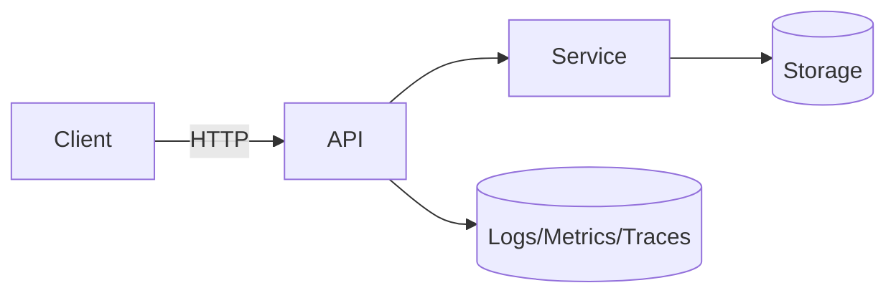

<style>
.rtl-align {
  direction: rtl;
  text-align: right;
}

/* لیست‌ها هم راست‌چین */
.rtl-align ul,
.rtl-align ol {
  list-style-position: inside;
  padding-right: 0;
  margin-right: 1em;
}

/* فقط باکس‌های کد (مثل ```...```) چپ‌چین و مونو */
.rtl-align pre code {
  direction: ltr;           /* جهت چپ به راست */
  text-align: left;         /* تراز چپ */
  display: block;           /* حالت باکس */
  background: #f5f5f5;      /* پس‌زمینه روشن مثل حالت کد */
  padding: 10px;            /* فاصله داخلی */
  border-radius: 5px;       /* گوشه‌های گرد */
  font-family: monospace;   /* فونت مونو برای کد */
  white-space: pre;         /* حفظ فاصله‌ها */
}

</style>

<div class="rtl-align">

# API — آموزش مستقیم، گام‌به‌گام و کاربردی (سطح پیش‌فرض: INTERMEDIATE)

> **یادداشت تطبیقی:** چون سطح شما را «BEGINNER یا INTERMEDIATE» ذکر کرده‌اید ولی انتخاب نهایی مشخص نشده، طبق قاعده این سند را در **سطح INTERMEDIATE** می‌نویسم و هرجا لازم باشد معادل‌های ساده و قیاس‌های مبتدی هم می‌آورم.

---

## 1) Title & Executive Summary

**API** \

 (رابط برنامه‌نویسی کاربردی) قراردادی استاندارد برای برقراری ارتباط بین نرم‌افزارهاست—عمدتاً بر بستر **HTTP** با بدنه‌های **JSON**. تاریخچهٔ APIهای وب با استانداردسازی HTTP در دههٔ ۹۰ و بلوغ REST/JSON در دههٔ ۲۰۰۰ گره خورده است؛ امروز APIها ستون فقرات اقتصاد دیجیتال‌اند: از اپلیکیشن‌های موبایل تا پرداخت‌های مالی و سیستم‌های داده‌محور.
چرا مهم است؟ چون **ماژولاریتۀ تیمی و فنی**، **یکپارچگی بین سرویس‌ها**، **امنیت و تطبیق** و **اندازه‌گیری‌پذیری** را ممکن می‌کند.

نکات کلیدی این سند: *قرارداد (OpenAPI)، نسخه‌بندی، امنیت (TLS/OAuth2)، کارایی (latency/p95)، قابلیت اطمینان (idempotency/retry)، مشاهده‌پذیری (logs/metrics/traces)، و تمرین‌های عملی با FastAPI*. مبانی HTTP و JSON به‌ترتیب در **RFC 9110 (Jun 2022)** و **RFC 8259 (Dec 2017)** ثبت شده‌اند. ([datatracker.ietf.org][1])

---

## 2) Prerequisites & Assumptions

* آشنایی پایه با **HTTP** (متدها، کد وضعیت)، **JSON**، و کار با **ترمینال**. (مرجع: RFC 9110/8259). ([datatracker.ietf.org][1])
* ابزارها: **Python 3.10+**, `pip`, **curl** یا **HTTPie**، مرورگر.
* فرض: یک کامپیوتر معمولی با دسترسی محلی؛ نیاز به اینترنت فقط برای نصب پکیج‌ها.

> **رفرش سریع مبتدی:** GET/POST/PUT/PATCH/DELETE؛ کدهای 2xx موفق، 4xx خطای کلاینت، 5xx خطای سرور.

---

## 3) Quick Start (۵–۱۵ دقیقه دست‌گرمی)

### 3.1 API مینیمال با FastAPI

```bash
pip install fastapi uvicorn
```

```python
# app.py
from fastapi import FastAPI, Header, HTTPException
from pydantic import BaseModel

app = FastAPI(title="Hello API", version="1.0.0")

class Item(BaseModel):
    name: str
    price: float

@app.get("/health")
def health():
    return {"status": "ok"}

@app.post("/items", status_code=201)
def create_item(item: Item, authorization: str | None = Header(None)):
    if not authorization:
        raise HTTPException(status_code=401, detail="Missing token")
    return {"id": 1, "item": item}
```

اجرا:

```bash
uvicorn app:app --reload --port 8000
```

**✅ Verify**

* سلامت: `curl http://localhost:8000/health` ⟶ `{"status":"ok"}`
* تلاش بدون توکن:
  `curl -X POST http://localhost:8000/items -H "Content-Type: application/json" -d '{"name":"book","price":10.5}'` ⟶ `401`
* با توکن نمایشی:
  `curl -X POST http://localhost:8000/items -H "Authorization: Bearer test" -H "Content-Type: application/json" -d '{"name":"book","price":10.5}'` ⟶ `201` + بدنهٔ ایجاد

> **یادداشت:** FastAPI از **OpenAPI 3** برای تولید قرارداد و **Swagger UI** برای مستندسازی زنده استفاده می‌کند (`/docs`). **OpenAPI 3.1.0** در ۱۸ فوریهٔ ۲۰۲۱ منتشر شد. ([openapis.org][2])

---

## 4) Core Concepts (گام‌به‌گام)

### 4.1 تعریف API و قرارداد

* **تعریف دقیق:** مجموعه‌ای از Endpointها با *قراردادِ* درخواست/پاسخ (روش‌ها، مسیرها، هدرها، بدنه، کدهای وضعیت).
* **پس‌زمینه:** HTTP و معنای متدها/کدها در **RFC 9110** مدون شده است؛ JSON در **RFC 8259**. ([datatracker.ietf.org][1])
* **کِی و چرا؟** جداسازی مسئولیت‌ها، امکان توسعهٔ مستقل تیم‌ها، تعامل با بیرون (شرکای تجاری).
* **مثال ساده:** `GET /health` ⟶ `"ok"`.
* **مثال واقعی:** `POST /orders` با اعتبارسنجی، احراز هویت، و ثبت تراکنش.

### 4.2 متدها و کدهای وضعیت (HTTP Semantics)

* **GET** (خواندن)، **POST** (ایجاد)، **PUT/PATCH** (به‌روزرسانی)، **DELETE** (حذف).
* **کدها:** `200 OK`, `201 Created`, `400/401/403/404`, `409`, `429`, `5xx`. (طبق RFC 9110). ([datatracker.ietf.org][1])
* **قیاس مبتدی:** مثل فرم‌های اداری—نوع درخواست (متد)، نتیجه (کد وضعیت).

### 4.3 مدل‌سازی منبع و نسخه‌بندی

* منابع را **اسمی** بنویسید: `/users/{id}/orders`.
* نسخه‌بندی: `v1` در مسیر یا با **Header** سفارشی؛ Deprecation شفاف.

### 4.4 قرارداد ماشین‌خوان (OpenAPI/JSON Schema)

* **OpenAPI** = تعریف رسمی API (مسیرها، ورودی/خروجی، امنیت، خطاها).
* **JSON Schema** = اعتبارسنجی ساختار JSON.
* **اهمیت صنعتی:** قرارداد واحد برای طراحی/تست/مستندسازی/مُک‌سرور. (Postman روی این زنجیره تأکید دارد.) ([Postman][3])

### 4.5 احراز هویت/مجوز (OIDC/OAuth2)

* **AuthN**: تشخیص هویت | **AuthZ**: تعیین اجازه.
* **Bearer (JWT)** با دامنه‌ها (Scopes).
* **نمونهٔ ساده:** هدر `Authorization: Bearer <token>`.

### 4.6 نرخ‌دهی و کش

* **Rate limiting** برای محافظت (کد `429`).
* **Caching** با `ETag`, `Cache-Control` یا لایهٔ Redis.

### 4.7 قابلیت اطمینان: Idempotency & Retry

* **Idempotency**: اجرای تکراری بدون اثر جانبی جدید (برای POST با کلید idempotency).
* **Retry با Backoff/Jitter**؛ **Circuit breaker** برای وابستگی‌ها.

### 4.8 مشاهده‌پذیری (Logs/Metrics/Traces)

* لاگ ساختارمند، **SLI/SLO** (نرخ خطا، p95/p99 latency)، **Trace-Id**.

**دیاگرام ساده**



---

## 5) Advanced Topics & Edge Cases

### کارایی (Performance)

* صفحه‌بندی و فیلتر، پاسخ‌های کوچک، **HTTP/2/Keep-Alive**، فشرده‌سازی.
* معیارها: **p95/p99 latency**، TPS، خطای 4xx/5xx.

### امنیت (Security)

* **TLS** اجباری؛ ورودی‌ها را اعتبارسنجی کنید؛ خطاها را امن گزارش کنید.
* **OAuth2/OIDC** برای صدور توکن؛ **Scopes**/نقش‌ها. (مرجع Postman برای چرخهٔ API) ([Postman][3])

### مقیاس‌پذیری/دسترس‌پذیری

* Stateless برای مسیرهای عمومی؛ **Health/Readiness**؛ **Autoscale** سرویس‌های داغ.

### استحکام و بازیابی

* **Timeout**‌های دقیق، **DLQ** برای پیام‌های شکست‌خورده؛ **PITR** برای DB.

### تطبیق/قانون‌مندی

* حریم خصوصی (GDPR و مشابه)، نگهداری/حذف داده، **Audit log**.

### رایج‌ترین خطاها و درمان

* بدون نسخه‌بندی ⟶ شکست کلاینت‌ها → **v1** + Deprecation plan.
* خطای نامفهوم ⟶ دیباگ سخت → مدل خطای یکنواخت (کد/پیام/جزئیات).
* نبود Rate limit ⟶ سوءاستفاده → 429 + سیاست.

---

## 6) Patterns, Idioms & Best Practices

* **Design-first** با OpenAPI + تست قرارداد در CI. (Postman نیز چرخهٔ طراحی→توسعه→تست→انتشار را توصیه می‌کند.) ([Postman][3])
* **Stateless** + **Idempotency** برای قابلیت اطمینان.
* **Consistent errors**: ساختار یکنواخت برای بدنهٔ خطا.
* **Pagination/Filtering** برای جمع‌های بزرگ.
* **Observability**: `request_id`, متریک‌های p95/p99.
* **Security headers** و **TLS**؛ عدم نشت دادهٔ حساس در پاسخ/لاگ.
* **Backward compatibility** را جدی بگیرید؛ Feature Flags برای rollout.

---

## 7) Tricks, Pro Tips, & Optimization Hacks

* از **OpenAPI** سراغ **Mock Server** بروید تا فرانت‌اند جلو بیافتد.
* **ETag/If-None-Match** برای کاهش ترافیک.
* **HTTPie** برای خوانایی بهتر نسبت به curl.
* **Retry با Jitter**، نه retry ساده؛ از **Idempotency-Key** استفاده کنید.
* **Trace-Id** را در پاسخ هم برگردانید تا با لاگ بخورد.
* **Contract tests** بین سرویس‌ها—قبل از پروداکشن.
* **429** را با `Retry-After` همراه کنید.

---

## 8) Troubleshooting & Debugging

| Symptom/Issue | Likely Causes               | Fix (گام‌به‌گام)                                    | Verification                   | Prevention             |
| ------------- | --------------------------- | --------------------------------------------------- | ------------------------------ | ---------------------- |
| 401/403       | توکن نامعتبر/منقضی          | زمان سیستم، امضا/کی‌ست را چک کنید؛ توکن جدید بگیرید | `WWW-Authenticate`/JWT decoder | چرخش کلید و TTL مناسب  |
| 429           | نبود یا سخت‌گیری Rate limit | نرخ را کم کنید؛ Backoff                             | هدرهای `Retry-After`           | سهمیه‌بندی/سقف‌ها      |
| 409           | تعارض state                 | **Idempotency-Key** یا قفل خوش‌دانه                 | تکرار با همان کلید             | طراحی idempotent       |
| 5xx           | وابستگی Down                | Circuit breaker + fallback                          | Health وابستگی‌ها              | SLO/Alert و بودجهٔ خطا |
| کندی p95      | N+1 Query/پاسخ بزرگ         | صفحه‌بندی/پیش‌بارگذاری/Index                        | پروفایل p95/p99                | تست بار در CI          |
| CORS خطا      | تنظیمات نادرست              | هدرهای CORS درست                                    | تست با مرورگر                  | مبدأهای مجاز شفاف      |

---

## 9) Practical Exercises & Applications

### Lab 1 — Read-only با صفحه‌بندی (۱۵–۲۰ دقیقه)

* **Task:** `GET /items?limit=10&offset=0`
* **Expected:** 200 با `items`، `next`
* **Verify:** درخواست خارج از محدوده ⟶ آرایهٔ خالی

### Lab 2 — Auth + Rate Limit

* **Task:** افزودن JWT (ساختگی) و Rate limit ساده در middleware
* **Expected:** بدون توکن ⟶ 401؛ نرخ زیاد ⟶ 429

### Lab 3 — Idempotent Create

* **Task:** `POST /orders` با `Idempotency-Key`
* **Expected:** تکرار با همان کلید ⟶ همان نتیجهٔ قبلی

### Lab 4 — Observability

* **Task:** درج `request_id` در هر پاسخ و لاگ ساختارمند
* **Expected:** همبستگی لاگ و پاسخ

### Capstone Project — «Todo API حرفه‌ای»

* مسیرها: `POST/GET/PUT/DELETE /todos`
* الزامات: Auth، Pagination، Validation، Error model یکنواخت، OpenAPI منتشر، p95<200ms محلی
* **Rubric:** عبور از تست‌های curl/HTTPie + تطابق قرارداد + لاگ/متریک پایه

---

## 10) Interdisciplinary Connections & Extensions

* **اقتصاد دیجیتال:** APIهای پرداخت و بانکداری باز.
* **علم داده/هوش مصنوعی:** API به‌عنوان «قرارداد» تبادل داده/مدل.
* **اخلاق/قانون:** حریم خصوصی، تبعیض الگوریتمی، شفافیت.
* **سیستم‌های توزیع‌شده:** Consistency/Availability/Partitioning و اثرشان بر طراحی API.

---

## 11) FAQs

1. REST vs gRPC؟ — REST متنی/HTTP/JSON؛ gRPC باینری/HTTP2/Proto؛ gRPC برای سرویس-به-سرویس داخلی کم‌تاخیر.
2. GraphQL کی؟ — وقتی کلاینت به انتخاب فیلدها و ترکیب چند منبع در یک پرسش نیاز دارد.
3. چرا OpenAPI؟ — قرارداد واحد برای طراحی، پیاده‌سازی، تست، مستندسازی. ([Postman][3])
4. نسخه‌بندی چگونه؟ — `v1` در مسیر یا هدر؛ با برنامهٔ Deprecation.
5. خطاها را چطور یکنواخت کنیم؟ — مدل خطای مشترک با کد/پیام/جزئیات.
6. امنیت حداقلی؟ — TLS، JWT با TTL، اعتبارسنجی ورودی، عدم نشت دادهٔ حساس.
7. Rate limit سمت کجا؟ — هر دو، اما enforce سمت سرور.
8. کش کجا؟ — کلاینت و سرور (ETag/Cache-Control/Proxy).
9. آیا باید همیشه REST باشد؟ — نه؛ بسته به قیود دامنه، gRPC/GraphQL هم مناسب است.
10. قرارداد کجا ذخیره شود؟ — در ریپو، روی CI تست شود؛ Postman/Mocks اختیاری. ([Postman][4])
11. آیا RFCها لازم‌اند؟ — برای اصول HTTP/JSON بله (9110/8259). ([datatracker.ietf.org][1])
12. مستندات زنده؟ — /openapi.json و `/docs` (Swagger UI) در FastAPI.

---

## 12) Reference Section (معتبر و تاریخ‌دار)

* **HTTP Semantics — RFC 9110**, IETF, *Jun 2022*. ([datatracker.ietf.org][1])
* **JSON — RFC 8259**, IETF, *Dec 2017*. ([rfc-editor.org][5])
* **OpenAPI Specification 3.1.0 Released**, OpenAPI Initiative, *Feb 18, 2021*. ([openapis.org][2])
* **Postman — What is an API?** (مرور مفهومی)، *Accessed 2025-11-03*. ([Postman][4])
* **Postman — API Lifecycle** (مراحل طراحی تا مصرف)، *Accessed 2025-11-03*. ([Postman][3])

> منابع ثانویهٔ منتخب (برای دید تاریخی/رسانه‌ای):
>
> * **OpenAPI Specification (Wiki)** — وضعیت نسخه‌ها تا 2025. ([Wikipedia][6])
> * **Postman Blog — API Lifecycle Blueprint** (۸ مرحله)، *Jan 14, 2022*. ([Postman Blog][7])

---

## 13) Glossary, Cheat Sheet, & Quick Reference

**Glossary (گزیده):**

* **API:** قرارداد ارتباط سرویس‌ها.
* **Endpoint:** مسیر + متد روی HTTP.
* **Resource:** موجودیت دامنه (user/order).
* **OpenAPI:** قرارداد ماشین‌خوان API.
* **JSON Schema:** اعتبارسنجی ساختار JSON.
* **AuthN/AuthZ:** احراز هویت/مجوز.
* **JWT/Scope:** توکن وب با دامنهٔ دسترسی.
* **Idempotency:** تکرار امن عملیات.
* **Rate limiting:** محدودسازی نرخ درخواست.
* **Observability:** logs/metrics/traces برای رویت‌پذیری.
* **p95/p99:** صدک‌های تأخیر.
* **Circuit breaker:** قطع موقت وابستگی ناسالم.
* **ETag:** برچسب نسخهٔ پاسخ برای کش.

**Cheat Sheet (HTTP/cURL)**

```bash
# GET صفحه‌بندی‌شده
curl -s "http://localhost:8000/items?limit=10&offset=0"

# POST با JSON و توکن
curl -s -X POST http://localhost:8000/orders \
  -H "Authorization: Bearer $TOKEN" \
  -H "Content-Type: application/json" \
  -d '{"symbol":"AAPL","qty":1}'

# Idempotency-Key
curl -s -X POST http://localhost:8000/orders \
  -H "Idempotency-Key: 123e4567-e89b-12d3-a456-426614174000" \
  -H "Content-Type: application/json" \
  -d '{"symbol":"AAPL","qty":1}'

# Conditional GET (ETag)
curl -I http://localhost:8000/items/1
curl -H 'If-None-Match: "etag-value"' http://localhost:8000/items/1

# Health/Readiness
curl -s http://localhost:8000/health
```

---

### جمع‌بندی کوتاه

* API = قرارداد استاندارد تبادل داده/قابلیت روی HTTP/JSON (بر مبنای RFC 9110/8259). ([datatracker.ietf.org][1])
* طلایی‌ها: **OpenAPI**، **نسخه‌بندی**، **TLS+OAuth2**، **Idempotency/Retry**، **Observability**، **Pagination/Filtering**.
* از **Quick Start** شروع کنید، **لب‌ها** را انجام دهید، و **Capstone** را تحویل بگیرید.
* برای به‌روزماندن، صفحات رسمی Postman برای مفاهیم و چرخهٔ API مفیدند. ([Postman][4])

اگر بخواهید، همین سند را برای **BEGINNER** بازنویسی می‌کنم (با مثال‌های روزمره و تصاویر بیشتر) یا برای **INTERMEDIATE** با تمرکز بر **مقایسهٔ REST/gRPC/GraphQL** و استقرار روی Docker/Nginx گسترش می‌دهم.

[1]: https://datatracker.ietf.org/doc/rfc9110/?utm_source=chatgpt.com "RFC 9110 - HTTP Semantics"
[2]: https://www.openapis.org/blog/2021/02/18/openapi-specification-3-1-released?utm_source=chatgpt.com "OpenAPI Specification 3.1.0 Released"
[3]: https://www.postman.com/api-platform/api-lifecycle/?utm_source=chatgpt.com "What Is the API Lifecycle? Stages & Best Practices"
[4]: https://www.postman.com/what-is-an-api/?utm_source=chatgpt.com "What is an API? A Beginner's Guide to APIs"
[5]: https://www.rfc-editor.org/info/rfc8259?utm_source=chatgpt.com "Information on RFC 8259"
[6]: https://en.wikipedia.org/wiki/OpenAPI_Specification?utm_source=chatgpt.com "OpenAPI Specification"
[7]: https://blog.postman.com/api-lifecycle-blueprint/?utm_source=chatgpt.com "API Lifecycle Stages: The 8-Point Blueprint"
