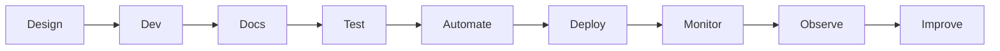

<style>
.rtl-align {
  direction: rtl;
  text-align: right;
}

/* لیست‌ها هم راست‌چین */
.rtl-align ul,
.rtl-align ol {
  list-style-position: inside;
  padding-right: 0;
  margin-right: 1em;
}

/* فقط باکس‌های کد (مثل ```...```) چپ‌چین و مونو */
.rtl-align pre code {
  direction: ltr;           /* جهت چپ به راست */
  text-align: left;         /* تراز چپ */
  display: block;           /* حالت باکس */
  background: #f5f5f5;      /* پس‌زمینه روشن مثل حالت کد */
  padding: 10px;            /* فاصله داخلی */
  border-radius: 5px;       /* گوشه‌های گرد */
  font-family: monospace;   /* فونت مونو برای کد */
  white-space: pre;         /* حفظ فاصله‌ها */
}

</style>

<div class="rtl-align">


# چرخهٔ عمر API — آموزش مستقیم و جامع (سطح: **INTERMEDIATE**)

> این سند «خودموضوع» را پوشش می‌دهد: از تعریف و تاریخچه تا طراحی، مستندسازی، تست، پایش و مشاهده‌پذیری؛ با مثال‌های اجراشدنی، دیاگرام‌ها، نکته‌های عملی و ارجاع‌های معتبر.

---

## 1) عنوان و جمع‌بندی اجرایی (5–10 خط)

**چرخهٔ عمر API** مجموعه مراحلی است که یک API را از **تعریف و طراحی** تا **توسعه، تست، انتشار، مصرف، پایش و بهبود** پیش می‌برد. در صنعت امروز، APIها ستون فقرات یکپارچگی نرم‌افزار و اقتصاد دیجیتال‌اند؛ کیفیت چرخهٔ عمر، مستقیماً بر **پذیرش، امنیت، کارایی و بازده سرمایه** اثر می‌گذارد. Postman این چرخه را به‌صورت مرحله‌ای تشریح می‌کند و برای هر مرحله ابزار و بهترین‌عمل‌ها ارائه می‌دهد (طراحی، مستندسازی، تست، خودکارسازی تست، پایش، مشاهده‌پذیری). per [Ref-P1] و [Ref-P2] (Postman, 2024–2025). ([postman.com][1])
در پایه، **HTTP** و **JSON** هستهٔ تعاملات API هستند (RFC 9110 / RFC 8259)، و **OpenAPI** قرارداد ماشین‌خوان استاندارد برای APIهای HTTP است (OAS 3.1.0). per [Ref-I1], [Ref-I2], [Ref-OAI] (2021–2025). ([IETF Datatracker][2])

**برداشت‌های کلیدی:**

* Design-first با OpenAPI، سپس توسعه و تست مبتنی بر قرارداد.
* مستندسازی زنده و به‌روز، متناسب با مخاطبان. per [Ref-P3]. ([postman.com][3])
* تست خودکار در CI/CD + مانیتورینگ و مشاهده‌پذیری انتهابه‌انتها. per [Ref-P4], [Ref-P5], [Ref-P6]. ([postman.com][4])

---

## 2) پیش‌نیازها و فرض‌ها

* آشنایی با HTTP/JSON و ابزار خط فرمان (`curl`/HTTPie). (پایه در RFC 9110/8259). ([IETF Datatracker][2])
* ابزارهای رایگان/لوکال: **Python 3.10+**, FastAPI/uvicorn، و یک ویرایشگر.
* فرض: سیستم محلی استاندارد با دسترسی نصب پکیج‌ها.
* اگر مبتدی: متدهای HTTP (GET/POST/PUT/PATCH/DELETE) و کدهای 2xx/4xx/5xx را مرور کن.

---

## 3) دست‌گرمی سریع (۵–۱۵ دقیقه)

### 3.1 نمونهٔ حداقلی: طراحی→توسعه→مستندسازی در لوکال

1. نصب وابستگی‌ها:

```bash
pip install fastapi uvicorn
```

2. پیاده‌سازی مینیمال:

```python
# app.py
from fastapi import FastAPI, HTTPException
from pydantic import BaseModel

app = FastAPI(title="Inventory API", version="1.0.0")

class Item(BaseModel):
    name: str
    price: float

@app.get("/health")
def health(): return {"status": "ok"}

@app.post("/items", status_code=201)
def create_item(item: Item):
    if item.price < 0:
        raise HTTPException(400, "price must be >= 0")
    return {"id": 1, "item": item}
```

3. اجرا:

```bash
uvicorn app:app --reload --port 8000
```

4. **Verify**

* سلامت: `curl http://localhost:8000/health` → `{"status":"ok"}`
* ایجاد:

```bash
curl -X POST http://localhost:8000/items \
  -H "Content-Type: application/json" \
  -d '{"name":"book","price":10.5}'
```

→ `201` با `id` و داده.

* قرارداد/مستند زنده: مرورگر → `http://localhost:8000/docs` (OpenAPI/Swagger UI). (OpenAPI 3.1.0). ([openapis.org][5])

> **نکتهٔ تطبیق با محدودیت آفلاین:** همه‌چیز محلی است؛ اگر به Postman نیاز داری، از **Postman Desktop App** با کالکشن‌های لوکال استفاده کن. راهنماهای Postman چرخهٔ عمر را برای همین مسیر پیشنهاد می‌دهند. ([postman.com][1])

---

## 4) مفاهیم هسته‌ای (گام‌به‌گام)

### 4.1 تعریف و مراحل چرخهٔ عمر

* **تعریف:** دنبالهٔ مراحل از **Design** تا **Observability** برای رساندن API با کیفیت به مصرف‌کننده. per [Ref-P1]. ([postman.com][1])



**چرایی/مزیت:** افزایش بهره‌وری، استانداردسازی، کاهش ریسک شکست در تولید. per [Ref-P1]. ([postman.com][1])

### 4.2 طراحی (Design-first با OpenAPI)

* **تعریف:** مشخص‌کردن منابع، مسیرها، اسکیماها، خطاها و امنیت در یک **Spec**. per [Ref-P2]/[Ref-P7]. ([postman.com][6])
* **تاریخچه/زمینه:** تکامل Swagger→OpenAPI تحت Linux Foundation؛ OAS 3.1.0 هم‌راست با JSON Schema. per [Ref-OAI] (2021). ([openapis.org][5])
* **تجارت‌آف:** Design-first (سازگاری و کیفیت) در مقابل Code-first (سرعت آغاز).
* **مثال ساده:** تعریف `/items` در Spec و تولید اسکلت کد.
* **کاربرد واقعی:** Spec در ریپو + بررسی قرارداد در CI.
* **زاویهٔ چندبعدی:** (اقتصادی) کاهش دوباره‌کاری؛ (اخلاقی) شفافیت برای مصرف‌کننده.

### 4.3 مستندسازی

* **تعریف:** روایت «چه کسی/چرا/چگونه» + مراجع، مثال‌ها و خطاهای استاندارد. per [Ref-P3]. ([postman.com][3])
* **بهترین‌عمل:** سازگاری سبک/ساختار و به‌روزرسانی مداوم. per Postman BP. ([Postman Blog][7])

### 4.4 تست و خودکارسازی تست

* **تعریف:** اجرای برنامه‌ریزی‌شدهٔ تست‌ها در زمان/فرکانس یا در CI/CD؛ مکمل تست دستی. per [Ref-P5]. ([postman.com][4])
* **مثال:** تست قرارداد، رگرسیون، و کارایی.

### 4.5 مانیتورینگ و مشاهده‌پذیری

* **مانیتورینگ:** گردآوری/بصری‌سازی/هشدار بر تتاتر API. per [Ref-P6]. ([postman.com][8])
* **مشاهده‌پذیری:** رصد عملکرد، عیب‌یابی، الگوهای مصرف، بهینه‌سازی. per [Ref-P8]. ([postman.com][9])
* **رابط با HTTP:** مفاهیم p95/p99 و کدهای 4xx/5xx طبق RFC 9110. ([IETF Datatracker][2])

---

## 5) مباحث پیشرفته و سناریوهای مرزی

* **کارایی:** Pagination/Filtering، فشرده‌سازی، Keep-Alive/HTTP2؛ شاخص‌ها: p95/p99، TPS. (HTTP Semantics). ([IETF Datatracker][2])
* **امنیت:** TLS اجباری، OIDC/OAuth2، ورودی امن، الگوی خطای غیرافشاگرانه. (Design/Docs/Testing صفحات Postman). ([postman.com][6])
* **مقیاس/دردسترس‌پذیری:** Stateless، Health/Readiness، Auto-Scale، Circuit-Breaker.
* **استحکام/بازیابی:** Timeout/Retry با Jitter، DLQ، پشتیبان‌گیری و PITR.
* **تطبیق/اخلاق:** حریم خصوصی، ردیابی ممیزی، حداقل‌سازی داده.

**خطاهای رایج و ریشه‌ها**

* بدون نسخه‌بندی ⟶ شکست کلاینت‌ها → `v1` + Deprecation plan.
* مستندات قدیمی ⟶ سردرگمی → Docs پیوسته از روی Spec. per [Ref-P3]. ([postman.com][3])
* تست ناکافی ⟶ Regression در Prod → خودکارسازی تست در CI. per [Ref-P5]. ([postman.com][4])

---

## 6) الگوها و Best Practices (Do/Don’t)

* **Design-first + OpenAPI در ریپو** (Do). per [Ref-P2]/[Ref-OAI]. ([postman.com][10])
* **مستندات مخاطب‌محور و به‌روز** (Do). per [Ref-P3]. ([postman.com][3])
* **تست خودکار چندلایه (قرارداد/کارکرد/کارایی)** (Do). per [Ref-P5]. ([postman.com][4])
* **بدنهٔ خطای سازگار** (Do)؛ افشای جزئیات داخلی در خطا (Don’t).
* **Rate limit/Quota** (Do)؛ بدون محدودسازی (Don’t).
* **Observability end-to-end** (Do). per [Ref-P8]. ([postman.com][9])

---

## 7) ترفندها و Pro Tips

* از Spec یک **Mock** بسازید تا فرانت جلو بیافتد (لوکال). per [Ref-P2]. ([postman.com][10])
* **ETag/If-None-Match** برای کاهش پهنای باند؛ **Idempotency-Key** برای POSTهای حساس.
* **Trace-Id** را در لاگ و پاسخ برگردانید (همبستگی سریع).
* **429** را با `Retry-After` همراه کنید.
* **Checklists** برای Review طراحی/امنیت/مستند.

---

## 8) Troubleshooting & Debugging

| Symptom/Issue              | Likely Causes   | Fix (گام‌به‌گام)                  | Verification       | Prevention                                             |
| -------------------------- | --------------- | --------------------------------- | ------------------ | ------------------------------------------------------ |
| مستندات و API هم‌خوان نیست | Spec قدیمی      | به‌روزرسانی Spec، Regenerate Docs | diff Spec در CI    | Docs از روی Spec (Design-first) ([postman.com][3])     |
| شکست رگرسیون پس از Merge   | نبود تست خودکار | افزودن تست قرارداد/کارکرد در CI   | اجرای پایپ‌لاین    | خودکارسازی تست‌ها ([postman.com][4])                   |
| افزایش خطاهای 5xx          | وابستگی Down    | Circuit-breaker/Timeout/Retry     | Health checks      | مانیتورینگ + هشدار ([postman.com][8])                  |
| کندی p95                   | پاسخ‌های حجیم   | Pagination/Filter/Compression     | پروفایل p95/p99    | بودجهٔ تأخیر در SLO (RFC 9110) ([IETF Datatracker][2]) |
| ناشناخته‌بودن علت خطا      | لاگ ناکافی      | Log ساختارمند + Trace-Id          | Correlate با Trace | Observability end-to-end ([postman.com][9])            |

---

## 9) تمرین‌های عملی و کاربردها

### Lab 1 — طراحی Contract (15–20دقیقه)

**Task:** یک OpenAPI کوچک برای `/items` بنویس و با همان، سرور را بساز (FastAPI).
**Verify:** `/docs` فعال و پاسخ‌ها مطابق Spec.

### Lab 2 — مستندسازی و سناریوهای نمونه (15–20دقیقه)

**Task:** برای هر مسیر مثال‌های موفق/خطا بنویس (نمونهٔ بدنهٔ خطا).
**Verify:** خوانایی و سازگاری با مخاطبان متفاوت. per [Ref-P3]. ([postman.com][3])

### Lab 3 — تست خودکار محلی (20–30دقیقه)

**Task:** اسکریپت‌های درخواست/پاسخ (با curl/HTTPie) + اسکریپت assert ساده.
**Verify:** کدهای وضعیت/بدنه در محدودهٔ انتظار. per [Ref-P5]. ([postman.com][4])

### Lab 4 — مانیتورینگ لوکال (15–20دقیقه)

**Task:** اسکریپت زمان‌بندی‌شده برای سنجش سلامت/زمان پاسخ (کرون/Task Scheduler).
**Verify:** هشدار ساده هنگام شکست/کندی. per [Ref-P6]. ([postman.com][8])

### Capstone — «چرخهٔ کامل در لوکال»

**هدف:** API کوچک با Spec، سرور، Docs زنده، تست خودکار و مانیتورینگ ساده.
**معیار موفقیت:**
A) Spec معتبر + Docs به‌روز؛ B) همهٔ تست‌ها سبز؛ C) اسکریپت مانیتورینگ خطا/کندی را تشخیص می‌دهد.

---

## 10) پیوندهای میان‌رشته‌ای و گسترش

* **کسب‌وکار/اقتصاد:** API-First باعث سرعت نوآوری و شراکت‌های B2B می‌شود.
* **اخلاق/حقوق:** حریم خصوصی، کمینه‌سازی داده، شفافیت مصرف.
* **مهندسی داده/ML:** قرارداد پایدار داده بین سرویس‌ها و پایپلاین‌ها.

---

## 11) پرسش‌های متداول (FAQ)

1. چرخهٔ عمر API چند مرحله دارد؟ — بسته به سازمان، اما طراحی تا مشاهده‌پذیری پوشش می‌دهد. per [Ref-P1]. ([postman.com][1])
2. Design-first یا Code-first؟ — برای سازگاری/مقیاس تیمی، Design-first توصیه می‌شود. per [Ref-P2]. ([postman.com][6])
3. چه‌طور Docs را همیشه درست نگه دارم؟ — Docs از روی Spec و پیوسته در CI. per [Ref-P3]. ([postman.com][3])
4. تست خودکار چه کمکی می‌کند؟ — جلوگیری از تغییرات مخرب قبل از Prod. per [Ref-P5]. ([postman.com][4])
5. مانیتورینگ vs مشاهده‌پذیری؟ — مانیتورینگ=پایش و هشدار؛ مشاهده‌پذیری=درک علت و الگوهای مصرف. per [Ref-P6]/[Ref-P8]. ([postman.com][8])
6. نقش OpenAPI؟ — قرارداد ماشین‌خوان واحد؛ OAS 3.1 هم‌راست با JSON Schema. per [Ref-OAI]. ([openapis.org][5])
7. استانداردهای پایه HTTP/JSON؟ — RFC 9110/8259. ([IETF Datatracker][2])
8. چه زمانی GraphQL یا gRPC؟ — وابسته به نیازهای query/latency/contract.

---

## 12) منابع (معتبر، به‌روز و متنوع)

**اولیه (Primary):**

* Postman — **API Lifecycle** (راهنمای مراحل), آخرین دسترسی: 2025-11-03. ([postman.com][1])
* Postman — **API Design / Platform** (طراحی و ابزارها), آخرین دسترسی: 2025-11-03. ([postman.com][6])
* Postman — **API Documentation** (بهترین‌عمل‌ها), 2024–2025. ([postman.com][3])
* Postman — **API Testing & Test Automation**, آخرین دسترسی: 2025-11-03. ([postman.com][4])
* Postman — **API Monitoring** و **API Observability**, آخرین دسترسی: 2025-11-03. ([postman.com][8])
* IETF — **RFC 9110: HTTP Semantics**, 2022. ([IETF Datatracker][2])
* OAI — **OpenAPI 3.1.0 Released**, 2021-02-18. ([openapis.org][5])

**ثانویه (Supplementary):**

* Postman Learning — **Monitors Intro**, 2025-04-30. ([Postman Docs][11])
* Wikipedia — **OpenAPI Specification (History/Timeline)**, به‌روزرسانی 2025. ([Wikipedia][12])

---

## 13) واژه‌نامه، چیـت‌شیت و مرجع سریع

**واژه‌نامه (گزیده 18 مورد):**
API (قرارداد تبادل)، Lifecycle (مراحل عمر)، OpenAPI (قرارداد ماشین‌خوان)، JSON Schema (اعتبارسنجی)، Endpoint (مسیر+متد)، Versioning (نسخه‌بندی)، AuthN/AuthZ (هویت/مجوز)، Idempotency (تکرار بی‌اثر)، Pagination (صفحه‌بندی)، SLO/SLI (هدف/شاخص خدمت)، p95/p99 (صدک تأخیر)، Rate-limit/Quota، Observability (Logs/Metrics/Traces)، Circuit-breaker، Retry-After، ETag/If-None-Match، DLQ، PITR.

**چیت‌شیت (نمونه‌های سریع):**

```bash
# سلامت
curl -s http://localhost:8000/health

# ایجاد با JSON
curl -s -X POST http://localhost:8000/items \
  -H "Content-Type: application/json" \
  -d '{"name":"book","price":10.5}'

# قرارداد/Docs زنده (FastAPI)
# مرورگر → http://localhost:8000/docs

# Conditional GET با ETag
curl -I http://localhost:8000/items/1
curl -H 'If-None-Match: "etag-value"' http://localhost:8000/items/1
```

---

### یک نگاه آخر

* چرخهٔ عمر API = **Design→Docs→Test→Automate→Deploy→Monitor→Observe→Improve**. per [Ref-P1]. ([postman.com][1])
* ستون‌ها: **قرارداد استاندارد (OpenAPI)**، **مستندات به‌روز**، **تست خودکار** و **مشاهده‌پذیری**.
* همهٔ مثال‌ها محلی و رایگان‌اند؛ برای سازمان، همین الگو را در CI/CD و حاکمیت API تعمیم بده.

[1]: https://www.postman.com/api-platform/api-lifecycle/?utm_source=chatgpt.com "What Is the API Lifecycle? Stages & Best Practices"
[2]: https://datatracker.ietf.org/doc/html/rfc9110?utm_source=chatgpt.com "RFC 9110 - HTTP Semantics"
[3]: https://www.postman.com/api-platform/api-documentation/?utm_source=chatgpt.com "API Documentation: How to Write, Examples & Best Practices"
[4]: https://www.postman.com/api-platform/api-test-automation/?utm_source=chatgpt.com "What Is API Test Automation? | Tools, Tips & Best Practices"
[5]: https://www.openapis.org/blog/2021/02/18/openapi-specification-3-1-released?utm_source=chatgpt.com "OpenAPI Specification 3.1.0 Released"
[6]: https://www.postman.com/api-platform/api-design/?utm_source=chatgpt.com "What is API Design? Principles & Best Practices"
[7]: https://blog.postman.com/document-your-api-like-a-pro-postman-collection-best-practices/?utm_source=chatgpt.com "Document Your API Like a Pro: Postman Collection Best ..."
[8]: https://www.postman.com/api-platform/api-monitoring/?utm_source=chatgpt.com "What is API Monitoring? Use Cases, Tools & Best Practices"
[9]: https://www.postman.com/api-platform/api-observability/?utm_source=chatgpt.com "API Observability: API Telemetry Data, Pillars & Use Cases"
[10]: https://www.postman.com/api-design/?utm_source=chatgpt.com "How to Use Postman to Design, Develop, and Test APIs"
[11]: https://learning.postman.com/docs/monitoring-your-api/intro-monitors/?utm_source=chatgpt.com "Monitor health and performance of your APIs in Postman"
[12]: https://en.wikipedia.org/wiki/OpenAPI_Specification?utm_source=chatgpt.com "OpenAPI Specification"
