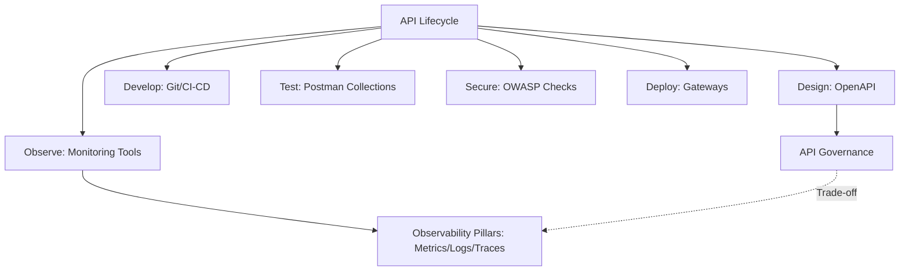
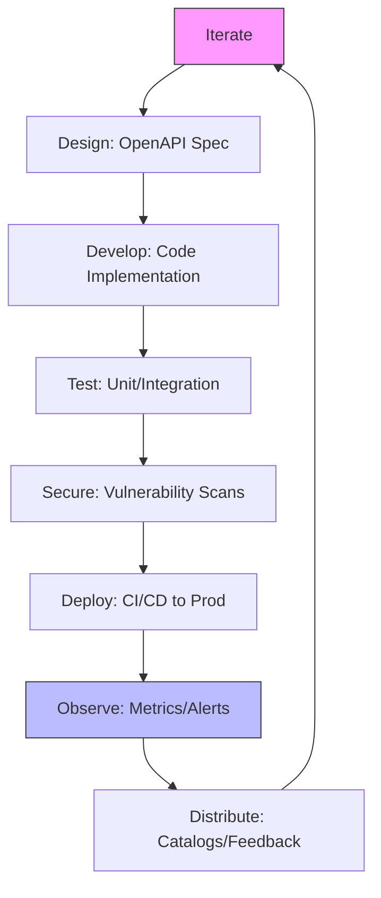
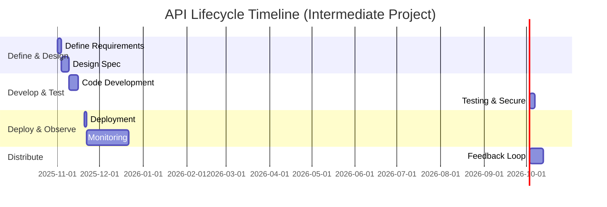

<style>
.rtl-align {
  direction: rtl;
  text-align: right;
}

/* لیست‌ها هم راست‌چین */
.rtl-align ul,
.rtl-align ol {
  list-style-position: inside;
  padding-right: 0;
  margin-right: 1em;
}

/* فقط باکس‌های کد (مثل ```...```) چپ‌چین و مونو */
.rtl-align pre code {
  direction: ltr;           /* جهت چپ به راست */
  text-align: left;         /* تراز چپ */
  display: block;           /* حالت باکس */
  background: #f5f5f5;      /* پس‌زمینه روشن مثل حالت کد */
  padding: 10px;            /* فاصله داخلی */
  border-radius: 5px;       /* گوشه‌های گرد */
  font-family: monospace;   /* فونت مونو برای کد */
  white-space: pre;         /* حفظ فاصله‌ها */
}

</style>

<div class="rtl-align">

# API Lifecycle

## 1. نام و تعریف‌ها

### نام موضوع و جایگاه آن در اکوسیستم فنی
API Lifecycle (چرخه حیات API) یکی از اجزای کلیدی در اکوسیستم توسعه نرم‌افزارهای مدرن است، به‌ویژه در رویکرد API-first که سازمان‌ها برنامه‌های خود را بر پایه سرویس‌های میکروسرویس و APIهای داخلی و خارجی می‌سازند. این مفهوم در چرخه توسعه نرم‌افزار، DevOps و治理 API (API Governance) قرار می‌گیرد و به عنوان پلی بین طراحی، توسعه، استقرار و نگهداری APIها عمل می‌کند. در اکوسیستم فنی، API Lifecycle با ابزارهایی مانند Postman، OpenAPI و CI/CD pipelines ادغام می‌شود تا بهره‌وری تیم‌ها را افزایش دهد و کیفیت APIها را تضمین کند.

### تعریف عمومی متمایل به حرفه‌ای (برای درک در سطح کلان)
چرخه حیات API به مجموعه‌ای از مراحل منظم اشاره دارد که تیم‌های توسعه برای طراحی، ساخت، تست، امنیت، استقرار و نظارت بر APIها طی می‌کنند. این فرآیند مانند چرخه زندگی یک محصول است: از ایده‌پردازی تا توزیع و به‌روزرسانی مداوم. در سطح کلان، API Lifecycle به سازمان‌ها کمک می‌کند تا APIها را به عنوان "محصولات" مدیریت کنند، بهره‌وری را افزایش دهند، دید بهتری بر عملکرد داشته باشند و هم‌راستایی سازمانی را تقویت کنند. طبق گزارش State of the API 2025 از Postman، سازمان‌های API-first بیش از دو برابر احتمال دارند که بیش از 75% درآمد خود را از APIها کسب کنند.

### تعریف تخصصی و دقیق (با بیان مهندسی و مبتنی بر مستندات رسمی)
از دیدگاه مهندسی، API Lifecycle یک فرآیند استانداردشده است که شامل هشت مرحله اصلی برای تولیدکنندگان API (Producer Lifecycle) می‌شود: Define (تعریف الزامات)، Design (طراحی قرارداد API)، Develop (توسعه کد)، Test (تست عملکرد)، Secure (امنیت‌سنجی)، Deploy (استقرار)، Observe (نظارت و مشاهده) و Distribute (توزیع و کشف). این مراحل بر اساس مستندات Postman API Platform تعریف شده‌اند و با مشخصات استاندارد مانند OpenAPI 3.0 و AsyncAPI هم‌خوانی دارند. هر مرحله شامل سیاست‌ها، ابزارها و مالکان خاص است تا治理 API را تضمین کند و از API sprawl (پراکندگی بیش از حد APIها) جلوگیری شود.

## 2. پیش‌نیازهای دانشی
برای درک کامل API Lifecycle در سطح متوسط، باید با مفاهیم زیر آشنا باشید. هر کدام را به طور مختصر توضیح می‌دهم:

- **RESTful APIs و HTTP Methods**: اصول طراحی APIهای مبتنی بر REST، شامل متدهایی مانند GET، POST، PUT و DELETE، برای درک جریان درخواست-پاسخ در مراحل Design و Develop.
- **API Specifications (مانند OpenAPI)**: فرمت‌های استاندارد برای تعریف قراردادهای API، که در مرحله Design حیاتی است و به تولید مستندات و ماک‌ها کمک می‌کند.
- **CI/CD Pipelines**: فرآیندهای خودکار ادغام و استقرار مداوم، ضروری برای مراحل Test، Secure و Deploy، با ابزارهایی مانند GitHub Actions یا Jenkins.
- **Testing Fundamentals**: انواع تست مانند Unit، Integration و Load Testing، برای فهم نقش تست در جلوگیری از شکست‌ها در مراحل Develop و Test.
- **Security Basics (OWASP Top 10)**: آسیب‌پذیری‌های رایج API مانند Injection Attacks، برای ارزیابی ریسک‌ها در مرحله Secure.
- **Monitoring Metrics**: مفاهیمی مانند Latency، Error Rate و Throughput، که در مرحله Observe برای تحلیل عملکرد استفاده می‌شوند.

## 3. دسته‌بندی کاربردها و نمونه‌های واقعی
### طبقه‌بندی حوزه‌های کاربردی
API Lifecycle در حوزه‌های متنوعی کاربرد دارد:
- **توسعه نرم‌افزار**: برای مدیریت APIها در میکروسرویس‌ها، با تمرکز بر Design و Develop.
- **داده و Analytics**: در پردازش داده‌های بزرگ، مانند APIهای GraphQL برای تجمیع داده‌ها.
- **امنیت**: ادغام چک‌های امنیتی در هر مرحله برای حفاظت از داده‌ها.
- **سیستم‌های توزیع‌شده**: نظارت بر APIها در محیط‌های ابری برای مقیاس‌پذیری.

### مثال‌های واقعی از شرکت‌ها، پروژه‌ها یا محصولات
- **Netflix**: از API Lifecycle برای مدیریت هزاران API داخلی در پلتفرم استریم خود استفاده می‌کند، با تمرکز بر Observe برای کاهش latency در مقیاس جهانی.
- **Google**: APIهای عمومی مانند Google Maps از مراحل Design با OpenAPI و Monitoring با ابزارهای داخلی برای تضمین SLAها بهره می‌برند.
- **AWS**: سرویس‌هایی مانند Lambda از API Gateway برای Deploy و Secure، که چرخه حیات را در محیط ابری مقیاس‌پذیر می‌کند.
- **Stripe**: APIهای پرداخت با تست‌های خودکار و Documentation پویا، که adoption را افزایش داده است.

## 4. شرکت‌ها و سازمان‌های استفاده‌کننده یا پشتیبان
- **Postman**: توسعه‌دهنده اصلی پلتفرم API Platform، که ابزارهای یکپارچه برای تمام مراحل ارائه می‌دهد.
- **Google**: پشتیبان OpenAPI Initiative و استفاده‌کننده گسترده در APIهای ابری.
- **Microsoft**: از طریق Azure API Management، چرخه حیات را در اکوسیستم .NET و Azure پشتیبانی می‌کند.
- **Red Hat (IBM)**: در OpenAPI و AsyncAPI برای APIهای enterprise.
- **Netflix و Stripe**: کاربران عمده که APIهای خود را بر اساس این مدل مدیریت می‌کنند.
- **OWASP Foundation**: پشتیبان استانداردهای امنیتی در مرحله Secure.

## 5. مفاهیم و فناوری‌های مرتبط
### توضیح کوتاه از مفاهیم وابسته
API Lifecycle به مفاهیمی مانند API Governance (سیاست‌های سازمانی برای استانداردسازی)، API-first Development (طراحی API قبل از کد) و Observability (جمع‌آوری telemetry برای debugging) وابسته است. این‌ها درک بهتری از trade-offها مانند سرعت توسعه در مقابل امنیت فراهم می‌کنند.

### ارتباط با فناوری‌های مشابه یا مکمل
جدول زیر ارتباطات را نشان می‌دهد:

| مفهوم مرتبط | توضیح ارتباط | مثال مکمل |
|--------------|--------------|-----------|
| OpenAPI Specification | پایه Design برای قراردادهای API، مستقیماً در Lifecycle ادغام می‌شود. | تولید خودکار Documentation و Mocks. |
| CI/CD Tools (Jenkins) | اتوماسیون Test و Deploy، trade-off: سرعت vs. reliability. | ادغام با Postman CLI برای تست‌های مداوم. |
| API Gateways (Kong) | مدیریت Deploy و Secure، برای مقیاس‌پذیری. | Rate Limiting در محیط‌های توزیع‌شده. |
| Observability Tools (Datadog) | گسترش Observe با metrics و traces. | همبستگی logs با business metrics. |

برای نمایش مفهومی، از Mermaid استفاده می‌کنم:



## 6. الگوها و Best Practices
### کارهایی که باید انجام داد (Do)
- مراحل را واضح تعریف کنید و مستندسازی کنید، با ابزارهای یکپارچه مانند Postman برای همکاری.
- از API Platforms برای visibility در تمام مراحل استفاده کنید، مانند ایجاد workspaces برای تیم‌ها.
- تست‌ها را "shift left" کنید: زودتر و مکرر اجرا کنید، با اتوماسیون در CI/CD.

### کارهایی که نباید انجام داد (Don’t)
- مراحل را مبهم رها نکنید؛ تغییرات را بدون ارزیابی اعمال نکنید تا confusion ایجاد نشود.
- از ابزارهای پراکنده استفاده نکنید؛ silos ایجاد می‌کند و productivity را کاهش می‌دهد.
- نظارت را نادیده نگیرید؛ بدون Observe، مسائل production را دیر تشخیص می‌دهید.

### توضیح درباره Design Patternها یا Anti-patternهای مرتبط
- **Design Pattern: Contract-First Design**: API را با spec مانند OpenAPI طراحی کنید قبل از کد، برای loose coupling.
- **Anti-pattern: API Sprawl**: تولید بیش از حد API بدون governance، منجر به نگهداری سخت و هزینه بالا می‌شود. راه‌حل: catalogs برای توزیع.

## 7. ترفندها و Pro Tips
- **بهینه‌سازی**: از Mock Servers در Design برای parallel development استفاده کنید تا time-to-market کاهش یابد.
- **خطاهای رایج**: Flaky Tests را با retry logic مدیریت کنید؛ همیشه environments جداگانه (dev/staging/prod) داشته باشید.
- **تشخیص مشکلات**: در Observe، از flame graphs برای traces استفاده کنید تا bottlenecks را پیدا کنید. Pro Tip: Insights Postman را برای تحلیل real traffic فعال کنید تا gaps in test coverage را کشف کنید.
- Trade-off: اتوماسیون تست را برای سرعت فدا نکنید؛ فقط stable tests را automate کنید تا false positives کم شود.

## 8. مباحث پیشرفته و سناریوهای مرزی
در محیط‌های پیچیده مانند سیستم‌های توزیع‌شده (microservices در Kubernetes)، API Lifecycle با چالش‌های مقیاس‌پذیری روبرو است. مثلاً در سناریوهای edge computing، Deploy را با serverless (مانند AWS Lambda) ادغام کنید، اما trade-off latency vs. cost را در نظر بگیرید.

- **محدودیت‌ها و Bottleneckها**: در Observe، volume بالای logs می‌تواند storage را اشغال کند؛ از sampling استفاده کنید. Bottleneck رایج: وابستگی‌های third-party در Integration Testing.
- **Trade-offهای معماری**: امنیت بالا (e.g., JWT در Secure) vs. performance (افزایش latency)؛ در مقیاس، از async patterns مانند Webhooks برای real-time استفاده کنید. در failure modes، از circuit breakers برای resilience بهره ببرید.

## 9. مقایسه با فناوری‌ها یا استانداردهای مشابه
### مزایا نسبت به رقبا
- **نسبت به Code-First Approach**: API Lifecycle (Contract-First) loose coupling و بهتر documentation فراهم می‌کند، adoption را 2x افزایش می‌دهد.
- **نسبت به Manual Testing**: اتوماسیون در Test، MTTR را کاهش می‌دهد و scalability را بهبود می‌بخشد.

### معایب نسبت به رقبا
- **نسبت به Simple Scripting**: پیچیدگی مراحل بیشتر است، اما برای enterprise ضروری؛ overhead اولیه برای small teams.
- **نسبت به No-Governance Models**: انعطاف کمتر، اما sprawl را کنترل می‌کند.

### جدول مقایسه
| ویژگی | API Lifecycle (Postman) | Code-First Approach | Manual Testing |
|--------|-------------------------|---------------------|---------------|
| **همکاری** | بالا (workspaces) | متوسط | پایین |
| **مقیاس‌پذیری** | عالی (CI/CD integration) | خوب | ضعیف |
| **Trade-off** | Overhead اولیه vs. Long-term efficiency | سریع اما brittle | ارزان اما error-prone |
| **امنیت** | Built-in (OWASP) | دستی | ناکافی |

## 10. نمودارها و مصورسازی‌ها
برای نمایش جریان مراحل، از Mermaid Flowchart استفاده می‌کنم:



برای مراحل پیاده‌سازی، Gantt Chart:



## 11. نتیجه‌گیری آموزشی
API Lifecycle یک چارچوب جامع برای مدیریت APIها از ایده تا نگهداری است، که بهره‌وری، کیفیت و مقیاس‌پذیری را تضمین می‌کند. در سطح کلان، این چرخه سازمان‌ها را به سمت API-first سوق می‌دهد و ارزش تجاری ایجاد می‌کند.

برای ادامه یادگیری، با مستندات OpenAPI Specification (openapi.org) شروع کنید، سپس RFC 7230 برای HTTP semantics را بخوانید، و دوره‌های Postman Academy را برای hands-on تمرین پیشنهاد می‌کنم. ابزارهای رایگان مانند Postman Community Edition را برای پروژه‌های شخصی امتحان کنید.