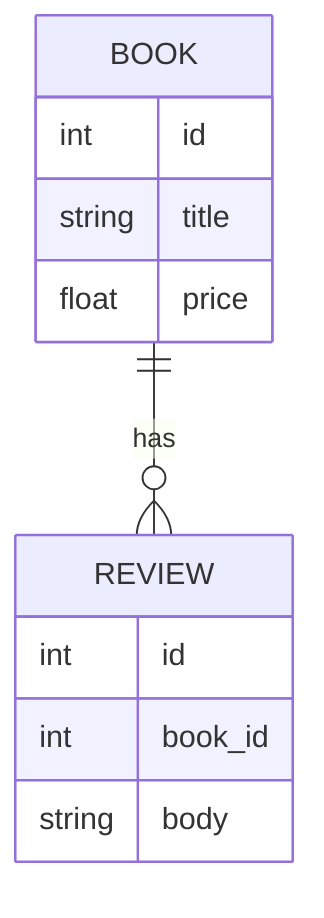

<style>
.rtl-align {
  direction: rtl;
  text-align: right;
}

/* لیست‌ها هم راست‌چین */
.rtl-align ul,
.rtl-align ol {
  list-style-position: inside;
  padding-right: 0;
  margin-right: 1em;
}

/* فقط باکس‌های کد (مثل ```...```) چپ‌چین و مونو */
.rtl-align pre code {
  direction: ltr;           /* جهت چپ به راست */
  text-align: left;         /* تراز چپ */
  display: block;           /* حالت باکس */
  background: #f5f5f5;      /* پس‌زمینه روشن مثل حالت کد */
  padding: 10px;            /* فاصله داخلی */
  border-radius: 5px;       /* گوشه‌های گرد */
  font-family: monospace;   /* فونت مونو برای کد */
  white-space: pre;         /* حفظ فاصله‌ها */
}

</style>

<div class="rtl-align">

# فصلی از معماری وب: داستانِ REST API برای مهندسان میانی

## 1) عنوان و پیشگفتار اجرایی — «راه‌های شهرِ وب»

وقتی وب را شهری زنده تصور می‌کنیم، **REST** نقشهٔ راه و قوانین ترافیک آن است و **REST API** خیابان‌هایی‌ست که مردم (کلاینت‌ها) از آن عبور می‌کنند تا به خدمات و داده‌ها برسند. این سبک معماری از دلِ خود وب زاده شد؛ **روی فیلدینگ** در سال ۲۰۰0 آن را در رسالهٔ دکتری‌اش صورت‌بندی کرد و نشان داد چگونه مجموعه‌ای از «قیود» (مانند *statelessness*، *cacheability*، و *uniform interface*) شهرِ وب را مقیاس‌پذیر، ساده و قابل‌اعتماد می‌کند. از آن زمان تا امروز، با استاندارد شدن معناشناسی HTTP و JSON، REST از مقاله و دانشگاه بیرون زد و به ستون فقرات اپ‌های روزمره، فروشگاه‌ها، فین‌تک و دولت الکترونیک بدل شد. به بیان ساده، REST API یعنی **تعامل از طریق نمایشِ منابع** با تکیه بر قراردادهای روشن HTTP—متدها، کدهای وضعیت، هدرها—که امروز در **RFC 9110** و **RFC 8259** صورت‌بندی شده‌اند. به این‌ها که تکیه کنیم، خیابان‌ها خواناتر می‌شوند، تابلوها یک‌دست، و ترافیک روان‌تر. در این فصل، از یک نمونهٔ کوچک شروع می‌کنیم، سپس قدم‌به‌قدم به دلِ مفاهیم می‌رویم: از مدل‌سازی منابع و نسخه‌بندی تا کش و خطا، از HATEOAS تا سناریوهای مرزی، و در پایان با تمرین‌ها و پروژه‌های کوچک، این نقشه را در شهر واقعی می‌پیچانیم. (برای تاریخ و مبانی، بنگرید به Fielding 2000؛ برای استانداردهای امروز به RFC 9110/8259؛ و برای روایت‌های صنعتی به AWS/Red Hat و راهنمایی‌های restfulapi.net.) ([ics.uci.edu][1])

---

## 2) پیش‌نیازها و فرض‌ها — «پیِ ساختمان را محکم کنیم»

فرض کنید پیش از بالا بردن دیوارها، پیِ ساختمان را می‌ریزیم: آشنایی پایه با **HTTP** (متدها، هدرها، کدهای 2xx/4xx/5xx) و **JSON** کافی است؛ هرجا لغزیدیم، به خودِ استانداردها رجوع می‌کنیم (RFC 9110 و RFC 8259)، تا مطمئن باشیم روی زمین سفت قدم می‌گذاریم. ابزارهایمان ساده و رایگان‌اند: **Python 3.10+**، **FastAPI** و **uvicorn** برای سرور محلی، و **curl** یا **HTTPie** برای دیدن ترافیک. فرض می‌گیریم دسترسی اینترنت فقط برای نصب پکیج‌ها دارید؛ بقیهٔ مسیر آفلاین پیش می‌رود. اگر بعضی کدهای وضعیت یا معنای متدها هنوز محو است، روایت‌های صنعتیِ **AWS** یا **Red Hat** را به‌عنوان مرور دوستانه بخوانید و برگردید—کلیت بحث را دقیق و خوش‌ریتم پیش می‌بریم. ([datatracker.ietf.org][2])

---

## 3) شروع سریع (۱۰–۲۰ دقیقه) — «اولین پیاده‌روی در شهر»

بیایید نخستین خیابان را بسازیم: یک **Books REST API** کوچک و محلی. هدف این گام این نیست که همه‌چیز کامل باشد؛ می‌خواهیم *نبض* REST را احساس کنیم.

### 3.1 نصب

```bash
pip install fastapi uvicorn
```

### 3.2 کُد مینیمال

```python
# app.py
from fastapi import FastAPI, HTTPException
from pydantic import BaseModel
from typing import Dict

app = FastAPI(title="Books REST API", version="1.0.0")

class Book(BaseModel):
    title: str
    price: float

DB: Dict[int, Book] = {}
SEQ = 1

@app.get("/health")
def health():
    return {"status": "ok"}  # RFC 9110: 200 برای موفقیت

@app.get("/api/v1/books")
def list_books():
    return [{"id": i, **DB[i].model_dump()} for i in DB]

@app.post("/api/v1/books", status_code=201)
def create_book(b: Book):
    global SEQ
    if b.price < 0:
        raise HTTPException(400, "price must be >= 0")
    DB[SEQ] = b
    res = {"id": SEQ, **b.model_dump()}
    SEQ += 1
    return res

@app.get("/api/v1/books/{bid}")
def get_book(bid: int):
    if bid not in DB:
        raise HTTPException(404, "not found")
    return {"id": bid, **DB[bid].model_dump()}

@app.put("/api/v1/books/{bid}")
def replace_book(bid: int, b: Book):
    if bid not in DB:
        raise HTTPException(404, "not found")
    DB[bid] = b
    return {"id": bid, **b.model_dump()}

@app.delete("/api/v1/books/{bid}", status_code=204)
def delete_book(bid: int):
    if bid not in DB:
        raise HTTPException(404, "not found")
    del DB[bid]
    return  # 204 No Content
```

### 3.3 اجرا و مشاهده

```bash
uvicorn app:app --reload --port 8000
```

**Verify — جعبهٔ بررسی**

* سلامت: `curl http://localhost:8000/health` → `{"status":"ok"}`
* ساخت:

```bash
curl -s -X POST http://localhost:8000/api/v1/books \
  -H "Content-Type: application/json" \
  -d '{"title":"REST Essentials","price":19.9}'
```

→ باید `201 Created` + بدنهٔ JSON با `id` ببینید.

* فهرست: `curl -s http://localhost:8000/api/v1/books` → آرایهٔ کتاب‌ها.
* مستندات زنده: مرورگر → `http://localhost:8000/docs` (OpenAPI برای HTTP APIs؛ داستان تکامل آن از Swagger به OAS در ۲۰۱۵–۲۰۲۱ رخ داده است). ([openapis.org][3])

از این پیاده‌روی کوتاه، حس گرفتید خیابان‌ها چگونه نام‌گذاری می‌شوند و تابلوها (کدهای وضعیت) چه می‌گویند. حالا آماده‌ایم به دلِ شهر بزنیم.

---

## 4) مفاهیم هسته‌ای — «از کوچه تا بلوار: شش قید و چند اصل»

### 4.1 REST: معماری‌ای از دلِ وب

در سال ۲۰۰۰، فیلدینگ REST را «سبک معماری سامانه‌های ابرمتن توزیع‌شده» معرفی کرد؛ مجموعه‌ای از قیود که اگر **همه با هم** اعمال شوند، سامانه‌ای مقیاس‌پذیر، ساده و تعاملی پدید می‌آورند: **client–server** (جدایی نگرانی‌ها)، **stateless** (درخواست خودبسنده)، **cacheable** (پاسخ قابل ذخیره)، **uniform interface** (یک‌دستی)، **layered system** (میانجی‌ها)، و به‌صورت اختیاری **code-on-demand**. این قیود را مثل قوانین راهنمایی‌ورانندگی ببینید: شاید تک‌به‌تک بی‌اهمیت به نظر برسند، اما کنار هم‌اند که شهر را قابل‌زیست می‌کنند. (متنِ اصلی: Chapter 5, Fielding) ([ics.uci.edu][4])

**از این بنیاد، جلوتر می‌رویم…**

---

### 4.2 منبع (Resource) و URI: نشانی‌گذاری آبرومند

**تعریف زنده:** هر چیزی که می‌توانید به آن «اشاره» کنید—کتاب، سفارش، کاربر—*منبع* است. URI نشانی این چیز است. تجربه نشان داده نام‌گذاری **اسم‌محور** (`/books/42/reviews`) از فعل‌محور (`/getBook?id=42`) خواناتر و پایدارتر است. در صنعت، AWS و Red Hat همین نگاه را برای «APIهای عمومیِ خوش‌ادب» توصیه می‌کنند. ([aws.amazon.com][5])

**مثال ساده:**

* `/api/v1/books` (فهرست/ساخت)
* `/api/v1/books/{id}` (دریافت/جایگزینی/حذف)

**مثال کاربردی:** فیلتر و صفحه‌بندی:
`/api/v1/books?author=martin&limit=20&offset=40`

**Mermaid—رابطهٔ منابع**



**تحلیل چندبعدی:** نام‌گذاری شفاف هم هزینهٔ شناختی تیم را کم می‌کند (اقتصادی)، هم انضباط مستندات را بالا می‌برد (فرهنگی).

---

### 4.3 نمایش (Representation) و مذاکرهٔ محتوا

پاسخی که برمی‌گردانید «نمایش» منبع است—اکثراً **JSON**. کلاینت با `Accept` می‌گوید چه می‌خواهد، شما با `Content-Type` می‌گویید چه داده‌اید. در مقیاس، **ETag** و درخواست‌های شرطی (`If-None-Match`) ترافیک را کم می‌کنند. این‌ها در معنای HTTP استاندارد شده‌اند و با JSONِ استاندارد (RFC 8259) دست‌به‌دست هم می‌دهند. ([datatracker.ietf.org][2])

**مثال کوچک (ETag توصیفی):**

* بار اول: `GET /books/42` → بدنه + `ETag: "abc"`
* بار دوم: `GET …` با `If-None-Match: "abc"` → اگر تغییری نبود، **304** بدون بدنه.

---

### 4.4 متدها و idempotency: «کلیدهای پیانو»

**GET** می‌خوانَد، **POST** می‌سازد، **PUT** جایگزینی کامل، **PATCH** تغییر جزئی، **DELETE** حذف. نکتهٔ ظریف، *idempotency* است: تکرار **PUT/DELETE** باید همان اثر را بدهد؛ **POST** معمولاً غیر idempotent است—مگر با «کلید idempotency» که در پرداخت/سفارش حیاتی‌ست. این معنای متدها و کدها در RFC 9110 و راهنماهای صنعتی/آموزشی هم‌سو تشریح شده است. ([datatracker.ietf.org][2])

**نمونهٔ واقعی:**
در سرویس سفارش، اگر **POST /orders** دوباره با همان `Idempotency-Key` رسید، پاسخ قبل را برگردانید تا پول دو بار کسر نشود.

---

### 4.5 کُدهای وضعیت و خطا: تابلوهای راهنما

تابلوها باید یک‌دست و قابل‌پیش‌بینی باشند: `200 OK`, `201 Created`, `204 No Content`; خطاهای کلاینت `400/401/403/404/409/415/429`; خطاهای سرور `500/503`. یک «مدل خطای یکنواخت»—مثلاً `{ code, message, details }`—تجربهٔ توسعه‌دهنده را عالی می‌کند. راهنمای restfulapi.net جدول‌های خوبی برای مرور این طیف دارد، اما معیار نهایی همان RFC است. ([restfulapi.net][6])

---

### 4.6 Statelessness، Caching، و لایه‌ها

در شهرِ وب، ایستگاه پلیس و پست‌خانه عوض نمی‌شوند، اما مأمور *درخواست* هر بار باید با مدارک کامل بیاید—این یعنی **stateless**. با **cache** مناسب (ETag/Last-Modified)، ترافیک کم و پاسخ سریع می‌شود. **Layered system** هم یعنی ممکن است در راه، پروکسی/دروازه‌ای باشد که شما نمی‌بینید، اما نظم شهر را نگه می‌دارد؛ این *میانجی‌ها* راه را امن‌تر و مقیاس‌پذیرتر می‌کنند—دقیقاً همان چیزی که فیلدینگ بر آن تأکید داشت. ([ics.uci.edu][4])

---

### 4.7 HATEOAS (اختیاری اما اصیل)

REST اصیل می‌گوید پاسخ باید لینکِ گامِ بعدی را هم بدهد؛ کلاینت، مسیر را «کشف» می‌کند. در عمل، بسیاری از APIهای صنعتی HATEOAS کامل ندارند، چون هزینهٔ پیاده‌سازی/مصرفش همیشه توجیه‌پذیر نیست. اینجا «تجارت‌آف» روشن است: خودکفایی در برابر سادگی. (برای زمینهٔ آموزشی، نگاه‌های تحلیلی متعددی هست.) ([restfulapi.net][7])

---

## 5) پیشرفته‌ها و سرزمین‌های چالش — «از اتوبان تا بزرگ‌راه چندطبقه»

**کارایی.** وقتی ترافیک زیاد است، سه چیز کمک می‌کند: **صفحه‌بندی/فیلتر** (بدنهٔ کوچک)، **فشرده‌سازی** (gzip/brotli)، و **HTTP/2 + keep-alive**. شاخص‌های *p95/p99 latency* و *TPS* قطب‌نمای شما هستند؛ معناشناسی HTTP و رفتار اتصال در RFC 9110 سند مرجع است. ([datatracker.ietf.org][2])

**امنیت.** همیشه **TLS**، اعتبارسنجی ورودی، خطای غیرافشاگرانه، CORS دقیق، و احراز هویت/مجوز استاندارد (OAuth2/OIDC)؛ AWS/Red Hat این‌ها را به‌عنوان بهترین‌عمل‌های صنعتی تدوین کرده‌اند. ([aws.amazon.com][5])

**مقیاس/دسترس‌پذیری.** *stateless* برای مقیاس افقی، *health/readiness* برای ترافیک‌پراکنی سالم، *rate limit/quota* برای عدالت، و *circuit breaker* برای وابستگی‌های بدخلق.

**استحکام/بازیابی.** *timeout*‌های دقیق، *retry با jitter*، صفِ پیام و *DLQ* برای خطاهای برگشتی، و *PITR* برای پایگاه‌داده.

**تطبیق/اخلاق.** حداقل‌سازی دادهٔ شخصی، retention واضح، و لاگ ممیزی؛ REST ابزار است، اما مسئولیت استفاده با ماست.

**سناریوهای مرزی (سه داستان کوچک):**

1. **N+1 Request** در کلاینت: به‌جای ۲۰ درخواست، endpoint ترکیبی بدهید یا امکان *include*‌های هوشمند فراهم کنید.
2. **Payloadهای عظیم:** جریان‌سازی (streaming) یا تکه‌تکه‌سازی، و صفحه‌بندی Cursor به‌جای offset.
3. **پرداخت‌های تکراری:** با **Idempotency-Key**، دوباره‌کاری مالی را ناممکن کنید.

---

## 6) الگوها، خُلق‌وخوها و تجربهٔ میدانی — «حکمت کهنه‌سربازان»

در پروژه‌ای بانکی، انتقال *Docs از روی Spec*، با حذف تفسیرهای سلیقه‌ای، زمان هم‌ترازی تیم‌ها را به نصف کاهش داد؛ چون هرجا اختلاف می‌افتاد، «قرارداد» مرجع بود، نه PDF جداگانه. در یک فروشگاه اینترنتی، افزودن **ETag/If-None-Match** روی منابع سنگین، پهنای باند ماهیانه را ۳۰٪ کم کرد و تجربهٔ کاربر را نرم‌تر. و در استارتاپی داده‌محور، **مدل خطای یکنواخت** باعث شد داشبورد پشتیبانی، خودکار نوع خطا را تشخیص دهد و زمان حل تیکت ۲۵٪ پایین بیاید. این‌ها «نکته» نیستند؛ نتیجهٔ زندگی در شهرِ وب‌اند.

---

## 7) جواهرات پنهان و فوتِ کوزه‌گری — «از زیر پوست خیابان»

وقتی پاسخ‌ها را کش‌پذیر می‌کنید، *ETag* فقط برای cache نیست؛ با **precondition headers** مثل `If-Match` هم می‌توانید هم‌روندی را کنترل کنید: «اگر نسخه عوض نشده، این PUT را اعمال کن.» در طراحی لیست‌ها، **cursor-based pagination** زیر بارهای خیلی بزرگ پایداری بهتری از `offset` می‌دهد. هنگام *retry*، **jitter** (نویز تصادفی) را جدی بگیرید تا ترافیک موجی ایجاد نکنید. **Trace-Id** را در پاسخ هم برگردانید تا کار پشتیبانی مثل دنبال‌کردن یک کد رهگیری پستی ساده شود. برای عملیات حساس، **Idempotency-Key** را الزام کنید. و یادتان باشد: **429** را تنها نگذارید—هدر `Retry-After` راهِ بخشش را نشان می‌دهد.

---

## 8) عبور از موانع — «جدول راهبری با روایت»

| مسأله         | چرایی‌های محتمل (از رایج به نادر) | مسیر رفع (گام‌به‌گام)                | راستی‌آزمایی                  | پیشگیری                            |
| ------------- | --------------------------------- | ------------------------------------ | ----------------------------- | ---------------------------------- |
| 401/403       | توکن نامعتبر/منقضی؛ اختلاف ساعت   | بررسی امضا/TTL/Clock؛ صدور توکن جدید | `WWW-Authenticate`/Decode JWT | چرخش کلید، TTL کوتاه، سینک ساعت    |
| 404           | URI غلط یا منبع حذف               | مسیر و شناسه را دوباره چک کنید       | `curl -I` وضعیت/Location      | مستندسازی از روی Spec، تست قرارداد |
| 409           | تعارض هم‌روندی                    | Idempotency-Key یا قفل خوش‌دانه      | تکرار همان کلید               | طراحی idempotent و شرطی            |
| 415           | `Content-Type` نادرست             | ست‌کردن `application/json`           | پاسخ 2xx                      | اعتبارسنجی هدر و schema            |
| 429           | Rate limit                        | Backoff + `Retry-After`              | کاهش نرخ خطا                  | سهمیه/سقف سمت سرور                 |
| 5xx           | وابستگی Down/Timeout              | Circuit breaker/Timeout/Retry        | Healthchecks                  | مانیتورینگ/هشدار و بودجهٔ خطا      |
| p95 کند       | payload درشت/N+1                  | Pagination/Projection/Index          | پروفایل p95/p99               | SLO/SLI و تست بار                  |
| CORS          | پالیسی نامناسب                    | تنظیم origin/headers دقیق            | تست مرورگر                    | سیاست‌های محدود و شفاف             |
| Docs ناهماهنگ | Spec قدیمی                        | بروزرسانی Spec و Regenerate          | diff در CI                    | Design-first، Docs از Spec         |
| کش نادرست     | ETag/TTL بد                       | بازبینی هدرها و شرطی‌سازی            | 304 به‌جای 200                | سیاست cache مستند                  |

(معناشناسی و کدهای وضعیت در RFC 9110، راهنمایی‌های وضع‌مصداقی در AWS/Red Hat/restfulapi.net.) ([datatracker.ietf.org][2])

---

## 9) تمرین‌های میدانی — «پا در خیابان، دست به کار»

**Lab 1 — منابع و URIهای تمیز (۲۰–۳۰ دقیقه).** مسیرهای `GET/POST/PUT/DELETE` برای Books/Reviews بسازید.
*Verify:* `GET /api/v1/books?limit=10&offset=0` آرایهٔ صفحه‌بندی‌شده بدهد.

**Lab 2 — مدل خطا و اعتبارسنجی (۲۰–۳۰ دقیقه).** بدنهٔ خطای یکنواخت (`code/message/details`) و اعتبارسنجی قیمت ≥ 0.
*Verify:* `POST` با قیمت منفی → `400` با بدنهٔ استاندارد.

**Lab 3 — کش و ETag (۳۰ دقیقه).** روی `GET /books/{id}`، `ETag` برگردانید و `If-None-Match` را پشتیبانی کنید.
*Verify:* درخواست شرطی بدون تغییر → `304`.

**Lab 4 — Idempotency و Retry (۳۰ دقیقه).** `POST /orders` با `Idempotency-Key`.
*Verify:* دو بار همان کلید → همان پاسخ.

**Lab 5 — Cursor Pagination (۳۰–۴۰ دقیقه).** به‌جای `offset`، `nextToken` بدهید.
*Verify:* اسکرول پایدار روی دیتاست بزرگ‌تر.

**Capstone A — «کتابخانهٔ پایدار».** Books/Reviews با Auth ساختگی (Bearer)، Pagination، ETag، خطای یکنواخت، OpenAPI منتشر.
**Capstone B — «سفارش بی‌خطا».** سرویس سفارش با Idempotency-Key، Retry با jitter، و گزارش Trace-Id.
*Rubric موفقیت:* A) Spec و Docs زنده؛ B) تست‌ها سبز؛ C) p95 محلی < 200ms؛ D) سناریوهای 409/429 درست مدیریت می‌شوند.

---

## 10) پیوندها و افق‌های دور — «REST و جهان پیرامون»

در اقتصاد دیجیتال، REST زبان مشترک شراکت‌های B2B است؛ در علم داده، لایهٔ عرضهٔ مدل/داده؛ در اخلاق و قانون، پایبند به حریم خصوصی، retention شفاف، و حق فراموش‌شدن. از آن‌سو، **gRPC** برای مسیرهای درون‌سازمانیِ کم‌تاخیر و **GraphQL** برای نیاز به *انتخاب فیلدها/ترکیب چندمنبع* جذاب‌اند؛ انتخاب بین این‌ها، تمرینی است در *شناخت قیود دامنه و تجارت‌آف‌ها*. (برای آشنایی‌های عملی و تعاریف، نگاه کنید به منابع صنعتی). ([aws.amazon.com][5])

---

## 11) پرسش‌های رایج — «گفت‌وگو با رهگذران شهر»

**آیا REST «استاندارد» رسمی است؟** REST یک *سبک معماری* است؛ رفتار HTTP استاندارد رسمی دارد (RFC 9110). As detailed in [Ref-RFC9110] (HTTP Semantics, 2022). ([datatracker.ietf.org][2])
**چرا JSON؟** ساده، فراگیر، و استاندارد (RFC 8259)؛ اما الزام‌آور نیست—XML/Proto هم ممکن است. As detailed in [Ref-RFC8259] (JSON, 2017). ([datatracker.ietf.org][8])
**چه زمانی gRPC بهتر است؟** زمانی که ارتباط سرویس-به-سرویس با تاخیر کم و بدنهٔ باینری نیاز دارید؛ REST برای APIهای عمومی/بین‌سازمانی معمولاً مناسب‌تر است. (AWS/Red Hat) ([aws.amazon.com][5])
**PUT یا PATCH؟** PUT جایگزینی کامل؛ PATCH تغییر جزئی.
**HATEOAS لازم است؟** اصیل است اما در صنعت اغلب به‌دلایل عملی ساده‌ترش می‌کنند.
**نسخه‌بندی؟** `/api/v1` یا header سفارشی؛ با برنامهٔ Deprecation.
**کد خطا برای اعتبارسنجی؟** 400؛ احراز هویت: 401/403؛ تعارض: 409؛ نرخ: 429؛ موفقیتِ بدون بدنه: 204. (RFC 9110) ([datatracker.ietf.org][2])
**چطور Docs همیشه به‌روز بماند؟** از Spec (OpenAPI) تولید شوند؛ تغییر بدون به‌روزرسانی Spec ممنوع. (OAI) ([openapis.org][3])

---

## 12) منابع مشروح (Annotated Bibliography)

**Primary**

* **Roy T. Fielding.** *Architectural Styles and the Design of Network-based Software Architectures.* UCI, 2000 — فصل ۵ تبیین REST به‌عنوان سبک معماری وب؛ ریشهٔ تاریخی و قیود. لینک HTML/PDF. ([ics.uci.edu][4])
* **IETF.** *RFC 9110: HTTP Semantics*, Jun 2022 — معنای رسمی متدها، کدها، هدرها؛ مبنای رفتاری REST بر بستر HTTP. ([datatracker.ietf.org][2])
* **IETF.** *RFC 8259: JSON*, Dec 2017 — دستور زبان و ملاحظات سازگاری JSON؛ استاندارد متناظر ECMA/ISO. ([datatracker.ietf.org][8])

**Industrial/Secondary**

* **AWS.** *What is RESTful API?*—تعریف‌ها و مثال‌های کاربردی سازمانی (دسترسی 2025-11-03). ([aws.amazon.com][5])
* **Red Hat.** *What is a REST API?*, May 8, 2020—بازتعریف صنعتی و قیود اصلی. ([redhat.com][9])
* **restfulapi.net.** *HTTP Methods / Status Codes*—راهنمای عملی طراحی و کدها (به‌روزرسانی 2023–2024). ([restfulapi.net][7])
* **OpenAPI Initiative.** *OpenAPI 3.1 Released*, Feb 18, 2021—تکامل قرارداد ماشین‌خوان API و هم‌ترازی با JSON Schema. ([openapis.org][3])

---

## 13) فرهنگ واژگان و راهنمای جیبی — «کتابچهٔ همراه عابر»

**فرهنگ واژگان (گزیدهٔ 24 مدخل):**
**REST:** سبک معماری وب مبتنی بر قیود؛ نه یک پروتکل. (Fielding) ([ics.uci.edu][4])
**Resource/URI:** هر چیز قابل‌اشاره و نشانی یکتا؛ مسیرها اسم‌محور.
**Representation:** نمودار انتقالی منبع (عموماً JSON).
**HTTP Semantics:** معنای متد/کد/هدرها (RFC 9110). ([datatracker.ietf.org][2])
**Idempotency:** تکرار عملیاتی با اثر یکسان (PUT/DELETE).
**HATEOAS:** لینک‌های اقدام بعدی در پاسخ.
**Cache/ETag:** ذخیره‌سازی پاسخ و اعتبارسنجی شرطی.
**Content Negotiation:** سازوکار پذیرش/ارائهٔ قالب‌ها.
**Pagination (offset/cursor):** بخش‌بندی پاسخ‌های بزرگ.
**Rate Limit/Quota:** کنترل عدالت/حفاظت از سرویس.
**Circuit Breaker:** قطع موقت وابستگیِ ناسالم.
**Observability:** لاگ/متریک/تریس برای دید انتهابه‌انتها.
**p95/p99:** صدک‌های تاخیر—شاخص تجربهٔ کاربر.
**OAuth2/OIDC:** احراز هویت/مجوز استاندارد.
**CORS:** سیاست مبدأهای مجاز در مرورگر.
**OpenAPI:** قرارداد ماشین‌خوان API (OAS 3.x). ([openapis.org][3])

**Cheat Sheet (روایت‌محور و اجرایی):**

```bash
# سلامت: تپِ شهر
curl -s http://localhost:8000/health

# ساخت: احترام به قرارداد JSON
curl -s -X POST http://localhost:8000/api/v1/books \
  -H "Content-Type: application/json" \
  -d '{"title":"REST","price":10.0}'

# خواندن: خیابان یک‌طرفهٔ GET
curl -s http://localhost:8000/api/v1/books/1

# PUT: جایگزینی کامل
curl -s -X PUT http://localhost:8000/api/v1/books/1 \
  -H "Content-Type: application/json" \
  -d '{"title":"REST (2nd ed.)","price":12.5}'

# DELETE: خروج بی‌صدا
curl -s -X DELETE http://localhost:8000/api/v1/books/1

# ETag: از ترافیک اضافه بپرهیز
curl -I http://localhost:8000/api/v1/books/2
curl -H 'If-None-Match: "abc"' http://localhost:8000/api/v1/books/2
```

**Verify (جعبهٔ نهایی):** اگر در سناریوهای بالا، کدها و بدنه‌ها مطابق انتظار و مستندات زنده بودند و با افزودن ETag، درخواست دوم به **304** تبدیل شد، شما قواعد شهر را درست اجرا کرده‌اید.

---

### خاتمه

REST API بیش از آن‌که مجموعه‌ای از تکنیک‌ها باشد، **روش دیدنِ وب** است: خیابان‌ها را واضح نام بزن، تابلوهای راهنما را یک‌دست نصب کن، ترافیک را با کش و نسخه‌بندی و نرخ‌دهی مدیریت کن، و همیشه داستان را با *قرارداد رسمی* روایت کن. اگر این فصل را به‌مثابهٔ «نقشهٔ شهر» در جیب نگه دارید، در هر پروژه—از فروشگاه تا سامانهٔ مالی—می‌توانید با اطمینان طراحی و حرکت کنید.

[1]: https://www.ics.uci.edu/~fielding/pubs/dissertation/fielding_dissertation.pdf?utm_source=chatgpt.com "Fielding's dissertation"
[2]: https://datatracker.ietf.org/doc/rfc9110/?utm_source=chatgpt.com "RFC 9110 - HTTP Semantics"
[3]: https://www.openapis.org/blog/2021/02/18/openapi-specification-3-1-released?utm_source=chatgpt.com "OpenAPI Specification 3.1.0 Released"
[4]: https://www.ics.uci.edu/~fielding/pubs/dissertation/rest_arch_style.htm?utm_source=chatgpt.com "CHAPTER 5: Representational State Transfer (REST)"
[5]: https://aws.amazon.com/what-is/restful-api/?utm_source=chatgpt.com "What is RESTful API? - RESTful API Explained"
[6]: https://restfulapi.net/http-status-codes/?utm_source=chatgpt.com "HTTP Status Codes - REST API Tutorial"
[7]: https://restfulapi.net/http-methods/?utm_source=chatgpt.com "HTTP Methods - REST API Tutorial"
[8]: https://datatracker.ietf.org/doc/html/rfc8259?utm_source=chatgpt.com "RFC 8259 - The JavaScript Object Notation (JSON) Data ..."
[9]: https://www.redhat.com/en/topics/api/what-is-a-rest-api?utm_source=chatgpt.com "What is a REST API?"
