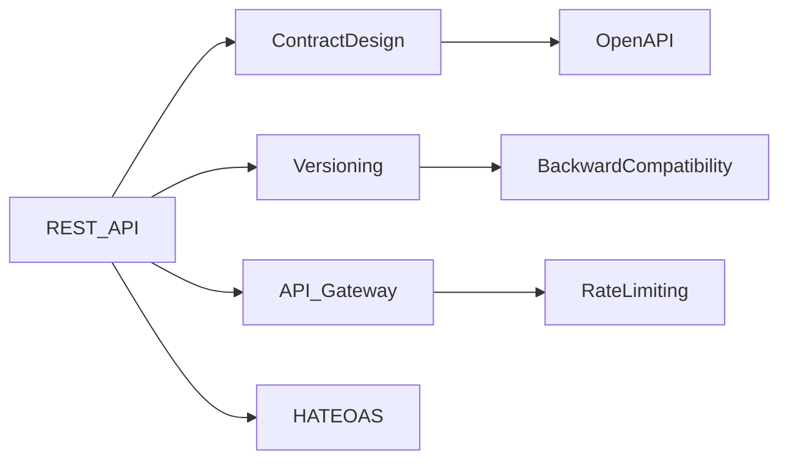
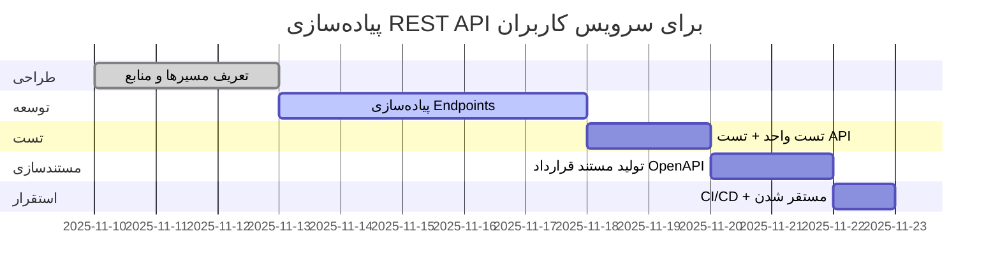

<style>
.rtl-align {
  direction: rtl;
  text-align: right;
}

/* لیست‌ها هم راست‌چین */
.rtl-align ul,
.rtl-align ol {
  list-style-position: inside;
  padding-right: 0;
  margin-right: 1em;
}

/* فقط باکس‌های کد (مثل ```...```) چپ‌چین و مونو */
.rtl-align pre code {
  direction: ltr;           /* جهت چپ به راست */
  text-align: left;         /* تراز چپ */
  display: block;           /* حالت باکس */
  background: #f5f5f5;      /* پس‌زمینه روشن مثل حالت کد */
  padding: 10px;            /* فاصله داخلی */
  border-radius: 5px;       /* گوشه‌های گرد */
  font-family: monospace;   /* فونت مونو برای کد */
  white-space: pre;         /* حفظ فاصله‌ها */
}

</style>

<div class="rtl-align">
# آموزش کامل: **REST API**

سطح: **INTERMEDIATE**
لطفاً موقعیت **Target stack/environment** و **Constraints** را خودتان تعیین کنید تا مثال‌ها دقیق‌تر شوند.

---

## 1. نام و تعریف‌ها

### نام موضوع و جایگاه آن در اکوسیستم فنی

«REST API» یا «رابط برنامه‌نویسی کاربردی از نوع RESTful»، یکی از رایج‌ترین روش‌ها برای ارتباط میان سیستم‌ها، سرویس‌ها و کلاینت‌ها در معماری‌های وب، میکروسرویس و توزیع‌شده است.

### تعریف عمومی متمایل به حرفه‌ای

یک REST API، رابطی است که امکان تبادل داده میان کلاینت و سرور را با استفاده از HTTP و روش‌های استاندارد فراهم می‌کند. این رابط به گونه‌ای طراحی شده که ساده، مقیاس‌پذیر و مستقل از پلتفرم باشد. ([ibm.com][1])

### تعریف تخصصی و دقیق

از منظر مهندسی، REST (Representational State Transfer) سبکی معماری است که مجموعه‌ای از محدودیت‌ها (constraints) برای طراحی سرویس‌های وب ارائه می‌دهد؛ یک API زمانی RESTful محسوب می‌شود که این محدودیت‌ها را رعایت کند (مثلاً Client-Server، Stateless، Cacheable، Uniform Interface، Layered System و اختیاری Code on Demand). ([Wikipedia][2])
در این حالت، «REST API» به رابطی گفته می‌شود که منابع (Resources) را با URI‌های یونیک نمایش می‌دهد، روش‌های HTTP مانند GET/POST/PUT/DELETE را روی آن‌ها اعمال می‌کند، و نمایشی (Representation) از آن منابع را به فرمت‌هایی مثل JSON یا XML برمی‌گرداند. ([Red Hat][3])

---

## 2. پیش‌نیازهای دانشی

برای درک کامل در سطح Intermediate، باید با موارد زیر آشنا باشید:

| مهارت/مفهوم                                         | توضیح مختصر                                                                            |
| --------------------------------------------------- | -------------------------------------------------------------------------------------- |
| HTTP و روش‌های آن (GET, POST…)                      | باید بدانید هر روش چه معنایی دارد و چه جا استفاده می‌شود. ([REST API Tutorial][4])     |
| URIها، مسیرها و پارامترها                           | طراحی مسیرها (مثل `/users/{id}`) و تفکیک پارامترهای مسیر، کوئری و بدنه. ([ibm.com][5]) |
| JSON / XML / Representation                         | مفهوم «نمایش» منابع، تبدیل داده‌ها و فرمت تبادل.                                       |
| معماری سرویس‌ها (Microservices, API-First)          | بدانید API چطور در معماری بزرگ‌تر سرویس‌ها جای می‌گیرد.                                |
| امنیت و کنترل دسترسی                                | مفاهیمی مانند احراز هویت، مجوز، نرخ محدودسازی (rate-limiting) مهم‌اند.                 |
| مستندسازی (API Documentation)، قراردادها (Contract) | API باید به‌خوبی درج شود تا مصرف‌کنندگان بتوانند استفاده کنند.                         |
| Versioning و نگهداری در زمان                        | در زمان به‌روزرسانی API، چگونه از شکستن مصرف‌کننده‌ها جلوگیری کنیم.                    |

---

## 3. دسته‌بندی کاربردها و نمونه‌های واقعی

### حوزه‌های کاربردی

* **واسط‌های وب و موبایل:** APIهایی که برای اپلیکیشن‌های موبایل یا SPA (Single-Page Application) فراهم می‌شوند.
* **میکروسرویس‌ها و سیستم‌های توزیع‌شده:** هر سرویس داخلی ممکن است REST API داشته باشد برای تعامل با دیگر سرویس‌ها.
* **سیستم‌های B2B و خدمات عمومی:** ارائه API به شرکای تجاری یا توسعه‌دهندگان بیرونی.
* **تحلیل داده و پلتفرم سرویس-گرا:** فراهم‌سازی داده via REST API برای مصرف توسط داشبوردها، BI و سیستم‌های ETL.

### مثال‌های واقعی

* شرکت‌هایی مانند IBM که در مستندات خود REST API را به‌عنوان راهکار سبک برای تبادل داده در معماری سرویس‌ها معرفی کرده‌اند. ([ibm.com][1])
* شرکت‌هایی مانند Red Hat که می‌گویند: «REST API رابطی است که قوانین معماری REST را رعایت می‌کند». ([Red Hat][3])
* پروژه‌های وب و موبایل بسیاری که از REST API به‌عنوان لایه‌ی Backend برای کلاینت‌های مختلف استفاده می‌کنند (مثلاً اپلیکیشن‌های تلفن همراه که داده‌ها را via REST دریافت می‌کنند) ([Pragim Tech][6])

---

## 4. شرکت‌ها و سازمان‌های استفاده‌کننده یا پشتیبان

* IBM – ارائه‌دهنده مستندات و راهنماهای طراحی REST API.
* Red Hat – منتشر کننده مقالات و توضیحات درباره REST API و معماری آن.
* گوگل، فیس‌بوک، آمازون – هرچند مستندات عمومی کامل ندارند، ولی در مقیاس بزرگ از معماری REST / RESTful استفاده می‌کنند.
* انجمن‌ها و استانداردها: مثلاً OpenAPI Initiative (برای قراردادهای API) که پوشش طراحی REST API را تسهیل می‌کند.

---

## 5. مفاهیم و فناوری‌های مرتبط

### توضیح مفاهیم وابسته

* **Contract-First API Design:** ابتدا قرارداد API با استفاده از OpenAPI یا Swagger تعریف می‌شود، سپس پیاده‌سازی صورت می‌گیرد.
* **HATEOAS (Hypermedia as the Engine of Application State):** بخشی از محدودیت‌های REST که می‌گوید منابع باید لینک‌های قابل مصرف به وضعیت بعدی ارائه دهند. ([Wikipedia][2])
* **Versioning API:** روش‌هایی برای به‌روزرسانی API بدون شکستن مصرف‌کننده‌ها (مثلاً `/v1/`, `/v2/` یا header-based).
* **Rate Limiting & Throttling:** برای جلوگیری از مصرف بیش‌ازحد و حملات.
* **API Gateway / Management:** لایه‌هایی برای امنیت، مستندسازی، مانیتورینگ و کنترل APIها.

### ارتباط مفهومی



---

## 6. الگوها و Best Practices

### Do (بایدها)

* از مسیر (URI)هایی استفاده کنید که نشان‌دهنده منابع باشند، نه عملیات (مثلاً `/users` به‌جای `/getAllUsers`). ([REST API Tutorial][7])
* از روش‌های HTTP به‌درستی استفاده کنید: GET برای دریافت، POST برای ایجاد، PUT/PATCH برای به‌روزرسانی، DELETE برای حذف. ([REST API Tutorial][4])
* API را مستند کنید، قرارداد آن را بنویسید (مثلاً OpenAPI) و نمونه‌های درخواست/پاسخ ارائه دهید.
* طراحی کنید تا API مستقل از کلاینت باشد (Client-Server)، و بدون حفظ وضعیت بین درخواست‌ها (Stateless). ([Red Hat][3])
* در نظر بگیرید که داده‌ها قابل کش (cacheable) باشند تا کارایی بهبود یابد.

### Don’t (نبایدها)

* نباید از عملیات نامناسب برای HTTP استفاده کنید (مثلاً حذف منابع با GET).
* نباید URIها را به‌طور غیر منطقی بسط دهید (مثل `/getUserInfoByUserId`).
* نباید تغییرات شکسته‌کننده (breaking changes) را بدون اعلام و نسخه‌گذاری اجرا کنید.
* نباید مستندسازی را نادیده بگیرید؛ عدم وجود مستندات، مصرف API را بسیار سخت خواهد کرد.

### Design Patterns / Anti-patterns

* **Pattern:** API First → قرارداد تعریف شده سپس ساخت.
* **Anti-pattern:** «شوخی با URIها و روش‌های HTTP» → باعث سردرگمی مصرف کننده می‌شود.
* **Anti-pattern:** «Stateful REST API» → وقتی سرور وضعیت جلسات (session) کلاینت را نگه می‌دارد؛ با معماری REST تناقض دارد.

---

## 7. ترفندها و Pro Tips

* در انتخاب مسیرها (URIs) از نام‌های جمع برای مجموعه‌ها استفاده کنید (مثلاً `/users`, `/orders`).
* برای به‌روزرسانی جزئی از `PATCH` استفاده کنید، نه صرفا `PUT`.
* در پاسخ‌های GET برای مجموعه‌ها از pagination استفاده کنید (مثلاً `?page=1&size=20`) تا عملکرد مناسب شود.
* خطاها را به شکل استاندارد برگردانید (مانند HTTP 4xx, 5xx با بدنه JSON که پیام خطا را دارد).
* امنیت: همیشه از HTTPS استفاده کنید، از JWT یا OAuth2 برای احراز هویت بهره بگیرید.
* مانیتورینگ: زمان پاسخ، نرخ خطاها، و مصرف بر اساس کلاینت را پایش کنید.
* نسخه‌گذاری را از ابتدا در نظر بگیرید؛ وقتی API عمومی عرضه می‌شود بعداً تغییر دادنش دشوار است.

---

## 8. مباحث پیشرفته و سناریوهای مرزی

### محیط‌های پیچیده و توزیع‌شده

در معماری میکروسرویس با صدها REST API، چالش‌های زیر وجود دارد: هماهنگی نسخه‌ها، مستندسازی متحد، مانیتورینگ متمرکز، و امنیت در سطح سرویس.

### تحلیل محدودیت‌ها، bottleneckها، trade-offها

* **بک‌لاین:** REST ساده و سریع است، ولی وقتی نیاز به پیچیدگی مثل تراکنش‌های توزیع‌شده، روابط پیچیده و hypermedia دارید ممکن است محدود شود.
* **trade-off:** رعایت کامل تمامی اصول REST (مثل HATEOAS) ممکن است سرعت توسعه را کند کند؛ در عمل بسیاری از APIها «semi-RESTful» هستند.
* **bottleneck:** کمبود مستندسازی یا کنترل نسخه می‌تواند باعث شود مصرف‌کنندگان قدیمی درگیر خطا شوند.
* حالت مرزی: در سیستم‌هایی با نیاز بسیار بالا به مقیاس، ممکن است به سمت معماری GraphQL یا gRPC تغییر داده شود.

---

## 9. مقایسه با فناوری‌ها یا استانداردهای مشابه

| معیار مقایسه        | REST API                                     | روش جایگزین (مثلاً SOAP, gRPC)        |
| ------------------- | -------------------------------------------- | ------------------------------------- |
| سبک ارتباط          | سبک، مبتنی بر HTTP/URI                       | سنگین‌تر (مثلاً SOAP: XML، WSDL)      |
| قابلیت مقیاس        | بالا، ساده در کش و مستقل کردن                | گاهی پیچیده‌تر برای مقیاس‌بندی        |
| انعطاف‌پذیری        | بسیار مناسب برای وب و موبایل                 | مناسب برای سناریوهای خاص (مثلاً ws-*) |
| قرارداد سخت         | قرارداد کم‌تر سخت (ممکن است استاندارد نباشد) | قرارداد دقیق همراه با WSDL/IDL        |
| پشتیبانی از زبان‌ها | گسترده، ساده برای همه کلاینت‌ها              | ممکن است نیاز به کتابخانه خاص باشد    |

**مزایا نسبت به SOAP/gRPC:**

* طراحی ساده‌تر، استفاده وسیع‌تر در وب، مستقل از پلتفرم.
* امکان توسعه و نگهداری سریع‌تر، مصرف منابع کمتر. ([Red Hat][3])
  **معایب نسبت به برخی روش‌ها:**
* شاید قراردادها کمتر سخت‌گیر باشند؛ پشتیبانی تراکنش توزیعی، امنیت سطح شرکتی (Enterprise) ممکن است به اندازه SOAP کامل نباشد.
* در سناریوهای نیازمند سرعت بسیار بالا یا ارتباط دوطرفه (streaming) ممکن است gRPC گزینه بهتری باشد.

---

## 10. نمودارها و مصورسازی‌ها

### نمودار جریان ساده

```mermaid
graph LR
    Client -->|HTTP Request| REST_API_Server
    REST_API_Server --> Resource
    Resource --> Representation
    Client <--|HTTP Response| Representation
```

### نمودار Gantt برای پیاده‌سازی یک REST API



---

## 11. نتیجه‌گیری آموزشی

برای شما به‌عنوان توسعه‌دهنده با سطح Intermediate، درک REST API به معنای توانایی طراحی و پیاده‌سازی رابط‌هایی است که قابل مصرف توسط سرویس‌ها و کلاینت‌های متعدد باشند، نگهداری‌شدنی باشند و بتوانند در معماری بزرگ‌تر به‌خوبی عمل کنند.
گام بعدی: مطالعه دقیق **مستندات رسمی** مثل OpenAPI Initiative، پیاده‌سازی عملی REST API با فریم‌ورک دلخواه (مثلاً Django REST Framework یا Spring Boot)، و آزمایش نسخه‌گذاری، مستندسازی، تست و مانیتورینگ.

اگر بخواهی، می‌توانیم با هم یک «کارگاه عملی طراحی و پیاده‌سازی REST API» در محیط شما (مثلاً Django + PostgreSQL) تعریف کنیم و مرحله به مرحله پیش برویم. آیا مایل هستی؟

[1]: https://www.ibm.com/think/topics/rest-apis?utm_source=chatgpt.com "What Is a REST API (RESTful API)? - IBM"
[2]: https://en.wikipedia.org/wiki/REST?utm_source=chatgpt.com "REST"
[3]: https://www.redhat.com/en/topics/api/what-is-a-rest-api?utm_source=chatgpt.com "What is a REST API? - Red Hat"
[4]: https://restfulapi.net/http-methods/?utm_source=chatgpt.com "HTTP Methods - REST API Tutorial"
[5]: https://www.ibm.com/docs/en/integration-bus/10.0?topic=apis-rest&utm_source=chatgpt.com "REST APIs - IBM"
[6]: https://www.pragimtech.com/blog/blazor/what-are-restful-apis/?utm_source=chatgpt.com "What are RESTful APIs - Pragim Tech"
[7]: https://restfulapi.net/resource-naming/?utm_source=chatgpt.com "REST API URI Naming Conventions and Best Practices"
