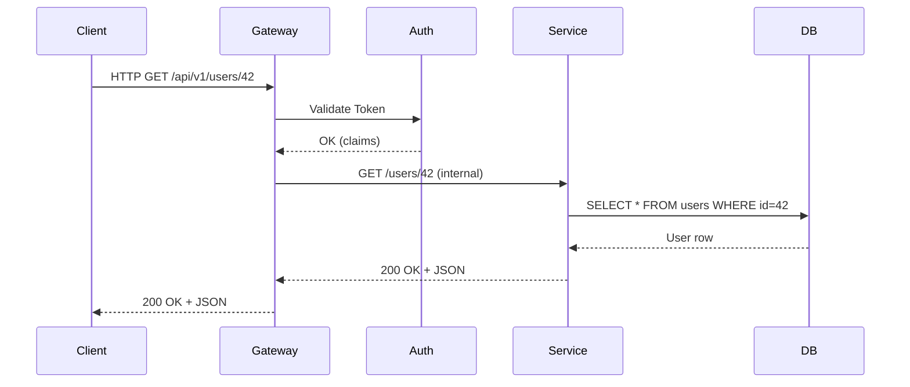
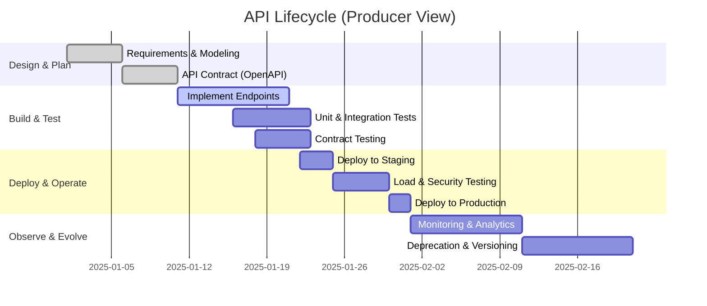

<style>
.rtl-align {
  direction: rtl;
  text-align: right;
}

/* لیست‌ها هم راست‌چین */
.rtl-align ul,
.rtl-align ol {
  list-style-position: inside;
  padding-right: 0;
  margin-right: 1em;
}

/* فقط باکس‌های کد (مثل ```...```) چپ‌چین و مونو */
.rtl-align pre code {
  direction: ltr;           /* جهت چپ به راست */
  text-align: left;         /* تراز چپ */
  display: block;           /* حالت باکس */
  background: #f5f5f5;      /* پس‌زمینه روشن مثل حالت کد */
  padding: 10px;            /* فاصله داخلی */
  border-radius: 5px;       /* گوشه‌های گرد */
  font-family: monospace;   /* فونت مونو برای کد */
  white-space: pre;         /* حفظ فاصله‌ها */
}

</style>

<div class="rtl-align">


## ۱. API چیست؟ جایگاه و تعریف‌ها

### ۱.۱. جایگاه API در اکوسیستم

* API مخفف Application Programming Interface است.
* طبق تعریف IBM و Red Hat، API مجموعه‌ای از قواعد، تعریف‌ها و پروتکل‌هاست که اجازه می‌دهد نرم‌افزارها با هم «ارتباط برقرار کنند» و داده، قابلیت یا رفتار را به اشتراک بگذارند. ([IBM][1])
* در معماری‌های مدرن (Cloud، Microservices، Event-Driven)، API سطح رسمی «قرارداد» بین سرویس‌هاست:

  * بین Frontend و Backend
  * بین میکروسرویس‌ها
  * بین سرویس داخلی و سرویس بیرونی (مثلاً درگاه پرداخت، سرویس پیامک، سرویس احراز هویت، Open Banking)

### ۱.۲. تعریف عمومی (سطح کلان)

یک تعریف کوتاه و عملی:

> API رابط رسمی و مستندسازی‌شده‌ای است که مشخص می‌کند یک نرم‌افزار «چطور می‌تواند از قابلیت‌های نرم‌افزار دیگری استفاده کند».

این تعریف روی سه چیز تاکید می‌کند:

1. رسمی بودن (Contract)
2. مستند بودن (Documentation / Specification)
3. استفادهٔ مجدد از قابلیت‌ها، نه بازنویسی آن‌ها

### ۱.۳. تعریف مهندسی (مبتنی بر مستندات رسمی)

با تکیه بر تعریف‌های Red Hat و IBM: ([IBM][1])

> API مجموعه‌ای از تعریف‌ها و پروتکل‌ها برای ساخت و یکپارچه‌سازی نرم‌افزار است؛ این مجموعه، قرارداد دقیقی از Endpointها، نوع و ساختار داده‌ها، خط‌مشی امنیت، سیاست نسخه‌بندی و محدودیت‌های استفاده را مشخص می‌کند تا Consumer و Provider بدون وابستگی به پیاده‌سازی داخلی، با هم تعامل کنند.

در وب، این قرارداد معمولاً روی پروتکل HTTP سوار است و از مفاهیم استاندارد HTTP (روش‌ها، Status Codeها، Headerها، Cache، Content Negotiation) طبق استانداردهای RFC 9110/9111 استفاده می‌کند. ([IETF Datatracker][2])

---

## ۲. پیش‌نیازهای دانشی برای فهم جدی API

برای استفادهٔ حرفه‌ای از API لازم است این مفاهیم را بدانی:

1. **HTTP و HTTP Semantics**

   * روش‌ها: GET، POST، PUT، PATCH، DELETE
   * Status Codeها (۲xx، ۴xx، ۵xx) طبق RFC 9110 ([IETF Datatracker][2])
   * Headerها، Cache، Content-Type، Authentication Headers

2. **فرمت‌های داده**

   * JSON (پرکاربردترین در Web APIها)
   * گاهی XML (مثلاً در SOAP)
   * Protobuf (در gRPC)

3. **مفاهیم طراحی Web / REST**

   * Resource، Representation، Statelessness، Cacheability
   * REST به‌عنوان یک سبک معماری برای Web APIها، نه یک پروتکل. ([Red Hat][3])

4. **امنیت**

   * HTTPS و TLS
   * OAuth 2.0، OpenID Connect برای AuthN / AuthZ
   * API Keys, HMAC, mTLS (در سناریوهای حساس)

5. **مدیریت و حاکمیت API (API Management / API Lifecycle)**

   * طراحی، توسعه، تست، استقرار، مانیتورینگ، نسخه‌بندی، Deprecation
   * مفهوم API Gateway و API Management Platform (Postman، Kong، Apigee، IBM API Connect، Zuplo و غیره). ([IBM][4])

6. **ابزارها**

   * Postman / Insomnia برای تست و مستندسازی
   * Curl برای تست ترمینالی
   * OpenAPI / Swagger برای Specification

اگر روی اینها نسبی مسلط باشی، می‌توانیم روی Trade-offها، طراحی و یکپارچه‌سازی تمرکز کنیم (سطح Intermediate).

---

## ۳. دسته‌بندی APIها و کاربردهای واقعی

### ۳.۱. انواع اصلی API از نگاه مهندسی

1. **Library / In-process API**

   * همان Interfaceهایی که یک کتابخانه درون برنامه‌ای ارائه می‌دهد.
   * مثال: API کتابخانه NumPy در پایتون، یا SDKهای داخلی در جاوا.

2. **OS / Platform APIs**

   * API سیستم‌عامل: POSIX، Win32، Android SDK
   * برای کار با فایل‌سیستم، شبکه، Thread، Sensors و غیره.

3. **Web API (Over HTTP)**
   مهم‌ترین بخش برای کار روزمرهٔ Backend / Data / DevOps:

   * RESTful HTTP API
   * SOAP API (رویکرد قدیمی‌تر، XML-based)
   * GraphQL
   * gRPC (بر پایه HTTP/2 + Protobuf)
   * Webhook (Callback-based API)

4. **Streaming / Event-driven APIs**

   * Kafka، WebSocket، Server-Sent Events
   * برای Stream داده، Real-time و Event-driven Architecture.

### ۳.۲. نمونه‌های واقعی

* **Google / Facebook / Twitter / GitHub API**

  * Login با حساب گوگل، دریافت دیتا از GitHub، ارسال توییت از طریق API و…
* **AWS / Azure / GCP**

  * تقریباً تمام سرویس‌ها از طریق API در دسترس‌اند (Create VM، Create Bucket، مدیریت IAM).
* **بانک‌ها و FinTechها**

  * Open Banking API ها برای دسترسی استاندارد به حساب، تراکنش، پرداخت. ([Red Hat][5])
* **Red Hat / IBM / Postman**

  * Red Hat و IBM روی مفهوم API Integration و API Management سرمایه‌گذاری جدی دارند. ([IBM][4])
  * Postman یک پلتفرم کامل برای Lifecycle API است. ([postman.com][6])

---

## ۴. شرکت‌ها، سازمان‌ها و استانداردهای کلیدی

۱. **IETF (برای HTTP و Web Semantics)**

* RFC 9110 (HTTP Semantics)
* RFC 9111 (HTTP Caching)
* RFC 9112/9113/9114 (HTTP/1.1, HTTP/2, HTTP/3) ([MDN Web Docs][7])

۲. **W3C / OASIS**

* SOAP، WSDL، برخی استانداردهای وب‌خدمات سنتی.

3. **OpenAPI Initiative (OAI)**

   * استاندارد OpenAPI Specification برای توصیف Web APIها.

4. **فروشندگان پلتفرم‌های API Management**

   * IBM API Connect، Apigee (Google Cloud), Kong, Zuplo و… ([Wikipedia][8])

5. **Postman**

   * به‌عنوان پلتفرم کامل طراحی و مدیریت API و Provider آموزش‌های جدی حول API Lifecycle. ([postman.com][9])

---

## ۵. مفاهیم و فناوری‌های مرتبط (نقشهٔ مفهومی)

### ۵.۱. مفاهیم محوری کنار API

* HTTP / HTTPS / TLS
* JSON / XML / Protobuf
* REST / SOAP / GraphQL / gRPC
* OAuth2 / OIDC / JWT
* API Gateway / Service Mesh
* OpenAPI / AsyncAPI
* API Lifecycle / API Governance

### ۵.۲. نمودار مفهومی (Mermaid)

```mermaid
graph TD
    A[Client (Web/Mobile)] --> B[API Gateway]
    B --> C[REST API]
    B --> D[gRPC Service]
    B --> E[GraphQL Server]
    C --> F[Database]
    D --> F
    E --> F
    B --> G[Auth Server (OAuth2/OIDC)]
    G --> B
```

این نمودار نشان می‌دهد:

* Client فقط Gateway را می‌بیند.
* Gateway مسئول Auth، Rate Limit، Routing، Observability است.
* سرویس‌ها می‌توانند REST / gRPC / GraphQL باشند اما همه پشت یک API Gateway قرار گرفته‌اند.

---

## ۶. طراحی API و Best Practices (Do / Don’t)

### ۶.۱. Do – کارهایی که باید انجام دهی

1. **طراحی Contract-first (یا حداقل Contract-conscious)**

   * اول Resourceها، Endpointها، مدل داده و خطا را روی کاغذ یا OpenAPI مشخص کن، بعد کد بزن. ([Red Hat Customer Portal][10])

2. **استفادهٔ صحیح از HTTP Semantics**

   * GET برای خواندن، بدون Side-effect
   * POST برای ایجاد / عملیات ناایمن
   * PUT/PATCH برای به‌روزرسانی
   * DELETE برای حذف
   * Status Codeها مطابق RFC 9110 (۲۰۰، ۲۰۱، ۲۰۴، ۴۰۰، ۴۰۱، ۴۰۳، ۴۰۴، ۴۲۲، ۵۰۰ و …). ([IETF Datatracker][2])

3. **نسخه‌بندی واضح**

   * v1، v2 در URL یا در Header (بسته به استراتژی)
   * مدیریت Deprecation و Backward Compatibility

4. **مدل خطای استاندارد**

   * برگرداندن JSON خطا با fields مثل code، message، details، correlation_id

5. **امنیت از روز اول**

   * اجباری کردن HTTPS
   * مدیریت Token، Expiration، Rate Limit، Throttling
   * لاگ‌کردن امن بدون لو دادن اطلاعات حساس

6. **مستندسازی و Self-describing بودن**

   * OpenAPI/Swagger + مستندات انسانی خوانا
   * مثال‌های Request/Response واقعی در مستندات

7. **Observability**

   * لاگ ساختاریافته، Trace ID، Metrics مثل Latency, Error Rate, RPS

### ۶.۲. Don’t – اشتباهات کلاسیک (Anti-pattern)

1. **استفادهٔ غلط از روش‌های HTTP**

   * استفاده از POST برای همه‌چیز (حتی خواندن داده)
   * نادیده گرفتن Idempotency (مثلاً PUT / DELETE باید idempotent باشد). ([IETF Datatracker][2])

2. **Status Code همیشه ۲۰۰**

   * برگرداندن ۲۰۰ حتی وقتی خطا رخ داده و خطا فقط در body است.
   * این کار مانیتورینگ، Alert و Client را از بین می‌برد.

3. **Payload چاق و Chatty**

   * Endpointهایی که حجم دیتای زیادی می‌فرستند بدون Pagination / Filtering.
   * Strong coupling بین Frontend و شکل دقیق دیتابیس.

4. **عدم نسخه‌بندی**

   * تغییر Schema بدون Versioning → شکستن Clientها

5. **مستندات ناقص یا بدون Sync**

   * تغییر کد بدون آپدیت مستندات یا OpenAPI
   * مستندات تئوریک که با واقعیت API مطابقت ندارد.

---

## ۷. مثال‌های عملی و Pro Tips

### ۷.۱. یک Request ساده با curl

```bash
curl -i \
  -X GET "https://api.example.com/v1/users/42" \
  -H "Accept: application/json"
```

* `-i`: نمایش Header پاسخ
* `-X GET`: مشخص‌کردن روش
* `Accept: application/json`: مذاکرهٔ نوع محتوا

**Verify:**

* انتظار Status Code در محدودهٔ ۲xx (مثلاً `HTTP/1.1 200 OK`)
* بدنهٔ JSON با فیلدهایی مثل `id`, `name`
* اگر API واقعی نداری، می‌توانی از یک Mock server (مثلاً Postman Mock) استفاده کنی. ([postman.com][6])

---

### ۷.۲. یک Web API مینیمال با FastAPI (پایتون)

```python
# file: main.py
from fastapi import FastAPI
from pydantic import BaseModel

app = FastAPI(title="User API", version="1.0.0")

class User(BaseModel):
    id: int
    name: str

fake_db = {42: User(id=42, name="Alice")}

@app.get("/api/v1/users/{user_id}", response_model=User)
async def get_user(user_id: int):
    user = fake_db.get(user_id)
    if not user:
        # FastAPI به طور خودکار 404 درست برمی‌گرداند
        from fastapi import HTTPException
        raise HTTPException(status_code=404, detail="User not found")
    return user
```

برای اجرا:

```bash
uvicorn main:app --reload --port 8000
```

سپس:

```bash
curl -s http://localhost:8000/api/v1/users/42 | jq .
```

**Verify:**

* با باز کردن `http://localhost:8000/docs` باید Swagger UI را ببینی (بر اساس OpenAPI).
* `GET /api/v1/users/42` باید JSON کاربر را برگرداند.
* `GET /api/v1/users/99` باید ۴۰۴ با پیام `"User not found"` برگرداند.

---

### ۷.۳. Pro Tips در سطح Intermediate

1. **API را Contract، نه فقط «کد» ببین**

   * هر تغییر API مثل تغییر Schema دیتابیس در سیستم‌های دیگر است؛ هماهنگی، Migration و Deprecation می‌خواهد.

2. **Backward Compatibility را همیشه در نظر بگیر**

   * افزودن فیلد جدید معمولاً امن است؛ حذف فیلد یا تغییر معنی آن خطرناک است.

3. **خطاها را قابل Debug کن**

   * Correlation ID در پاسخ‌ها، Error Code قابل جست‌وجو در لاگ‌ها

4. **API Lifecycle را جدی بگیر**

   * Postman API Lifecycle هشت مرحله را معرفی می‌کند: Design، Mock، Develop، Test، Document، Secure، Deploy، Observe/Deprecate. ([postman.com][9])

---

## ۸. مباحث پیشرفته و سناریوهای مرزی

### ۸.۱. API در معماری‌های توزیع‌شده و مقیاس‌پذیر

در Microservices / Cloud-native:

* **API Gateway**

  * مدیریت Auth، TLS Termination, Rate Limit, Routing, Transformation
* **Service Mesh**

  * مدیریت ترافیک سرویس به سرویس، mTLS، Observability
* **Caching**

  * استفاده از HTTP Caching (RFC 9111) و Cache-Control برای کاهش Latency. ([MDN Web Docs][7])

### ۸.2. Bottleneckها و Trade-offها

1. **REST vs gRPC**

   * REST: خوانا، سازگار با مرورگر، ساده برای Debug
   * gRPC: سریع‌تر، Binary، Streaming، بهینه برای Internal microservice-to-microservice

2. **REST vs GraphQL**

   * REST: ساده، Cache‌پذیر، بهینه برای Resource-oriented APIs
   * GraphQL: انعطاف بالا در Query، اما پیچیدگی در امنیت، caching و performance.

3. **Consistency vs Performance**

   * APIهای خواندن‌محور با Cache می‌توانند Eventually Consistent باشند
   * APIهای حساس مالی ممکن است نیاز به Strong Consistency داشته باشند و Latency را قربانی کنند.

4. **امنیت vs UX**

   * MFA، Tokenهای کوتاه‌مدت، Zero Trust امنیت را بالا می‌برد اما UX را سخت‌تر می‌کند؛ باید تعادل پیدا شود. ([Zuplo][11])

---

## ۹. مقایسهٔ سبک‌های رایج Web API

### ۹.۱. جدول مقایسه‌ای (Markdown)

| ویژگی              | REST HTTP API     | gRPC                   | GraphQL                            | SOAP (XML)                  |
| ------------------ | ----------------- | ---------------------- | ---------------------------------- | --------------------------- |
| پروتکل             | HTTP/1.1, HTTP/2  | HTTP/2 + Protobuf      | معمولاً HTTP/1.1                   | HTTP + XML                  |
| فرمت داده          | JSON              | Protobuf (binary)      | JSON                               | XML                         |
| مدل                | Resource-based    | RPC-based              | Query-based                        | Operation-based             |
| خوانایی برای انسان | بالا              | کم                     | بالا                               | متوسط/پایین                 |
| کارایی شبکه        | متوسط             | بالا                   | متوسط (ممکن است over-fetch کم شود) | پایین                       |
| مناسبت             | Public APIs, ساده | Internal Microservices | APIهای دیتای پیچیده برای UIها      | سیستم‌های Legacy/Enterprise |
| ابزار استاندارد    | OpenAPI/Swagger   | .proto files           | SDL (Schema Definition Language)   | WSDL                        |

---

## ۱۰. مصورسازی: جریان درخواست تا پاسخ + چرخهٔ عمر API

### ۱۰.۱. Sequence Diagram (درخواست کاربر تا میکروسرویس)



این نمودار ارتباط Client با API را در معماری دارای Gateway و Auth Server نشان می‌دهد.

### ۱۰.۲. Gantt Chart – چرخهٔ عمر یک API

بر اساس نگاه Postman به API Lifecycle: ([postman.com][9])



---

## ۱۱. جمع‌بندی آموزشی و مسیر ادامه

### ۱۱.۱. خلاصهٔ کلان

* API زبان مشترک نرم‌افزارهاست؛ بدون API، هیچ یکپارچگی پایدار و استانداردی وجود ندارد.
* Web APIها (روی HTTP) با تکیه بر استانداردهایی مثل RFC 9110 و OpenAPI، پایهٔ اصلی معماری‌های مدرن (Microservices، Cloud، Mobile) هستند. ([IETF Datatracker][2])
* طراحی درست API یعنی:

  * Contract واضح
  * استفادهٔ درست از HTTP
  * امنیت و Observability از روز اول
  * نسخه‌بندی و مدیریت چرخهٔ عمر (API Lifecycle)

### ۱۱.۲. مسیر ادامهٔ یادگیری (منابع رسمی)

پیشنهاد می‌کنم برای تعمیق:

1. **مبانی API و Integration**

   * IBM – What is an API? ([IBM][1])
   * Red Hat – Understanding APIs, What is a REST API? ([Red Hat][5])

2. **HTTP و Web Semantics**

   * RFC 9110 (HTTP Semantics)
   * MDN – HTTP Resources and Specifications (مرور کلی RFCهای HTTP). ([MDN Web Docs][7])

3. **API Lifecycle و ابزارها**

   * Postman – API Lifecycle مقاله و دورهٔ آموزشی. ([postman.com][9])

4. **Security & Best Practices**

   * منابع مربوط به API Security و Zero Trust، مثل مطالب Red Hat و Zuplo دربارهٔ API Security و دفاع در برابر حملات. ([Zuplo][11])

5. **طراحی Contract-first**

   * مستندات OpenAPI و نمونه‌های Red Hat و Postman روی طراحی API با OpenAPI. ([Red Hat Customer Portal][10])

اگر خواستی، در ادامه می‌توانیم:

* یک API واقعی را انتخاب کنیم (مثلاً REST در Django/FastAPI)
* از ۰ تا ۱ (Contract-first، پیاده‌سازی، تست، Document، Versioning) را گام‌به‌گام و با نگاه معماری و Performance پیش ببریم.

[1]: https://www.ibm.com/think/topics/api?utm_source=chatgpt.com "What Is an API (Application Programming Interface)?"
[2]: https://datatracker.ietf.org/doc/html/rfc9110?utm_source=chatgpt.com "RFC 9110 - HTTP Semantics"
[3]: https://www.redhat.com/en/topics/api/what-is-a-rest-api?utm_source=chatgpt.com "What is a REST API? - Red Hat"
[4]: https://www.ibm.com/think/topics/api-integration?utm_source=chatgpt.com "What Is API Integration? | IBM"
[5]: https://www.redhat.com/en/topics/api?utm_source=chatgpt.com "Understanding APIs"
[6]: https://www.postman.com/product/what-is-postman/?utm_source=chatgpt.com "What is Postman? Postman API Platform"
[7]: https://developer.mozilla.org/en-US/docs/Web/HTTP/Reference/Resources_and_specifications?utm_source=chatgpt.com "HTTP resources and specifications - MDN Web Docs - Mozilla"
[8]: https://en.wikipedia.org/wiki/IBM_API_Management?utm_source=chatgpt.com "IBM API Management"
[9]: https://www.postman.com/api-platform/api-lifecycle/?utm_source=chatgpt.com "What Is the API Lifecycle? Stages & Best Practices"
[10]: https://access.redhat.com/node/2513321/index.html?utm_source=chatgpt.com "REST API Guide"
[11]: https://zuplo.com/learning-center/defending-your-api-against-brute-force-attacks?utm_source=chatgpt.com "Essential Strategies Against Brute Force Attacks - API ..."
