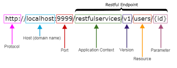
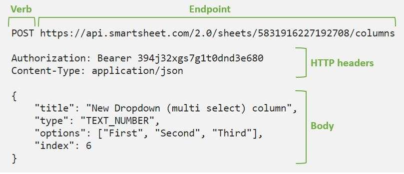

<style>
.rtl-align {
  direction: rtl;
  text-align: right;
}

/* لیست‌ها هم راست‌چین */
.rtl-align ul,
.rtl-align ol {
  list-style-position: inside;
  padding-right: 0;
  margin-right: 1em;
}

/* فقط باکس‌های کد (مثل ```...```) چپ‌چین و مونو */
.rtl-align pre code {
  direction: ltr;           /* جهت چپ به راست */
  text-align: left;         /* تراز چپ */
  display: block;           /* حالت باکس */
  background: #f5f5f5;      /* پس‌زمینه روشن مثل حالت کد */
  padding: 10px;            /* فاصله داخلی */
  border-radius: 5px;       /* گوشه‌های گرد */
  font-family: monospace;   /* فونت مونو برای کد */
  white-space: pre;         /* حفظ فاصله‌ها */
}

</style>

<div class="rtl-align">

# ساختار کامل یه Request در RESTful – بیا مثل حرفه‌ای‌ها حرف بزنیم! 🚀

تصور کن همین الان تو اسنپ دکمه «درخواست ماشین» رو زدی… یه درخواست فوق‌العاده تمیز و مرتب از گوشیت رفت سمت سرورهای اسنپ و یه ثانیه بعد ماشین اومد!
اون چیزی که رفت دقیقاً همون «Request» هست و اگه اجزاش رو مثل کف دستت بلد باشی، دیگه هیچ API تو دنیا نمی‌تونه بهت نه بگه 😎
آماده‌ای با هم یه درخواست رو تیکه‌تیکه کنیم و مثل نینجا بفهمیمش؟ بزن بریم!

## یه مثال واقعی که هر روز داری ازش استفاده می‌کنی



```bash
    # اجزای  REST

    Method → POST
    URL → https://api.instagram.com/v1/likes
    Headers → Authorization: Bearer اینجای_توکن_طولانی
    Body → { "media_id": "27845391234" }
```



دیجی‌کالا – اضافه کردن کالا به سبد:

- Method: POST
- URL: https://api.digikala.com/v1/cart/items/
- Body شامل product_id و quantity

اسنپ – درخواست سفر:

- Method: POST
- Body شامل مبدأ، مقصد، نوع سرویس و کوپن

اوبر – درخواست ماشین:

- Body شامل latitude/longitude مبدأ و مقصد

آمازون – ساخت سفارش:

- Body شامل لیست آیتم‌ها، آدرس، روش پرداخت

اینستاگرام – لایک کردن پست:

- Method: POST
- URL: /media/{media-id}/likes
- Body فقط یه جیسون خالی یا {}`

## جدول مقایسه متدها – یه نگاه بنداز و برای همیشه یادت بمونه

| متد | کارش چیه؟                    | Body داره؟ | Idempotent؟ | مثال واقعی                                     |
| ------ | ------------------------------------ | --------------- | ------------ | ------------------------------------------------------- |
| GET    | بگیر و بخون                 | ❌              | بله       | لیست سفارشات دیجی‌کالا              |
| POST   | بساز چیزی جدید           | ✅              | خیر       | درخواست ماشین در اسنپ                 |
| PUT    | کامل جایگزین کن         | ✅              | بله       | آپدیت کامل پروفایل                      |
| PATCH  | فقط یه تیکه‌ش عوض کن | ✅              | خیر       | تغییر فقط آدرس ارسال در آمازون |
| DELETE | پاک کن                          | گاهی        | بله       | حذف آیتم از سبد خرید                    |

## قدم‌به‌قدم ساخت یه درخواست حرفه‌ای (پایتون + requests)

```python
import requests

# درخواست سفر اسنپ – دقیقاً شبیه واقعی
url = "https://api.snapp.ir/api/v2/passenger/trip"
headers = {
    "Authorization": "Bearer خیلی_طولانی_توکن_تست",
    "Content-Type": "application/json",
    "Accept": "application/json",
    "User-Agent": "Snapp/7.0 iOS"
}

# payload = Body = Data = json_data = request_body , ....
payload = {
    "origin"      : {"lat": 35.7123, "lng": 51.4042},
    "destination" : {"lat": 35.6892, "lng": 51.3890},
    "service_type": "snapp-car",
    "coupon_code" : "SNAPP50"
}

# POST -> requests.post
response = requests.post(url, json=payload, headers=headers)
print(response.json())
```

```python
# ۲. اضافه به سبد در دیجی‌کالا
digi_url = "https://api.digikala.com/v1/cart/items/"

digi_data = {
    "product_id": 987654,
    "quantity": 2,
    "variant_id": 12345
}
requests.post(digi_url, json=digi_data, headers=headers)

```

```python

# ۳. درخواست اوبر (شبیه‌سازی)
uber_url = "https://api.uber.com/v1.2/requests"
uber_data = {
    "start_latitude": 35.7123,
    "start_longitude": 51.4042,
    "product_id": "uberX"
}
requests.post(uber_url, json=uber_data, headers=headers)
```
---

## یک هدر چه فیلدهای دارد :

## ۱) مدیریت محتوا (Content Negotiation & Representation)

این دسته از هدرها تعیین می‌کند چه نوع داده‌ای ارسال یا دریافت می‌شود و سرور و کلاینت چگونه درباره‌ی قالب محتوا به توافق می‌رسند. کلاینت با هدرهایی مثل Accept اعلام می‌کند چه فرمتی را ترجیح می‌دهد، و سرور با Content-Type اعلام می‌کند پاسخ را در چه فرمتی ارائه می‌دهد. هدرهایی مثل Content-Encoding یا Accept-Encoding نیز مشخص می‌کنند داده فشرده شده یا نه. هدف این دسته، جلوگیری از ابهام و تضمین سازگاری میان کلاینت و سرور است.

| نام Header         | نوع              | نمونه مقدار        | نقش                              | زمان استفاده       | نکته کلیدی                       |
| ------------------ | ---------------- | ------------------ | -------------------------------- | ------------------ | -------------------------------- |
| `Content-Type`     | Request/Response | `application/json` | نوع بدنه                         | همیشه              | الزامی برای POST/PUT/PATCH       |
| `Accept`           | Request          | `application/json` | کلاینت می‌گوید چه فرمتی می‌خواهد | GET, POST          | پایه‌ی negotiation               |
| `Accept-Charset`   | Request          | `utf-8`            | charset                          | نادر               | همیشه UTF-8                      |
| `Accept-Encoding`  | Request          | `gzip, br`         | فشرده‌سازی                       | API با ترافیک بالا |                                  |
| `Content-Encoding` | Response         | `gzip`             | encoding بدنه پاسخ               | حین فشرده‌سازی     | نباید با Content-Type اشتباه شود |
| `Content-Length`   | Request/Response | `128`              | اندازه بدنه                      | همه                | توسط سرور/کلاینت ست می‌شود       |
| `Content-Language` | Response         | `fa-IR`            | زبان بدنه                        | API چندزبانه       |                                  |

---

## ۲) احراز هویت / مجوز (Authentication / Authorization)

هدرهای این دسته مسئول احراز هویت و مجوز هستند و تعیین می‌کنند چه کسی به API دسترسی دارد. مهم‌ترین آن‌ها Authorization است که توکن یا اعتبار کاربر را حمل می‌کند. سرور در صورت نیاز با WWW-Authenticate توضیح می‌دهد چه نوع احراز هویتی مورد انتظار است. برخی APIهای stateful از Cookie و Set-Cookie استفاده می‌کنند، اما در معماری REST ترجیح با روش‌های stateless مانند Bearer Token است.


| نام Header         | نوع      | نمونه مقدار          | نقش                         | زمان استفاده      | نکته کلیدی                 |
| ------------------ | -------- | -------------------- | --------------------------- | ----------------- | -------------------------- |
| `Authorization`    | Request  | `Bearer <JWT>`       | احراز هویت                  | همه               | مهم‌ترین هدر امنیتی        |
| `WWW-Authenticate` | Response | `Bearer realm="api"` | سرور می‌گوید auth چگونه است | معمولاً در 401    | فقط در Response            |
| `Cookie`           | Request  | `sessionid=...`      | session-based auth          | اگر stateful هستی | REST ترجیحاً session ندارد |
| `Set-Cookie`       | Response | `sessionid=...`      | ایجاد session               | Web App           | مراقب HttpOnly/Secure      |

---

## ۳) ردیابی، لاگ و Observability

این دسته امکان ردیابی، دیباگ و مشاهده‌پذیری در سیستم‌های توزیع‌شده را فراهم می‌کند. هدرهایی مانند X-Request-Id و X-Correlation-Id اجازه می‌دهند یک درخواست در تمام سرویس‌ها قابل ردگیری باشد. استانداردهای جدیدتر مانند Traceparent و Tracestate نیز برای سازگاری با OpenTelemetry و ابزارهای APM استفاده می‌شوند. این هدرها برای Logging، Troubleshooting و تحلیل رفتار سیستم ضروری‌اند.

| نام Header         | نوع              | نمونه مقدار   | نقش                | زمان استفاده        | نکته کلیدی             |
| ------------------ | ---------------- | ------------- | ------------------ | ------------------- | ---------------------- |
| `X-Request-Id`     | Request/Response | `4f1a12...`   | شناسه واحد درخواست | distributed tracing | الزام در microservices |
| `X-Correlation-Id` | Request/Response | `2b3c...`     | chain tracking     | بین سرویس‌ها        | بهتر از Request-Id     |
| `Traceparent`      | Request          | استاندارد W3C | trace              | OpenTelemetry       | استاندارد جدید         |
| `Tracestate`       | Request          | W3C           | context اضافی      | OpenTelemetry       |                        |

---

## ۴) ریدایرکت، مسیر و شناسایی درخواست

این هدرها به سرور یا Gateway کمک می‌کنند تشخیص دهد درخواست دقیقاً از کجا آمده و چگونه باید هدایت شود. هدر Host مقصد درخواست را مشخص می‌کند و User-Agent نوع کلاینت را اعلام می‌کند. مجموعه هدرهای X-Forwarded-* در محیط‌های پشت Reverse Proxy استفاده می‌شوند تا IP واقعی و پروتکل واقعی کلاینت مشخص بماند. این دسته برای امنیت، لاگینگ و routing صحیح حیاتی است.

| نام Header          | نوع     | نمونه مقدار       | نقش            | زمان استفاده      |        |
| ------------------- | ------- | ----------------- | -------------- | ----------------- | ------ |
| `Host`              | Request | `api.example.com` | مقصد           | HTTP/1.1          | اجباری |
| `User-Agent`        | Request | `MobileApp/1.0`   | شناسایی کلاینت | تحلیل - logging   |        |
| `Referer`           | Request | URL               | منبع           | Web flows         |        |
| `X-Forwarded-For`   | Request | IP                | IP واقعی کاربر | پشت reverse proxy |        |
| `X-Forwarded-Proto` | Request | `https`           | پروتکل اصلی    | Cloud / LB        |        |
| `X-Forwarded-Host`  | Request | `foo.com`         | دامنه واقعی    | پشت gateway       |        |

---

## ۵) کش، نسخه و شرایط (Caching & Conditional Requests)

هدرهای این دسته با هدف کاهش بار سرور و افزایش سرعت پاسخ طراحی شده‌اند. سرور با Cache-Control تعیین می‌کند پاسخ تا چه مدت و تحت چه شرایطی قابل کش است. هدرهایی مثل ETag یا Last-Modified به کلاینت اجازه می‌دهند هنگام دریافت داده‌های تغییرنیافته، به‌جای دانلود دوباره، پاسخ 304 بگیرد. این دسته در APIهای پرمصرف و داده‌محور نقش کلیدی دارد.


| نام Header          | نوع      | نمونه مقدار  | نقش             | زمان استفاده | نکته کلیدی                |
| ------------------- | -------- | ------------ | --------------- | ------------ | ------------------------- |
| `Cache-Control`     | R/R      | `max-age=60` | کنترل کش        | GET          | مهم‌ترین برای performance |
| `Expires`           | Response | تاریخ        | قدیمی (legacy)  | GET          | جایگزین: Cache-Control    |
| `ETag`              | Response | `"v1-abc"`   | نسخه داده       | GET          | برای 304                  |
| `If-None-Match`     | Request  | `"v1-abc"`   | conditional GET | caching      | پاسخ 304                  |
| `Last-Modified`     | Response | تاریخ        | زمان آخر تغییر  | GET          |                           |
| `If-Modified-Since` | Request  | تاریخ        | conditional     | GET          |                           |

---

## ۶) Rate Limit و Reliability

این هدرها رفتار API در شرایط فشار بالا را مدیریت می‌کنند و به کلاینت اطلاع می‌دهند چقدر از سهمیه درخواست باقی مانده و چه زمانی مجاز به ادامه است. هدرهای X-RateLimit-Limit، X-RateLimit-Remaining و X-RateLimit-Reset وضعیت مصرف rate limit را مشخص می‌کنند. هدر Retry-After نیز می‌گوید چه زمانی دوباره تلاش شود. این دسته از سوءاستفاده جلوگیری کرده و مانع سقوط سیستم در زمان بار سنگین می‌شود.

| نام Header              | نوع      | نمونه مقدار | نقش       | توضیح           |
| ----------------------- | -------- | ----------- | --------- | --------------- |
| `X-RateLimit-Limit`     | Response | `1000`      | سقف       | توسط gateway    |
| `X-RateLimit-Remaining` | Response | `200`       | باقیمانده | سشن فعلی        |
| `X-RateLimit-Reset`     | Response | `17345`     | زمان ریست | unix timestamp  |
| `Retry-After`           | Response | `120`       | تاخیر     | برای 429 یا 503 |

---

## ۷) CORS (وب مهم‌ترین)

هدرهای CORS زمانی اهمیت دارند که Frontend و Backend در دامنه‌های متفاوت باشند. مرورگر اجازه نمی‌دهد بدون تأیید سرور، درخواست cross-origin انجام شود، بنابراین سرور با هدرهایی مثل Access-Control-Allow-Origin و Access-Control-Allow-Methods قوانین ارتباط را مشخص می‌کند. هدرهای Preflight نیز تعیین می‌کنند چه هدرها و متدهایی مجازند. این دسته برای امنیت وب و جلوگیری از حملات CSRF/CORS حیاتی است.

| Header                             | نوع      | نمونه             | نکته               |
| ---------------------------------- | -------- | ----------------- | ------------------ |
| `Origin`                           | Request  | `https://app.com` | شروع CORS          |
| `Access-Control-Allow-Origin`      | Response | `*` یا دامنه      | حساسیت امنیتی بالا |
| `Access-Control-Allow-Methods`     | Response | `GET, POST`       | Preflight          |
| `Access-Control-Allow-Headers`     | Response | `Authorization`   | مهم‌ترین           |
| `Access-Control-Allow-Credentials` | Response | `true`            | فقط با Origin خاص  |
| `Access-Control-Max-Age`           | Response | `86400`           | عمر preflight      |
| `Access-Control-Expose-Headers`    | Response | `X-RateLimit-*`   | قابل‌دسترسی در JS  |

---

## ۸) مدیریت ریسورس و ناوبری (Resource Control)

این دسته هدرهایی را شامل می‌شود که به کلاینت اعلام می‌کنند ریسورس ایجاد شده کجاست، چه عملیات‌هایی مجازند و چگونه باید صفحات بعدی یا لینک‌های مرتبط را پیدا کرد. هدر Location مسیر ریسورس جدید را (مثلاً بعد از 201) برمی‌گرداند. Allow در پاسخ 405 می‌گوید کدام متدها پشتیبانی می‌شوند. هدر Link نیز برای pagination و ناوبری بین ریسورس‌ها استفاده می‌شود. این دسته تعامل REST را قابل‌پیش‌بینی و استاندارد می‌کند.

| Header             | نوع      | نمونه               | نقش                  |
| ------------------ | -------- | ------------------- | -------------------- |
| `Location`         | Response | `/users/123`        | در 201 Created       |
| `Content-Location` | Response | URI                 | منبع این ریسپانس     |
| `Allow`            | Response | `GET, PUT`          | در 405               |
| `Link`             | Response | `<...>; rel="next"` | pagination / HATEOAS |

---

## ۹) Versioning بر اساس Header

این دسته از هدرها برای مدیریت نسخه‌بندی API بدون وابستگی به URL استفاده می‌شوند. برخی معماری‌ها نسخه را در Accept (با media-type نسخه‌دار) قرار می‌دهند و برخی APIها از هدرهای اختصاصی مانند X-API-Version استفاده می‌کنند. مزیت این مدل، جدا شدن versioning از ساختار URL و کنترل دقیق نسخه در سطح قرارداد API است. این دسته بیشتر در APIهای enterprise و بلندمدت کاربرد دارد.


| Header                          | نمونه                           | توضیح                 |
| ------------------------------- | ------------------------------- | --------------------- |
| `Accept` با media type نسخه‌دار | `application/vnd.myapp.v2+json` | بهترین روش            |
| `X-API-Version`                 | `2`                             | فقط اگر ساده می‌خواهی |

---

## ۱۰) Headerهای Custom (فقط اگر واقعاً لازم است)

زمانی استفاده می‌شود که API نیاز به متادیتای اختصاصی داشته باشد که در هیچ دسته استانداردی نمی‌گنجد. نمونه‌های رایج شامل Idempotency-Key برای جلوگیری از درخواست‌های تکراری یا X-Client-Version برای هماهنگی نسخه اپلیکیشن است. این هدرها باید با نام‌گذاری vendor-specific تعریف شوند و فقط زمانی اضافه شوند که داده‌ی موردنظر واقعاً «متادیتا» باشد نه «داده دامنه». استفاده بی‌رویه از این دسته به معماری آسیب می‌زند.


| Header             | نوع     | نمونه            | نقش                       |
| ------------------ | ------- | ---------------- | ------------------------- |
| `Idempotency-Key`  | Request | UUID             | جلوگیری از duplicate POST |
| `X-Client-Version` | Request | `app-1.0.2`      | مدیریت سازگاری            |
| `X-Platform`       | Request | `android`, `ios` | analysis                  |

قانون:
**داده دامنه (مثل amount, user_id, filters) هرگز نباید در header باشد.**


---
## تله‌های مرگبار که جونیورها می‌افتن توش ⚠️

فراموش کردن Content-Type → 415 می‌گیری
توکن رو تو Query String گذاشتن → تو لاگ‌ها می‌مونه!
GET برای ساختن یا آپدیت → ناامن و غیراستاندارد
Body تو GET فرستادن → خیلی از سرورها نادیده می‌گیرن
غلط املایی تو کلیدهای JSON → 400 Bad Request

## خلاصه طلایی (۵ خط که همیشه همراهت باشه)

هر درخواست RESTful دقیقاً ۴ بخش اصلی داره: متد + URL تمیز + هدرهای کامل (مخصوصاً Authorization و Content-Type) + Body فقط وقتی واقعاً لازم باشه و همیشه JSON.
