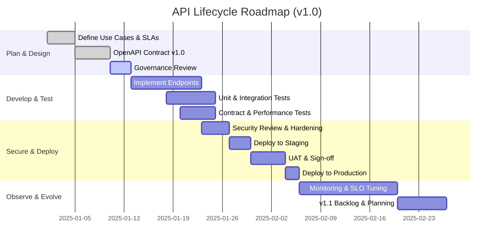

<style>
.rtl-align {
  direction: rtl;
  text-align: right;
}

/* لیست‌ها هم راست‌چین */
.rtl-align ul,
.rtl-align ol {
  list-style-position: inside;
  padding-right: 0;
  margin-right: 1em;
}

/* فقط باکس‌های کد (مثل ```...```) چپ‌چین و مونو */
.rtl-align pre code {
  direction: ltr;           /* جهت چپ به راست */
  text-align: left;         /* تراز چپ */
  display: block;           /* حالت باکس */
  background: #f5f5f5;      /* پس‌زمینه روشن مثل حالت کد */
  padding: 10px;            /* فاصله داخلی */
  border-radius: 5px;       /* گوشه‌های گرد */
  font-family: monospace;   /* فونت مونو برای کد */
  white-space: pre;         /* حفظ فاصله‌ها */
}

</style>

<div class="rtl-align">


## ۱. API Lifecycle 

**دقیقاً چیست و کجای اکوسیستم می‌نشیند؟**

### تصویر کلان

تقریباً همهٔ Vendorهای جدی (Postman، IBM API Connect، Red Hat 3scale، Kong Konnect، SwaggerHub…) وقتی حرف از API Lifecycle می‌زنند، دربارهٔ این محورهای تکراری حرف می‌زنند: ([Red Hat Developer][2])

* از دید **Producer**:
  **Define → Design → Develop & Document → Test → Secure → Deploy → Observe → Version & Retire**
* از دید **Consumer**:
  **Discover → Try → Onboard → Use → Give Feedback**

در عمل، API Lifecycle یعنی:

> مجموعه‌ای از فرآیندها، ابزارها و سیاست‌ها برای این‌که API از ایده تا بازنشستگی، به‌شکل **قابل‌پیش‌بینی، امن، قابل‌مانیتور و نسخه‌پذیر** مدیریت شود.

### تعریف عمومی (نیمه‌مدیرانه)

از نگاه تجاری (مثلاً در eBookهای Kong و راهنماهای Red Hat)، API Lifecycle بخشی از **API Product Management** است: API مثل یک محصول است که طراحی می‌شود، چرخه عمر دارد، نسخه می‌گیرد، مانیتور می‌شود و در نهایت Retire می‌شود. ([Kong Inc.][3])

### تعریف مهندسی (مبتنی بر مستندات رسمی Vendorها)

با تکیه بر TechTarget، IBM و Postman:

> API Lifecycle Management یعنی مدیریت API در تمام مراحل: **Planning & Design, Development, Documentation, Testing, Security, Versioning, Monitoring, Analytics, Retirement**، به‌صورتی که هم نیازهای فنی (Performance, Security, Reliability) و هم نیازهای کسب‌وکار (Time-to-market, Reusability, Monetization) برآورده شود. ([TechTarget][4])

---

## ۲. چه پیش‌نیازهایی لازم است؟

برای این‌که API Lifecycle فقط شعار نباشد و واقعاً در پروژه پیاده شود، باید این بلوک‌ها را بدانی:

1. **HTTP و Web API Design**

   * فهم عملی روش‌ها (GET/POST/PUT/PATCH/DELETE)، Status Codeها، Headerها، Caching، Idempotency.
   * بدون این، هیچ چیز در Design/Test/Observe معنی‌دار نیست.

2. **مفاهیم REST / RPC / GraphQL / gRPC**

   * بدانی API تو Resource-based است یا Operation-based؟ این روی Design و Versioning اثر دارد.

3. **OpenAPI / Schema-first / Contract-first**

   * توان خواندن و نوشتن OpenAPI Spec (YAML/JSON).
   * در فهم Design/Develop/Test حیاتی است، چون اکثر ابزارها روی OpenAPI سوارند. ([Swagger][5])

4. **CI/CD و DevOps پایه**

   * آشنایی با مفاهیم Pipeline، Stage، Environment (dev/stage/prod)، Rollback.
   * Lifecycle بدون اتوماسیون، تبدیل می‌شود به کلی کار دستی و خطای انسانی.

5. **امنیت API**

   * OAuth2/OIDC، API Keys، JWT، mTLS، Rate limiting، Throttling.
   * Vendorهایی مثل Red Hat و Kong صریحاً Security را جزئی از Lifecycle می‌بینند (Create / Run / Manage / Secure). ([Red Hat Developer][2])

6. **Observability**

   * Log ساختاریافته، Metrics (latency, RPS, error rate)، Tracing (distributed trace).
   * برای «Observe» و «Operate» در Lifecycle لازم است.

7. **آشنایی با ابزارهای API Platform**

   * Postman / Insomnia برای طراحی، تست، مانیتور؛ ([Postman Blog][1])
   * API Gateway مثل Kong / 3scale / APIConnect؛ ([Kong Inc.][6])
   * SwaggerHub / Apicurio برای مدیریت قرارداد (Contract).

---

## ۳. stageهای API Lifecycle در عمل (با مثال و Trade-off)

در این بخش از هدرها و اصطلاحات Postman و IBM و TechTarget استفاده می‌کنم، ولی روایت را مهندسی نگه می‌دارم. ([Postman Blog][1])

### ۳.۱. Define (تعریف مسئله و دامنه API)

* سؤال‌های کلیدی:

  * این API کدام مسئله را حل می‌کند؟
  * Consumerها چه کسانی هستند؟ (Mobile، Partner، Internal Microservice؟)
  * Non-functionalها چیست؟ (SLA، Latency، Security Level، Data Sensitivity)
* خروجی خوب:

  * یک **API Brief** شامل هدف، Personaهای مصرف‌کننده، Use caseها، محدودیت‌های امنیتی/قانونی.

اگر این مرحله را سرسری رد کنی، پایین‌دست (Design/Versioning) پر از بدهی معماری می‌شود.

---

### ۳.۲. Design (طراحی API – Contract-first)

طبق Swagger و Postman، Design باید شامل موارد زیر باشد: Endpoints، Method، Request/Response Schema، Error Model، Auth، Rate Limit Policy. ([Swagger][5])

خروجی ایده‌آل: یک **OpenAPI Specification** که:

* Resourceها را منطقی گروه‌بندی می‌کند.
* Naming، Versioning، Query Parameters، Pagination، Error Codes را مشخص می‌کند.
* Policyهای امنیتی (OAuth2 scopes, API key) را در تعریف Security Schemes مشخص می‌کند.

اینجا نقطه‌ای است که **API Governance** وارد بازی می‌شود (استانداردسازی نام‌ها، ساختار پاسخ‌ها، قواعد نسخه‌بندی). ([Swagger][5])

---

### ۳.۳. Develop & Document (پیاده‌سازی و مستندسازی هم‌زمان)

Postman صریحاً مرحلهٔ ۳ را: **Develop and Document** می‌نامد؛ یعنی در حین توسعه، مستندات و Spec باید Sync بماند. ([Postman Blog][1])

* پیاده‌سازی Server (مثلاً Django/FastAPI/Express).
* تولید خودکار مستندات از روی OpenAPI، و اضافه کردن توضیحات انسانی (Guides, Examples).
* تولید SDK یا Snippet برای زبان‌های رایج (Python, JS, …).

اگر مستندات عقب‌تر از کد باشند، عملاً Lifecycle نصفه است.

---

### ۳.۴. Test (از Unit تا Contract و Performance)

در مدل‌های TechTarget/IBM، Test یک Stage رسمی است، نه یک «کار جانبی». ([TechTarget][4])

* Unit Test روی Handlerها و Serviceها.
* Integration Test (API + DB + External Services).
* **Contract Test** (تطبیق پیاده‌سازی با OpenAPI).
* Performance & Load Test (latency, throughput, error rate).

ابزارهایی مثل Newman (runner خط فرمان Postman) برای گنجاندن تست API در CI/CD استفاده می‌شوند. ([postman.com][7])

---

### ۳.۵. Secure (امن‌سازی API)

در Blueprints Postman و در راهنماهای 3scale/Kong، Security یک Stage مجزا است: **Secure**. ([Postman Blog][1])

* انتخاب مکانیزم Auth (OAuth2/OIDC, API Key, mTLS).
* Rate Limiting، Quotas، WAF Rules، IP Allow/Deny Lists در API Gateway.
* Logging امنیتی، Audit Trail.

Trade-off اصلی: هرچه Security قوی‌تر، پیچیدگی Dev و UX بالاتر؛ باید مقدار امنیت را با نوع داده و سطح ریسک هماهنگ کنی.

---

### ۳.۶. Deploy (استقرار در محیط‌های مختلف)

IBM و AWS و دیگران بر این تأکید دارند که Deployment مرحلهٔ رسمی چرخه است، معمولاً با محیط‌های **dev / test / staging / prod** و امکان Rollback. ([IBM][8])

* Deploy به API Gateway (مثلاً Kong) و Map کردن Routeها و Policies. ([Kong Inc.][6])
* استفاده از Stageها در API Gateway (dev, stage, prod) برای مدیریت Lifecycle (Throttling، Logging، Caching متفاوت). ([AgileTest][9])

---

### ۳.۷. Observe (مانیتور، Analytics، Governance)

Postman Stage 7 را **Observe** می‌نامد؛ Red Hat و Kong نیز روی Monitoring, Analytics & Governance تأکید دارند. ([Postman Blog][1])

* مانیتورینگ Latency، Error Rate، Request Volume.
* Log ساختاریافته همراه Correlation ID.
* Alert روی SLA/SLI/SLO.

بدون این مرحله، هیچ‌کس نمی‌فهمد API در دنیای واقعی چطور رفتار می‌کند.

---

### ۳.۸. Distribute & Retire (انتشار، Productization، بازنشستگی)

Postman آخرین Stage را **Distribute** معرفی می‌کند؛ IBM و 3scale اضافه می‌کنند: **Retire/Deprecate**. ([Postman Blog][1])

* انتشار API در Developer Portal (Document + Try-it + SDK).
* مدیریت Planها، Subscriptionها، Monetization (در پلتفرم‌هایی مثل 3scale و Kong Konnect). ([NobleProg Uruguay][10])
* Deprecation Notice، Sunset Header، Migration Guide برای نسخه‌های قدیمی.

این همان جایی است که API از یک «Feature» به یک «Product» تبدیل می‌شود.

---

## ۴. چه کسانی این را جدی می‌گیرند؟

نمونه‌هایی از شرکت‌ها و پلتفرم‌هایی که API Lifecycle را به‌عنوان قابلیت رسمی دارند:

* **IBM API Connect**: «capabilities and tooling for all phases of the API lifecycle». ([Techzert][11])
* **Red Hat (3scale)**: تمرکز روی **full API lifecycle management** از ایده تا مدیریت در سطح سازمان. ([Red Hat Developer][2])
* **Postman**: مقالهٔ «API Lifecycle Stages: The 8-Point Blueprint» و رویدادهای «API Lifecycle, Part 1 & 2». ([Postman Blog][1])
* **Kong Konnect**: خود را «cloud-native SaaS API lifecycle management platform» معرفی می‌کند. ([Kong Inc.][6])
* **Swagger / OpenAPI Ecosystem**: روی Design/Documentation/Mocking/Testing/Monitoring به‌عنوان مراحل Lifecycle تمرکز دارند. ([Swagger][5])
* **Vendorهای دیگر**: Apigee (Google), MuleSoft, API7 و … که همه روی «full lifecycle» و Governance تأکید دارند. ([API7][12])

---

## ۵. مفاهیم مرتبط (نقشهٔ ذهنی)

### فهرست مفاهیم مرتبط

* **API Management Platform** (API Gateway + Portal + Analytics + Security)
* **API Governance** (قوانین نام‌گذاری، Versioning، Security baselines)
* **Developer Portal / API Productization**
* **Service Mesh** (تکمیل‌کنندهٔ API Gateway برای ترافیک داخلی)
* **Contract-first / Schema-first Development**
* **API Testing & Monitoring** (Newman, k6, JMeter, Postman monitors)

### نمودار مفهومی (Mermaid)

```mermaid
graph LR
    subgraph Producer View
        A[Define] --> B[Design (OpenAPI)]
        B --> C[Develop & Document]
        C --> D[Test]
        D --> E[Secure]
        E --> F[Deploy]
    end

    subgraph Platform
        G[API Gateway / Management]
        H[Developer Portal]
        I[Monitoring & Analytics]
        J[API Governance]
    end

    F --> G
    G --> H
    G --> I
    J --- B
    J --- C
    J --- F

    subgraph Consumer View
        H --> K[Discover & Try]
        K --> L[Onboard & Use]
        L --> M[Feedback]
    end

    M --> A
```

این نمودار نشان می‌دهد که Governance و Platform چطور به مراحل Producer و Consumer وصله می‌شوند.

---

## ۶. الگوها، Best Practices و Anti-patternها

### Do – کارهایی که باید انجام دهی

1. **Contract-first / Design-first**

   * قبل از کد، OpenAPI بنویس و روی آن اجماع تیمی بگیر. Red Hat و IBM این رویکرد را برای کاهش Coupling و تسهیل Governance توصیه می‌کنند. ([Red Hat Developer][13])

2. **Use a Single Source of Truth**

   * Contract (OpenAPI) باید منبع اصلی باشد؛ کد، تست، مستندات، Mock، همه باید از روی آن تولید یا با آن چک شوند. ([API Evangelist][14])

3. **Environment Strategy واضح**

   * حداقل dev, test, staging, prod با Policyهای واضح (logging, throttling, access). ([AgileTest][9])

4. **Security baked-in**

   * Security را فقط در Stage جداگانه نبین، بلکه در Define/Design هم لحاظ کن (مثلاً data classification، auth model). ([Adeptia][15])

5. **Observability به‌عنوان requirement**

   * SLI/SLO برای API تعریف کن و در Design بنویس (مثلاً p95 latency < 200ms، error rate < 0.1%). ([Adeptia][15])

6. **Versioning & Deprecation Policy**

   * از روز اول روی v1 شروع کن، Policy Deprecation بنویس، تغییراتbreaking را بدون برنامه انجام نده. ([Adeptia][15])

### Don’t – Anti-patternها

1. **“Code-first, spec-never”**

   * پیاده‌سازی بدون Spec و بعداً زورکی Swagger تولید کردن → مستندات fake، تست ناقص، Governance صفر.

2. **Monolithic Lifecycle**

   * همه چیز در سر دولوپر است؛ هیچ ابزار/پلتفرمی برای Design, Test, Govern وجود ندارد.

3. **Environmentهای بی‌معنی**

   * dev = prod ولی فقط اسم متفاوت؛ بدون Isolation، بدون Policy جداگانه.

4. **تست فقط دستی**

   * تست در Postman فقط روی لپ‌تاپ انجام می‌شود و وارد CI/CD و Monitors نمی‌شود.

5. **بدون Retire**

   * APIهای مرده که هرگز Deprecate/Retire نمی‌شوند و سال‌ها بدهی امنیتی می‌سازند.

---

## ۷. Pro Tips و نکات عملی

### ۷.۱. یک مثال ساده از استفادهٔ Lifecycle در CI

فرض کن یک OpenAPI و یک مجموعه Postman داری؛ در CI می‌توانی **Develop → Test → Deploy** را این‌طور ببینی:

```bash
# 1) اجرای تست‌های API با newman قبل از Deploy
newman run api-tests.postman_collection.json \
  --environment dev.postman_environment.json \
  --reporters cli,junit \
  --reporter-junit-export reports/api-tests.xml
```

**Verify:**
در CI خروجی `newman` باید کد خروجی ۰ بدهد (موفقیت). در صورت شکست، Job باید fail شود و Deploy انجام نشود. گزارش JUnit را می‌توانی در ابزار CI (مثلاً GitLab/Jenkins) به‌صورت تست‌ریپورت ببینی. ([postman.com][7])

---

### ۷.۲. تفکیک Producer/Consumer Lifecycle

* از مدل Red Hat استفاده کن: **Producer lifecycle** (Create/Run/Manage/Secure) و **Consumer lifecycle** (Discover/Onboard/Use/Feedback). ([Red Hat Developer][2])
* برای هر Consumer مهم، KPI تعریف کن (Time to First Successful Call، Error rate، NPS).

---

### ۷.۳. نشانه‌های سالم بودن Lifecycle

* برای هر API:

  * Spec وجود دارد و در Git versioned است.
  * تست خودکار (unit + integration + contract) دارد.
  * مانیتور فعال دارد (health + functional monitors).
  * صفحهٔ Portal دارد و آخرین تغییرات نسخه مستند شده است.
  * تاریخ Deprecation نسخه‌های قدیمی مشخص است.

اگر هرکدام از این‌ها غایب است، Lifecycle جایی شکسته است.

---

## ۸. سناریوهای پیشرفته و مرزی

### ۸.۱. در معماری Microservices و Event-driven

Red Hat مثال‌های عملی از **API-driven, contract-first** در محیط Kafka و multi-stage environments می‌دهد. ([Red Hat Developer][13])

* برای HTTP و Event (Kafka) باید Contract جدا ولی هماهنگ داشته باشی.
* Service Registry (Apicurio, Confluent Schema Registry) را به‌عنوان بخشی از Lifecycle در نظر بگیر.
* Promotion از dev → stage → prod باید روی قراردادها و Implementationها هم‌زمان اعمال شود.

### ۸.۲. Bottleneckها و Trade-offهای معماری

1. **Speed vs Governance**

   * اگر Governance را خیلی سخت بگیری، تیم‌ها به‌سمت bypass می‌روند.
   * اگر خیلی شل بگیری، API Zoo درست می‌شود (هر سرویس زبان و استاندارد خودش).

2. **API Gateway vs Service Mesh**

   * Gateway برای north-south traffic و Lifecycle بیرونی.
   * Mesh برای east-west traffic؛ ولی باز هم در Lifecycle کلی در نظر گرفته می‌شود (mTLS، retries، timeouts). ([Kong Inc.][6])

3. **Centralized vs Federated API Governance**

   * Centralized سریعاً تبدیل به bottleneck می‌شود.
   * Federated نیازمند automated checks (linting، style guide، CI rules) است.

4. **Performance vs Observability**

   * لاگ خیلی زیاد → هزینه و Latency بالا.
   * لاگ کم → debug سخت.
   * باید sampling، log level و retention را تناسب بدهی.

---

## ۹. مقایسهٔ رویکردها و ابزارهای Lifecycle

برای این قسمت، API Lifecycle را به‌عنوان یک «قابلیت» در پلتفرم‌های مختلف مقایسه می‌کنم:

### جدول مقایسهٔ پلتفرم‌ها

| ویژگی / پلتفرم      | Postman Platform                                                                          | IBM API Connect                                                    | Red Hat 3scale / RH Stack                                                | Kong Konnect / Kong Gateway                                     |
| ------------------- | ----------------------------------------------------------------------------------------- | ------------------------------------------------------------------ | ------------------------------------------------------------------------ | --------------------------------------------------------------- |
| تمرکز اصلی          | Design, Develop, Test, Monitor & Docs                                                     | Enterprise API Management & Governance                             | Full API lifecycle + Monetization                                        | Cloud-native Gateway + Lifecycle Platform                       |
| مراحل پوشش‌داده‌شده | Define, Design, Develop & Document, Test, Secure, Monitor, Distribute ([Postman Blog][1]) | Plan, Design, Develop, Test, Deploy, Retire ([IBM Garage TSA][16]) | Full lifecycle from idea to management at scale ([Red Hat Developer][2]) | Build, Publish, Secure, Monitor, Maintain APIs ([Kong Inc.][6]) |
| Developer Portal    | بله (Public Workspaces + Docs)                                                            | بله (Rich Portal)                                                  | بله                                                                      | بله (Konnect Dev Portal)                                        |
| Governance / Policy | Collections, Style Guides, Central API repo                                               | Strong Governance, Product Lifecycle States                        | Policy-based usage & Monetization                                        | Plugins, Control Plane, Governance Patterns                     |
| مناسب برای          | تیم‌های Dev/QA و Design-first                                                             | سازمان‌های Enterprise با نیاز قوی Governance                       | سازمان‌های Enterprise (Hybrid/On-prem/Cloud)                             | تیم‌های Cloud-native و High-scale APIs                          |

---

## ۱۰. نمودارهای کمکی

### ۱۰.۱. چرخهٔ Producer/Consumer

```mermaid
graph TD
    subgraph Producer
        P1[Define] --> P2[Design]
        P2 --> P3[Develop & Document]
        P3 --> P4[Test]
        P4 --> P5[Secure]
        P5 --> P6[Deploy]
        P6 --> P7[Observe]
        P7 --> P8[Version & Retire]
    end

    subgraph Consumer
        C1[Discover API] --> C2[Try & Evaluate]
        C2 --> C3[Onboard (Keys / Tokens)]
        C3 --> C4[Integrate & Use]
        C4 --> C5[Feedback & Feature Requests]
    end

    P6 --> C1
    C5 --> P1
```

این حلقهٔ feedback نشان می‌دهد Lifecycle واقعی یک حلقه است، نه یک خط.

---

### ۱۰.۲. Gantt برای یک API جدی



این نمودار برای برنامه‌ریزی تیمی و هماهنگی Dev/QA/Infra خیلی کمک می‌کند.

---

## ۱۱. جمع‌بندی و مسیر ادامهٔ یادگیری

### جمع‌بندی مفهومی

* API Lifecycle در اصل می‌گوید: **API یک artefact زنده است، نه فقط چند endpoint**.
* برای مدیریت سالم این موجود زنده، باید:

  * از روز اول **Define → Design → Develop & Document → Test → Secure → Deploy → Observe → Distribute/Retire** را به‌عنوان یک حلقه بپذیری؛ نه چند مرحلهٔ جدا. ([Postman Blog][1])
  * یک **Single Source of Truth** برای Contract (OpenAPI) داشته باشی و همه‌چیز را به آن وصل کنی. ([Swagger][5])
  * از پلتفرم‌هایی مثل Postman، IBM API Connect، Red Hat 3scale، Kong Konnect به‌عنوان تسهیل‌گرهای Lifecycle استفاده کنی، نه جادوگر. ([Techzert][11])

### پیشنهاد مسیر مطالعهٔ عمیق‌تر (با تکیه بر منابع رسمی)

۱. **درک stages و دید product:**

* Postman – «API Lifecycle Stages: The 8-Point Blueprint» ([Postman Blog][1])
* Kong – «API Product Management Guide: Strategy, Lifecycle & Best Practices» ([Kong Inc.][3])

2. **Full lifecycle از دید Enterprise:**

   * Red Hat – «Full API lifecycle management: A primer» ([Red Hat Developer][2])
   * IBM API Connect – مستندات Lifecycle و Labs مربوط به Versioning و Lifecycle Controls. ([Techzert][11])

3. **Contract-first و Governance:**

   * Swagger – «What is API Lifecycle Management?» (Design, Development, Documentation, Testing, Governance, Monitoring). ([Swagger][5])
   * Red Hat – «Contract-first approach to API life cycle management». ([Red Hat Developer][13])

4. **ابزار و انتخاب Platform:**

   * Postman Product docs دربارهٔ API Platform. ([postman.com][17])
   * مقالات مقایسهٔ ابزارهای API lifecycle management (مثلاً API7). ([API7][12])

اگر بخواهی قدم بعدی را عملی کنی، پیشنهاد من این است:

* یک API کوچک واقعی انتخاب کنیم (ترجیحاً چیزی که الان در پروژه‌ات هست).
* برایش یک OpenAPI v1.0 بنویسیم.
* روی آن یک خط Lifecycle کامل طراحی کنیم (Design, CI Tests, Gateway deployment, Monitoring, Versioning).
* بعد شروع کنیم به hardening: Governance rules، Security baseline، و observability استاندارد.

هر وقت آماده بودی، می‌توانیم از مرحلهٔ Define برای یکی از APIهای فعلی‌ات شروع کنیم و آن را «به زور» وارد یک API Lifecycle تمیز کنیم تا فاصلهٔ تئوری و عمل حذف شود.

[1]: https://blog.postman.com/api-lifecycle-blueprint/?utm_source=chatgpt.com "API Lifecycle Stages: The 8-Point Blueprint"
[2]: https://developers.redhat.com/blog/2019/02/25/full-api-lifecycle-management-a-primer?utm_source=chatgpt.com "Full API lifecycle management: A primer"
[3]: https://konghq.com/resources/e-book/api-product-management-guide?utm_source=chatgpt.com "API Product Management Guide: Strategy, Lifecycle & Best ..."
[4]: https://www.techtarget.com/searchapparchitecture/definition/API-lifecycle-management?utm_source=chatgpt.com "What is API Lifecycle Management? | Definition from ..."
[5]: https://swagger.io/blog/api-strategy/what-is-api-lifecycle-management/?utm_source=chatgpt.com "What is API Lifecycle Management? - Swagger"
[6]: https://konghq.com/blog/enterprise/modern-api-platform-principles?utm_source=chatgpt.com "Building a Modern API Platform: Key Principles and Benefits"
[7]: https://www.postman.com/events/intergalactic/api-lifecycle-part-2-monitor-and-deploy-an-api/?utm_source=chatgpt.com "API Lifecycle, Part 2: Monitor and Deploy an API"
[8]: https://www.ibm.com/docs/en/api-connect/10.0.x_cd?topic=products-product-lifecycle&utm_source=chatgpt.com "The product lifecycle - API Connect"
[9]: https://agiletest.app/apis-complete-guide/?utm_source=chatgpt.com "Complete Guide to APIs: Build, Test and Deploy"
[10]: https://www.nobleprog.com.uy/en/cc/redhat3scale?utm_source=chatgpt.com "Managing APIs with Red Hat 3Scale Training Course"
[11]: https://www.techzert.com/blog/ibm-api-connect?utm_source=chatgpt.com "IBM API Connect: API Lifecycle Management"
[12]: https://api7.ai/blog/how-to-choose-api-management-tools?utm_source=chatgpt.com "How to Choose the Right API Lifecycle Management Tool ..."
[13]: https://developers.redhat.com/articles/2021/07/07/managing-api-life-cycle-event-driven-architecture-practical-approach?utm_source=chatgpt.com "Contract-first approach to API life cycle management"
[14]: https://apievangelist.com/2021/08/05/enabling-an-openapi-lifecycle/?utm_source=chatgpt.com "Enabling the API Lifecycle with the Postman Platform"
[15]: https://www.adeptia.com/blog/what-is-full-life-cycle-api-management?utm_source=chatgpt.com "The Benefits of Full Life Cycle API Management"
[16]: https://ibm-garage-tsa.github.io/cp4i-demohub/APICDevJam/Lab4/?utm_source=chatgpt.com "APIC Dev Jam Lab 4 - Use Lifecycle Controls to Version your ..."
[17]: https://www.postman.com/product/?utm_source=chatgpt.com "Postman API Platform - Build, Test & Manage"
