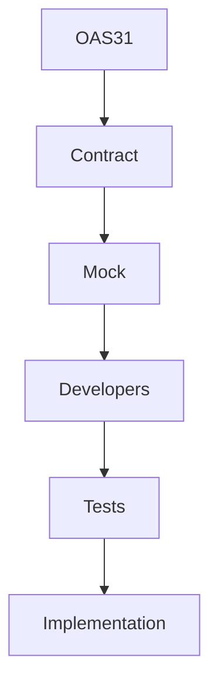
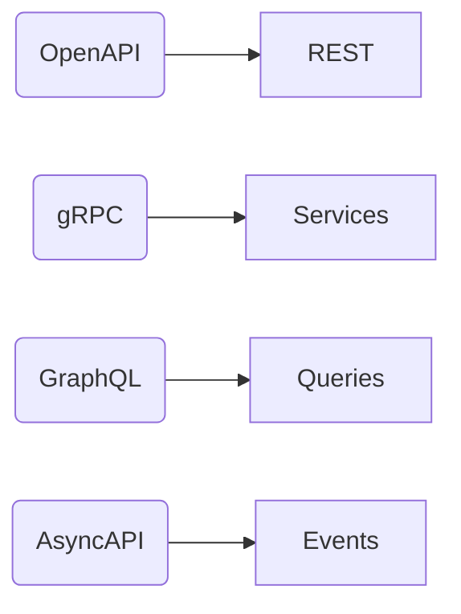
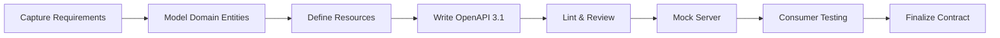
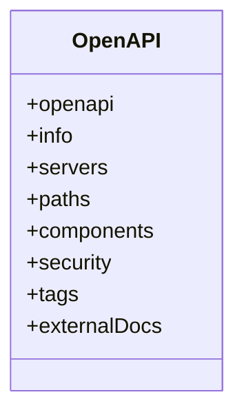
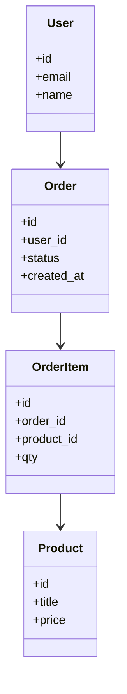
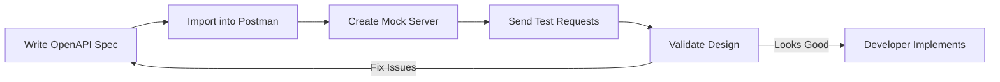

# فصل ۲

# API Design

(با ادغام هدرهای رسمی Postman API Design + OpenAPI 3.1 + RFC 9110)

---

## بخش ۱

# نام و تعریف‌ها

(هدر مشابه با Postman API Design → "What is API Design?")

### نام

API Design — طراحی API

### تعریف عمومی (روایی و ثلیث)

طراحی API یعنی قبل از نوشتن هر خط کد، **قرارداد تعامل** بین «سرویس» و «مصرف‌کننده» را به‌صورت واضح، قابل‌خواندن و پایدار مشخص کنی؛ این قرارداد نحوهٔ درخواست‌ها، پاسخ‌ها، خطاها و رفتار سیستم را تعیین می‌کند.

در عمل، API Design شبیه طراحی «قانون اساسی» یک سرویس است. وقتی این قانون خوب نوشته شود، توسعه، تست، مستندسازی، مانیتورینگ و نسخه‌بندی همگی روان و بی‌تنش انجام می‌شود.

### تعریف تخصصی

(براساس ساختار OpenAPI 3.1 → "The OpenAPI Specification")

API Design یعنی تعریف یک **Specification رسمی** مبتنی بر OpenAPI 3.1 که شامل موارد زیر است:

* **Paths** (مسیرهای HTTP)
* **Operations** (GET, POST, PUT, DELETE … با semantics طبق RFC 9110)
* **Components/Schemas** (تعریف ساختار داده‌ها با JSON Schema 2020-12)
* **Parameters** (Query, Path, Header)
* **Request Bodies**
* **Responses**
* **Security Schemes**
* **Servers**
* **Examples** و **Examples Objects**

این ساختار، هستهٔ API Design است.

---

## بخش ۲

# پیش‌نیازهای دانشی

(براساس Postman — "Prerequisites for good API design")

* **HTTP Semantics (RFC 9110)**
  شامل meaning دقیق روش‌ها، headerها، status codeها، caching و content negotiation.

* **JSON Schema (Draft 2020–12)**
  چون OAS 3.1 مستقیماً از آن استفاده می‌کند.

* **REST Architectural Constraints**
  resource، uniform interface، idempotency، statelessness.

* **Domain Modeling**
  مدل‌سازی دامنه قبل از مشخص‌کردن endpointها.

* **API Governance Basics**
  style guide، naming convention، linting.

---

## بخش ۳

# دسته‌بندی کاربردها و نمونه‌های واقعی

(براساس Postman — "Why API Design matters")

### کاربردها

* طراحی API در محیط‌های **میکروسرویس**
* APIهای عمومی با **مصرف‌کنندگان زیاد**
* APIهای مالی با **بایدهای سخت‌گیر امنیتی**
* APIهای داده (Data APIs)
* APIهای Gateway برای هماهنگی سرویس‌ها

### نمونه‌های واقعی

(مطابق case studies رسمی Postman)

* **Stripe API**: بهترین نمونهٔ **contract-first API design**
* **Twilio**: الگوی استاندارد برای error models
* **GitHub API**: مرجع عالی pagination و media types
* **Spotify**: طراحی resource محور و پایدار

---

## بخش ۴

# شرکت‌ها و توسعه‌دهندگان پشتیبان

(براساس منابع رسمی)

* **OpenAPI Initiative (Linux Foundation)**
  توسعه‌دهندهٔ OAS 3.1
* **IETF**
  منتشرکنندهٔ RFC 9110 و RFCهای مرتبط با HTTP
* **Postman**
  ابزار رسمی طراحی، linting، mocking
* **Google / Microsoft / AWS**
  با API Guidelines معتبر جهانی
* **Swagger / Stoplight / Redocly**
  محیط‌های حرفه‌ای برای طراحی Specification

---

## بخش ۵

# مفاهیم و فناوری‌های مرتبط

(هدر رسمی Postman → “Related Concepts”)

| مفهوم                           | نقش                         |
| ------------------------------- | --------------------------- |
| **OpenAPI 3.1**                 | توصیف رسمی رفتار API        |
| **JSON Schema**                 | کنترل کیفیت ساختار داده     |
| **Mock Servers**                | تست API قبل از توسعه        |
| **Contract Testing**            | جلوگیری از breaking changes |
| **API Governance**              | یکپارچگی سازمانی            |
| **Linting (Spectral, Postman)** | جلوگیری از خطاهای طراحی     |

### نمودار ارتباطی



---

## بخش ۶

# الگوها و Best Practices

(هدر رسمی Postman API Design → “Best practices for designing APIs”)

### Do

* **Contract First** (قبل از کدنویسی، Specification بنویس)
* استفاده از **OAS 3.1** به‌عنوان منبع واحد حقیقت
* تعریف **Resourceها** با نام‌گذاری یکنواخت
* رعایت semantics متدها طبق **RFC 9110**
* طراحی **Error Objects استاندارد**
* افزودن **Examples** واقعی در Specification
* اجتناب از **breakهای ناگهانی**

### Don’t

* قراردادن افعال در URL
* استفاده از STATUS CODEهای نادرست
* استفاده از schemaهای تکراری
* قراردادن رفتارهای undocumented
* تغییر response بدون نسخه‌بندی

### Design Patterns

* **Resource-Centric API Design**
* **Error Envelope Pattern** (ساختار استاندارد خطا)
* **Pagination Cursor-Based**
* **Filtering + Sorting مشترک و ثابت**

### Anti-patterns

* **Everything via POST**
* **Unbounded Responses**
* **Hidden Validation Rules**
* **Schema Drift**
* **God Endpoint**

---

## بخش ۷

# ترفندها و Pro Tips

(مطابق Postman API Design Tips)

* همیشه **Mock Server** قبل از توسعه اجرا کن.
* حتماً **examples** بنویس، حتی برای خطاها.
* از **Spectral** یا لینترهای Postman برای جلوگیری از خطای طراحی استفاده کن.
* برای endpointهای پرترافیک، از ابتدا **Pagination + Filtering** را لحاظ کن.
* responseهای حجیم را **نرمال‌سازی یا خلاصه‌سازی** کن.
* اگر API عمومی است، از **rate limits** در طراحی لحاظ کن، نه فقط در پیاده‌سازی.

---

## بخش ۸

# مباحث پیشرفته و سناریوهای مرزی

(هدر Postman → “Advanced API design”)

* طراحی API در سازمان‌های multi-team با **Governance + Style Guide**
* APIهای Real-time (Webhook, WebSocket, AsyncAPI)
* تعریف **contract**‌هایی که با streaming سازگار باشند
* طراحی endpointهای حساس مالی با **idempotency key**
* Trade-offs:

  * پیچیدگی Schema در مقابل خوانایی
  * اندازه Response در مقابل سرعت
  * عمق Resourceها در مقابل سادگی URL

---

## بخش ۹

# مقایسه با استانداردهای مشابه

(ساختار مقایسه مطابق Postman Guides)

| فناوری             | مدل            | مزیت                          | ضعف                  |
| ------------------ | -------------- | ----------------------------- | -------------------- |
| **REST (OAS 3.1)** | Contract-based | استاندارد جهانی، ساده، پایدار | ضعف در streaming     |
| **gRPC**           | Binary RPC     | بسیار سریع                    | مناسب وب مرورگر نیست |
| **GraphQL**        | Query Language | پاسخ سفارشی                   | پیچیدگی caching      |
| **AsyncAPI**       | Event-driven   | مناسب رویدادها                | پیچیده‌تر از REST    |



---

## بخش ۱۰

# نمودارها و مصورسازی‌ها

(براساس Postman API Design → “Design Flow”)

### جریان استاندارد طراحی



### ساختار رسمی OAS 3.1



---

## بخش ۱۱

# نتیجه‌گیری آموزشی

طراحی API هستهٔ تمام چرخهٔ عمر است. اگر در این بخش استاندارد و دقیق باشی، کل تیم توسعه در بخش‌های بعدی—تست، مستندسازی، نسخه‌بندی و مانیتورینگ—بدون اصطکاک کار خواهد کرد.

در فصل ۲ دیدی که طراحی API:

* یک فعالیت صرفاً فنی نیست
* بلکه **ساخت قرارداد رسمی** بین Producer و Consumer است
* و بر ستون‌هایی مثل **OAS 3.1، RFC 9110، JSON Schema** و **Governance** استوار است

اکنون کاملاً آماده‌ای برای ورود به **فصل ۳: API Documentation**.

اگر تأیید کنی، فصل ۳ را با همین روایی و سخت‌گیری آغاز می‌کنم.


# In Act

# ۱) Domain Model

(قدم رسمی طبق Postman: Capture Requirements → Model Domain)

فرض می‌کنیم یک سرویس سادهٔ «مدیریت سفارش» داریم.

Domain Entities:

* **User**
* **Order**
* **OrderItem**
* **Product**

رابطه‌ها:

* هر **Order** برای یک **User**
* هر **Order** چند **OrderItem**
* هر **OrderItem** مربوط به **Product**

نمودار دامنه:



---

# ۲) طراحی REST API (Contract First)

Endpoints پیشنهادی:
(استاندارد، resource-centric، طبق RFC 9110)

## GET /users/{id}/orders

لیست سفارش‌های یک کاربر
→ idempotent
→ safe

## POST /users/{id}/orders

ایجاد یک سفارش جدید
→ غیر idempotent
→ status 201

## GET /orders/{id}

نمایش جزئیات سفارش

## PATCH /orders/{id}

بروزرسانی وضعیت سفارش (status)

## GET /products

لیست محصولات

## GET /products/{id}

---

# ۳) Specification کامل

(OpenAPI 3.1 — واقعی و استاندارد)

این **یک سند کامل OAS 3.1** است که می‌توانی مستقیم در Postman یا Swagger Editor وارد کنی.

```yaml
openapi: 3.1.0
info:
  title: Order Management API
  version: 1.0.0
  description: >
    A simple, standard, contract-first API for managing orders,
    built according to Postman API Design guidelines and RFC 9110 semantics.

servers:
  - url: https://api.example.com/v1

paths:

  /users/{user_id}/orders:
    get:
      summary: List orders of a user
      operationId: listUserOrders
      parameters:
        - name: user_id
          in: path
          required: true
          schema:
            type: string
      responses:
        "200":
          description: Orders of the user
          content:
            application/json:
              schema:
                $ref: "#/components/schemas/OrderList"

    post:
      summary: Create a new order for a user
      operationId: createOrder
      parameters:
        - name: user_id
          in: path
          required: true
          schema:
            type: string
      requestBody:
        required: true
        content:
          application/json:
            schema:
              $ref: "#/components/schemas/CreateOrderRequest"
      responses:
        "201":
          description: Order created
          content:
            application/json:
              schema:
                $ref: "#/components/schemas/Order"

  /orders/{order_id}:
    get:
      summary: Get an order by ID
      parameters:
        - name: order_id
          in: path
          required: true
          schema:
            type: string
      responses:
        "200":
          description: Order details
          content:
            application/json:
              schema:
                $ref: "#/components/schemas/Order"

    patch:
      summary: Update order status
      parameters:
        - name: order_id
          in: path
          required: true
          schema:
            type: string
      requestBody:
        content:
          application/json:
            schema:
              $ref: "#/components/schemas/UpdateOrderStatus"
      responses:
        "200":
          description: Updated order
          content:
            application/json:
              schema:
                $ref: "#/components/schemas/Order"

  /products:
    get:
      summary: List products
      responses:
        "200":
          description: List of products
          content:
            application/json:
              schema:
                $ref: "#/components/schemas/ProductList"

  /products/{product_id}:
    get:
      summary: Get product details
      parameters:
        - name: product_id
          in: path
          required: true
          schema:
            type: string
      responses:
        "200":
          description: Product details
          content:
            application/json:
              schema:
                $ref: "#/components/schemas/Product"

components:

  schemas:

    CreateOrderRequest:
      type: object
      required: [items]
      properties:
        items:
          type: array
          items:
            $ref: "#/components/schemas/CreateOrderItem"

    CreateOrderItem:
      type: object
      required: [product_id, qty]
      properties:
        product_id:
          type: string
        qty:
          type: integer
          minimum: 1

    UpdateOrderStatus:
      type: object
      required: [status]
      properties:
        status:
          type: string
          enum: [pending, paid, shipped, delivered, canceled]

    Order:
      type: object
      properties:
        id:
          type: string
        user_id:
          type: string
        status:
          type: string
        created_at:
          type: string
          format: date-time
        items:
          type: array
          items:
            $ref: "#/components/schemas/OrderItem"

    OrderItem:
      type: object
      properties:
        product_id:
          type: string
        qty:
          type: integer
        price:
          type: number

    OrderList:
      type: array
      items:
        $ref: "#/components/schemas/Order"

    Product:
      type: object
      properties:
        id:
          type: string
        title:
          type: string
        price:
          type: number

    ProductList:
      type: array
      items:
        $ref: "#/components/schemas/Product"
```

---

# ۴) Mock Server Flow

(طبق Postman API Design Lifecycle)



---

# ۵) چگونه این Specification را اعتبارسنجی کنیم؟

### ابزارهای حیاتی:

#### 1) Spectral Linter

```
spectral lint openapi.yaml
```

#### 2) Swagger Editor

مشاهدهٔ structure و اسکیماها

#### 3) Postman Mock Server

بررسی رفتار قبل از توسعه

#### 4) Newman (برای تست)

```
newman run collection.json
```

---

# جمع‌بندی

این مثال:

* براساس **OAS 3.1 واقعی** ساخته شده
* اصول Postman API Design را رعایت کرده
* semantics صحیح HTTP طبق RFC 9110 را پیاده کرده
* برای **Mock Server** آماده است
* طراحی Contract First است
* می‌تواند وارد خط واقعی API Lifecycle شود

