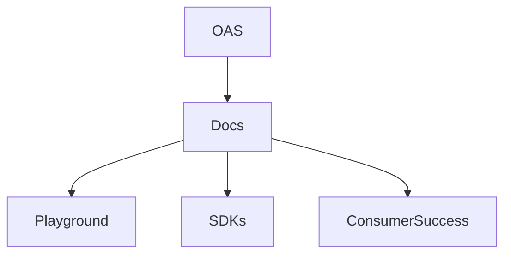
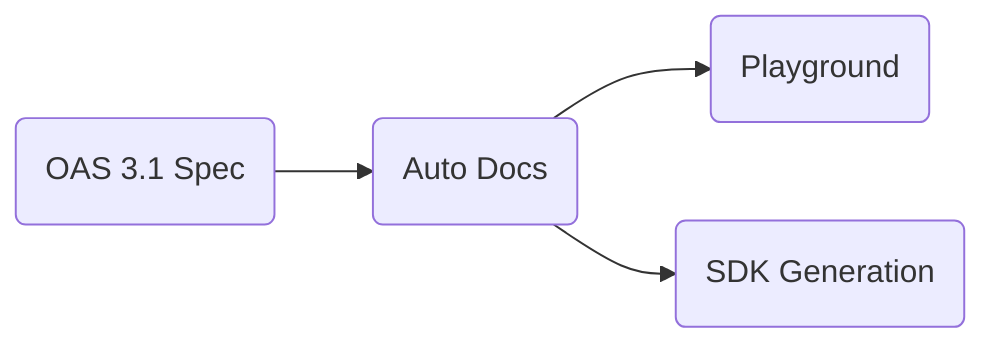
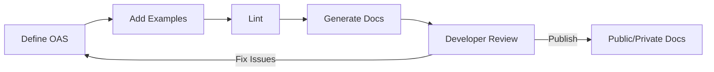

# فصل ۳

# API Documentation

(مطابق Postman API Documentation + OpenAPI 3.1 + Best Practices)

---

## 1. نام و تعریف‌ها

(هدر رسمی Postman → *“What is API documentation?”*)

### نام

API Documentation — مستندسازی API

### تعریف عمومی (روایی و ثلیث)

مستندسازی API یعنی تبدیل تمام رفتار واقعی API—ورودی‌ها، خروجی‌ها، خطاها، مثال‌ها، قوانین—به یک «نقشهٔ خوانا» که توسعه‌دهنده بتواند بدون پرسیدن از تیم، API را بفهمد و استفاده کند. یک API بدون مستندات، مثل فرودگاهی است بدون تابلو و راهنما.

### تعریف تخصصی

(بر اساس Postman + OpenAPI)
API Documentation مجموعه‌ای از **ماشین‌خوان** و **انسان‌خوان** شامل توضیحات، مثال‌ها، schemaها، نمونه پاسخ‌ها، خطاها، authentication و مسیرهای API است که معمولاً از OpenAPI 3.1 تولید می‌شود و باید سه ویژگی داشته باشد:

1. **دقیق** (مطابق با اجرای واقعی)
2. **قابل‌جستجو**
3. **قابل‌مصرف توسط ماشین** (برای SDK، تست، mock)

---

## 2. پیش‌نیازهای دانشی

(هدر رسمی Postman → “Before you document an API…”)

* **آشنایی با OAS 3.1**
* **توانایی خواندن و نوشتن JSON/YAML**
* **دانش HTTP Status Codes و Error Models**
* **شناخت Authentication Mechanisms**
* **آشنایی با Postman و ابزارهای Doc Generation**

---

## 3. دسته‌بندی کاربردها و نمونه‌های واقعی

### کاربردها

* مستندسازی APIهای عمومی
* ایجاد مستندات همکاری بین Back-end و Front-end
* ساخت SDKها و Client Libraries
* ایجاد Playground داخل مستندات (مثل Stripe)

### نمونه‌های عالی

* **Stripe API Docs** (استاندارد طلایی)
* **Twilio API Docs** (مثال واقعی از Error Model)
* **GitHub REST API Docs** (ترکیب OAS + human-readable)
* **Postman Public Workspaces** (Docs به‌عنوان محصول)

---

## 4. شرکت‌ها و سازمان‌های پشتیبان

(مطابق Reference)

* Postman (API Documentation Platform)
* OpenAPI Initiative
* Redocly (Docs Engine)
* Swagger UI / SwaggerHub
* Stoplight
* GitHub (برای hosting OAS-based docs)

---

## 5. مفاهیم و فناوری‌های مرتبط

(هدر Postman → “Related concepts”)

| مفهوم                 | نقش                                  |
| --------------------- | ------------------------------------ |
| OpenAPI 3.1           | منبع اصلی تولید مستندات              |
| Redoc                 | DOC UI حرفه‌ای                       |
| Swagger UI            | محیط تست + نمایش                     |
| Postman Documentation | مستند + Playground                   |
| Examples              | کلید فهم سریع API                    |
| Error Objects         | جلوگیری از ابهام و پرسش‌های غیرضروری |

### نمودار مفهومی



---

## 6. الگوها و Best Practices

(منطبق با Postman API Documentation Guide)

### Do

* از **Examples واقعی** استفاده کن
* برای هر endpoint، **Request + Response + Error** را کامل بنویس
* از **Schemas قابل‌جستجو** استفاده کن
* Behavior واقعی را بنویس، نه behavior ایده‌آل
* همزمان API Docs را **لینت** کن تا Drift رخ ندهد
* توضیح واضح دربارهٔ Authentication

### Don’t

* در مستندات Copy/Paste پاسخ‌های غیرواقعی
* استفاده از توضیحات یک‌خطی مبهم
* حذف خطاهای مهم (“fail silently”)
* انتشار مستندات ناقص همراه با TODO
* mismatch میان Production و Documentation

### Design Patterns

* **Single Source of Truth (SSoT)**
  مستندات → از OAS تولید شوند
* **Auto-Generated + Human-Enhanced**
* **Try-it Playground** (مثل Postman یا Redoc)

### Anti-patterns

* **Swagger Drift**
  OAS یک چیز → مستندات چیز دیگر
* **Wall of Text**
  بدون مثال و بدون ساختار
* **Inline JSON Everywhere**
  بدون schema واحد

---

## 7. ترفندها و Pro Tips

(براساس Postman — API Documentation Tips)

* همیشه برای هر endpoint **حداقل سه example** بده:
  success / validation error / authorization error
* برای ساخت مستندات حرفه‌ای، از **tags** استفاده کن
* برای هر Model، یک بخش **copy-paste-ready** بده
* همیشه **rate limit headers** را به صورت مستند ارائه کن
* اگر API عمومی است، **SDK code snippets** اضافه کن
* توضیح بده که چه چیزهایی تغییر behavior می‌دهند
  مثل: headers, media types, query parameters

---

## 8. مباحث پیشرفته و سناریوهای مرزی

* مستندسازی APIهای نسخه‌بندی‌شده (v1, v2)
* مستندسازی رفتارهای شرطی (conditional requests, caching policies)
* مستندسازی APIهای real-time (webhook, event-delivery guarantees)
* مستندسازی برای چند consumer profile (internal / partner / public)
* DocOps:
  اتوماسیون ساخت، انتشار و تست Docs در CI/CD

---

## 9. مقایسه با فناوری‌ها یا روش‌های مشابه

| روش                | مزایا                                   | ضعف                   |
| ------------------ | --------------------------------------- | --------------------- |
| OpenAPI-based Docs | استاندارد، قابل‌تولید، machine-readable | نیازمند دقت بالا      |
| Markdown Docs      | انعطاف زیاد                             | ممکن است drift رخ دهد |
| Postman Docs       | playground + examples                   | نیازمند import        |
| ReadMe.com         | UX بسیار قوی                            | SaaS وابسته           |



---

## 10. نمودارها و مصورسازی‌ها

### چرخه تولید مستندات



---

## 11. نتیجه‌گیری آموزشی

در فصل ۳ آموختی که:

* مستندسازی تنها «نوشتن توضیح» نیست؛
  **ساخت پل ارتباطی بین API و انسان است**.
* بهترین مستندات از **OAS 3.1** و **Examples واقعی** ساخته می‌شوند.
* API بدون Docs → در عمل unusable
* Docs خوب هزینهٔ پشتیبانی، ابهام و خطاهای مصرف‌کننده را ۹۰٪ کاهش می‌دهد.

# In Act

# ۱) مقدمه

این مستند نشان می‌دهد چگونه یک API واقعی را بر اساس **OpenAPI 3.1** و **Best Practices مستندسازی Postman** به شکل حرفه‌ای و قابل‌مصرف ارائه کنیم.

خروجی نهایی این مستند:

* آماده برای نمایش در Postman Documenter
* قابل نمایش در Swagger UI / Redoc
* قابل استفاده توسط توسعه‌دهندگان Front-end / Mobile / Back-end
* دارای Examples واقعی، Error Models، Authentication، Request/Responseهای معتبر

---

# ۲) نام API

**Order Management API**
(مستندسازی نسخه: ۱.۰.۰)

---

# ۳) Overview

API مدیریت سفارش‌ها یک سرویس REST استاندارد است که امکان:

* ایجاد سفارش
* مشاهده سفارش
* بروزرسانی وضعیت سفارش
* مشاهده محصولات
* مشاهده سفارش‌های یک کاربر

را فراهم می‌کند.

تمام APIها:

* مبتنی بر JSON هستند
* همه پاسخ‌ها دارای ساختار سازگار و قابل‌پیش‌بینی‌اند
* احراز هویت از طریق Bearer Token انجام می‌شود

---

# ۴) Authentication

(طبق نیازهای مستندات Postman → *Authentication section*)

این API از **Bearer Token Authentication** استفاده می‌کند.

در تمام درخواست‌ها باید این هدر ارسال شود:

```
Authorization: Bearer <token>
```

اگر ارسال نشود:

```
401 Unauthorized
{
  "error": "missing_token",
  "message": "Authentication token is required."
}
```

---

# ۵) Base URL

(مطابق استاندارد Docs)

```
https://api.example.com/v1
```

---

# ۶) تعریف Resourceها و Endpoints

(هر Endpoint شامل Request، Response، نمونهٔ خطا، Exampleها)

## ۶.۱) List User Orders

### GET /users/{user_id}/orders

**توضیح:**
لیست تمام سفارش‌های یک کاربر را برمی‌گرداند.

### Path Parameters

| نام     | نوع    | توضیح       |
| ------- | ------ | ----------- |
| user_id | string | شناسه کاربر |

### Response 200

```json
[
  {
    "id": "ord-1001",
    "user_id": "u-1",
    "status": "pending",
    "created_at": "2025-01-10T12:11:00Z",
    "items": [
      {"product_id": "p-21", "qty": 2, "price": 90000}
    ]
  }
]
```

### Example — موفق

```
GET /users/u-1/orders
Authorization: Bearer <token>
```

### Example — خطای عدم احراز هویت (401)

```json
{
  "error": "unauthorized",
  "message": "Token missing or invalid"
}
```

---

## ۶.۲) Create Order

### POST /users/{user_id}/orders

### Request Body

```json
{
  "items": [
    {"product_id": "p-21", "qty": 2},
    {"product_id": "p-90", "qty": 1}
  ]
}
```

### Response 201

```json
{
  "id": "ord-1002",
  "user_id": "u-1",
  "status": "pending",
  "created_at": "2025-01-11T08:42:10Z",
  "items": [
    {"product_id": "p-21", "qty": 2, "price": 90000},
    {"product_id": "p-90", "qty": 1, "price": 120000}
  ]
}
```

### Example — Invalid Request (422)

```json
{
  "error": "invalid_request",
  "message": "Each item must contain product_id and qty."
}
```

---

## ۶.۳) Get Order

### GET /orders/{order_id}

### Response 200

```json
{
  "id": "ord-1001",
  "user_id": "u-1",
  "status": "pending",
  "created_at": "2025-01-10T12:11:00Z",
  "items": [
    {"product_id": "p-21", "qty": 2, "price": 90000}
  ]
}
```

---

## ۶.۴) Update Order Status

### PATCH /orders/{order_id}

### Request Body

```json
{"status": "shipped"}
```

### Response 200

```json
{
  "id": "ord-1001",
  "status": "shipped"
}
```

---

## ۶.۵) List Products

### GET /products

### Response

```json
[
  {"id": "p-21", "title": "Laptop Bag", "price": 90000},
  {"id": "p-90", "title": "Mechanical Keyboard", "price": 120000}
]
```

---

# ۷) Schema Reference

(قسمت بسیار مهم در Docs — طبق Postman/OAS)

### Order Schema

```json
{
  "type": "object",
  "properties": {
    "id": {"type": "string"},
    "user_id": {"type": "string"},
    "status": {"type": "string"},
    "created_at": {"type": "string", "format": "date-time"},
    "items": {
      "type": "array",
      "items": {"$ref": "#/components/schemas/OrderItem"}
    }
  }
}
```

### OrderItem Schema

```json
{
  "type": "object",
  "properties": {
    "product_id": {"type": "string"},
    "qty": {"type": "integer"},
    "price": {"type": "number"}
  }
}
```

---

# ۸) Error Model (استاندارد و قابل‌پیش‌بینی)

(طبق Best Practices Postman)

تمام خطاها باید ساختار یکسان داشته باشند:

```json
{
  "error": "invalid_request",
  "message": "Validation failed",
  "details": {
      "field": "items",
      "reason": "must not be empty"
  }
}
```

مزایا:

* قابل‌مصرف برای فرانت‌اند
* قابل‌جستجو
* پیاده‌سازی ساده‌تر در mobile

---

# ۹) Try-It Playground

(طبق Postman Documentation استاندارد)

در Postman Documenter:

* دکمهٔ “Run in Postman”
* مثال‌های آماده
* امکان Mock Server
* امکان تغییر مقادیر و اجرای درخواست

این بخش به توسعه‌دهنده اجازه می‌دهد بدون خواندن طولانی موارد، API را «حس» کند.

---

# ۱۰) نکات حرفه‌ای برای Documentation

* در هر endpoint توضیح بده **چه چیزی تضمین شده** و **چه چیزی ممکن است تغییر کند**.
* در مستندات **به مدل caching اشاره کن** (Cache-Control, ETag).
* تمام مثال‌ها باید از **Production-like values** استفاده کنند.
* در صورت نسخه‌بندی API، در هر صفحه Doc توضیح بده که چه چیزی در نسخه قبلی متفاوت بوده است.
* اگر API عمومی است، **SDK Snippets** بده:

  * cURL
  * Python
  * JavaScript
  * Go

نمونه:

```bash
curl -X GET \
  https://api.example.com/v1/orders/ord-1001 \
  -H "Authorization: Bearer <token>"
```

---

# ۱۱) اعتبارسنجی مستندات (DocOps)

### ۱) اطمینان از هماهنگی Doc و Spec

```
spectral lint openapi.yaml
```

### ۲) تولید Doc با Swagger

```
docker run -p 8080:8080 -v $PWD/openapi.yaml:/usr/share/nginx/html/openapi.yaml swaggerapi/swagger-ui
```

### ۳) انتشار اتوماتیک با GitHub Pages

(OAS → Redoc → GH Pages)

