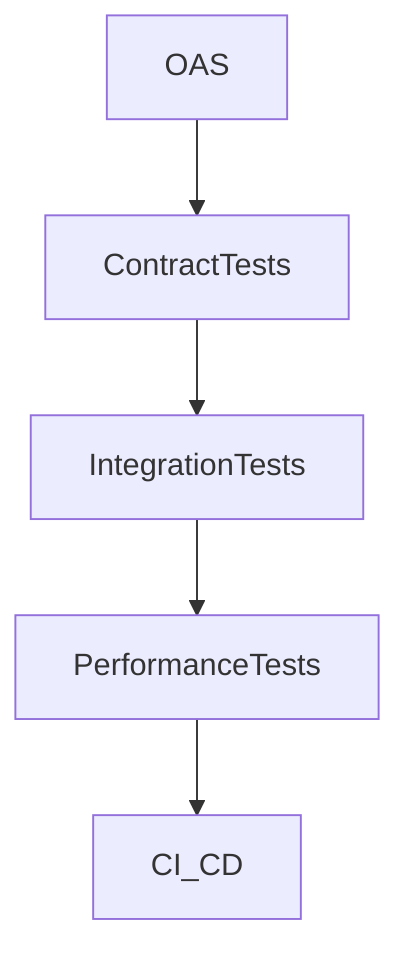
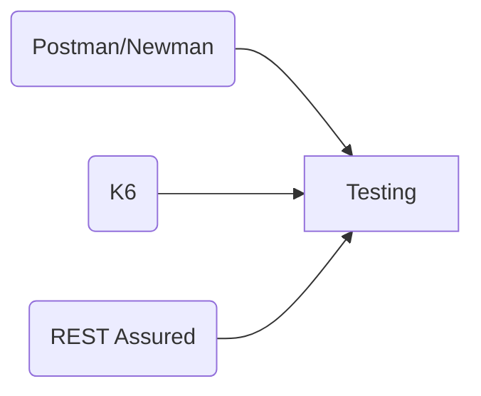
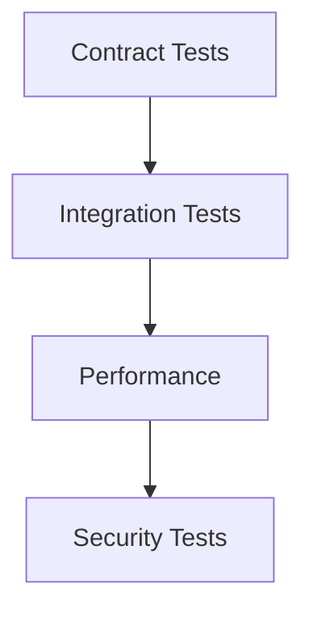
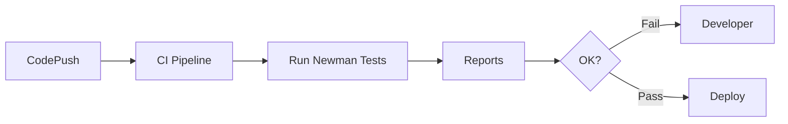

# فصل ۴

# API Test Automation

(بر اساس Postman API Test Automation + RFC9110 + Testing Patterns)

---

## 1. نام و تعریف‌ها

(هدر رسمی Postman → *What is API test automation?*)

### نام

API Test Automation — تست خودکار API

### تعریف عمومی (روایی)

API Test Automation یعنی به‌جای این‌که هر بار یک توسعه‌دهنده درخواست را دستی بفرستد و پاسخ را نگاه کند، مجموعه‌ای از تست‌ها به‌صورت خودکار و منظم رفتار API را بررسی می‌کنند و هرگونه خطا، ناسازگاری، افت عملکرد یا تغییر غیرمنتظره را **بدون دخالت انسان** کشف می‌کنند.

مثل داشتن یک تیم نگهبان ۲۴ ساعته که هر دقیقه API را بررسی می‌کند.

### تعریف تخصصی

(مبتنی بر Postman + RFC9110)
API Test Automation مجموعه‌ای از تست‌های رسمی، تکرارپذیر و قابل‌اجرایی است که با استفاده از Collectionهای Postman، اسکریپت‌های Newman، Contract Tests، Tests Integration و Load/Stress Tests اعتبار موارد زیر را بررسی می‌کنند:

* صحت semantics طبق RFC9110
* انطباق Request/Response با Specification (OAS 3.1)
* رفتار endpointها در سناریوهای واقعی
* امنیت و احراز هویت
* performance و latency
* backward compatibility

هدف: تضمین کیفیت پایدار API در مقابل تکامل سریع.

---

## 2. پیش‌نیازهای دانشی

(هدر Postman → “Before running automated tests”)

برای درک کامل این فصل باید بدانی:

* **HTTP Status Codes + Error Models**
* **OpenAPI 3.1** برای Contract Testing
* **مفاهیم CI/CD**
* **Postman Tests (JavaScript-based)**
* **Newman CLI**
* **Mock Server و Test Environment**
* **Semantic HTTP Rules (per RFC9110)**

---

## 3. دسته‌بندی کاربردها و نمونه‌های واقعی

(هدر Postman → “Use cases for API testing”)

### کاربردها

* اعتبارسنجی صحت API در هر build
* جلوگیری از regression
* اعتبارسنجی رفتار endpointهای حیاتی
* تست امنیت (Token, Signature, Unauthorized flows)
* تست SLA و latency
* تست در محیط‌های multi-team
* تست تغییرات schema قبل از انتشار نسخهٔ جدید

### نمونه‌های واقعی

* **Stripe**: 100% Test Coverage برای API، شامل Negative Tests
* **GitHub**: تست قرارداد با چند زبان
* **Airbnb**: تست API از طریق Mesh Test + Integration
* **Postman Public Workspaces**:  نمونه‌های Testing + Automation

---

## 4. شرکت‌ها و سازمان‌های مرتبط

* **Postman** (Testing + Newman)
* **OpenAPI Initiative** (Contract verification)
* **K6** (Load testing API)
* **OWASP** (Security Testing Guidelines)
* **CircleCI, GitHub Actions, GitLab CI**
* **Swagger** (Validator tools)

---

## 5. مفاهیم و فناوری‌های مرتبط

(هدر Postman → “Related concepts”)

| مفهوم                 | نقش                              |
| --------------------- | -------------------------------- |
| **Postman Tests**     | تست API به‌صورت اسکریپتی         |
| **Newman CLI**        | اجرای تست‌ها در CI/CD            |
| **Contract Testing**  | جلوگیری از اختلاف میان API و OAS |
| **Schema Validation** | ضمانت ساختار پاسخ                |
| **Integration Tests** | تست چند سرویس با هم              |
| **Load/Stress Tests** | اندازه‌گیری عملکرد               |

### نمودار مفهومی



---

## 6. الگوها و Best Practices

(هدر Postman → “Testing best practices”)

### Do

* تست‌ها را **به سه لایه** تقسیم کن:

  1. Contract Tests
  2. Integration Tests
  3. Performance Tests
* در هر endpoint حداقل یک **positive** و یک **negative test**
* استفاده از **Environment Variables**
* اعتبارسنجی Response مطابق **JSON Schema**
* تست Authentication:

  * token missing
  * token expired
  * insufficient scopes
* تست idempotency طبق RFC9110:

  * GET, PUT باید idempotent باشند
  * POST نباید idempotent باشد

### Don’t

* استفاده از Responseهای ثابت و غیرواقعی
* اجرای تست‌ها بدون Mock یا Staging Environment
* تست کردن مستقیم Production بدون محافظ
* ترکیب تست‌های سطح API با UI Tests
* نادیده گرفتن delayها و rate limits

### A Standard Test Suite باید شامل:

* Happy path
* Validation errors
* Authorization errors
* Business logic errors
* Latency threshold test
* Schema consistency tests
* Backward compatibility tests

---

## 7. ترفندها و Pro Tips

(برگرفته از Postman Testing Guidelines)

* در هر test برای readability از پیام‌های واضح استفاده کن:

  ```
  pm.test("should return 200 for valid request", function(){ ... })
  ```
* از **Chaining** برای تست چند مرحله‌ای استفاده کن (login → get data → create order)
* تست را **Tag** بزن:

  * smoke
  * regression
  * critical
* تست‌ها را در **Pre-request Script** آماده کن (token refresh)
* همیشه performance baseline را ذخیره کن
* از **Mock Server** برای Zero-cost feedback قبل از development استفاده کن
* از **Newman HTML Reporter** برای گزارش حرفه‌ای استفاده کن

---

## 8. مباحث پیشرفته و سناریوهای مرزی

* Contract Drift Detection
* تست APIهای توزیع‌شده (multi-service orchestration)
* Parallel test execution
* تست SLA در APIهای پرترافیک
* تست race condition در APIهای مالی
* تست‌های Event-Driven (Webhook delivery guarantees)
* Chaos Testing (latency injection, packet loss)

---

## 9. مقایسه با روش‌های مشابه

| روش                     | مزایا                       | ضعف                            |
| ----------------------- | --------------------------- | ------------------------------ |
| **Postman + Newman**    | ساده، کامل، محبوب، CI-ready | مناسب load تست خیلی سنگین نیست |
| **K6**                  | قوی برای performance        | نیاز به scripting              |
| **Karate**              | DSL محور                    | یادگیری بیشتر                  |
| **REST Assured**        | مناسب Java                  | محدود به JVM                   |
| **SuperTest (Node.js)** | ساده برای تست سرویس‌های JS  | مناسب پروژه‌های کوچک‌تر        |



---

## 10. نمودارها و مصور‌سازی‌ها

### لایه‌بندی تست‌ها



### اجرای تست خودکار در CICD



---

## 11. نتیجه‌گیری آموزشی

در فصل ۴ فهمیدی که:

* بدون Test Automation، کیفیت API صرفاً «تصوری» است.
* تست خودکار بخش جدایی‌ناپذیر APIOps، CI/CD و API Lifecycle است.
* ساختار صحیح تست شامل **Contract + Integration + Performance** است.
* Postman و Newman عملی‌ترین ابزار برای ایجاد و اجرای تست‌ها هستند.

اکنون آماده‌ای برای اجرای **in act** این فصل:
ساخت یک مجموعه تست واقعی، استاندارد، قابل اجرا و حرفه‌ای که برای همان API فصل ۲ نوشته شود.

# In Act

خیلی خوب، می‌رویم سراغ in act فصل ۴.
الان باید برای همان **Order Management API** یک سناریوی واقعی، گام‌به‌گام و قابل اجرا برای **API Test Automation** بسازم؛ طوری که اگر امروز روی سیستم‌ات Postman و Newman نصب کنی، بتوانی همین را اجرا کنی.

من رویکرد را این‌طور می‌چینم:

1. تعریف سناریوی تست
2. ساخت Postman Collection (مفهومی + اسکریپت‌ها)
3. نوشتن تست‌ها (assertionها)
4. اجرای Newman از خط فرمان
5. اتصال به CI/CD (سطح مفهومی اما عملی)
6. نکات حرفه‌ای و خطاهای رایج

همه چیز روی همان API فصل ۲ و ۳ سوار است.

---

# in act — فصل ۴

سناریوی عملی: API Test Automation برای Order Management API

---

## ۱. سناریوی کلی تست

برای **Order Management API** می‌خواهیم یک Test Suite واقعی بسازیم که حداقل موارد زیر را پوشش دهد:

1. احراز هویت درست کار می‌کند (بدون توکن = 401).
2. ایجاد سفارش جدید (POST /users/{id}/orders) در صورت درخواست معتبر → 201.
3. ایجاد سفارش با ورودی نامعتبر → خطای 422 با مدل خطای استاندارد.
4. لیست سفارش‌ها (GET /users/{id}/orders) بعد از ایجاد سفارش، شامل سفارش جدید باشد.
5. دریافت جزئیات سفارش (GET /orders/{order_id}) → 200 و اسکیمای درست.
6. تغییر وضعیت سفارش (PATCH /orders/{id}) → 200 و status جدید.

سه لایه حداقلی که پیاده می‌کنیم:

* Smoke / Happy Path
* Validation / Negative Tests
* Contract-ish Tests (چک ساختار response با اسکیمای JSON)

---

## ۲. ساخت Postman Collection (ساختار مفهومی)

در Postman یک Collection به نام:

> Order Management API — Tests

بساز. ساختار فولدرها را پیشنهاد می‌کنم این‌طور باشد:

* 00 – Auth & Setup
* 01 – Orders – Happy Path
* 02 – Orders – Validation Errors
* 03 – Orders – Auth Errors

در سطح Collection، چند متغیر تعریف می‌کنیم:

* `base_url` = `https://api.example.com/v1`
* `token` = (فعلاً یک مقدار تست؛ یا از تست Auth گرفته می‌شود)
* `user_id` = `u-1`
* `order_id` = (بعداً در تست‌ها ست می‌شود)

در Environment، همین متغیرها را می‌توانی override کنی (staging / production / local).

---

## ۳. یک درخواست نمونه + تست‌ها (Postman Tests)

### ۳.۱) درخواست: Create Order (موفق)

Method: `POST`
URL: `{{base_url}}/users/{{user_id}}/orders`

Body (JSON):

```json
{
  "items": [
    {"product_id": "p-21", "qty": 2},
    {"product_id": "p-90", "qty": 1}
  ]
}
```

Headers:

```text
Content-Type: application/json
Authorization: Bearer {{token}}
```

### ۳.۲) اسکریپت تست (Tests tab)

در تب Tests این اسکریپت را قرار بده:

```javascript
pm.test("Status code is 201", function () {
    pm.response.to.have.status(201);
});

pm.test("Response has valid order structure", function () {
    const json = pm.response.json();
    pm.expect(json).to.have.property("id");
    pm.expect(json).to.have.property("user_id", pm.environment.get("user_id"));
    pm.expect(json).to.have.property("status");
    pm.expect(json).to.have.property("items");
    pm.expect(json.items).to.be.an("array").that.is.not.empty;
});

pm.test("Order items have product_id, qty, price", function () {
    const json = pm.response.json();
    json.items.forEach(item => {
        pm.expect(item).to.have.property("product_id");
        pm.expect(item).to.have.property("qty");
        pm.expect(item).to.have.property("price");
    });
});

// ذخیره order_id برای تست‌های بعدی
const order = pm.response.json();
pm.environment.set("order_id", order.id);
```

این اسکریپت:

* کد وضعیت را چک می‌کند.
* ساختار کلی را بررسی می‌کند.
* روی items می‌چرخد و کلیدهای لازم را چک می‌کند.
* `order_id` را برای درخواست‌های بعدی ذخیره می‌کند.

---

## ۴. تست منفی: Request نامعتبر (Validation Error)

یک درخواست دیگر روی همان endpoint بساز:

### ۴.۱) Create Order – Invalid – Missing Items

Body:

```json
{
  "items": []
}
```

یا:

```json
{
  "items": [{}]
}
```

Tests:

```javascript
pm.test("Status code is 422 for invalid request", function () {
    pm.response.to.have.status(422);
});

pm.test("Error model is standardized", function () {
    const json = pm.response.json();
    pm.expect(json).to.have.property("error");
    pm.expect(json).to.have.property("message");
    pm.expect(json).to.have.property("details");
    pm.expect(json.details).to.have.property("field");
    pm.expect(json.details).to.have.property("reason");
});
```

اینجا در واقع داری **Error Model استاندارد** که در فصل ۳ تعریف کردیم را enforce می‌کنی.

---

## ۵. تست Auth: بدون توکن

درخواست:

* هم از GET /users/{{user_id}}/orders
* هم از POST /users/{{user_id}}/orders

یک نسخه بدون header `Authorization` بساز.

Tests:

```javascript
pm.test("Unauthorized without token", function () {
    pm.response.to.have.status(401);
});

pm.test("Error describes missing or invalid token", function () {
    const json = pm.response.json();
    pm.expect(json.error).to.be.oneOf(["missing_token", "unauthorized"]);
});
```

این تست‌ها مطمئن می‌شوند که API **به‌درستی از خودش محافظت می‌کند** و اجازهٔ استفادهٔ بدون توکن را نمی‌دهد.

---

## ۶. تست خواندن سفارش: GET /orders/{{order_id}}

حالا از `order_id` که در تست create ذخیره کردیم استفاده می‌کنیم.

Request:

* Method: GET
* URL: `{{base_url}}/orders/{{order_id}}`

Tests:

```javascript
pm.test("Status 200 for existing order", function () {
    pm.response.to.have.status(200);
});

pm.test("Order id matches the one we created", function () {
    const json = pm.response.json();
    pm.expect(json.id).to.eql(pm.environment.get("order_id"));
});

pm.test("Order matches schema subset", function () {
    const json = pm.response.json();
    pm.expect(json).to.have.property("user_id");
    pm.expect(json).to.have.property("status");
    pm.expect(json).to.have.property("items");
});
```

اگر بخواهی حرفه‌ای‌تر شوی، می‌توانی در این تست، از **JSON Schema Validation** استفاده کنی (Postman هم این را ساپورت می‌کند با کد JS).

نمونهٔ ساده JSON Schema Validation:

```javascript
const schema = {
  "type": "object",
  "required": ["id", "user_id", "status", "items"],
  "properties": {
    "id": { "type": "string" },
    "user_id": { "type": "string" },
    "status": { "type": "string" },
    "items": {
      "type": "array",
      "items": {
        "type": "object",
        "required": ["product_id", "qty", "price"]
      }
    }
  }
};

pm.test("Order matches JSON schema", function () {
    pm.response.to.have.jsonSchema(schema);
});
```

---

## ۷. اجرای Collection با Newman (از خط فرمان)

بعد از این‌که Collection را در Postman ساختی، آن را به صورت JSON export کن (مثلاً):

* `order-management-api.postman_collection.json`
  و یک Environment هم (مثلاً):

* `staging.postman_environment.json`

سپس روی سیستم‌ات Newman را نصب کن (اگر نداری):

```bash
npm install -g newman
```

حالا تست‌ها را اجرا کن:

```bash
newman run order-management-api.postman_collection.json \
  -e staging.postman_environment.json
```

خروجی مورد انتظار (نمونه):

* برای هر درخواست، نام و نتیجهٔ تست‌ها را می‌بینی
* در آخر، خلاصه:

```text
┌─────────────────────────┬──────────┬──────────┐
│                         │ executed │   failed │
├─────────────────────────┼──────────┼──────────┤
│              iterations │        1 │        0 │
│                requests │        6 │        0 │
│            test-scripts │        6 │        0 │
│      prerequest-scripts │        1 │        0 │
│              assertions │       15 │        0 │
└─────────────────────────┴──────────┴──────────┘
```

اگر assertionای fail شود، دقیقاً می‌گوید کدام تست، روی کدام درخواست شکست خورده.

---

## ۸. تولید گزارش HTML (مناسب CI/CD)

برای خروجی خواناتر (برای تیم یا گزارش)، یک reporter HTML اضافه کن:

```bash
npm install -g newman-reporter-htmlextra
```

سپس:

```bash
newman run order-management-api.postman_collection.json \
  -e staging.postman_environment.json \
  -r htmlextra \
  --reporter-htmlextra-export newman-report.html
```

حال می‌توانی `newman-report.html` را در مرورگر باز کنی.

---

## ۹. ادغام در CI/CD (مفهومی اما عملی)

### نمونهٔ GitHub Actions (yaml مفهومی)

```yaml
name: API Tests

on:
  push:
    branches: [ main, develop ]
  pull_request:

jobs:
  api-tests:
    runs-on: ubuntu-latest
    steps:
      - name: Checkout repo
        uses: actions/checkout@v4

      - name: Setup Node
        uses: actions/setup-node@v4
        with:
          node-version: '20'

      - name: Install newman
        run: npm install -g newman newman-reporter-htmlextra

      - name: Run API tests
        run: |
          newman run tests/order-management-api.postman_collection.json \
            -e tests/staging.postman_environment.json \
            -r htmlextra \
            --reporter-htmlextra-export newman-report.html
```

در این سناریو، **هر push یا PR** باعث اجرای تست‌ها می‌شود. اگر تستی fail شود، pipeline قرمز می‌شود و اجازهٔ deploy نمی‌دهد.

---

## ۱۰. نکات حرفه‌ای و چاله‌های رایج

* اگر تست‌هایت flaky هستند (گاهی pass، گاهی fail)، معمولاً مشکل از **وابستگی به دادهٔ بیرونی** است؛
  یا باید mock کنی، یا داده‌ها را stable کنی.

* تست‌ها را **business-oriented** بنویس:
  به‌جای: “status code is 200”
  بنویس: “user can see his orders after creating one”.

* تست‌ها را دسته‌بندی و tag کن:

  * smoke
  * regression
  * critical
    تا بتوانی در CI/CD فقط بخش خاصی را اجرا کنی:

```bash
newman run ... --folder "01 – Orders – Happy Path"
```

* در تست performance (که اینجا وارد جزییاتش نشدیم)، حتماً latency threshold تعریف کن (مثلاً: p95 < 200ms).

---

## ۱۱. جمع‌بندی in act فصل ۴

کاری که الان انجام دادیم:

* بر اساس API طراحی‌شده در فصل ۲ و مستندشده در فصل ۳،
  یک **Test Suite واقعی و قابل‌اجرا** طراحی کردیم:

  * مثبت (happy path)
  * منفی (validation / auth)
  * schema validation
  * chain بین درخواست‌ها (استفاده از order_id)

* تست‌ها را در Postman نوشتیم،

* با Newman از خط فرمان اجرا کردیم،

* و در CI/CD ادغام کردیم.
