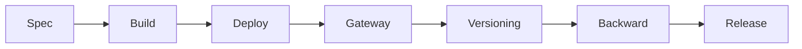
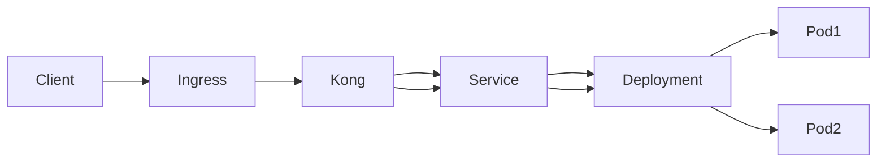
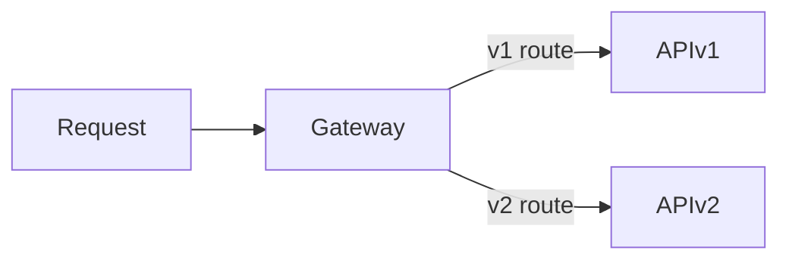
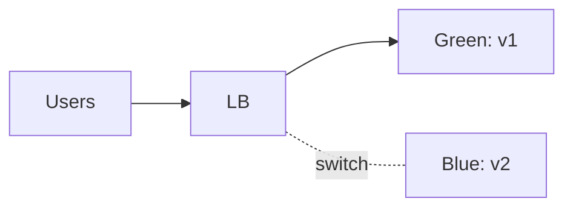
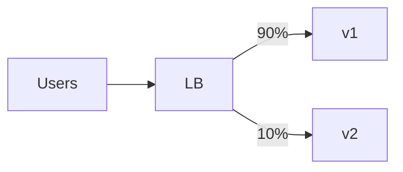

# فصل ۵ — API Deployment & Versioning

(مطابق استانداردهای صنعتی، RFCها و API Gateway Patterns)

---

# 1. نام و تعریف‌ها

## 1.1 نام

API Deployment & Versioning
(دیپلوی و نسخه‌بندی API)

## 1.2 تعریف روایی

بعد از این‌که API طراحی و پیاده شد، باید آن را **جایی مستقر کنیم** که مصرف‌کنندگان (موبایل، وب‌اپ، سرویس‌های داخلی، تیم‌های دیگر) بتوانند به آن دسترسی داشته باشند.
اما API یک کتابخانه نیست؛ هر تغییری در API ممکن است مصرف‌کنندگان را از کار بیندازد.

پس دو مرحله حساس پیش‌رو داریم:

* **Deployment**: کجا و چگونه API را اجرا کنیم؟
* **Versioning**: چگونه تغییر بدهیم بدون اینکه مصرف‌کننده‌ها بشکنند؟

Deployment = «چطور بالا بیاریم»
Versioning = «چطور تکامل بدهیم بدون شکستن کاربران»

## 1.3 تعریف تخصصی

(بر اساس RFC9110 HTTP Semantics و API Evolution Principles)

API Deployment مجموعه‌ای از فرایندهای عملیاتی است که شامل:

* پکیج‌سازی (Containerization)
* استقرار (Deployment)
* مسیردهی (Routing)
* Load balancing
* Observability
* Rollout strategies (Blue/Green, Canary)

API Versioning مجموعه‌ای از قراردادها و الگوهایی است برای:

* تغییر API بدون breaking changes
* مدیریت backward compatibility
* ارائه نسخه‌های هم‌زمان (parallel versions)
* تعیین چرخه عمر نسخه‌ها (Deprecation → Sunset → Removal)
* و هماهنگ‌سازی با اسناد رسمی (RFC 8594 – Sunset Header)

---

# 2. پیش‌نیازهای دانشی

برای فهم کامل فصل ۵ باید این‌ها را کم‌وبیش بشناسی:

* **HTTP Semantics (RFC 9110)**
* **Containerization** (Docker)
* **Reverse Proxy / Load Balancer concepts**
* **Kubernetes basics** (Ingress, Service, Deployment)
* **API Gateway patterns** (Routing, Rate Limit, Auth, Transformations)
* **DNS / TLS / Certificates**
* **Semantic Versioning**

دانستن Django/DRF کافی است؛ این فصل مستقل‌تر از زبان و فریم‌ورک است.

---

# 3. دسته‌بندی کاربردها و نمونه‌های واقعی

## 3.1 کاربردها

* استقرار API روی محیط‌های:

  * Docker Compose
  * Kubernetes
  * Cloud Provider (AWS/GCP/Azure)
  * Serverless Gateway

* نسخه‌بندی API:

  * v1, v2 برای breaking changes
  * استفاده از Header برای نسخه‌بندی RESTful/Hypermedia
  * Media-Type Versioning
  * Feature Flags + Canary Release

## 3.2 نمونه‌های واقعی

* **Stripe**:
  نسخه‌بندی از طریق Header (خود Stripe-style versioning)
  یعنی:
  `Stripe-Version: 2023-10-16`

* **GitHub API**:
  Media-Type Versioning:
  `application/vnd.github+json; version=2022-11-28`

* **Kubernetes API**:
  نسخه‌بندی در URI:
  `/api/v1`, `/apis/apps/v1`, `/apis/coordination.k8s.io/v1`

* **Google APIs**:
  URI-based Versioning:
  `https://maps.googleapis.com/maps/api/v3/...`

* **Twitter API**:
  URI versioning + rollout progressive

---

# 4. شرکت‌ها/فناوری‌های پشتیبان

* **Kong Gateway**
* **NGINX / NGINX Ingress Controller**
* **Envoy / Istio**
* **Cloudflare API Gateway**
* **AWS API Gateway**
* **Google API Gateway**
* **Traefik / Ambassador**
* **Kubernetes Ingress**
* **Docker Swarm / Compose**

---

# 5. مفاهیم و فناوری‌های مرتبط

| مفهوم               | توضیح                                              |
| ------------------- | -------------------------------------------------- |
| Reverse Proxy       | سروری که ترافیک ورودی را به API پشت‌صحنه می‌فرستد  |
| Load Balancer       | تقسیم بار بین چند Pod/Container                    |
| Ingress             | درگاه ورودی ترافیک در Kubernetes                   |
| API Gateway         | کنترل ورود ترافیک، احراز هویت، Rate Limiting، Logs |
| Canary Release      | انتشار تدریجی نسخه جدید برای درصدی از کاربران      |
| Blue/Green          | اجرای همزمان دو نسخه و سوییچ ناگهانی               |
| Semantic Versioning | نسخه‌بندی: MAJOR.MINOR.PATCH                       |
| Sunset Header       | اعلام تاریخ حذف نسخه قبلی                          |

نمودار مفهومی:



---

# 6. الگوها و Best Practices

### ✦ 6.1 Deployment Do’s

* همیشه از **Containerization** (Docker) استفاده کن
* Healthcheck داشته باش (Liveness & Readiness)
* Logs + Metrics + Traces:

  * Prometheus
  * Grafana
  * OpenTelemetry
* استفاده از **Gateway** برای:

  * Rate Limit
  * Auth
  * Routing
  * CORS
* Configuration as Code (CI/CD)

### ✦ 6.2 Deployment Don’ts

* API را بدون healthcheck دیپلوی نکن
* روی یک ماشین مستقیم python manage.py runserver اجرا نکن
* نسخه جدید را بدون rollout strategy منتشر نکن
* وابستگی‌ها را بدون pin کردن نسخه‌ها رها نکن

---

### ✦ 6.3 Versioning Do’s

* برای هر **breaking change** → نسخه جدید
* هر نسخه را کامل در Docs مشخص کن
* تاریخ **Deprecation** را مشخص کن
* تاریخ **Sunset** را اعلام کن → RFC 8594
* Backward compatibility = اصل طلایی

### ✦ 6.4 Versioning Don’ts

* نسخه‌بندی برای تغییرات کوچک
* ترکیب چند روش نسخه‌بندی در یک API
* تغییر schema بدون version bump
* تغییر معنی فیلدها در نسخه جاری

---

### ✦ 6.5 Versioning Patterns

#### 1) URI Versioning  (محبوب‌ترین)

```
/api/v1/orders/
/api/v2/orders/
```

مزایا: واضح و خوانا
معایب: تکرار زیاد ساختار

#### 2) Header Versioning (سازمانی + B2B)

```
API-Version: 2024-10-12
```

#### 3) Media-Type Versioning (سازمانی + پیچیده)

```
Accept: application/vnd.myapp.orders+json; version=2
```

#### 4) Resource Versioning (در GraphQL/REST جدیدتر)

بدون version در URI؛ با “fields” evolution
اما در REST کلاسیک چندان رایج نیست.

---

# 7. ترفندها و Pro Tips

* همیشه rollout را **Canary** انجام بده مگر اینکه تجربه‌ کافی داشته باشی
* Versioning را در API Gateway انجام بده، نه داخل کد
* از **feature flags** برای رفتارهای جدید استفاده کن
* نسخه قدیمی را تنها زمانی حذف کن که:

  * `Usage < 5%`
  * ۶ ماه sunset اعلام شده باشد
* از “Shadow Traffic” برای تست نسخه جدید استفاده کن
* اگر از Django استفاده می‌کنی → خوب است نسخه‌بندی را در urls.py سازمان‌دهی کنی

---

# 8. مباحث پیشرفته و سناریوهای مرزی

* Multi-version Compatibility
* Endpoint Shadowing
* Traffic Mirroring
* Multi-Region Deployment
* Auto-Failover
* Zero-downtime Migration
* Contract-first vs Code-first evolution
* OpenAPI Multi-version Management
* الگوی Strangler Pattern برای جایگزینی نسخه قدیمی

---

# 9. مقایسه روش‌های اصلی Versioning

| روش | مزایا | معایب | کاربرد |
|------|-------|--------|---------|
| URI (/v1/) | ساده، محبوب، سریع | تکرار ساختار | Backend سنتی، REST |
| Header | تمیز، بدون تغییر URL | مشتری باید Header بگذارد | B2B، Internal APIs |
| Media-Type | حرفه‌ای، دقیق | پیچیده | GitHub, Stripe |
| No-Version | فقط evolution | خطرناک | GraphQL |

---

# 10. نمودارهای Deployment و Versioning

### 10.1 Deployment روی Kubernetes



### 10.2 نسخه‌بندی در Gateway (Kong)



### 10.3 Blue/Green Release



### 10.4 Canary Release



---

# 11. نتیجه‌گیری آموزشی

در این فصل یاد گرفتی:

* API Deployment یعنی چه و چرا مهم است
* Versioning چگونه جلوی شکستن کاربران را می‌گیرد
* الگوهای استاندارد مانند URI، Header، Media Type
* استراتژی‌های انتشار: Canary و Blue/Green
* نقش API Gateway مثل Kong/NGINX در نسخه‌بندی و Rollout
* اهمیت backward compatibility و Sunset headers

حالا API تو دیگر فقط «سرورها» نیست؛
بلکه «یک محصول قابل نسخه‌بندی و استقرار حرفه‌ای» است.

