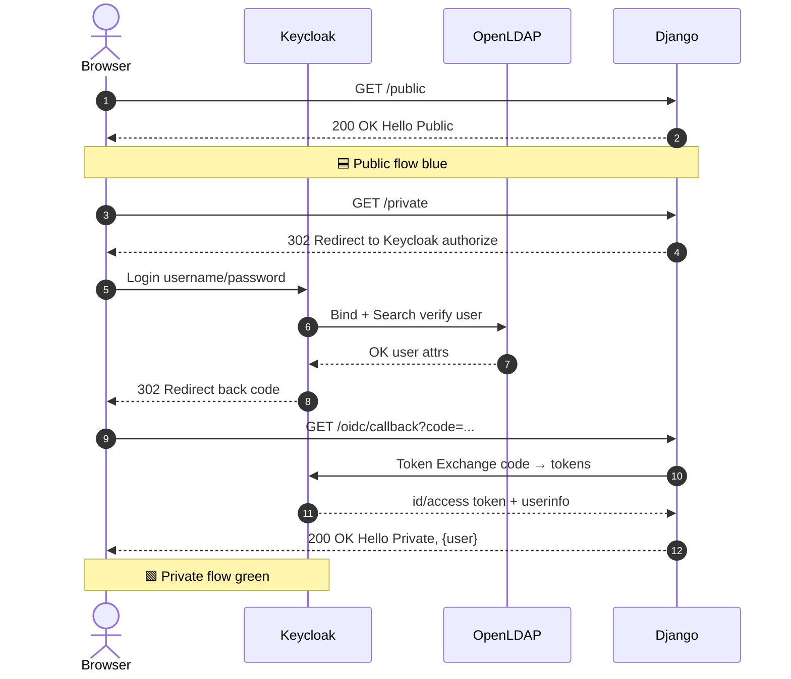
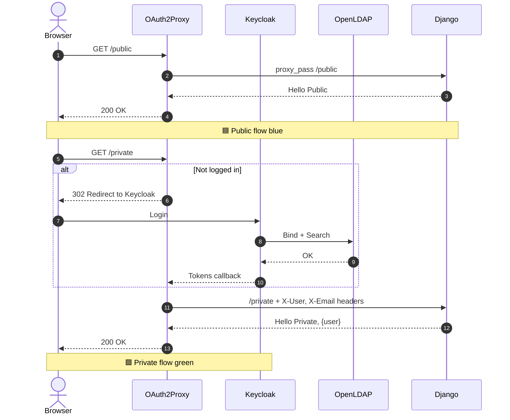
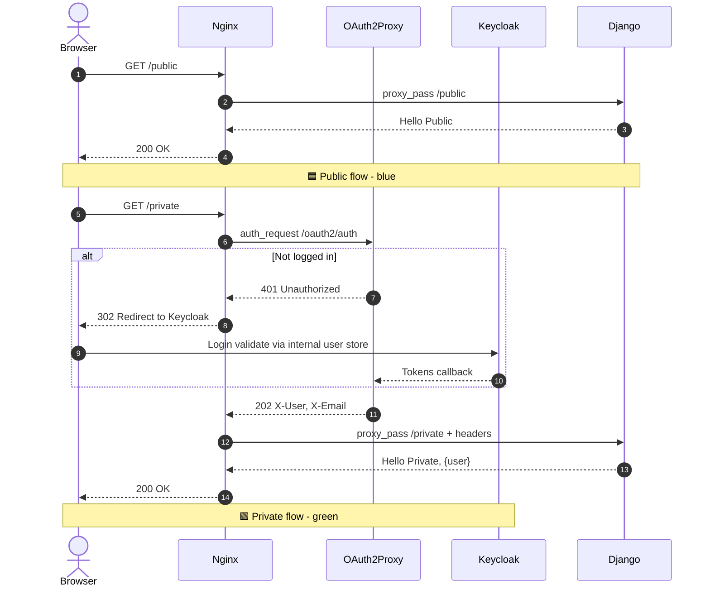
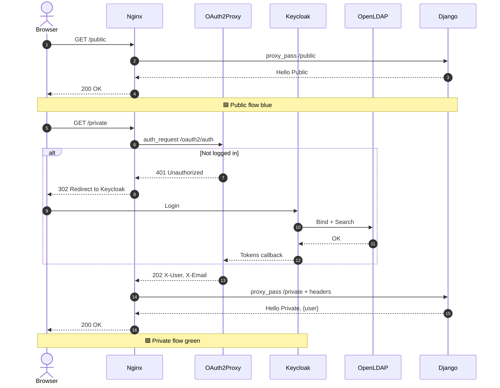
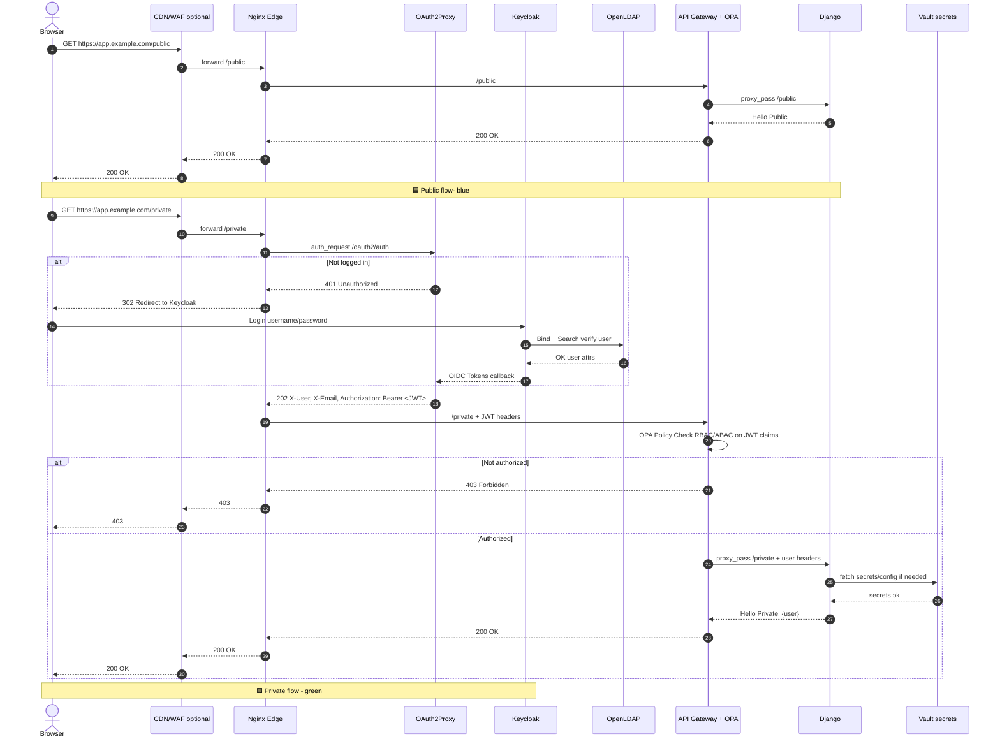
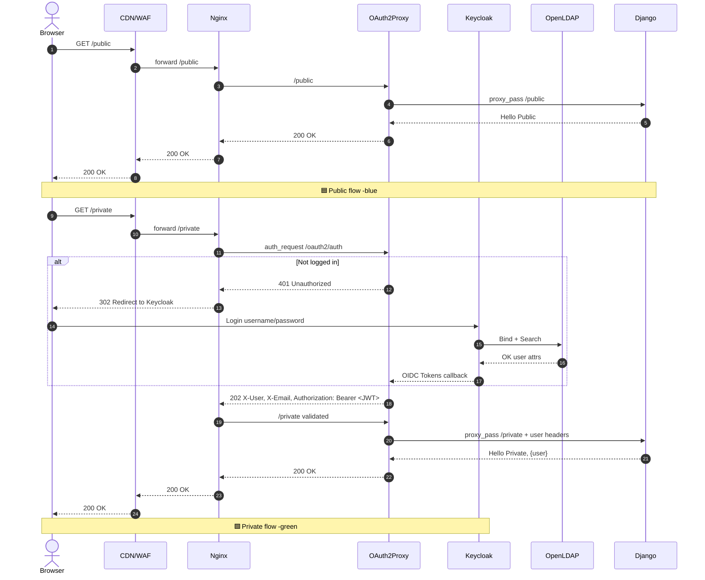
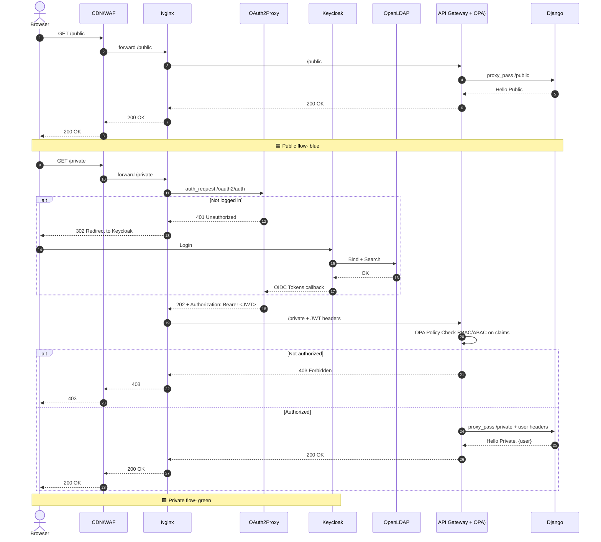
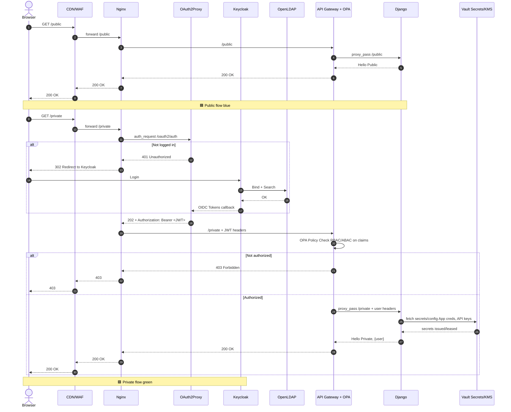

## 🧩 **معماری 1 : OpenLDAP + Keycloak**

**1️⃣ نام حرفه‌ای:**
**Federated Identity & Directory Integration**

**2️⃣ سرویس‌ها:**
OpenLDAP + Keycloak

**3️⃣ مزیت / مشکل حل‌شده:**
یکپارچه‌سازی کاربران در یک منبع مرکزی (LDAP) و مدیریت ورود آن‌ها از طریق Keycloak.

**4️⃣ تعریف کوتاه:**
Keycloak هویت‌ها را از LDAP می‌خواند و برای ورود کاربران به سیستم‌های مختلف از آن استفاده می‌کند.

**5️⃣ استفاده در:**
سازمان‌هایی با دایرکتوری کاربران (مانند شرکت‌ها یا دانشگاه‌ها) که نیاز به ورود واحد 

---

## 🧩 **معماری 2 : OpenLDAP + Keycloak + OAuth2-Proxy**

**1️⃣ نام حرفه‌ای:**
**Identity-Aware Proxy Architecture**

**2️⃣ سرویس‌ها:**
OpenLDAP + Keycloak + OAuth2-Proxy

**3️⃣ مزیت / مشکل حل‌شده:**
افزودن لایهٔ محافظ جلوی اپلیکیشن‌ها بدون نیاز به تغییر کد (SSO + Access Control).

**4️⃣ تعریف کوتاه:**
OAuth2-Proxy بین کاربر و اپلیکیشن قرار می‌گیرد و با Keycloak برای احراز هویت و دریافت اطلاعات کاربر ارتباط دارد.

**5️⃣ استفاده در:**
محیط‌هایی که اپ‌های مختلف باید از طریق یک نقطهٔ ورود امن و متمرکز محافظت شوند.

---

## 🧩 **3 : Nginx + Keycloak + OAuth2-Proxy**

**1️⃣ نام حرفه‌ای:**
**Cloud-Native SSO Gateway Architecture**

**2️⃣ سرویس‌ها:**
Nginx + OAuth2-Proxy + Keycloak

**3️⃣ مزیت / مشکل حل‌شده:**
ایجاد ورود یک‌باره (SSO) در محیط‌های Cloud بدون نیاز به دایرکتوری خارجی.

**4️⃣ تعریف کوتاه:**
Keycloak کاربران را در خود نگه می‌دارد، OAuth2-Proxy جلوی اپ‌هاست، و Nginx لایهٔ ورود و امنیت HTTP را فراهم می‌کند.

**5️⃣ استفاده در:**
پلتفرم‌های Cloud-native، Docker/Kubernetes، و سرویس‌های SaaS با کاربران داخلی.

---

## 🧩 **معماری 4 : Nginx + OpenLDAP + Keycloak + OAuth2-Proxy**

**1️⃣ نام حرفه‌ای:**
**Edge-Secured Federated IAM Architecture**

**2️⃣ سرویس‌ها:**
Nginx + OAuth2-Proxy + Keycloak + OpenLDAP

**3️⃣ مزیت / مشکل حل‌شده:**
افزودن امنیت لبه (Edge Security)، مدیریت TLS، و مسیربندی امن همراه با احراز هویت مرکزی.

**4️⃣ تعریف کوتاه:**
Nginx در لبه ترافیک قرار می‌گیرد، OAuth2-Proxy محافظت از مسیرها را انجام می‌دهد، و Keycloak+LDAP مسئول احراز هویت کاربران هستند.

**5️⃣ استفاده در:**
محیط‌های سازمانی و Hybrid که نیاز به کنترل دقیق دسترسی و امنیت لایه 7 دارند.

---

## 🧩 **معماری 5 : CDN/WAF + Nginx + OAuth2-Proxy + Keycloak + OpenLDAP + API Gateway (+OPA) + Vault**

**1️⃣ نام حرفه‌ای:**
**Zero-Trust Cloud Identity & Access Architecture**

**2️⃣ سرویس‌ها:**
CDN/WAF + Nginx + OAuth2-Proxy + Keycloak + OpenLDAP + API Gateway (+OPA) + Vault

**3️⃣ مزیت / مشکل حل‌شده:**
ایجاد امنیت چندلایه با کنترل سیاست‌های پویا، احراز هویت فدره، و مدیریت امن اسرار.

**4️⃣ تعریف کوتاه:**
کاربر از طریق مسیر امن لبه وارد می‌شود، Proxy و Gateway دسترسی را طبق سیاست بررسی می‌کنند، و هویت از طریق Keycloak/LDAP تأیید می‌شود.

**5️⃣ استفاده در:**
زیرساخت‌های Enterprise و Cloud-native با رویکرد Zero-Trust و نیاز به انطباق امنیتی (Compliance).
h Federated IAM and Policy Enforcement Layer)

کاملاً موافقم—این شکستن هم منطقیه هم مسیر بلوغ رو شفاف می‌کنه. برای هر مرحله، همان ۵ بخشِ کوتاه و شفاف:

---

## 6) CDN/WAF + Nginx + OAuth2-Proxy + Keycloak + OpenLDAP

**1️⃣ نام حرفه‌ای:**
**Edge-Secured Federated SSO Architecture**

**2️⃣ سرویس‌ها:**
CDN/WAF + Nginx + OAuth2-Proxy + Keycloak + OpenLDAP

**3️⃣ مزیت / مشکل حل‌شده:**
امنیت لبه (DDoS/WAF/TLS)، SSO متمرکز، اتصال به دایرکتوری سازمانی؛ بدون تغییر کد اپ‌ها.

**4️⃣ تعریف کوتاه:**
CDN/WAF ترافیک را ایمن می‌کند، Nginx در لبه می‌نشیند، OAuth2-Proxy جلوی اپ‌ها احراز هویت را با Keycloak انجام می‌دهد، Keycloak هویت‌ها را از OpenLDAP می‌خواند.

**5️⃣ استفاده در:**
سازمان‌هایی که SSO و امنیت لبه می‌خواهند و منبع کاربران در LDAP است (Hybrid/On-Prem/Cloud).

---

## 7) + API Gateway (+ OPA)

CDN/WAF + Nginx + OAuth2-Proxy + Keycloak + OpenLDAP + **API Gateway (+OPA)**

**1️⃣ نام حرفه‌ای:**
**Policy-Driven Zero-Trust Gateway Architecture**

**2️⃣ سرویس‌ها:**
CDN/WAF + Nginx + OAuth2-Proxy + Keycloak + OpenLDAP + API Gateway (+ OPA)

**3️⃣ مزیت / مشکل حل‌شده:**
اعمال سیاست‌های مجوز (RBAC/ABAC) در گیت‌وی، مدیریت نسخه/کوتا/Rate-Limit API، جداسازی AuthN از AuthZ.

**4️⃣ تعریف کوتاه:**
توکنِ صادرشده توسط Keycloak در API Gateway اعتبارسنجی می‌شود و OPA سیاست‌های دسترسی را قبل از رسیدن درخواست به سرویس‌ها ارزیابی می‌کند.

**5️⃣ استفاده در:**
پلتفرم‌های API-محور، میکروسرویس‌ها، سناریوهای چند تیم/چند اپ با نیاز به حاکمیت مرکزی روی API.

---

## 8) + Vault (Secrets/KMS)

CDN/WAF + Nginx + OAuth2-Proxy + Keycloak + OpenLDAP + API Gateway (+OPA) + **Vault**

**1️⃣ نام حرفه‌ای:**
**Zero-Trust IAM with Centralized Secrets Management**

**2️⃣ سرویس‌ها:**
CDN/WAF + Nginx + OAuth2-Proxy + Keycloak + OpenLDAP + API Gateway (+ OPA) + Vault

**3️⃣ مزیت / مشکل حل‌شده:**
حفاظت و چرخه عمر امن Secrets/Keys/Certs، صدور گذرواژه‌های پویا، انطباق و ممیزی (audit) متمرکز.

**4️⃣ تعریف کوتاه:**
همه اجزا (Nginx/Proxy/Gateway/Apps/Keycloak) Secrets را از Vault می‌گیرند؛ چرخش کلید/توکن و ثبت رویدادها متمرکز و خودکار می‌شود.

**5️⃣ استفاده در:**
محیط‌های Enterprise با نیازهای Compliance (PCI/GDPR/SOX)، ریسک پایین افشای Secrets، مقیاس بزرگ و خودکارسازی امنیت.

---

