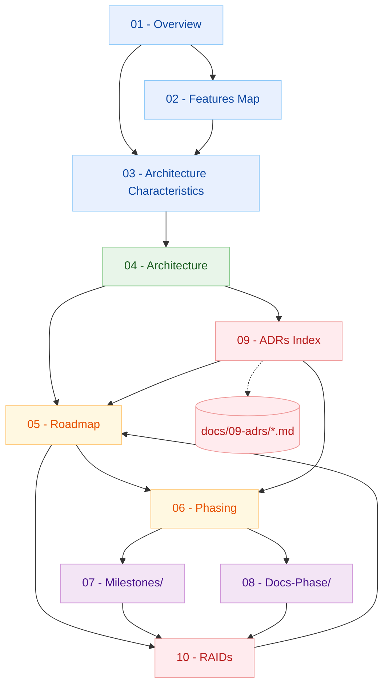
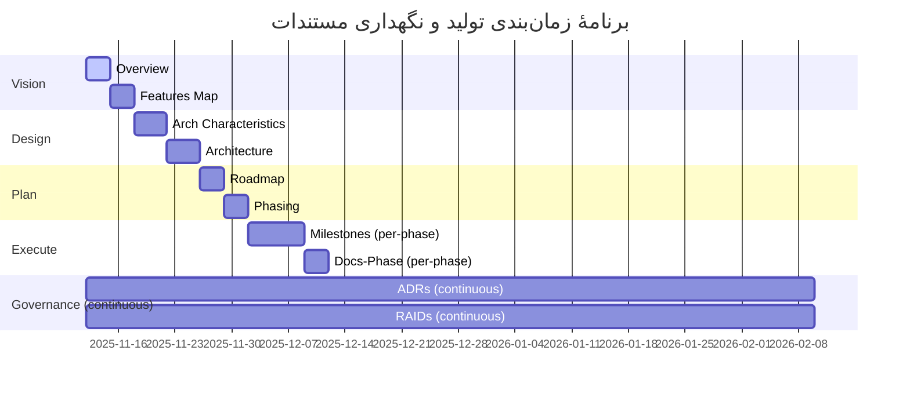

# Project Documentation Framework

این مخزن مستندات، شالودهٔ مدیریت و طراحی پروژه‌های فنی است. هدف آن جلوگیری از توسعهٔ بی‌برنامه، حفظ یکپارچگی بین نقش‌ها (Backend/DevOps/DB/Data/Mobile)، و ردیابی شفاف تصمیم‌ها و ریسک‌ها در طول عمر پروژه است. خروجی این ساختار باید مستقیماً به معماری پایدار، توسعهٔ تدریجی، و کنترل کیفیت منجر شود.

## اهداف
- تعریف دقیق «چه» و «چرا» پیش از «چگونه».
- هم‌راستاسازی تصمیم‌های معماری با ویژگی‌های محصول و الزامات کیفی.
- ردیابی مداوم تصمیم‌ها (ADR) و ریسک‌ها/فرضیات/وابستگی‌ها (RAID).
- تضمین سازگاری Backend و موبایل؛ استانداردسازی API و تست قرارداد.
- پایبندی به UTF-8 برای تمام داده‌های فارسی در DB و UI.

---

## ساختار اسناد (۱۰ قلم)
> روی هر مورد کلیک کنید:

1. [01-overview.md](./docs/01-overview.md) — تعریف محصول، مسئله، راه‌حل، ارزش، پرسونا، مقایسه
2. [02-features-map.md](./docs/02-features-map.md) — ویژگی‌های عمومی/متمایز و نگاشت به سرویس/ماژول
3. [03-architecture-characteristics.md](./docs/03-architecture-characteristics.md) — ویژگی‌های معماری: Operational/Structural/Cross-Cutting
4. [04-architecture.md](./docs/04-architecture.md) — سبک معماری، C4 (Context/Container)، نگاشت سرویس‌ها
5. [05-roadmap.md](./docs/05-roadmap.md) — نقشهٔ راه: اهداف کوتاه/میان/بلندمدت، نگاشت Feature→Goal
6. [06-phasing.md](./docs/06-phasing.md) — فازبندی زنجیره‌ای منطبق با Clean Architecture و سبک منتخب
7. [07-milestones/](./docs/7-milestones.md) — شناسنامهٔ اجرایی هر فاز (قبل از شروع هر فاز تکمیل می‌شود)
8. [08-docs-phase/](./docs/8-docs-phase.md) — گزارش نهایی هر فاز پس از اجرا و تست
9. [09-adrs.md](./docs/09-adrs.md) — نمایهٔ تصمیم‌های معماری + ارجاع به فایل‌های ADR تاریخ‌دار در `docs/09-adrs/`
10. [10-raids.md](./docs/10-raids.md) — ثبت ریسک‌ها، فرضیات، مشکلات و وابستگی‌ها (RAID Log)

> توجه دربارهٔ ADR: علاوه بر فایل نمایهٔ `09-adrs.md`، هر تصمیم معماری مهم به‌صورت لاگ تاریخ‌دار در مسیر `docs/09-adrs/` نگهداری می‌شود، مانند:
>
> `docs/09-adrs/adrs2025-11-12_adrs.md`

---

## نقشهٔ ارتباط اسناد (Documentation Dependency Map)

---

## گانت اجرای مستندات (Gantt)

> تاریخ‌ها نمونه هستند؛ با توجه به پروژه به‌روزرسانی شوند.

---

## قواعد کلیدی

* تنها دو پوشهٔ ثابت: `docs/07-milestones/` و `docs/08-docs-phase/`.
* برای ADR‌ها:

  * فایل نمایه: `docs/09-adrs.md`
  * لاگ‌های تاریخ‌دار: `docs/09-adrs/adrsYYYY-MM-DD_adrs.md`
* استاندارد UTF-8 برای تمامی متون و داده‌های فارسی در DB و UI.
* قراردادهای API، نسخه‌بندی، الگوی خطا، و تست قرارداد باید در اولین فاز عملیاتی تثبیت شوند.
* هر تغییر معماری باید ADR داشته باشد؛ هر تغییر ریسک/فرضیات باید در RAID ثبت شود.

## مالکیت و بازبینی

* مالک فنی: Tech Lead
* بازبین‌ها: معمار سیستم، Backend Lead، DevOps، Data
* چرخهٔ بازبینی: هر ۴ هفته یا با هر ADR مهم

