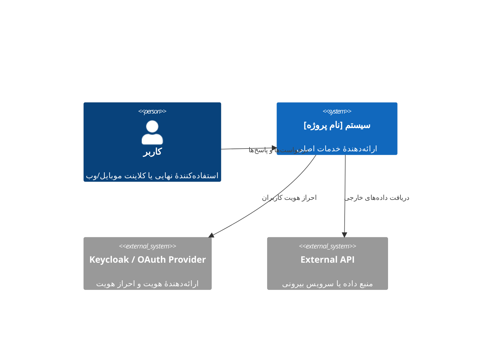
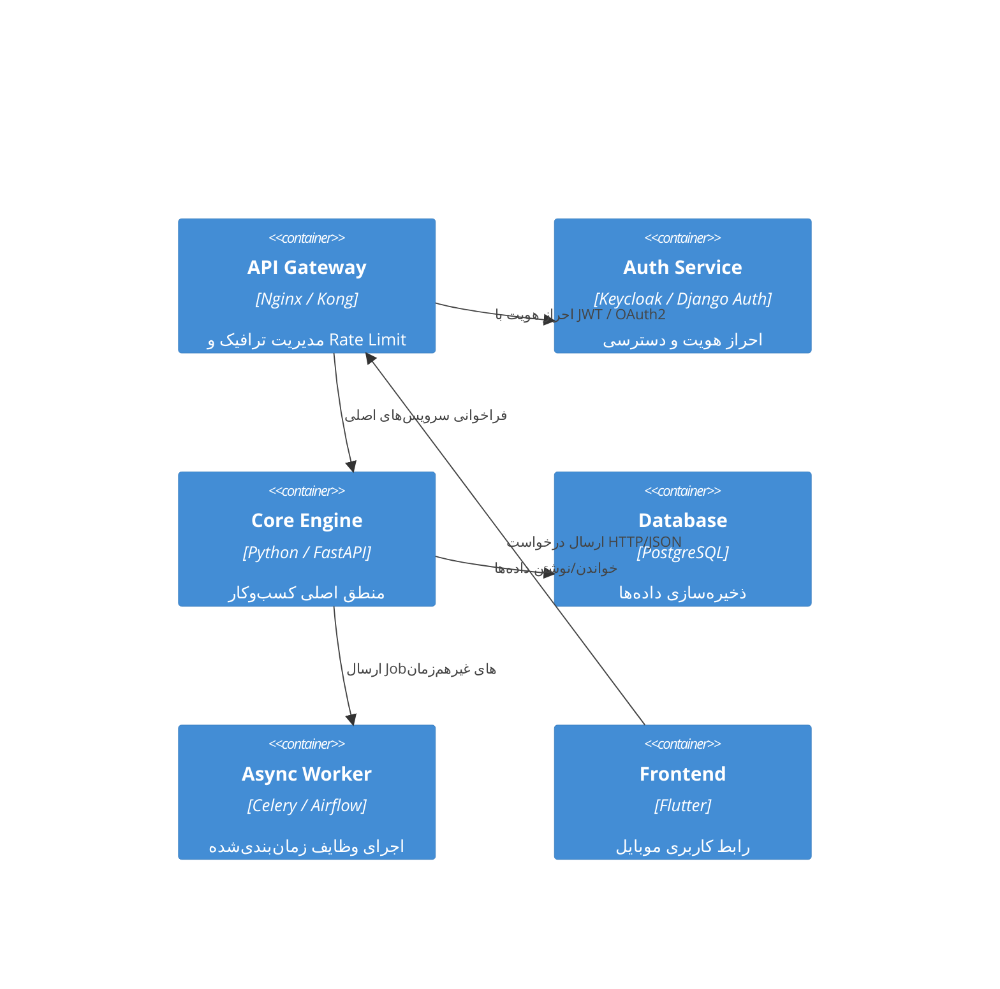

## ⚙️ پرامپت استاندارد برای فایل **04-architecture.md**

```text
نقش شما: تیم معماری سیستم (Software Architect + DevOps Engineer + Backend Developer + Data Engineer)

هدف: تولید مستند جامع برای فایل **docs/04-architecture.md**، شامل طراحی معماری سطح بالا، دیاگرام C4، و نگاشت سرویس‌ها.  
این سند باید بر پایهٔ نتایج سه سند قبلی ساخته شود:
- docs/01-overview.md
- docs/02-features-map.md
- docs/03-architecture-characteristics.md

==============================
🔹 اطلاعات ورودی (قابل ویرایش توسط کاربر)
نام پروژه: [نام پروژه]
سبک معماری مورد نظر (Layered / Microservices / Modular Monolith / Event-Driven / Serverless): [انتخاب کن]
تکنولوژی‌های کلیدی: [مثلاً Django + FastAPI + PostgreSQL + Redis + Airflow + Flutter]
الزامات عملکردی: [مثلاً پاسخ‌دهی زیر 200ms، در دسترس بودن 99.9%]
الزامات غیرفنی کلیدی: [امنیت، مقیاس‌پذیری، نگهداری‌پذیری]
==============================

🔹 خروجی مورد انتظار (Markdown نهایی برای فایل docs/04-architecture.md):

# 04 - Architecture Design

## 1. مقدمه
در این بخش، معماری سیستم بر اساس نیازهای تجاری، ویژگی‌های محصول، و الزامات کیفی استخراج‌شده از اسناد قبلی طراحی می‌شود.  
هدف، ایجاد ساختاری است که **پایدار، مقیاس‌پذیر، و قابل نگهداری** باشد و توسعهٔ تدریجی را ممکن سازد.

---

## 2. سبک معماری (Architecture Style)
توضیح سبک انتخاب‌شده و دلیل انتخاب آن:

| ویژگی | توضیح |
|--------|--------|
| سبک معماری | [Layered / Microservices / Modular Monolith / Event-Driven] |
| منطق انتخاب | چرا این سبک برای این پروژه مناسب است (با توجه به مقیاس، نوع داده، و استقلال سرویس‌ها). |
| جایگزین‌های بررسی‌شده | سایر گزینه‌هایی که در نظر گرفته شدند و چرا رد شدند. |
| الزامات پشتیبانی | ابزارها، زیرساخت، و نیازمندی‌های اجرایی مرتبط با این سبک. |

---

## 3. دیاگرام سطح بالا (C4 Model)

### 3.1 سطح Context (System Context Diagram)
نمای کلی از سیستم و بازیگران خارجی (External Actors).



### 3.2 سطح Container (Container Diagram)

نمای اجزای اصلی و نحوهٔ ارتباط آن‌ها در سطح سرویس/ماژول.



> این دیاگرام‌ها فقط به‌صورت مفهومی هستند و باید در نسخه نهایی با نام سرویس‌های واقعی پروژه جایگزین شوند.

---

## 4. نگاشت ویژگی‌ها به سرویس‌ها (Feature–Service Mapping)

در این بخش، هر ویژگی کلیدی از سند FeaturesMap به سرویس یا ماژول متناظر در معماری نگاشت می‌شود.

| ویژگی محصول | سرویس / ماژول مرتبط | توضیح پیاده‌سازی    | اثر معماری (از 03-characteristics) |
| --------------------- | ---------------------------------- | ---------------------------------- | --------------------------------------------- |
| Authentication        | Auth Service                       | Keycloak + JWT                     | Security, Availability                        |
| Notifications         | Notification Service               | Event-driven Queue (Redis, Celery) | Reliability, Configurability                  |
| Data Analytics        | Analytics Engine                   | FastAPI + Pandas + AI Model        | Scalability, Performance                      |
| Dashboard             | Frontend + API Gateway             | Flutter + REST API                 | Usability, Observability                      |

---

## 5. جریان داده و تعامل اجزا (System Data Flow)

شرح خلاصه از مسیر داده در سیستم از ورود تا خروج:

1. کاربر از طریق اپلیکیشن موبایل (Flutter) وارد می‌شود.
2. درخواست از API Gateway عبور کرده و به Auth Service می‌رسد.
3. پس از تأیید JWT، درخواست به Core Engine هدایت می‌شود.
4. Core Engine داده را از PostgreSQL می‌خواند و در صورت نیاز Task را به Worker ارسال می‌کند.
5. نتیجه از طریق API به کاربر بازمی‌گردد.

> این فلو به صورت نمودار Sequence یا Activity در مراحل بعدی تکمیل می‌شود.

---

## 6. تصمیم‌های کلیدی معماری (Architecture Decisions)

لیست تصمیم‌های کلیدی با توضیح مختصر و پیامدها (خلاصه ADRs):

| شناسه | تصمیم                                              | دلیل                                                  | پیامدها                                                           |
| ---------- | ------------------------------------------------------- | --------------------------------------------------------- | ------------------------------------------------------------------------ |
| ADR-01     | استفاده از معماری میکروسرویسی | استقلال سرویس‌ها و مقیاس‌پذیری | نیاز به ابزارهای DevOps پیشرفته (CI/CD, Monitoring) |
| ADR-02     | استفاده از PostgreSQL به‌جای MongoDB     | یکپارچگی تراکنش‌ها                       | ساختار داده سخت‌تر اما پایدارتر               |
| ADR-03     | JWT-Based Auth با Keycloak                            | سازگاری با اکوسیستم مدرن             | پیچیدگی تنظیمات اولیه افزایش می‌یابد     |

---

## 7. وابستگی‌ها و زیرساخت (Infrastructure & Deployment)

توضیح اجزای زیرساختی که برای پشتیبانی از معماری نیاز است.

| مؤلفه              | ابزار پیشنهادی | نقش در معماری                   |
| ----------------------- | --------------------------- | ------------------------------------------ |
| Reverse Proxy / Gateway | Nginx / Kong                | مدیریت ورودی و امنیت      |
| Service Orchestrator    | Docker Compose / Kubernetes | اجرای سرویس‌ها                |
| Message Broker          | Redis / RabbitMQ            | ارسال وظایف غیرهم‌زمان |
| Monitoring              | Prometheus / Grafana        | نظارت بر سلامت سیستم      |
| CI/CD                   | GitHub Actions / Jenkins    | استقرار خودکار                |

---

## 8. ملاحظات غیرکارکردی (Non-Functional Concerns)

* **Performance:** پاسخ API زیر 200ms در 95٪ درخواست‌ها.
* **Availability:** حداقل 99.9% در ماه.
* **Scalability:** مقیاس‌پذیری افقی برای سرویس‌های Stateless.
* **Security:** رمزنگاری کامل (TLS + AES256).
* **Maintainability:** معماری ماژولار با جداسازی Contextها.
* **Observability:** لاگ، متریک و Trace در تمام سرویس‌ها.

---

## 9. جمع‌بندی

این معماری به‌گونه‌ای طراحی شده که میان نیازهای عملیاتی، نگهداری‌پذیری و توسعه‌پذیری توازن برقرار کند.

در فاز بعدی ( **05-roadmap.md** ) این ساختار به مسیر زمان‌بندی‌شده و مایل‌استون‌های اجرایی ترجمه می‌شود.

==============================

🔹 دستور خروجی:

* سند را فقط به زبان فارسی تولید کن.
* تمام تیترها و قالب Markdown بالا را حفظ کن.
* دیاگرام‌ها را با Markdown Mermaid بنویس (C4Context و C4Container).
* سرویس‌ها را بر اساس FeaturesMap و Architecture Characteristics نگاشت کن.
* توضیحات را دقیق، فنی، و منطبق با استانداردهای معماری بنویس.
* خروجی باید برای درج مستقیم در فایل `docs/04-architecture.md` آماده باشد.

