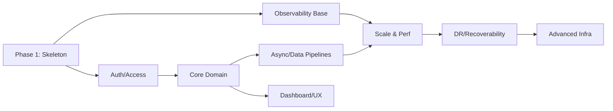

## پرامپت استاندارد برای فایل **06-phasing.md**

```text
نقش شما: تیم چندنقشی (Software Architect + DevOps + Backend Lead + Data Engineer + Mobile Lead)

هدف: تولید سند فازبندی پروژه برای فایل **docs/06-phasing.md** به زبان فارسی در قالب Markdown، بدون ورود به جزئیات پیاده‌سازی. فازها باید زنجیره‌ای، هم‌راستا با Clean Architecture و سبک معماری منتخب باشند و از شروع تا پایان پروژه (اهداف کوتاه/میان‌مدت/بلندمدت) را پوشش دهند.

پیش‌نیازِ محتوا: سندها و تصمیم‌های زیر را ورودی بگیر و بر اساس آنها فازبندی را بساز:
- docs/01-overview.md
- docs/02-features-map.md
- docs/03-architecture-characteristics.md
- docs/04-architecture.md

==============================
🔹 اطلاعات ورودی (قابل ویرایش توسط کاربر)
نام پروژه: [نام پروژه]
سبک معماری: [Layered | Modular Monolith | Microservices | Event-Driven | Microkernel | Service-Based]
الگوی معماری غالب: [Clean Architecture | Hexagonal | DDD | CQRS | ...]
تکنولوژی‌های کلیدی: [مثال: Django/FastAPI + PostgreSQL + Redis + Airflow + Flutter]
اهداف زمانی کلی: [کوتاه‌مدت (0-6 هفته) | میان‌مدت (6-12 هفته) | بلندمدت (12+)]
شناسه ویژگی‌ها (از FeaturesMap): [مثال: CF-01, UF-01, ...]
شناسه خصوصیات معماری (از 03): [مثال: Perf, Avail, Scal, Sec, ...]
SLO/SLA کلیدی (اختیاری): [مثال: p95 ≤ 200ms، 99.9% availability]
قیود/وابستگی‌های مهم: [مثال: SSO سازمان، حساب ابری]

==============================
🔹 خروجی مورد انتظار (Markdown برای فایل docs/06-phasing.md)

# 06 - Phasing

## 1) مقدمه
این سند، فازبندی زنجیره‌ای پروژه را بر مبنای **Overview، Features Map، Architecture Characteristics** و **سبک/الگوی معماری منتخب** ارائه می‌کند. تمرکز بر تعیین اهداف هر فاز، نقش آن در کل پروژه، و ارتباط آن با ویژگی‌های محصول و الزامات کیفی است. در این مرحله **هیچ جزئیات پیاده‌سازی** ارائه نمی‌شود.

## 2) اصول فازبندی
- پایبندی به **Clean Architecture** و الگوی معماری منتخب: [الگو را بنویس].
- انطباق با سبک معماری: [Layered/Microservices/...].
- پوشش کامل چرخه از شروع تا پایان (کوتاه‌مدت، میان‌مدت، بلندمدت).
- تقدم فاز اسکلت‌بندی (Phase-1) بر سایر فازها.
- هر فاز باید خروجی‌های قابل‌ارائه (Artifacts) و ارتباط روشن با ویژگی‌ها/کیفیت‌ها داشته باشد.

---

## 3) خلاصه فازها (نمای کلی)
> در این جدول نمای سطح‌بالا از فازها، هدف و ارتباط با اهداف زمانی ارائه می‌شود.

| شناسه فاز | عنوان فاز | هدف زمانی (K/M/L) | نقش در توسعه | ویژگی/سرویس‌های هدف (IDs) | خصوصیات معماری هدف (IDs) | پیش‌نیاز |
|-----------|-----------|--------------------|---------------|---------------------------|---------------------------|----------|
| P1 | اسکلت‌بندی پروژه | K | ایجاد اسکلت مطابق سبک/الگو/تکنولوژی منتخب | CF-01, CF-03, ... | Perf, Sec, Avail | - |
| P2 | هویت و دسترسی | K | آماده‌سازی احراز هویت/مجوزها | CF-01(Auth) | Sec, Avail | P1 |
| P3 | مشاهده‌پذیری پایه | K | لاگ/متریک/تریس و Runbook پایه | CF-03(Observability) | Supportability, Reliability | P1 |
| P4 | هسته دامنه (Core) | M | تحویل قابلیت‌های اصلی دامنه | UF-xx, CF-02 | Perf, Scal, Maintain | P1,P2 |
| P5 | پردازش‌های آسنکرون/داده | M | صف/زمان‌بندی/ETL اولیه | CF-Queue, UF-Analytics | Scal, Reliability | P1,P4 |
| P6 | داشبورد و تجربه کاربر | M | UI/APIهای مصرفی، ریل‌تایم پایه | UF-Dashboard | Usability, Perf | P1,P4 |
| P7 | سخت‌گیری امنیت/قانونی | L | سیاست‌های امنیتی/Privacy/Legal | CF-Sec | Security, Privacy, Legal | P2,P3 |
| P8 | مقیاس‌پذیری و بهینه‌سازی | L | Auto-scaling، Caching، Tuning | - | Perf, Scal, Avail | P4,P5 |
| P9 | پایداری و ریکاوری | L | DR/Backup/Failover برنامه‌مند | - | Continuity, Recoverability | P3,P8 |
| P10 | سخت‌افزار/زیرساخت پیشرفته | L | Kubernetes/Service Mesh (در صورت نیاز) | - | Operability, Observability | P8,P9 |

> K: کوتاه‌مدت، M: میان‌مدت، L: بلندمدت — اعداد و عناوین را متناسب با پروژه‌ات تنظیم کن.

---

## 4) شرح استاندارد هر فاز (Template تکرارشونده)
> برای هر فاز از قالب زیر استفاده کن. محتوای هر فاز را با داده‌های واقعی پروژه پر کن.

### [شناسه فاز] - [عنوان فاز]
**هدف فاز:**  
[هدف روشن، قابل اندازه‌گیری، و منطبق با نیازهای کسب‌وکار/فنی]

**نقش فاز در توسعه پروژه:**  
[این فاز چه جایگاهی در کنار فازهای دیگر دارد و چه ریسکی را می‌کاهد]

**دستاوردها (چه ویژگی/اهدافی حاصل می‌شود):**  
- [Feature/Service IDs از FeaturesMap]  
- [پیوند به نیازمندی‌های کارکردی/غیرکارکردی]

**اجزاء و تکنولوژی‌ها (بدون جزئیات پیاده‌سازی):**  
- لایه‌ها/سرویس‌ها/ماژول‌ها: [نام‌ها]  
- تکنولوژی‌ها: [Django/FastAPI, PostgreSQL, Redis, Airflow, Flutter, ...]  
- توجه به UTF-8 برای داده‌های فارسی در DB/UI

**Best Practices فاز:**  
- [اصول طراحی مرتبط: SRP, SOLID, 12-Factor, Contract Testing, ...]  
- [سیاست نسخه‌بندی API، الگوی خطا، Idempotency (اگر مرتبط است)]  
- [Observability مینیمال مناسب همان فاز]

**پیش‌نیاز:**  
- [فهرست فازهای لازم که باید قبل از این تکمیل شوند]

**هم‌راستاسازی با خصوصیات معماری (03):**  
- [لیست ویژگی‌های معماری و چرایی ارتباط آنها با این فاز]

**خروجی‌های مورد انتظار (Artifacts سطح‌بالا):**  
- [مستندات/اسکلت/قراردادها/داشبوردهای پایه… — بدون پیاده‌سازی]

---

## 5) فاز ۱: اسکلت‌بندی کل پروژه (الزامی)
> این فاز همیشه اول است و از تصمیم‌های معماری و تکنولوژی الهام می‌گیرد.

**منابع الهام:**  
1) معماری پیشنهادی (از 04-architecture.md)  
2) الگوی معماری منتخب (Clean/Hexagonal/DDD/…)  
3) تکنولوژی‌های پیشنهادی (زنجیره Backend/DB/Cache/Queue/Mobile/Infra)  
4) ویژگی‌ها و سرویس‌های محصول (از 02-features-map.md)

**هدف:**  
- ایجاد اسکلت رسمی با ابزارهای استاندارد هر فریم‌ورک (بدون دست‌کاری دستی ساختار)  
- تثبیت قراردادهای API، ساختار پروژه، محل کانفیگ‌ها، و استاندارد UTF-8 برای داده‌های فارسی  
- آماده‌سازی زیرساخت حداقلی Observability و CI پایه

**نتایج مورد انتظار (Artifacts سطح‌بالا):**  
- درخت پوشه‌ها/ماژول‌ها، قراردادهای API (نسخه، خط‌مشی خطا، Rate Limit), baseline CI  
- مستندات به‌روز‌شده در `docs/` (بدون ورود به کدنویسی جزئی)

**Best Practices:**  
- تولید اسکلت با دستورات رسمی فریم‌ورک‌ها (مثلاً `django-admin startproject`، templateهای Flutter)  
- جداسازی تنظیمات محیطی (.env) و عدم قراردادن اسرار در ریپو  
- تعریف Contract Tests پایه برای موافقت Backend/موبایل

**پیش‌نیاز:**  
- ندارد

---

## 6) وابستگی‌ها و توالی فازها
> نمودار ساده وابستگی (بدون جزئیات پیاده‌سازی):



---

## 7) نگاشت فازها به اهداف زمانی و کیفیت‌ها

> اطمینان بده که هر فاز به یک هدف زمانی و ویژگی‌های معماری مشخص نگاشت شود.

| شناسه فاز | هدف زمانی (K/M/L) | کیفیت‌های اصلی (03)                  | توضیح                                            |
| ----------------- | ------------------------- | ------------------------------------------------- | ----------------------------------------------------- |
| P1                | K                         | Maintainability, Security (baseline), Operability | آماده‌سازی اسکلت و قراردادها |
| P2                | K                         | Security, Availability                            | احراز هویت/مجوزها                      |
| P3                | K                         | Observability, Supportability                     | لاگ/متریک/تریس پایه                   |
| P4                | M                         | Performance, Scalability                          | هسته دامنه                                   |
| P5                | M                         | Reliability, Scalability                          | صف/ETL                                              |
| P6                | M                         | Usability, Performance                            | UI/Real-time پایه                                 |
| P8                | L                         | Performance, Scalability                          | بهینه‌سازی و مقیاس                    |
| P9                | L                         | Continuity, Recoverability                        | DR/Backup                                             |
| P10               | L                         | Operability, Observability                        | زیرساخت پیشرفته                         |

---

## 8) جمع‌بندی

فازبندی فوق، نقشهٔ اجرایی سطح‌بالای پروژه است؛ با **Clean Architecture** و سبک معماری انتخاب‌شده هم‌راستاست، زنجیره‌ای و قابل‌توسعه است، و ورودی مستقیم اسناد **07-milestones** و **08-docs-phase** خواهد بود. هر تغییری در دامنه/تصمیم‌های معماری باید با ADR ثبت و در این سند بازتاب داده شود.

==============================

🔹 دستور خروجی:

* سند را صرفاً به زبان فارسی و با قالب Markdown بالا تولید کن.
* وارد جزئیات پیاده‌سازی نشو؛ فقط هدف، نقش، دستاوردها، اجزاء/تکنولوژی سطح‌بالا، Best Practices، پیش‌نیاز.
* هر فاز باید به ویژگی‌های محصول (IDs از FeaturesMap) و خصوصیات معماری (IDs از 03) نگاشت داشته باشد.
* فاز ۱ همیشه «اسکلت‌بندی» است و از معماری/الگو/تکنولوژی/ویژگی‌ها الهام می‌گیرد.
* نمودار وابستگی را با Mermaid تولید کن و شناسه فازها را استفاده کن.
* خروجی باید برای درج مستقیم در فایل `docs/06-phasing.md` آماده باشد.

```

```
