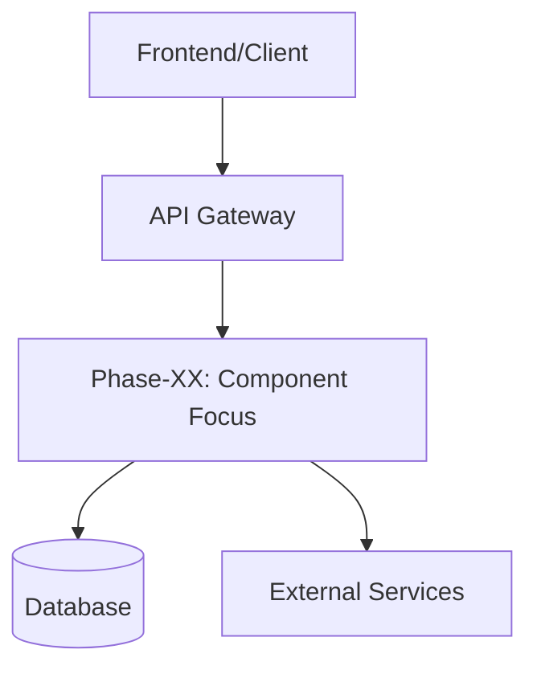
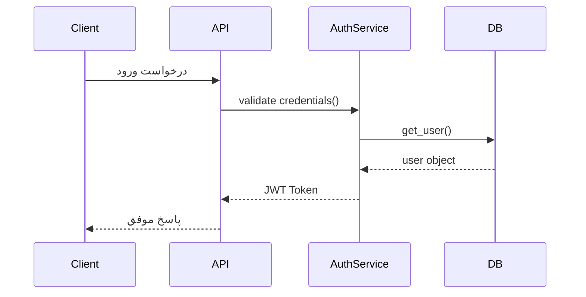

## ⚙️ پرامپت استاندارد برای فایل **08-docs-phase/phase-XX-doc.md**


نقش شما: تیم چندنقشی (Software Architect + Backend Developer + Business Analyst + Data Engineer + Technical Writer)

هدف: تولید مستند نهایی یک فاز کامل‌شده از پروژه در قالب Markdown (docs/08-docs-phase/phase-XX-doc.md)  
این سند باید ترکیبی از تحلیل فنی، توصیف منطقی، و انتقال دانش سیستم‌دیزاین باشد.  
در این مرحله، همهٔ تسک‌ها و نوت‌بوک‌های فاز اجرا شده‌اند و این داکیومنت صرفاً توصیف و تحلیل است، نه طراحی.

==============================

🔹 اطلاعات متادیتا (ابتدای مستند قرار می گیرد)
نام پروژه: [نام پروژه]
شناسه فاز: [مثلاً P1 یا Phase-01]
عنوان فاز: [مثلاً فاز اسکلت‌بندی، فاز احراز هویت، فاز مشاهده‌پذیری پایه]
تاریخ تکمیل فاز: [YYYY-MM-DD]
سبک معماری پروژه: [Layered / Microservices / Event-Driven / Modular Monolith / ...]
الگوی معماری: [Clean / Hexagonal / DDD / CQRS / ...]
تکنولوژی‌های استفاده‌شده: [Django, FastAPI, PostgreSQL, Redis, Airflow, Flutter, ...]
منبع کد: [مسیر ریپوی کد یا شاخه مربوطه]

==============================

🔹 خروجی مورد انتظار (Markdown نهایی برای docs/08-docs-phase/phase-XX-doc.md):

# Docs-Phase - [عنوان فاز]

---

## 0) نام فاز
**نام انتخابی:** `[نام کوتاه و معنادار برای فاز]`  
توضیح: نام باید نشان‌دهندهٔ مأموریت اصلی فاز باشد (مثلاً: *Core Domain Setup*، *Auth & Access Layer*، *Observability Base*).

---

## 1) هدف فاز

### 1.1 تعریف عمومی
بیان هدف این فاز با زبانی ساده برای خوانندهٔ غیر‌توسعه‌دهنده، با مثال‌های عمومی.  
توضیح بده که این فاز در کل سیستم چه مسئله‌ای را حل می‌کند (مثلاً “مدیریت ورود و خروج کاربران”، “نمایش داشبورد زنده”، “بهبود پایداری سیستم در خطا”).

### 1.2 تعریف تخصصی
شرح عمیق و فنی هدف فاز از دید توسعه‌دهنده:
- چه مسئله‌ای را در معماری حل کرده است؟  
- چه تصمیم‌هایی گرفته شده‌اند و چرا؟  
- چه trade-off هایی وجود داشتند (Performance vs Maintainability، Complexity vs Control و غیره).  
- ارتباط با اصول Clean Architecture، SOLID، DDD، Design Patterns.

### 1.3 تحلیل سیستمی (System Design Perspective)
تحلیل چرایی و چیستی از دید معماری:
- چرا این فاز ضروری است؟  
- اگر نبود، چه خلأی در کل سیستم ایجاد می‌شد؟  
- چطور با ساختار معماری (Layered, Microservices, Event-Driven, ...) هم‌راستا است؟

### 1.4 تحلیل کسب‌وکاری (Business Logic Perspective)
تحلیل فاز از دید بیزنس:
- این فاز چه ارزش یا مزیتی برای کاربران نهایی یا کسب‌وکار ایجاد می‌کند؟  
- خروجی این فاز در جریان داده یا فرآیند کلی بیزنس چه نقشی دارد؟  
- شاخص‌های موفقیت (KPIs) فاز چه بودند و آیا محقق شدند؟

### 1.5 شکستن هدف کلی به زیرهدف‌ها
- هدف ۱: [شرح]
- هدف ۲: [شرح]
- هدف ۳: [شرح]

---

## 1.2) جایگاه و اهمیت در پروژه
این فاز چه بخشی از کل پروژه را پوشش می‌دهد؟  
چه فازهایی به آن وابسته‌اند و چه فازهایی به آن متکی هستند؟  

### دیاگرام معماری مخصوص این فاز
> دیاگرام سطح فاز (به‌صورت Mermaid):



> جایگزین کن با دیاگرام واقعی جریان فاز (Context یا Container سطح فاز).

---

## 2) عناصر فاز (Component Inventory)

### 2.1 لیست کلاس‌ها، دیتاکلاس‌ها و فایل‌های مهم

نمایش ساختار درختی فایل‌های اصلی این فاز:

```bash
app/
├── services/
│   └── auth_service.py
├── models/
│   └── user_model.py
├── routers/
│   └── user_router.py
└── utils/
    └── validators.py
```

> توجه: فقط فایل‌های مرتبط با این فاز را بیاور، نه کل پروژه.

---

### 2.2 تشریح عملکرد اجزا (File/Class/Function)

برای هر بخش توضیح هدف، نقش و ارتباطش با اصول طراحی:

| نوع      | نام            | توضیح عملکرد        | نقش در فاز              | اصول مرتبط                           |
| -------- | -------------- | ------------------- | ----------------------- | ------------------------------------ |
| فایل     | user_router.py | تعریف مسیرهای HTTP  | کنترل جریان ورودی       | Clean Architecture - Interface Layer |
| کلاس     | AuthService    | منطق احراز هویت     | قلب عملکرد فاز          | SOLID - SRP / DDD - Service          |
| دیتاکلاس | UserModel      | ساختار داده کاربر   | انتقال داده بین لایه‌ها | DDD - Entity                         |
| تابع     | verify_token() | اعتبارسنجی توکن JWT | پشتیبان امنیت           | Design Pattern - Strategy            |

---

## 3) ارتباط و تعامل اجزا (Interaction)

### 3.1 تعامل داخلی (درون فاز)

توضیح بده که اجزای داخل این فاز چگونه با هم تعامل دارند (Service ↔ Model ↔ Router ↔ Utils).

> می‌توان از نمودار Sequence استفاده کرد.



---

### 3.2 تعامل بیرونی (بین فازها)

* این فاز از کدام فازها داده می‌گیرد؟
* خروجی آن به کدام فاز‌ها می‌رود؟
* آیا با فازهای دیگر تعامل هم‌زمان دارد یا فقط ورودی/خروجی؟

| فاز مبدا            | فاز مقصد        | نوع ارتباط | توضیح                          |
| ------------------- | --------------- | ---------- | ------------------------------ |
| Phase-01 (Skeleton) | Phase-02 (Auth) | Upstream   | Auth بر پایه اسکلت ساخته شد    |
| Phase-02 (Auth)     | Phase-04 (Core) | Downstream | استفاده از Token در منطق دامنه |

---

## 4) ارتباط با خصوصیات معماری (Architecture Characteristics)

برای هر ویژگی کیفی که این فاز پشتیبانی کرده، توضیح بده چطور محقق شده است:

| ویژگی           | اقدام‌های انجام‌شده              | نتیجه / بهبود            |
| --------------- | -------------------------------- | ------------------------ |
| Availability    | افزودن healthcheck endpoint      | تشخیص سریع خرابی سرویس   |
| Performance     | استفاده از cache در auth_service | کاهش latency تا 40%      |
| Maintainability | تفکیک لایه‌ها و تست‌های واحد     | ساده‌سازی توسعه آینده    |
| Security        | JWT + RBAC                       | کنترل دقیق سطح دسترسی‌ها |

---

## 5) تست و تأیید

* **نوع تست‌ها:** واحد، یکپارچه، E2E، Contract.
* **پوشش تست:** [%]
* **ابزار تست:** pytest / behave / postman collection
* **نتیجه:** وضعیت تست‌ها و خروجی‌ها (موفق/ناقص/در انتظار بازبینی).

---

## 6) درس‌آموخته‌ها و بازبینی (Retrospective)

در پایان هر فاز، نکات و یافته‌های کلیدی مستند شوند:

* چه چیزی خوب پیش رفت؟
* چه چیزی نیاز به اصلاح دارد؟
* پیشنهاد برای فازهای بعدی چیست؟
* آیا لازم است ADR یا تغییر معماری ثبت شود؟

---

## 7) خلاصه و وضعیت نهایی فاز

| شاخص           | مقدار                            | توضیح |
| -------------- | -------------------------------- | ----- |
| وضعیت تست‌ها   | ✅ Passed / ⚠️ Partial / ❌ Failed |       |
| وضعیت مستندات  | ✅ به‌روز / ⚠️ ناقص               |       |
| قابلیت نگهداری | بالا / متوسط / پایین             |       |
| Performance    | [p95 زمان پاسخ / هدف مقایسه‌ای]  |       |
| Observability  | فعال / ناقص                      |       |
| Lessons Logged | ✅ بله / ❌ خیر                    |       |

> پس از تأیید، این سند باید در کنار خروجی کد فاز (branch مربوطه) commit شود.

---

## 8) نتیجه نهایی

فاز **[شناسه فاز] - [عنوان فاز]** با موفقیت تکمیل شد و تمام تسک‌ها، نوت‌بوک‌ها، تست‌ها و خروجی‌های فنی مورد انتظار به‌دست آمدند.
این سند به‌عنوان مرجع رسمی عملکرد و تصمیم‌های فاز در بازبینی‌های بعدی استفاده می‌شود.

==============================
🔹 دستور خروجی:

* خروجی را فقط به زبان فارسی تولید کن.
* از قالب Markdown فوق پیروی کن.
* بخش‌ها و جدول‌ها را دقیق نگه دار.
* نمودارها را با Mermaid بنویس (Context یا Sequence).
* هر کلاس/فایل/تابع را با توضیح هدف و اصول طراحی همراه کن.
* تمرکز اصلی: انتقال دانش، تحلیل سیستم‌دیزاین، و مستندسازی ارتباطات فنی/بیزنسی.
* خروجی باید برای درج مستقیم در مسیر `docs/08-docs-phase/phase-XX-doc.md` آماده باشد.


---

این پرامپت برای هر فاز قابل استفاده است و ترکیب تحلیل معماری، منطق بیزنس و آموزش فنی را در خود دارد. 
