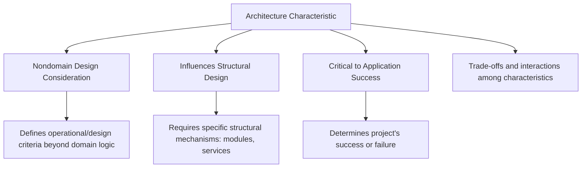

# **ویژگی‌های معماری (Architecture Characteristics Defined)**

اصطلاح *“architecture characteristics”* به‌صورت مستقیم اشاره دارد به **جنبه‌هایی از طراحی که برای موفقیت معماری حیاتی‌اند**.
این مفهوم برخلاف *“nonfunctional requirements”* (نیازمندی‌های غیرعملکردی)،
نشان‌دهنده‌ی دیدگاهی *پیش‌نگرانه و طراحی‌محور* است، نه دیدگاهی *پسینی و ارزیابانه*.

متن می‌گوید:

> اصطلاح *nonfunctional requirements* ضمنی دارد که این ویژگی‌ها فقط پس از ساخت سیستم مورد ارزیابی قرار می‌گیرند (after-the-fact assessment).
> اما ما، معماران نرم‌افزار، اصطلاح *architecture characteristics* را ترجیح می‌دهیم،
> چون این عبارت به عواملی اشاره می‌کند که از همان آغاز طراحی برای موفقیت کل سیستم حیاتی هستند —
> و در نتیجه، نه تنها اهمیت آن‌ها کم نیست، بلکه در اصل ستون‌های موفقیت معماری‌اند.

---

## **تعریف رسمی ویژگی معماری**

یک ویژگی معماری زمانی به‌صورت کامل و صحیح تعریف می‌شود که **هر سه معیار زیر را داشته باشد:**

1. **یک ملاحظه‌ی طراحی غیردامنه‌ای را مشخص کند.**
   (Specifies a nondomain design consideration)

2. **بر بخشی ساختاری از طراحی اثر بگذارد.**
   (Influences some structural aspect of the design)

3. **برای موفقیت سامانه حیاتی یا بسیار مهم باشد.**
   (Is critical or important to application success)

این سه بخشِ درهم‌تنیده، اجزای اصلی تعریف ویژگی معماری هستند
و در **شکل 4-2** به‌صورت سه ضلع مثلث نشان داده می‌شوند که در مرکز آن «تعادل» و در رأس آن مفهوم **Trade-off** قرار دارد.

---

## **جزء نخست: Specifies a Nondomain Design Consideration**

*(مشخص‌کردن یک ملاحظه‌ی طراحی غیردامنه‌ای)*

در طراحی هر سیستم نرم‌افزاری،
دو نوع الزام وجود دارد:

* **الزامات دامنه‌ای (Domain Requirements)**
  که می‌گویند سیستم *چه کاری باید انجام دهد* (یعنی What).
* **الزامات غیردامنه‌ای یا معماری (Architecture Characteristics)**
  که می‌گویند سیستم *چگونه و چرا* باید آن کار را انجام دهد (یعنی How و Why).

به بیان دیگر، نیازمندی‌ها رفتارهای کسب‌وکاری را تعیین می‌کنند،
در حالی که ویژگی‌های معماری معیارهای عملکردی، طراحی و عملیاتی را مشخص می‌سازند که برای موفقیت کل سیستم ضروری‌اند.

---

### **مثال توضیحی**

فرض کنیم در مستند نیازمندی‌ها نوشته شده باشد:

> «کاربر باید بتواند سفارش جدید ثبت کند.»

اما در همین پروژه، تیم معمار مشخص می‌کند که:

> «ثبت سفارش باید در کمتر از ۲۰۰ میلی‌ثانیه انجام شود،
> سامانه باید بتواند ۵۰۰۰ کاربر همزمان را مدیریت کند،
> و نباید هیچ نشت اطلاعاتی از داده‌های شخصی کاربران رخ دهد.»

این موارد **در مستند نیازمندی‌ها نوشته نشده‌اند،**
اما در واقع **ملاک موفقیت یا شکست کل سامانه** هستند.
بنابراین، این موارد همان *Architecture Characteristics* هستند.

---

### **تفاوت در نگاه طراحی**

در نیازمندی‌ها فقط می‌گوییم *چه چیزی باید ساخته شود*.
در ویژگی‌های معماری مشخص می‌کنیم *چرا و چگونه باید به آن رسید.*

**مثال دیگر:**
هیچ سند نیازمندی‌ای نمی‌گوید:

> «از بدهی فنی (Technical Debt) جلوگیری شود.»

اما معماران می‌دانند که **کنترل بدهی فنی** بخشی حیاتی از موفقیت درازمدت است.
بنابراین، این موضوع به‌عنوان یک *ویژگی معماری ضمنی* شناخته می‌شود.

---

### **نکتهٔ تحلیلی**

در کتاب اشاره می‌شود که این تفاوت میان ویژگی‌های صریح و ضمنی (explicit/implicit characteristics)
در بخش **“Extracting Architecture Characteristics from Domain Concerns”** (صفحه ۶۵) به‌صورت مفصل بررسی خواهد شد.
در آن بخش، نویسنده توضیح می‌دهد که چگونه باید این ویژگی‌های پنهان را از دل تحلیل دامنه استخراج کرد.

---

## **جزء دوم: Influences Some Structural Aspect of the Design**

*(تأثیرگذاری بر جنبه‌ای ساختاری از طراحی)*

دلیل اصلی که معماران سعی می‌کنند ویژگی‌های معماری را به‌صورت دقیق تعریف کنند،
این است که این ویژگی‌ها **مستقیماً بر ساختار طراحی اثر می‌گذارند.**

در واقع، یک ویژگی فقط وقتی *ویژگی معماری واقعی* است که برای تحقق آن **نیاز به تصمیم یا ساختار خاص معماری باشد.**

---

### **مثال کلیدی: ویژگی امنیت (Security)**

نویسنده با مثالی در حوزه‌ی پرداخت (Payment) این موضوع را شفاف می‌کند:

#### **حالت اول – پرداخت از طریق سرویس شخص ثالث (Third-Party Payment Processor)**

اگر سیستم تنها با یک سرویس خارجی مانند Stripe، Zarinpal یا PayPal یکپارچه شود،
در این حالت طراح فقط باید **ملاحظات امنیتی استاندارد** را رعایت کند:
رمزنگاری ارتباط (TLS/HTTPS)، هش‌کردن اطلاعات حساس، و رعایت سیاست‌های امنیتی پایه.

در این سناریو، امنیت **بر ساختار سیستم اثر خاصی ندارد**،
چون تمام حساسیت امنیتی به عهده‌ی سرویس پرداخت بیرونی است.

---

#### **حالت دوم – پرداخت درون‌برنامه‌ای (In-Application Payment Processing)**

اما اگر قرار است خود سیستم ما پرداخت را مدیریت کند —
مثلاً پردازش کارت بانکی، رمزنگاری داده‌ی مشتری، یا تطبیق با PCI-DSS —
در این صورت معمار باید **یک ماژول یا سرویس جداگانه برای پردازش امن** طراحی کند،
تا داده‌های مالی از سایر بخش‌ها جدا باشند.

در اینجا امنیت به یک ویژگی معماری واقعی تبدیل می‌شود،
زیرا باعث شده **ساختار سیستم تغییر کند.**

---

### **تحلیل معماری:**

در نتیجه، ویژگی‌ای مانند «Security» در حالت اول فقط یک «ملاحظه‌ی توسعه‌ای» است،
اما در حالت دوم یک «ویژگی معماری» محسوب می‌شود، چون نیازمند تصمیم ساختاری (مانند طراحی ماژول جدا) است.

---

### **توجه مهم**

نویسنده تأکید می‌کند که حتی این دو معیار (غیردامنه‌ای بودن و تأثیر ساختاری داشتن)
همیشه برای تصمیم‌گیری کافی نیستند،
زیرا عوامل بیشتری نیز در نظر گرفته می‌شوند، مثل:

* سابقه‌ی رخدادهای امنیتی قبلی در سازمان
* ماهیت ادغام (Integration) با سرویس‌های ثالث
* الزامات قانونی یا صنعتی (Compliance مثل GDPR یا PCI)

اما همین مثال نشان می‌دهد که چرا معمار باید تصمیم بگیرد کدام قابلیت‌ها **ساختار ویژه** نیاز دارند و کدام‌ها نه.

---

## **جزء سوم: Critical or Important to Application Success**

*(حیاتی یا بسیار مهم برای موفقیت سامانه)*

نویسنده هشدار می‌دهد که هر سیستم می‌تواند صدها ویژگی بالقوه داشته باشد،
اما هر ویژگی معماری **هزینه و پیچیدگی** طراحی را افزایش می‌دهد.

بنابراین، یکی از مهم‌ترین وظایف معمار این است که:

> به‌جای افزودن ویژگی‌های زیاد، کمترین و حیاتی‌ترین ویژگی‌ها را انتخاب کند.

زیرا پشتیبانی از هر ویژگی، معمولاً نیازمند تصمیمات ساختاری، ابزار، و زمان توسعه‌ی اضافی است.

---

## **ویژگی‌های صریح (Explicit) و ضمنی (Implicit)**

نویسنده ویژگی‌های معماری را به دو دسته تقسیم می‌کند:

| نوع ویژگی           | توضیح                                                             | مثال                                                                     |
| ------------------- | ----------------------------------------------------------------- | ------------------------------------------------------------------------ |
| **Explicit (صریح)** | به‌صورت مستقیم در مستندات یا نیازمندی‌ها آمده‌اند.                | «سیستم باید در کمتر از ۲۰۰ms پاسخ دهد.»، «باید ۹۹.۹٪ uptime داشته باشد.» |
| **Implicit (ضمنی)** | معمولاً در مستندات ذکر نمی‌شوند، اما برای موفقیت پروژه ضروری‌اند. | امنیت، قابلیت اعتماد (Reliability)، دسترس‌پذیری (Availability)           |

در بیشتر پروژه‌ها، ویژگی‌های ضمنی تعدادشان بیشتر و حیاتی‌ترند،
چون بدون آن‌ها سیستم از دید کاربر یا ذی‌نفع شکست‌خورده تلقی می‌شود.

---

### **مثال کاربردی از ویژگی ضمنی**

فرض کنید در یک شرکت **معاملات فرکانس بالا (High-Frequency Trading)**
در مستندات سیستم نوشته نشده باشد:

> «Latency باید زیر ۱ میلی‌ثانیه باشد.»

اما معماران حوزه می‌دانند که در چنین دامنه‌ای،
**تاخیر (Latency)** مستقیماً بر سود و زیان مالی تأثیر دارد،
پس این ویژگی به‌صورت ضمنی اما قطعی بخشی از معماری است.

---

## **شکل 4-2: مثلث ویژگی‌های معماری**

در این شکل، نویسنده از **مثلث** استفاده می‌کند تا نشان دهد که سه مؤلفه‌ی تعریف (غیردامنه‌ای بودن، تأثیر ساختاری، و اهمیت حیاتی)
به‌صورت متقابل یکدیگر را پشتیبانی می‌کنند.

در رأس مثلث، یک **Fulcrum (نقطه‌ی تعادل)** وجود دارد که نشان می‌دهد
ویژگی‌های معماری معمولاً با یکدیگر در **تعامل یا تعارض (Interaction / Trade-off)** هستند.

---

### **مفهوم Trade-off (موازنه)**

ویژگی‌های معماری در خلأ وجود ندارند؛
تقریباً همیشه در تضاد یا موازنه با یکدیگرند.
مثلاً:

| ویژگی‌ها                                                       | تضاد و تأثیر متقابل                                  |
| -------------------------------------------------------------- | ---------------------------------------------------- |
| امنیت (Security) ↔ کارایی (Performance)                        | رمزنگاری قوی سرعت را کاهش می‌دهد.                    |
| مقیاس‌پذیری (Scalability) ↔ پایداری داده (Consistency)         | طبق قضیه‌ی CAP، هر دو باهم کامل قابل دستیابی نیستند. |
| قابلیت نگهداری (Maintainability) ↔ زمان توسعه (Time-to-Market) | طراحی تمیز هزینه‌ی زمان تحویل را بالا می‌برد.        |

این همان دلیل اصلی است که چرا معماران از اصطلاح **“trade-off”** به‌صورت گسترده استفاده می‌کنند.
هر ویژگی جدید باید با بقیه در تعادل باشد.

---

## **توضیح تکمیلی (از دید معماری عملیاتی – DevOps و Backend)**

در عمل، معماران باید برای هر ویژگی معماری تصمیم‌های فنی مشخص بگیرند.
نمونه‌ها در پروژه‌های مبتنی بر Django، Airflow و PostgreSQL:

| ویژگی معماری                        | تأثیر ساختاری در طراحی              | تصمیم یا ابزار مرتبط               |
| ----------------------------------- | ----------------------------------- | ---------------------------------- |
| **Performance (کارایی)**            | نیازمند لایه‌ی کش و تنظیم Query     | Redis، Index، Async API            |
| **Security (امنیت)**                | نیازمند لایه‌ی Auth و رمزنگاری داده | Keycloak، JWT، HTTPS               |
| **Scalability (مقیاس‌پذیری)**       | نیازمند طراحی Stateless و Queue     | Docker + Celery + Kafka            |
| **Reliability (قابلیت اعتماد)**     | نیازمند Retry, Circuit Breaker      | Airflow SLA، Celery Retry          |
| **Maintainability (نگهداری‌پذیری)** | ماژولار بودن و جدا‌سازی منطقی       | DDD Layering، Dependency Injection |
| **Observability (قابلیت مشاهده)**   | نیازمند متریک، لاگ، و تریس          | Prometheus، Grafana، ELK Stack     |

---

## **جمع‌بندی دقیق**

ویژگی معماری یک مؤلفه‌ی طراحی است که:

1. **غیردامنه‌ای است** → در مورد *چگونگی پیاده‌سازی* است، نه *چیستی سیستم*.
2. **بر ساختار اثر دارد** → باعث تصمیمات فنی خاص (مثلاً ماژول جدا، سرویس مجزا) می‌شود.
3. **برای موفقیت حیاتی است** → بدون آن سیستم از دید کاربران شکست می‌خورد.

و معمار باید همواره میان آن‌ها **تعادل (Trade-off)** برقرار کند.

---

### **نمودار تکمیلی مفهومی (Mermaid)**

