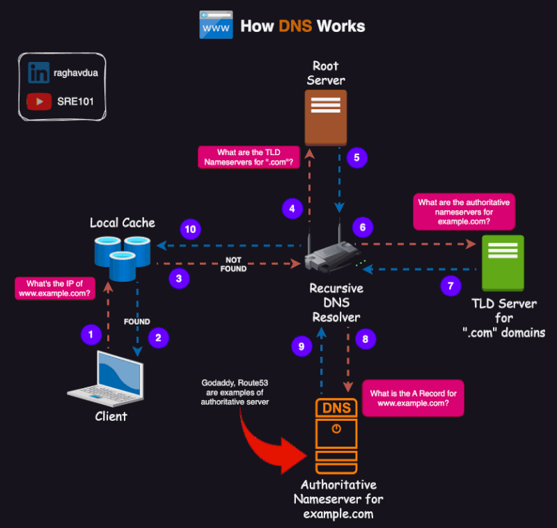
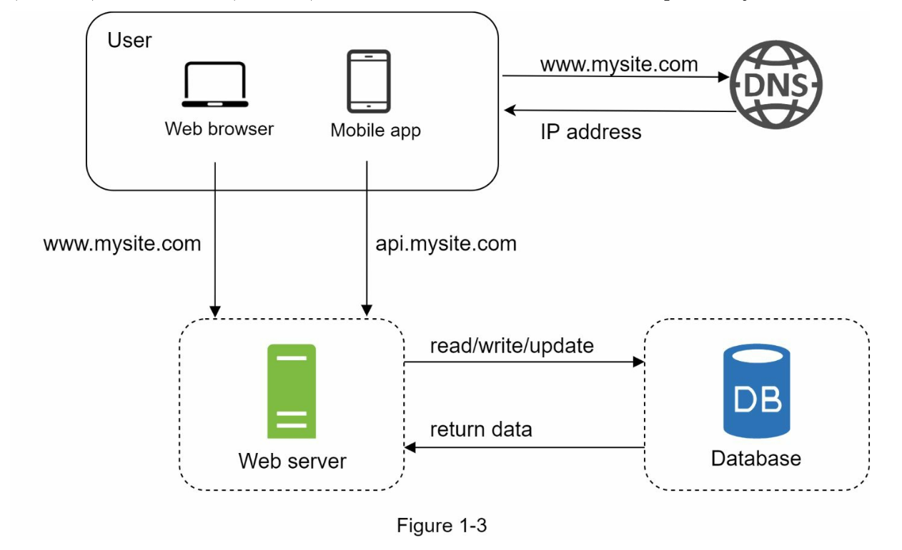
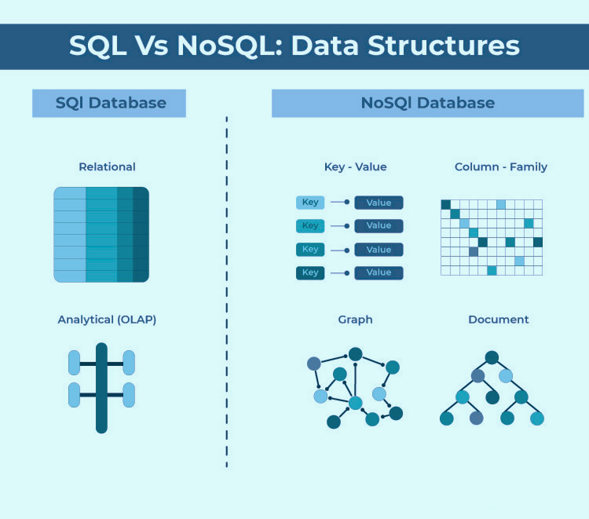
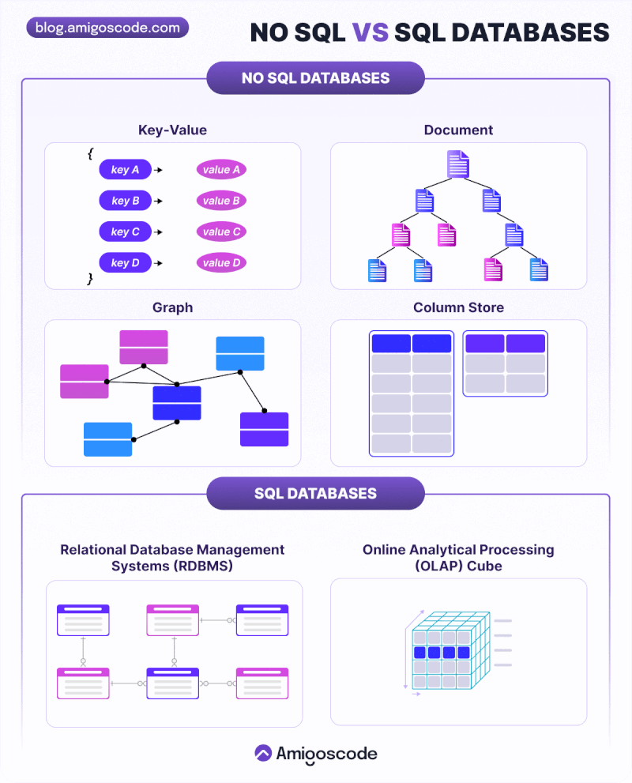
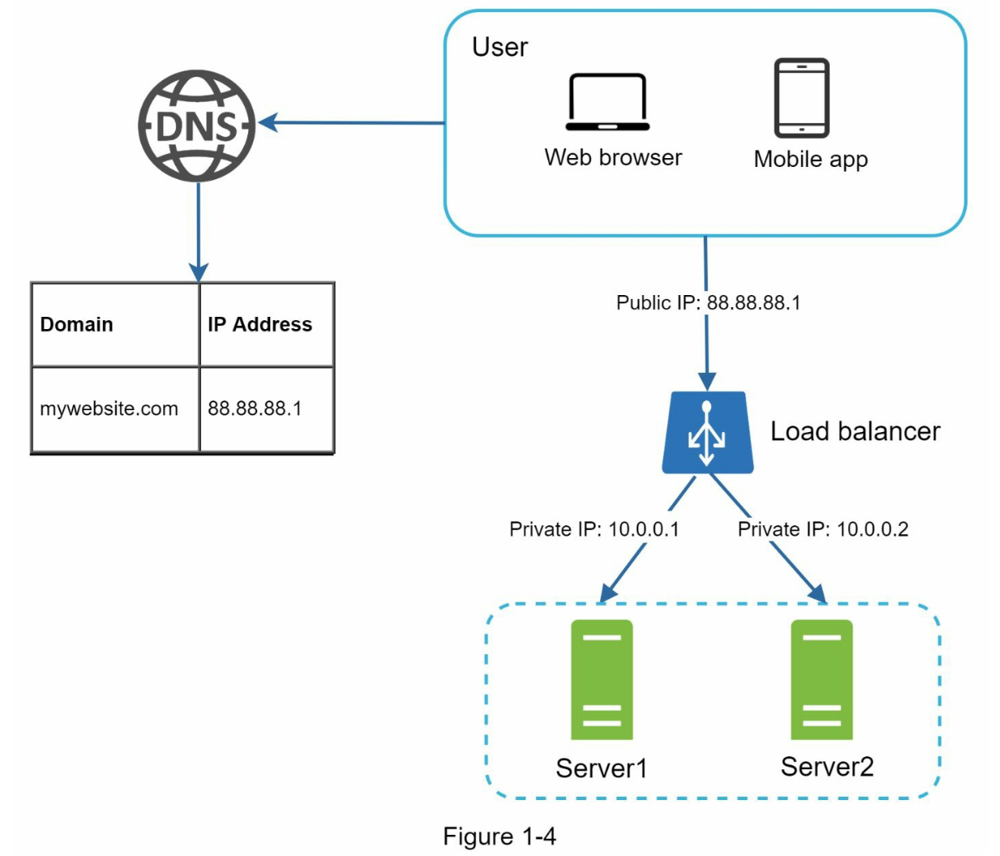
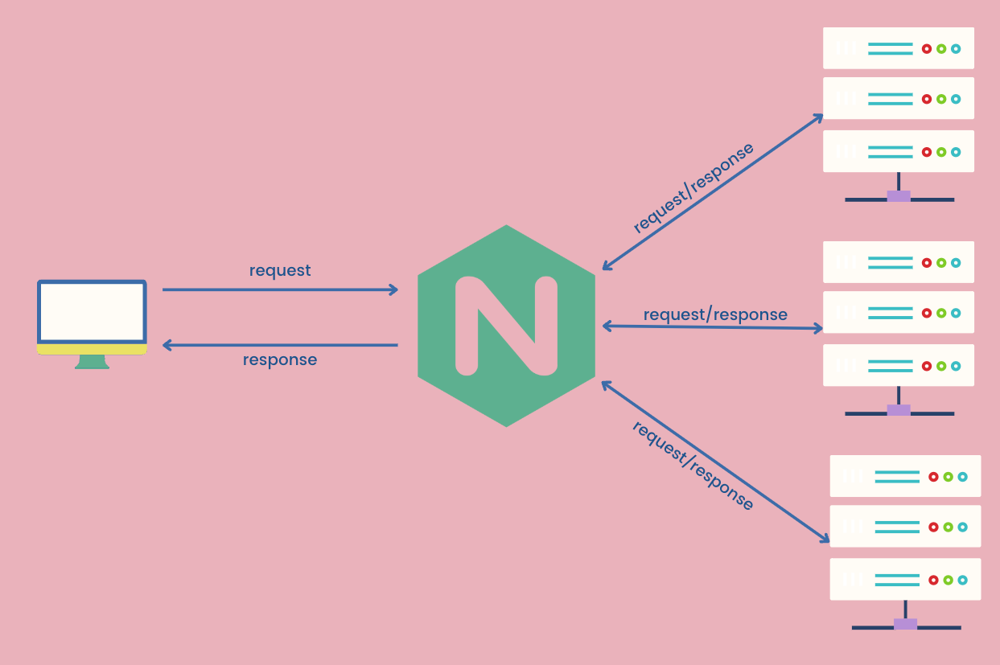
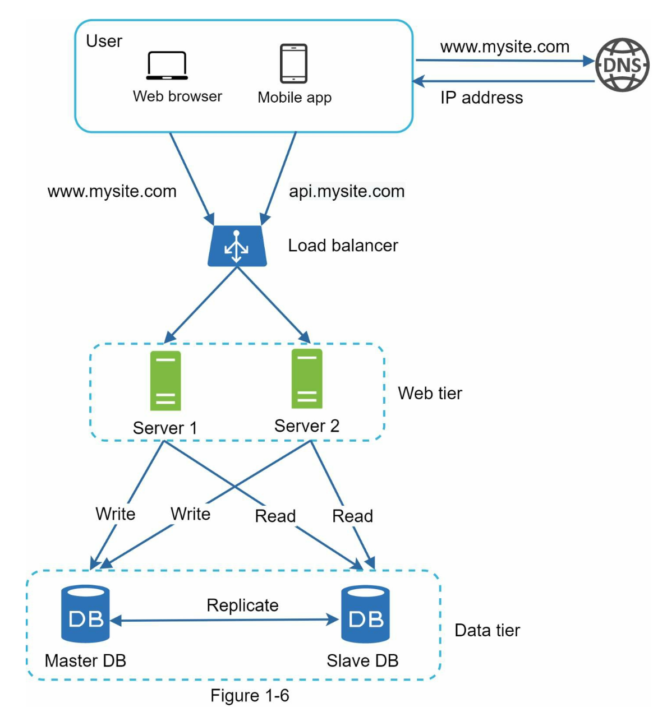
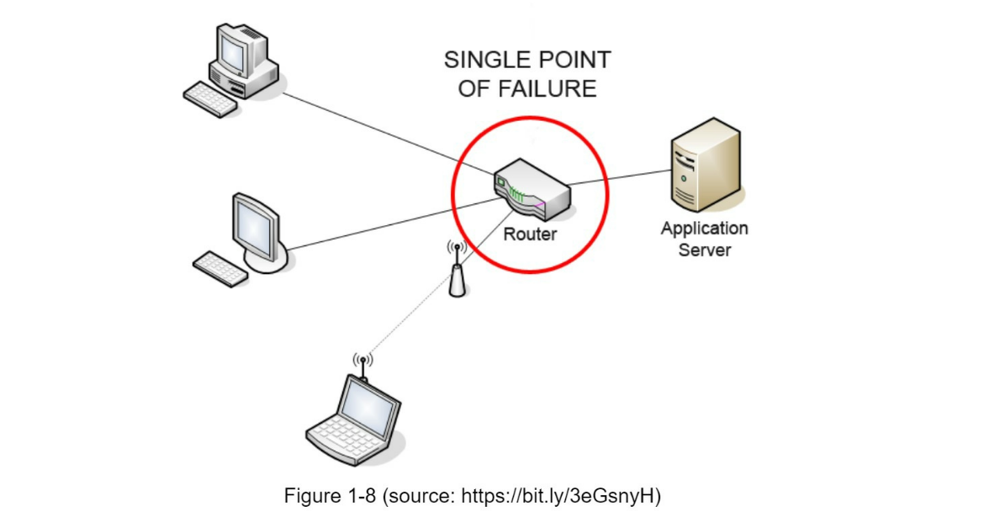
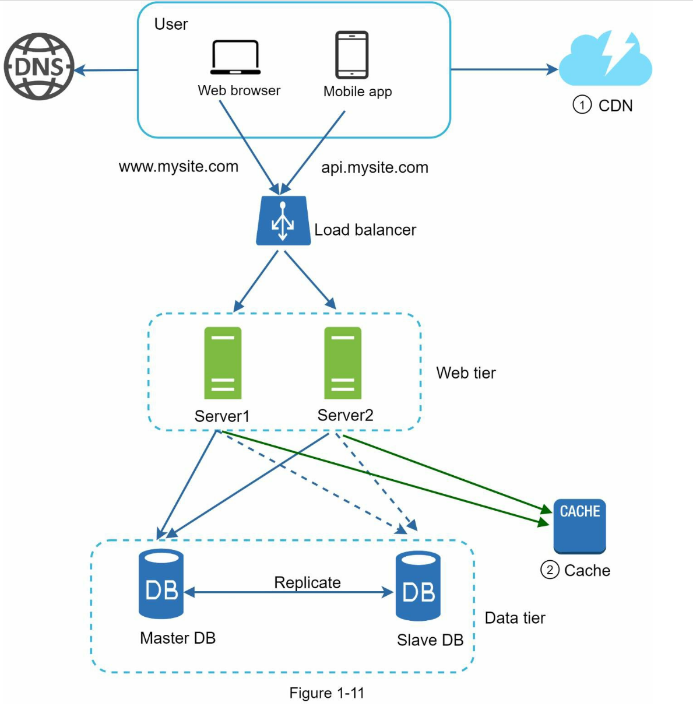

<!-- language: rtl -->
<div dir="rtl" align="right" >

# 1. DNS


 **سامانه نام دامنه (Domain Name System)** 

یکی از مهم‌ترین اجزای زیرساخت اینترنت است که وظیفه‌اش تبدیل **نام‌های دامنه (Domain Names)** مانند `www.example.com` به **آدرس‌های IP** مانند `192.168.1.1` است. از آنجایی که کامپیوترها برای برقراری ارتباط در شبکه از آدرس‌های عددی (IP) استفاده می‌کنند و به خاطر سپردن این آدرس‌ها برای کاربران دشوار است، DNS این فرایند را ساده می‌کند.  

### نحوه عملکرد DNS:

1. **درخواست نام دامنه**:

 وقتی کاربر نام دامنه‌ای مانند `www.example.com` را در مرورگر وارد می‌کند، درخواست به سیستم DNS ارسال می‌شود.

2. **جستجوی آدرس IP**:

 سیستم DNS به دنبال آدرس IP متناظر با نام دامنه می‌گردد. این کار را از طریق جستجو در سرورهای DNS مختلف انجام می‌دهد.

3. **بازگشت آدرس IP**:

 پس از پیدا کردن آدرس IP، سیستم DNS آن را به مرورگر کاربر بازمی‌گرداند.

4. **ارتباط با سرور وب**:

 مرورگر با استفاده از آدرس IP به سرور مربوطه متصل شده و داده‌ها را دریافت می‌کند.

### اجزای اصلی DNS:
1. **DNS Resolver (حل‌کننده DNS)**:

 این سیستم درخواست‌های DNS را از کاربران دریافت کرده و آنها را برای پیدا کردن آدرس IP به سرورهای DNS ارسال می‌کند.

2. **Root DNS Server**:

 اولین سروری که درخواست را دریافت می‌کند و به سرورهای سطح بالاتر (مانند `.com`) هدایت می‌کند.

3. **TLD DNS Server (سرور دامنه سطح بالا)**:

 سرورهای مرتبط با پسوند دامنه (مانند `.com`، `.org`، یا `.ir`) هستند.

4. **Authoritative DNS Server**:

 این سرورها اطلاعات دقیق مربوط به دامنه را نگهداری می‌کنند و آدرس IP نهایی را بازمی‌گردانند.

### انواع رکوردهای DNS:
- **A Record**: 

آدرس IPv4 مرتبط با نام دامنه را مشخص می‌کند.
- **AAAA Record**:

 آدرس IPv6 مرتبط با نام دامنه را مشخص می‌کند.
- **CNAME Record**:

 یک نام دامنه را به نام دامنه دیگری نگاشت می‌دهد.
- **MX Record**:

 مشخص می‌کند که ایمیل‌ها باید به کدام سرور ارسال شوند.
- **TXT Record**:

 برای ذخیره اطلاعات متنی یا احراز هویت دامنه استفاده می‌شود.

### مزایای DNS:
- **سادگی برای کاربران**: کاربران به جای به خاطر سپردن آدرس‌های عددی، از نام‌های دامنه قابل فهم استفاده می‌کنند.
- **انعطاف‌پذیری**: اگر آدرس IP یک وب‌سایت تغییر کند، تنها کافی است رکورد DNS به‌روزرسانی شود.
- **مقیاس‌پذیری**: DNS به شکلی طراحی شده که بتواند میلیون‌ها درخواست در ثانیه را مدیریت کند.

### معایب و محدودیت‌ها:
- **مشکلات امنیتی**: حملاتی مانند DNS Spoofing یا DNS Cache Poisoning می‌توانند باعث هدایت کاربران به وب‌سایت‌های جعلی شوند.
- **وابستگی به سرورهای ثالث**: بسیاری از شرکت‌ها از سرویس‌های DNS پولی مانند Cloudflare، Google DNS یا AWS Route 53 استفاده می‌کنند که می‌تواند هزینه‌بر باشد.

### مثال ساده:
فرض کنید کاربر `www.example.com` را وارد می‌کند:
1. مرورگر درخواست را به DNS Resolver ارسال می‌کند.
2. DNS Resolver از سرورهای Root و TLD عبور کرده و آدرس IP، مثلاً `93.184.216.34`، را دریافت می‌کند.
3. آدرس IP به مرورگر بازمی‌گردد و مرورگر به سرور وب متصل می‌شود تا محتوا را دریافت کند.

### سرویس‌دهندگان معروف DNS:
- **Google Public DNS**:

 با آدرس‌های IP `8.8.8.8` و `8.8.4.4`.

- **Cloudflare DNS**:

 با آدرس IP `1.1.1.1`.

- **OpenDNS**:

 با آدرس IP `208.67.222.222` و `208.67.220.220`.

به طور کلی، DNS ستون اصلی اینترنت است که تجربه کاربری را بسیار ساده‌تر و سریع‌تر می‌کند.

# 2. Single server setup


کاربران از طریق نام‌های دامنه، مانند `api.mysite.com`، به وب‌سایت‌ها دسترسی پیدا می‌کنند. معمولاً **سامانه نام دامنه (DNS)** به‌عنوان یک سرویس پولی توسط شرکت‌های ثالث ارائه می‌شود و بر روی سرورهای ما میزبانی نمی‌شود.

۲. پس از پردازش درخواست، یک **آدرس پروتکل اینترنت (IP)** به مرورگر یا اپلیکیشن موبایل بازگردانده می‌شود. به‌عنوان مثال، آدرس IP `15.125.23.214` بازگردانده می‌شود.

۳. پس از دریافت آدرس IP، درخواست‌های **پروتکل انتقال ابرمتن (HTTP)** مستقیماً به سرور وب ارسال می‌شوند.

۴. سرور وب صفحات HTML یا پاسخ‌های JSON را برای نمایش بازمی‌گرداند.

### بررسی منبع ترافیک

ترافیک به سرور وب شما از دو منبع می‌آید:

- **برنامه وب (Web Application)**: این برنامه از ترکیبی از زبان‌های سمت سرور (مانند Java، Python و غیره) برای مدیریت منطق کسب‌وکار، ذخیره‌سازی داده‌ها و غیره استفاده می‌کند. همچنین زبان‌های سمت کلاینت (مانند HTML و JavaScript) برای نمایش داده‌ها به کار می‌روند.
- **برنامه موبایل (Mobile Application)**: پروتکل HTTP به‌عنوان پروتکل ارتباطی بین اپلیکیشن موبایل و سرور وب عمل می‌کند. **JSON (JavaScript Object Notation)** معمولاً به‌عنوان فرمت پاسخ API برای انتقال داده‌ها استفاده می‌شود، زیرا بسیار ساده است.

### مثال پاسخ API در قالب JSON

در ادامه یک نمونه پاسخ API به فرمت JSON نشان داده می‌شود:

```json
{
  "status": "success",
  "data": {
    "user_id": 12345,
    "username": "johndoe",
    "email": "johndoe@example.com",
    "roles": ["admin", "editor"],
    "preferences": {
      "theme": "dark",
      "notifications": true
    }
  }
}
```

این ساختار به دلیل خوانایی بالا و سهولت در پردازش، در انتقال داده‌ها بین اپلیکیشن موبایل و سرور وب بسیار رایج است.

---

# 3. Database  
با رشد تعداد کاربران، یک سرور به‌تنهایی کافی نیست و نیاز به چندین سرور داریم: یک سرور برای مدیریت ترافیک وب/موبایل و سرور دیگر برای پایگاه داده. جداسازی سرورهای ترافیک وب/موبایل (**web tier**) از سرورهای پایگاه داده (**data tier**) این امکان را می‌دهد که این دو بخش به‌طور مستقل مقیاس‌پذیر باشند.




---

### **کدام پایگاه داده‌ها را استفاده کنیم؟**  
شما می‌توانید بین پایگاه داده‌های **رابطه‌ای (Relational Database)** و **غیررابطه‌ای (Non-Relational Database)** یکی را انتخاب کنید. بیایید تفاوت‌های آن‌ها را بررسی کنیم.




## **پایگاه داده‌های رابطه‌ای (Relational Databases)**  
 سیستم مدیریت پایگاه داده رابطه‌ای (**RDBMS**) یا پایگاه داده‌های SQL.  
- **محبوب‌ترین گزینه‌ها**: MySQL، Oracle Database، PostgreSQL و غیره.  
- **ساختار**: داده‌ها را در قالب **جدول‌ها و ردیف‌ها** ذخیره می‌کنند.  
- **عملیات Join**: امکان انجام عملیات Join بین جداول مختلف با استفاده از SQL وجود دارد.  


## **پایگاه داده‌های غیررابطه‌ای (Non-Relational Databases)**  
 پایگاه داده‌های NoSQL.  
- **محبوب‌ترین گزینه‌ها**: CouchDB، Neo4j، Cassandra، HBase، Amazon DynamoDB و غیره.  
- **دسته‌بندی**: پایگاه داده‌های غیررابطه‌ای به ۴ دسته اصلی تقسیم می‌شوند:  
  1. **Key-Value Stores**: داده‌ها به‌صورت کلید-مقدار ذخیره می‌شوند.  
  2. **Graph Stores**: برای ذخیره‌سازی داده‌های گراف مانند ارتباط بین موجودیت‌ها.  
  3. **Column Stores**: داده‌ها در قالب ستون‌ها ذخیره می‌شوند.  
  4. **Document Stores**: برای ذخیره‌سازی اسناد ساختارمند مانند JSON و XML استفاده می‌شوند.  
- **عملیات Join**: به‌طور کلی در این نوع پایگاه داده‌ها پشتیبانی نمی‌شود.





---

### کدام پایگاه داده برای شما مناسب است؟  

`پایگاه داده‌های رابطه‌ای` گزینه‌ای مناسب برای اکثر توسعه‌دهندگان هستند زیرا:  
- بیش از ۴۰ سال سابقه استفاده دارند.  
- به‌خوبی امتحان خود را در پروژه‌های مختلف پس داده‌اند.  

اما اگر پایگاه داده‌های رابطه‌ای برای نیازهای خاص شما مناسب نیستند، ممکن است `پایگاه داده‌های غیررابطه‌ای` انتخاب بهتری باشند.

در شرایط زیر، پایگاه داده‌های غیررابطه‌ای را در نظر بگیرید:

super-low latency
- **زمان پاسخ‌دهی بسیار پایین** برای برنامه شما ضروری است.  

unstructured data
- داده‌های شما **غیرساختاریافته** هستند یا نیازی به ارتباط بین داده‌ها ندارید.  

serialize and deserialize
- تنها نیاز به **سریالایز و دی‌سریالایز کردن داده‌ها** (JSON، XML، YAML و غیره) دارید.  

Gig Data
- باید **مقادیر عظیمی از داده‌ها** را ذخیره کنید.  

---

انتخاب پایگاه داده به نیازهای خاص پروژه شما وابسته است. برای سیستم‌های معمول با داده‌های ساختارمند، پایگاه داده‌های رابطه‌ای (مثل PostgreSQL یا MySQL) انتخاب بهتری هستند. اما در موارد خاص مثل داده‌های عظیم، زمان پاسخ‌دهی سریع یا داده‌های غیرساختاریافته، باید به سراغ پایگاه داده‌های غیررابطه‌ای (مثل Amazon DynamoDB یا Cassandra) بروید.


---
# 4. Vertical Scaling vs Horizontal Scaling  


### **Vertical Scaling (Scale Up)**  
**تعریف**: افزودن توان سخت‌افزاری بیشتر (مانند CPU و RAM) به یک سرور برای افزایش ظرفیت آن.  
- **مزیت اصلی**:  
  - **سادگی**: اجرای این روش آسان است و نیاز به تغییرات پیچیده ندارد.  
- **مناسب برای**:  
  - شرایطی که **ترافیک پایین** است و نیازی به ظرفیت بالای منابع وجود ندارد.  

#### **محدودیت‌های Vertical Scaling**:  
1. **محدودیت فیزیکی**: امکان افزایش نامحدود CPU و RAM برای یک سرور وجود ندارد.  
2. **عدم پشتیبانی از Redundancy و Failover**: اگر سرور دچار مشکل شود، کل وب‌سایت یا برنامه غیرفعال خواهد شد.  

---

### **Horizontal Scaling (Scale Out)**  
**تعریف**: افزودن سرورهای بیشتر به مجموعه منابع برای تقسیم بار کاری بین سرورها.  
- **مزیت اصلی**:  
  - مناسب برای **برنامه‌های بزرگ‌مقیاس** و ترافیک بالا.  
- **مناسب برای**:  
  - سیستم‌هایی که نیاز به **مقیاس‌پذیری بالا** دارند.  

#### **چرا Horizontal Scaling برتر است؟**  
- در طراحی قبلی، کاربران مستقیماً به سرور وب متصل می‌شدند:  
  1. اگر سرور وب غیرفعال می‌شد، کاربران دیگر قادر به دسترسی به وب‌سایت نبودند.  
  2. اگر تعداد زیادی کاربر به سرور وب به‌طور هم‌زمان متصل می‌شدند و سرور به حداکثر ظرفیت بار خود می‌رسید، کاربران با **کندی در پاسخ‌دهی** یا **قطع ارتباط** مواجه می‌شدند.  

- **راه‌حل**: استفاده از یک **Load Balancer**.  
  - **Load Balancer**:  
    - توزیع ترافیک بین سرورها برای جلوگیری از بار بیش‌ازحد روی یک سرور.  
    - افزایش دسترسی‌پذیری (Availability) و پایداری سیستم.  

---

- **Vertical Scaling** گزینه‌ای ساده و مناسب برای ترافیک کم است اما محدودیت‌های جدی دارد.  
- **Horizontal Scaling** انتخابی ایده‌آل برای برنامه‌های بزرگ و با ترافیک بالا است، چراکه امکان مقیاس‌پذیری بیشتر، Redundancy و Failover را فراهم می‌کند.  
- برای دستیابی به یک سیستم پایدار و قابل‌اعتماد، استفاده از **Load Balancer** به‌همراه Horizontal Scaling توصیه می‌شود.

# 5. Load Balancer

**تعریف:**  
یک **Load Balancer** وظیفه توزیع یکنواخت ترافیک ورودی بین سرورهای وب در یک مجموعه متعادل‌کننده بار را بر عهده دارد. این مکانیزم برای افزایش دسترس‌پذیری (Availability) و جلوگیری از بار اضافی روی یک سرور استفاده می‌شود.  

### **عملکرد Load Balancer**  
1. **اتصال کاربران به Public IP Load Balancer**:  
   کاربران به‌جای اتصال مستقیم به سرورهای وب، به آدرس IP عمومی Load Balancer متصل می‌شوند.  

2. **ارتباط داخلی با سرورها از طریق Private IPs**:  
   - سرورهای وب دیگر مستقیماً توسط کاربران قابل‌دسترسی نیستند.  
   - **Private IP** برای ارتباط بین سرورها و Load Balancer استفاده می‌شود.  
   - **Private IP** تنها در شبکه داخلی سرورها قابل‌دسترسی است و از اینترنت قابل‌دسترسی نیست.  




### **مزایای استفاده از Load Balancer**  
**بهبود امنیت و دسترس‌پذیری:**  
- اگر یک سرور (مثلاً سرور 1) غیرفعال شود:  
  - Load Balancer تمام ترافیک را به سرورهای سالم (مثلاً سرور 2) هدایت می‌کند.  
  - این مکانیزم از **آفلاین شدن وب‌سایت** جلوگیری می‌کند.  
  - سرور جدید و سالم می‌تواند به مجموعه سرورها اضافه شود تا بار ترافیکی متعادل بماند.  

**مقیاس‌پذیری:**  
- اگر ترافیک وب‌سایت به‌سرعت افزایش یابد و دو سرور برای مدیریت بار کافی نباشند:  
  - سرورهای جدید به مجموعه اضافه می‌شوند.  
  - Load Balancer به‌طور خودکار درخواست‌ها را بین سرورهای جدید تقسیم می‌کند.  

---

### **مشکلات Data Tier (لایه داده)**  
- در طراحی فعلی، تنها یک دیتابیس وجود دارد که از **Failover** و **Redundancy** پشتیبانی نمی‌کند.  
- برای حل این مشکلات، از **Database Replication** استفاده می‌شود.  

Load Balancer با توزیع بار و استفاده از Private IPs، امنیت، مقیاس‌پذیری و پایداری لایه وب را بهبود می‌بخشد.  
برای اطمینان از عملکرد پایدار در لایه داده، تکنیک‌هایی مانند Replication باید پیاده‌سازی شوند.

---
# 5.1.NGINX
**NGINX** یکی از قدرتمندترین و محبوب‌ترین ابزارها برای **Load Balancing**، **وب سرور** و **Reverse Proxy** است. این ابزار متن‌باز و بسیار انعطاف‌پذیر است و در بسیاری از پروژه‌های کوچک تا بزرگ در سراسر دنیا استفاده می‌شود. در ادامه توضیحات بیشتری درباره NGINX به عنوان Load Balancer ارائه شده است:



### **ویژگی‌های NGINX به عنوان Load Balancer**  
1. **پشتیبانی از لایه 4 و لایه 7:**  
   - در لایه **4**: برای توزیع ترافیک TCP و UDP.  
   - در لایه **7**: برای توزیع درخواست‌های HTTP/HTTPS با قابلیت مسیریابی پیشرفته بر اساس URL، کوکی‌ها، و هدرها.  

2. **مقیاس‌پذیری بالا:**  
   - NGINX می‌تواند میلیون‌ها درخواست را با کمترین منابع سخت‌افزاری پردازش کند.  
   - این ابزار بهینه‌سازی شده است تا برای سرورهای با ترافیک بالا عملکرد عالی ارائه دهد.  

3. **قابلیت‌های پیشرفته:**  
   - پشتیبانی از **SSL Termination**: رمزگشایی SSL برای کاهش بار روی سرورها.  
   - **Health Check**: بررسی سلامت سرورها و هدایت ترافیک فقط به سرورهای فعال.  
   - **Session Persistence**: حفظ اتصال کاربر به یک سرور خاص.  
   - **Caching**: ذخیره‌سازی پاسخ‌ها برای بهبود عملکرد.  

4. **انعطاف‌پذیری در تنظیمات:**  
   - NGINX از یک فایل کانفیگ ساده و قابل فهم استفاده می‌کند که به راحتی می‌توان آن را سفارشی کرد.  
   - شما می‌توانید قوانین توزیع بار، مسیریابی درخواست‌ها، و رفتار پروکسی را بر اساس نیازهای خاص خود تنظیم کنید.  

5. **ماژول‌های متن‌باز و پولی:**  
   - نسخه **NGINX Open Source** برای اکثر نیازهای عمومی کافی است.  
   - نسخه **NGINX Plus** ویژگی‌های پیشرفته‌تری مانند رابط کاربری گرافیکی، آمار زنده، و پشتیبانی تجاری ارائه می‌دهد.  

---

### روش‌های Load Balancing در NGINX
یکی از محبوب‌ترین و انعطاف‌پذیرترین Load Balancerهای متن‌باز.

NGINX از چندین روش برای توزیع بار پشتیبانی می‌کند که به طور پیش‌فرض می‌توانید از آن‌ها استفاده کنید:  

1. **Round Robin (پیش‌فرض):**  
   - درخواست‌ها به صورت متوالی به سرورها ارسال می‌شوند.  
   - مناسب برای بار متعادل بین سرورهایی با ظرفیت مشابه.  

2. **Least Connections:**  
   - ترافیک به سروری ارسال می‌شود که کمترین تعداد اتصال فعال را دارد.  
   - مناسب برای سرورهایی با بار متفاوت یا درخواست‌های طولانی‌تر.  

3. **IP Hash:**  
   - درخواست‌ها بر اساس آدرس IP کلاینت به یک سرور خاص ارسال می‌شوند.  
   - این روش برای **Session Persistence** مفید است.  

4. **Weighted Round Robin:**  
   - سرورها بر اساس وزن مشخصی بار دریافت می‌کنند.  
   - مناسب برای سرورهایی با قدرت پردازش متفاوت.  

---

### **نمونه تنظیمات Load Balancer با NGINX**  

در اینجا یک نمونه فایل تنظیمات برای استفاده از NGINX به عنوان Load Balancer آورده شده است:

```nginx
http {
    upstream backend_servers {
        # تعریف سرورها
        server 192.168.1.101 weight=3; # سرور با وزن بیشتر
        server 192.168.1.102;
        server 192.168.1.103;
    }

    server {
        listen 80;

        location / {
            proxy_pass http://backend_servers; # ارسال درخواست‌ها به سرورها
            proxy_set_header Host $host;
            proxy_set_header X-Real-IP $remote_addr;
            proxy_set_header X-Forwarded-For $proxy_add_x_forwarded_for;
        }
    }
}
```

**توضیحات:**  
- **upstream**: گروه سرورها را تعریف می‌کند.  
- **weight**: وزن هر سرور برای توزیع درخواست‌ها.  
- **proxy_pass**: ارسال درخواست‌ها به گروه سرورها.  
- **proxy_set_header**: تنظیم هدرهای HTTP.  

---

### **مزایا و معایب NGINX برای Load Balancing**  

#### **مزایا:**  
1. **کارایی بالا:** توانایی پردازش تعداد زیادی درخواست با کمترین مصرف منابع.  
2. **پیکربندی ساده:** ساختار ساده فایل تنظیمات و انعطاف‌پذیری بالا.  
3. **مناسب برای معماری‌های مدرن:** پشتیبانی از Microservices، Kubernetes و Docker.  
4. **متن‌باز بودن:** رایگان و با پشتیبانی گسترده از جامعه متن‌باز.  

#### **معایب:**  
1. **عدم رابط گرافیکی (در نسخه متن‌باز):** نسخه رایگان رابط گرافیکی برای مدیریت ندارد.  
2. **نیاز به مهارت فنی:** برای تنظیمات پیشرفته، آشنایی با syntax و ساختار فایل‌های NGINX ضروری است.  
3. **محدودیت‌های Built-in Monitoring:** ابزارهای مانیتورینگ داخلی NGINX محدود هستند و نیاز به ابزارهای خارجی مانند Prometheus یا Grafana دارید.  

---

### **موارد استفاده NGINX به عنوان Load Balancer**
- مدیریت ترافیک وب‌سایت‌های پربازدید.  
- استفاده در معماری Microservices و کلاسترهای Kubernetes.  
- توزیع بار در سرورهای RESTful API.  
- افزایش دسترس‌پذیری و افزونگی در سیستم‌های بزرگ.  

---


# 6. Database Replication

 یکی از تکنیک‌های مهم برای افزایش کارایی، دسترس‌پذیری و افزونگی در سیستم‌های دیتابیس است. در این روش، داده‌ها از یک دیتابیس اصلی (**Master**) به یک یا چند دیتابیس کپی (**Slave**) منتقل می‌شوند. این انتقال باعث می‌شود که سیستم بتواند بار خواندن (Read) را بین چندین سرور توزیع کند، در حالی که عملیات نوشتن (Write) همچنان به دیتابیس اصلی ارسال می‌شود. در ادامه جزئیات بیشتری ارائه می‌شود:


به معنای ایجاد نسخه‌های کپی از یک پایگاه داده (Database) و توزیع داده‌ها بین سرورهای مختلف برای بهبود عملکرد، دسترس‌پذیری و افزونگی است. 

---

### **معماری Master-Slave**  
در این مدل، پایگاه داده به دو نوع تقسیم می‌شود:  
1. **Master Database:**  
   - فقط عملیات‌های **Write** (مانند Insert, Update, Delete) را مدیریت می‌کند.  
   - داده‌های به‌روز شده را به پایگاه داده‌های Slave ارسال می‌کند.  

2. **Slave Database:**  
   - فقط عملیات‌های **Read** را پشتیبانی می‌کند.  
   - از داده‌های کپی‌شده از Master برای پاسخگویی به درخواست‌های خواندن استفاده می‌کند.  

> **نکته:** تعداد پایگاه داده‌های Slave معمولاً بیشتر از پایگاه داده‌های Master است، چرا که اکثر برنامه‌ها به خواندن بیشتری نسبت به نوشتن نیاز دارند.

---

### **مزایای Database Replication**  
1. **بهبود عملکرد:**  
   - عملیات‌های نوشتن به Master اختصاص داده می‌شود، در حالی که عملیات‌های خواندن در بین سرورهای Slave توزیع می‌شود.  
   - این توزیع بار باعث افزایش کارایی و کاهش زمان پاسخ‌دهی می‌شود.  

2. **افزایش قابلیت اطمینان (Reliability):**  
   - داده‌ها در چندین سرور کپی می‌شوند، بنابراین در صورت بروز حادثه (مانند بلایای طبیعی)، داده‌ها از بین نمی‌روند.  

3. **دسترس‌پذیری بالا (High Availability):**  
   - اگر یک پایگاه داده (Master یا Slave) از دسترس خارج شود، داده‌ها همچنان در سایر سرورها در دسترس خواهند بود.  

---

### **عملکرد در صورت از دسترس خارج شدن سرورها**  
1. **خرابی یک Slave:**  
   - اگر فقط یک سرور Slave وجود داشته باشد و از دسترس خارج شود:  
     - درخواست‌های **Read** به طور موقت به سرور Master هدایت می‌شوند.  
     - یک سرور Slave جدید جایگزین سرور معیوب خواهد شد.  
   - اگر چندین سرور Slave وجود داشته باشد:  
     - درخواست‌های **Read** به سرورهای Slave سالم هدایت می‌شود.  

2. **خرابی Master:**  
   - یکی از سرورهای Slave به عنوان **Master جدید** ارتقا پیدا می‌کند.  
   - درخواست‌های **Write** و **Read** به سرور جدید منتقل می‌شوند.  
   - یک سرور جدید به عنوان Slave برای ادامه فرآیند Replication جایگزین می‌شود.  

---

### **چالش‌های ارتقای یک Slave به Master**  
- در هنگام ارتقای یک Slave به Master، ممکن است داده‌های آن Slave به‌روز نباشد.  
- برای به‌روز رسانی داده‌های از دست رفته:  
  - از **اسکریپت‌های بازیابی داده** (Data Recovery Scripts) استفاده می‌شود.  
  - روش‌های پیشرفته‌تر مانند **Multi-Master Replication** یا **Circular Replication** می‌توانند کمک کنند، اما پیچیدگی بیشتری دارند.  

---

### **روش‌های دیگر Database Replication**  
1. **Multi-Master Replication:**  
   - همه سرورها توانایی **Write** و **Read** را دارند.  
   - مناسب برای برنامه‌هایی که به نوشتن همزمان از چندین نقطه نیاز دارند.  
   - پیچیده‌تر است و مشکلات هماهنگی (Conflict Resolution) را به همراه دارد.  

2. **Circular Replication:**  
   - هر سرور به صورت همزمان داده‌ها را از یک سرور دیگر دریافت و به سرور بعدی ارسال می‌کند.  
   - برای سناریوهای خاصی کاربرد دارد.  

---

### **موارد استفاده رایج از Database Replication**
- برنامه‌های با تعداد زیادی کاربران (مانند شبکه‌های اجتماعی).  
- سیستم‌های مالی که نیاز به دسترس‌پذیری بالا و امنیت داده دارند.  
- ذخیره‌سازی داده‌های توزیع‌شده جغرافیایی برای بهبود زمان پاسخ‌دهی کاربران در مناطق مختلف.  



### **ابزارهای پرکاربرد برای Database Replication**
1. **`MySQL` Replication:**  
   - روش Master-Slave پیش‌فرض.  
   - پشتیبانی از Semi-Synchronous Replication برای بهبود هماهنگی.  

2. **`PostgreSQL` Replication:**  
   - پشتیبانی از Streaming Replication.  
   - ابزارهای پیشرفته مانند **pglogical** برای Replication منطقی.  

3. **`MongoDB` Replication:**  
   - استفاده از Replica Sets برای مدیریت Failover و افزونگی.  

4. **`Oracle` Data Guard:**  
   - راهکار پیشرفته اوراکل برای Replication و Failover خودکار.  

# 7. Cache

کش به عنوان یک لایه ذخیره‌سازی موقت برای داده‌ها، امکان پاسخ‌دهی سریع‌تر به درخواست‌های کاربران را فراهم می‌کند. 

### **مزایای استفاده از Cache:**
1. **افزایش کارایی سیستم:**
   - با کاهش نیاز به درخواست‌های مکرر به پایگاه داده، زمان پاسخ‌دهی بهبود پیدا می‌کند.
2. **کاهش بار روی پایگاه داده:**
   - کشینگ باعث کاهش تعداد پرس‌وجوهای پایگاه داده شده و منابع آن آزاد می‌شود.
3. **مقیاس‌پذیری مستقل:**
   - لایه Cache می‌تواند به طور مستقل گسترش یابد تا نیازهای سیستم را برآورده کند.


### **Cache Tier (لایه کش):**
**لایه کش** یک لایه مجزا در معماری سیستم است که به عنوان یک حافظه موقت و سریع‌تر از پایگاه داده عمل می‌کند. این لایه معمولاً برای ذخیره داده‌هایی استفاده می‌شود که:
- دسترسی به آن‌ها بسیار متداول است.
- ایجاد آن‌ها زمان‌بر یا پرهزینه است (مانند نتایج محاسبات پیچیده یا پرس‌وجوهای سنگین).

#### **عملکرد Cache Tier:**
1. درخواست به سرور وب ارسال می‌شود.
2. سرور وب بررسی می‌کند که آیا داده مورد نیاز در کش موجود است:
   - **در صورت موجود بودن (Cache Hit):** پاسخ از کش ارسال می‌شود.
   - **در صورت عدم وجود (Cache Miss):** داده از پایگاه داده دریافت شده، در کش ذخیره می‌شود و سپس به کاربر ارسال می‌گردد.

---

### **استراتژی‌های کشینگ:**
1. **Read-Through Cache:**
   - داده‌هایی که به طور مکرر خوانده می‌شوند، به طور خودکار در کش ذخیره می‌شوند.
   - درخواست ابتدا به کش ارسال می‌شود و در صورت عدم وجود داده، به پایگاه داده منتقل می‌شود.

2. **Write-Through Cache:**
   - هر تغییر داده در پایگاه داده به طور خودکار در کش نیز به‌روزرسانی می‌شود.
   - این استراتژی برای داده‌هایی که مکرراً تغییر می‌کنند مناسب است.

3. **Cache Aside:**
   - داده‌ها به صورت دستی در کش ذخیره یا حذف می‌شوند.
   - برنامه ابتدا به کش نگاه می‌کند و اگر داده موجود نبود، به پایگاه داده مراجعه می‌کند.

4. **Write-Behind Cache:**
   - داده‌ها ابتدا در کش به‌روزرسانی می‌شوند و سپس به صورت غیرهمزمان به پایگاه داده منتقل می‌شوند.

---


### **ملاحظات در طراحی Cache:**
1. **سیاست‌های حذف (Eviction Policies):**
   - در صورت پر شدن حافظه، داده‌های قدیمی حذف می‌شوند.
   - سیاست‌هایی مانند **Least Recently Used (LRU)** یا **First In, First Out (FIFO)** استفاده می‌شود.

2. **زمان انقضا (TTL):**
   - هر آیتم کش می‌تواند یک زمان انقضا داشته باشد تا از ذخیره طولانی‌مدت داده‌های غیرمعتبر جلوگیری شود.

3. **Consistency (یکپارچگی داده‌ها):**
   - باید اطمینان حاصل شود که` داده‌های کش با پایگاه داده همگام هستند`، مخصوصاً در استراتژی‌های Write-Through یا Write-Behind.

---

### **ادغام Cache با CDN:**
در مواردی که محتوای استاتیک (مانند تصاویر، ویدئوها یا فایل‌های CSS و جاوااسکریپت) مورد استفاده قرار می‌گیرد، می‌توان از **CDN** به همراه کش استفاده کرد. این ترکیب باعث می‌شود:
- محتوای استاتیک از نزدیک‌ترین سرور به کاربر ارائه شود.
- کارایی کلی سیستم افزایش یابد.

---

# 7.1. Redis

 یکی از قدرتمندترین و پرکاربردترین ابزارهای کشینگ و مدیریت داده‌های درون حافظه (In-Memory Data Store) است. این ابزار به دلیل سرعت بالا، انعطاف‌پذیری و پشتیبانی از انواع داده‌های متنوع، به‌طور گسترده در طراحی سیستم‌های مدرن استفاده می‌شود. 

### **Redis چیست؟**
Redis (Remote Dictionary Server)

 یک **پایگاه داده درون‌حافظه‌ای** (In-Memory Database) و **ذخیره‌سازی key-value** است. برخلاف پایگاه داده‌های سنتی که داده‌ها را روی دیسک ذخیره می‌کنند، Redis داده‌ها را در حافظه RAM نگهداری می‌کند که باعث سرعت بسیار بالای آن می‌شود.


### **ویژگی‌های Redis به عنوان Cache:**
1. **سرعت بالا:**
   - Redis داده‌ها را به‌طور کامل در حافظه ذخیره می‌کند، بنابراین زمان دسترسی به داده‌ها به شدت کاهش می‌یابد.
   - سرعت عملیات در Redis در حد میلی‌ثانیه است.

2. **پشتیبانی از انواع داده‌های متنوع:**
   - علاوه بر ساختار ساده **key-value**، Redis از انواع داده‌های پیچیده مانند لیست‌ها، مجموعه‌ها، هش‌ها و رشته‌ها پشتیبانی می‌کند.

3. **سیاست‌های حذف پیشرفته (Eviction Policies):**
   - Redis امکان استفاده از سیاست‌های مختلف برای حذف داده‌ها در صورت پر شدن حافظه را فراهم می‌کند، از جمله:
     - **Least Recently Used (LRU)**: حذف داده‌هایی که اخیراً استفاده نشده‌اند.
     - **Least Frequently Used (LFU)**: حذف داده‌هایی که کمتر استفاده شده‌اند.
     - **Volatile TTL**: حذف داده‌هایی که زمان انقضای (TTL) آن‌ها به پایان رسیده است.

4. **پشتیبانی از TTL (Time-to-Live):**
   - می‌توانید برای هر داده در Redis یک زمان انقضا تعیین کنید. این ویژگی به‌طور خاص برای کش مناسب است تا از ذخیره‌سازی طولانی‌مدت داده‌های غیرمعتبر جلوگیری شود.

5. **مقیاس‌پذیری:**
   - Redis می‌تواند به‌صورت **افقی** (افزودن سرورهای بیشتر) و **عمودی** (افزایش منابع سرور) مقیاس‌پذیری داشته باشد.
   - پشتیبانی از **Redis Cluster** برای مدیریت داده‌ها در بین چندین گره.

6. **قابلیت ماندگاری اختیاری (Persistence):**
   - اگرچه Redis به عنوان یک پایگاه داده درون حافظه طراحی شده است، اما امکان ذخیره‌سازی داده‌ها روی دیسک (Persistence) نیز وجود دارد.

---

### **Redis در نقش Cache:**
Redis در سیستم‌های مدرن به عنوان لایه کش برای ذخیره‌سازی موقت داده‌هایی که به‌طور مکرر مورد دسترسی قرار می‌گیرند، استفاده می‌شود. به‌طور کلی، Redis در نقش Cache مزایای زیر را ارائه می‌دهد:

1. **ذخیره نتایج پرس‌وجوهای پایگاه داده:**
   - نتایج کوئری‌های پرهزینه را می‌توان در Redis ذخیره کرد تا نیازی به اجرای مجدد آن‌ها در پایگاه داده نباشد.
   - این کار بار روی پایگاه داده را کاهش می‌دهد.

2. **ذخیره داده‌های نشست (Session Data):**
   - در برنامه‌های وب، داده‌های نشست کاربران می‌تواند در Redis ذخیره شود. این کار باعث افزایش سرعت دسترسی به اطلاعات کاربر می‌شود.

3. **ذخیره محتوای استاتیک:**
   - محتوای استاتیک مانند فایل‌های CSS یا HTML می‌توانند به‌صورت موقت در Redis نگهداری شوند.

4. **ذخیره داده‌های API:**
   - پاسخ‌های API که زیاد فراخوانی می‌شوند، می‌توانند در Redis ذخیره شوند تا درخواست‌های مشابه نیاز به پردازش مجدد نداشته باشند.

---

### **معماری Redis به عنوان Cache:**

1. **استراتژی‌های کشینگ:**
   - **Cache Aside:**
     - برنامه ابتدا به Redis مراجعه می‌کند. اگر داده موجود بود (Cache Hit)، پاسخ داده می‌شود. اگر داده موجود نبود (Cache Miss)، به پایگاه داده مراجعه می‌شود، نتیجه در Redis ذخیره می‌شود و سپس به کاربر بازگردانده می‌شود.
   - **Write-Through:**
     - داده‌ها همزمان در پایگاه داده و Redis نوشته می‌شوند. این روش برای اطمینان از یکپارچگی داده‌ها استفاده می‌شود.
   - **Write-Behind:**
     - داده‌ها ابتدا در Redis نوشته می‌شوند و به‌صورت غیرهمزمان به پایگاه داده منتقل می‌شوند. این روش برای افزایش سرعت نوشتن مناسب است.

2. **سازگاری با مقیاس بالا:**
   - Redis می‌تواند به‌صورت **Master-Slave** یا **Cluster** تنظیم شود تا نیازهای برنامه‌های بزرگ‌مقیاس را برآورده کند.

3. **پشتیبانی از Pub/Sub:**
   - Redis از سیستم پیام‌رسانی **Publish/Subscribe** پشتیبانی می‌کند که می‌تواند برای مدیریت رویدادها در سیستم‌های توزیع‌شده استفاده شود.

---

### **نمونه کد استفاده از Redis در Python:**
برای استفاده از Redis در Python، می‌توانید از کتابخانه **redis-py** استفاده کنید:

```python
import redis

# اتصال به سرور Redis
cache = redis.Redis(host='localhost', port=6379, db=0)

# ذخیره داده در Redis
cache.set('key', 'value')

# بازیابی داده از Redis
value = cache.get('key')
print(value.decode('utf-8'))

# تنظیم زمان انقضا برای داده
cache.setex('key_with_expiration', 60, 'temp_value')  # 60 ثانیه
```

---

### **موارد استفاده Redis به عنوان Cache:**
- ذخیره نتایج پرس‌وجوهای سنگین پایگاه داده.
- ذخیره داده‌های نشست کاربران.
- مدیریت صف‌ها و شمارشگرهای سیستم.
- کش کردن اطلاعات موقت در سیستم‌های توزیع‌شده.
- ذخیره‌سازی داده‌های غیرساختاریافته مانند JSON.

---

### **مزایای Redis به عنوان Cache:**
- سرعت بسیار بالا.
- انعطاف‌پذیری در مدیریت داده‌ها.
- سازگاری با زبان‌های برنامه‌نویسی مختلف.
- مناسب برای سیستم‌های مقیاس‌پذیر.

### **معایب Redis:**
- محدودیت ظرفیت حافظه (RAM) در مقایسه با پایگاه داده‌های دیسکی.
- نیاز به طراحی دقیق برای حفظ یکپارچگی داده‌ها در سیستم‌های پیچیده.

# 7.2. Considerations for using cache

## نکاتی برای استفاده از سیستم کش

### **1. تصمیم‌گیری برای استفاده از کش**
- **چه زمانی از کش استفاده کنیم؟** از کش زمانی استفاده کنید که داده‌ها به‌صورت مکرر خوانده می‌شوند اما به ندرت تغییر می‌کنند. 
- از آنجا که داده‌های کش در حافظه موقت (Volatile Memory) ذخیره می‌شوند، این سیستم برای ذخیره‌سازی دائمی داده‌ها مناسب نیست. به‌عنوان مثال، اگر سرور کش ری‌استارت شود، تمام داده‌های موجود در حافظه از بین می‌روند. بنابراین، داده‌های مهم باید در پایگاه داده‌های ماندگار (Persistent Data Store) ذخیره شوند.

---

### **2. سیاست انقضا (Expiration Policy)**
- **پیاده‌سازی سیاست انقضا یک امر ضروری است.** پس از انقضای داده‌های کش، آن‌ها از حافظه حذف می‌شوند.
- اگر هیچ سیاست انقضایی تعریف نشود، داده‌های کش ممکن است به‌صورت دائمی در حافظه باقی بمانند و منابع حافظه را اشغال کنند.
- **تنظیم مدت زمان انقضا:**
  - زمان انقضا نباید خیلی کوتاه باشد، زیرا سیستم مجبور می‌شود به‌طور مکرر داده‌ها را از پایگاه داده بارگذاری کند.
  - زمان انقضا نباید خیلی طولانی باشد، زیرا ممکن است داده‌های کش شده منسوخ (Stale) شوند.

---

### **3. همگام‌سازی (Consistency)**
- **همگام نگه‌داشتن پایگاه داده و کش:** اطمینان حاصل کنید که داده‌های ذخیره‌شده در پایگاه داده و کش همزمان هستند. 
- **چالش‌های همگام‌سازی:** عدم هماهنگی ممکن است به این دلیل رخ دهد که عملیات تغییر داده‌ها (نوشتن، حذف یا به‌روزرسانی) در پایگاه داده و کش در یک تراکنش واحد انجام نمی‌شوند.
- **مقیاس‌گذاری در چند منطقه:** حفظ همگام‌سازی بین کش و پایگاه داده در سیستم‌هایی که در چندین منطقه جغرافیایی اجرا می‌شوند، بسیار چالش‌برانگیز است. برای اطلاعات بیشتر، به مقاله **“Scaling Memcache at Facebook”** مراجعه کنید.

---

### **4. کاهش شکست‌ها (Mitigating Failures)**
- **جلوگیری از نقطه شکست واحد (SPOF):** اگر یک سرور کش دچار خرابی شود، ممکن است کل سیستم متوقف شود. برای جلوگیری از این مشکل:
  - استفاده از چندین سرور کش در مراکز داده مختلف توصیه می‌شود.
  - تخصیص حافظه بیش از مقدار مورد نیاز (Overprovisioning) به میزان مشخصی پیشنهاد می‌شود. این کار به‌عنوان یک بافر عمل کرده و افزایش مصرف حافظه را مدیریت می‌کند.

`SPOF` : A `single point of failure` (SPOF) is a part of a
system that, if it fails, will stop the entire system from working



### **5. سیاست حذف داده‌ها (Eviction Policy)**
- **کش پر شده:** هنگامی که کش به ظرفیت کامل خود می‌رسد، هر درخواست جدید برای افزودن داده ممکن است باعث حذف داده‌های قدیمی شود. این فرآیند به عنوان **حذف کش (Cache Eviction)** شناخته می‌شود.
- **سیاست‌های حذف محبوب:**
  - **Least Recently Used (LRU):** داده‌هایی که کمترین زمان استفاده اخیر را داشته‌اند، حذف می‌شوند.
  - **Least Frequently Used (LFU):** داده‌هایی که کمتر مورد استفاده قرار گرفته‌اند، حذف می‌شوند.
  - **First In First Out (FIFO):** داده‌هایی که ابتدا وارد کش شده‌اند، ابتدا حذف می‌شوند.
- انتخاب سیاست حذف مناسب به مورد استفاده (Use Case) بستگی دارد.


# 8. CDN

### شبکه تحویل محتوا (Content Delivery Network - CDN)

 شبکه‌ای از سرورهای جغرافیایی پراکنده است که برای تحویل محتوای استاتیک (مانند تصاویر، ویدئوها، فایل‌های CSS و JavaScript) استفاده می‌شود. این سرورها با کش کردن محتوای استاتیک به بهبود زمان بارگذاری و کاهش تأخیر کمک می‌کنند.


**عملکرد CDN در سطح بالا:**
1. زمانی که کاربری از سایتی بازدید می‌کند، نزدیک‌ترین سرور CDN به کاربر محتوای استاتیک را ارائه می‌دهد. این کاهش فاصله فیزیکی بین کاربر و سرور، سرعت بارگذاری را افزایش می‌دهد.
2. اگر سرور CDN فایل موردنظر (مثلاً image.png) را در کش نداشته باشد، درخواست به سرور اصلی (origin) ارسال می‌شود.
3. سرور اصلی فایل را به همراه هدر HTTP اختیاری **Time-to-Live (TTL)** به سرور CDN می‌فرستد. این هدر مشخص می‌کند که فایل چه مدت در کش باقی بماند.
4. فایل در سرور CDN کش می‌شود و به کاربر بازمی‌گردد.
5. درخواست‌های بعدی تا زمانی که TTL منقضی نشده باشد، فایل را مستقیماً از کش ارائه می‌دهند.


### **مزایای استفاده از CDN**
- **بهبود سرعت بارگذاری:** نزدیک بودن سرور CDN به کاربر، زمان انتقال داده‌ها را کاهش می‌دهد.
- **کاهش بار روی سرور اصلی:** درخواست‌ها برای محتوای استاتیک به جای سرور اصلی به سرورهای CDN ارسال می‌شوند.
- **بهبود تجربه کاربری:** زمان بارگذاری کمتر به بهبود تجربه کاربری و حفظ بازدیدکنندگان کمک می‌کند.
- **افزایش دسترس‌پذیری:** در صورت وجود خرابی در سرور اصلی، کاربران همچنان می‌توانند محتوای کش‌شده را دریافت کنند.


### **ملاحظات استفاده از CDN**
1. **هزینه:** 
   - ارائه‌دهندگان CDN خدمات خود را با هزینه انتقال داده‌ها ارائه می‌دهند.
   - برای فایل‌هایی که کمتر استفاده می‌شوند، استفاده از CDN مزیت خاصی ندارد و ممکن است هزینه‌بر باشد.

2. **تنظیم زمان مناسب برای کش (Cache Expiry):** 
   - برای محتواهای حساس به زمان، تنظیم مناسب زمان انقضای کش ضروری است.
   - **اگر زمان کش طولانی باشد:** محتوای به‌روزرسانی نشده به کاربران نمایش داده می‌شود.
   - **اگر زمان کش کوتاه باشد:** باعث ارسال درخواست‌های مکرر به سرور اصلی و افزایش بار کاری آن می‌شود.

3. **پشتیبان‌گیری در صورت خرابی CDN (CDN Fallback):**
   - در صورت خرابی موقت CDN، برنامه یا وب‌سایت باید توانایی تشخیص این مشکل را داشته باشد و درخواست‌ها را به سرور اصلی هدایت کند.

4. **ابطال فایل‌های کش‌شده:**
   - فایل‌های کش‌شده را می‌توان پیش از انقضا به یکی از روش‌های زیر حذف کرد:
     - با استفاده از API‌های ارائه‌شده توسط ارائه‌دهندگان CDN، شیء کش‌شده را باطل کنید.
     - از نسخه‌بندی اشیاء استفاده کنید. برای مثال، یک پارامتر مانند شماره نسخه به URL اضافه کنید:  
       `image.png?v=2`

---


### **شکل نهایی طراحی سیستم با CDN و کش**
بعد از افزودن CDN و لایه کش، سیستم به شکل زیر ارتقا پیدا می‌کند:
- سرورهای نزدیک به کاربر درخواست‌های استاتیک را سریع پاسخ می‌دهند.
- لایه کش درخواست‌های مکرر به دیتابیس را کاهش می‌دهد.
- زمان بارگذاری کاهش یافته و عملکرد کلی سیستم بهبود می‌یابد.




</div>
