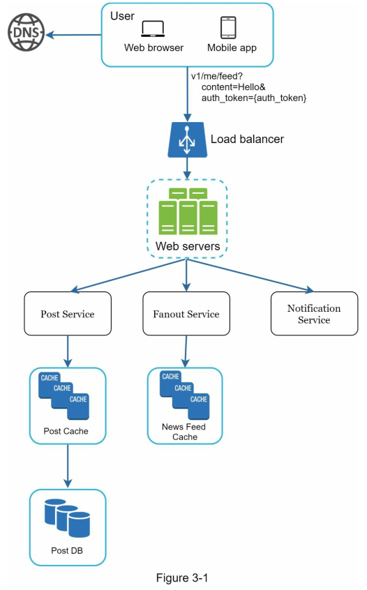
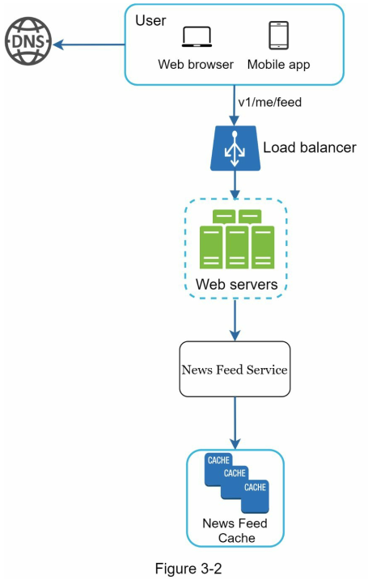
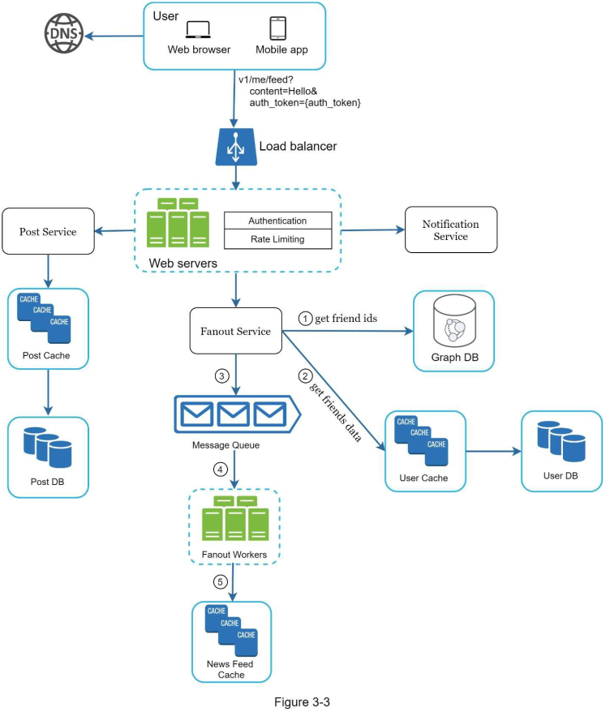
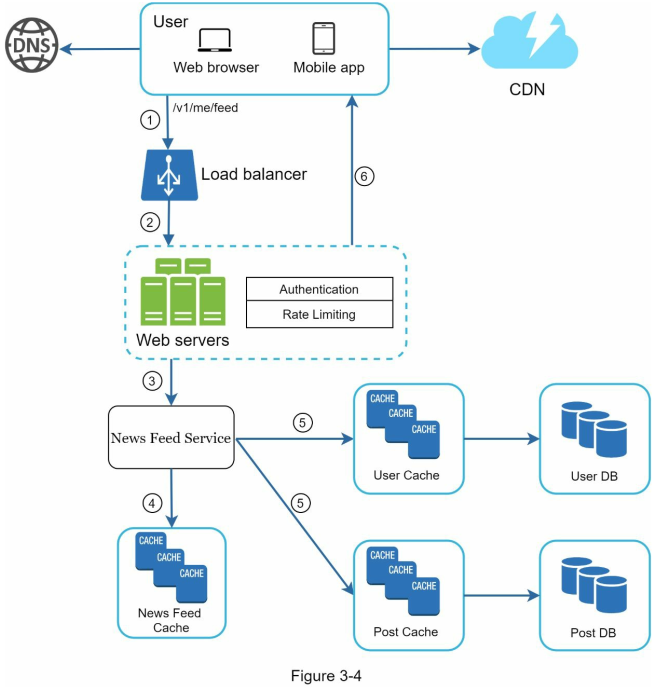

<!-- language: rtl -->
<div dir="rtl" align="right" >

### فصل سوم: یک چارچوب برای مصاحبه طراحی سیستم

(**CHAPTER 3: A FRAMEWORK FOR SYSTEM DESIGN INTERVIEWS**)

شما به‌تازگی موفق به دریافت دعوت‌نامه مصاحبه حضوری در شرکت رؤیایی‌تان شده‌اید. مسئول هماهنگی استخدام برایتان برنامه روز مصاحبه را ارسال می‌کند.
همه چیز خوب به نظر می‌رسد تا اینکه نگاهتان به یکی از بخش‌ها می‌افتد:
**مصاحبه طراحی سیستم (System Design Interview)**.

---

### چرا این مصاحبه ترسناک است؟

مصاحبه طراحی سیستم اغلب **ترسناک و مبهم** به نظر می‌رسد. ممکن است سوالی به‌سادگی این مطرح شود:

> «یک نسخه از محصول معروف X را طراحی کن؟»

این سوالات **باز و گسترده** هستند و مشخص نیست دقیقاً چه انتظاری می‌رود.
ترس شما منطقی است؛ چون چطور می‌توان یک سیستم محبوب را در عرض یک ساعت طراحی کرد؟ سیستمی که صدها یا هزاران مهندس طی سال‌ها ساخته‌اند؟

---

### خبر خوب چیست؟

**هیچ‌کس انتظار ندارد که شما سیستم واقعی را در یک ساعت طراحی کنید.**

طراحی سیستم‌های واقعی بسیار پیچیده است.
برای مثال:

* **جستجوی گوگل (Google Search)** ظاهری ساده دارد
* اما فناوری پشت آن **فوق‌العاده پیچیده و متشکل از هزاران مؤلفه** است.

---

### هدف واقعی مصاحبه طراحی سیستم چیست؟

هدف اصلی این مصاحبه:

> شبیه‌سازی حل مسئله واقعی در محل کار
> جایی که دو همکار با یک مسئله مبهم مواجه می‌شوند و باید با همکاری، راه‌حلی عملی برای آن بیابند.

---

### خصوصیات مسئله:

* **باز و بدون پاسخ کامل** است
* بیش از آنکه پاسخ نهایی اهمیت داشته باشد، **فرآیند طراحی و تفکر شما** اهمیت دارد

---

### فرصت‌هایی که شما در این مصاحبه دارید:

* **نمایش مهارت طراحی**
* **دفاع از انتخاب‌های طراحی خود**
* **پاسخ دادن سازنده به بازخوردها**

---

### ذهنیت مصاحبه‌گر چگونه است؟

بیایید نقش‌ها را عوض کنیم و ببینیم چه چیزی در ذهن مصاحبه‌گر می‌گذرد:

> مصاحبه‌گر دنبال این است که **توانایی واقعی شما را ارزیابی کند.**
> بدترین حالت برای او این است که جلسه به خوبی پیش نرود و نتواند سیگنال روشنی از عملکرد شما بگیرد.

---

### مصاحبه‌گر به دنبال چه چیزهایی است؟

بسیاری تصور می‌کنند که این مصاحبه فقط درباره **مهارت‌های فنی در طراحی سیستم** است.
اما در واقع موضوع **فراتر از این است**.

#### مصاحبه‌گر به دنبال سیگنال‌هایی درباره توانایی‌های زیر است:

* **توانایی همکاری (Collaboration)**
* **توانایی کار در شرایط ابهام و فشار**
* **توانایی پرسیدن سوال‌های درست**
* **میزان انعطاف‌پذیری در پاسخ به بازخورد**

---

### هشدارهایی که ممکن است علیه شما استفاده شود (Red Flags):

مصاحبه‌گر همچنین به دنبال **نشانه‌های منفی** است. از جمله:

#### ۱. **طراحی بیش‌ازحد (Over-engineering)**

* مهندسانی که غرق در طراحی‌های ایده‌آل می‌شوند و از **محدودیت‌ها و هزینه‌ها** غافل هستند.
* طراحی بیش‌ازحد می‌تواند هزینه‌های پنهان زیادی برای تیم و سازمان ایجاد کند.

#### ۲. **ذهن بسته (Narrow-mindedness)**

#### ۳. **لجبازی (Stubbornness)**

* عدم پذیرش بازخورد یا عدم بررسی گزینه‌های جایگزین.

---

### مسیر این فصل چیست؟

در ادامه فصل، یک چارچوب ساده و مؤثر برای پاسخ به سوالات مصاحبه طراحی سیستم معرفی خواهد شد.
این چارچوب کمک می‌کند تا:

* فرآیند طراحی خود را ساختارمند کنید
* تحت فشار مسیر فکری‌تان را گم نکنید
* به شکلی حرفه‌ای، منطقی و فنی، مصاحبه را پیش ببرید

---

### فرآیند ۴ مرحله‌ای برای موفقیت در مصاحبه طراحی سیستم

(**A 4-Step Process for Effective System Design Interviews**)

هر مصاحبه طراحی سیستم با مصاحبه دیگر متفاوت است.
اما یک مصاحبه موفق طراحی سیستم، همیشه **باز و بدون پاسخ قطعی** است.
هیچ راه‌حل یکسانی برای همه وجود ندارد،
اما تقریباً در همه‌ی مصاحبه‌ها، ‌مجموعه‌ای از **گام‌های مشترک** وجود دارد که باید دنبال شوند.

---

## مرحله اول: درک مسئله و تعریف محدوده طراحی

(**Step 1 - Understand the Problem and Establish Design Scope**)

### ❌ اشتباه رایج: سریع جواب دادن

در مصاحبه طراحی سیستم، اگر بدون درک کامل مسئله به سرعت وارد ارائه‌ی راه‌حل شوید، **هیچ امتیازی نمی‌گیرید**.
این مصاحبه مثل مسابقه‌ی اطلاعات عمومی نیست؛
هیچ "جواب درست و قطعی" وجود ندارد.

> مثال استعاری:
> «چرا ببر غرید؟»
> «چون گرسنه بود!»
> در کلاس همیشه شاگردی هست که سریع پاسخ می‌دهد، حتی اگر مطمئن نباشد. **در مصاحبه طراحی سیستم، آن شاگرد نباشید.**

---

### ✅ هدف این مرحله:

1. **کند پیش بروید**
2. **سوال بپرسید** برای فهم دقیق مسئله
3. **ابهامات را روشن کنید**
4. **فرضیات را بنویسید**

> مهارت مهندسی فقط حل مسئله نیست، بلکه **درک عمیق و پرسش‌گری ساختارمند** نیز هست.

---

### چرا این مرحله حیاتی است؟

* درک ناقص = طراحی اشتباه
* طراحی اشتباه = سیگنال منفی برای استخدام
* نوشتن فرضیات = ابزار رجوع برای بخش‌های بعدی

---

### چه سوالاتی باید پرسید؟

برای درک صحیح از مسئله، باید سوالاتی **هدفمند و استراتژیک** پرسید. مثال‌ها:

#### ✔ سوالات عملکردی (Functional Requirements)

* چه ویژگی‌هایی باید طراحی شود؟
* آیا این اپلیکیشن فقط خواندنی است یا نوشتن هم دارد؟
* کاربران چه نوع داده‌ای وارد می‌کنند؟ متن؟ عکس؟ ویدیو؟

#### ✔ سوالات غیرعملکردی (Non-Functional Requirements)

* چند کاربر فعال داریم؟
* بار پیک چقدر است؟
* زمان پاسخ مورد انتظار چند میلی‌ثانیه است؟
* تا چه مدت داده باید نگه داشته شود؟

#### ✔ سوالات رشد و مقیاس‌پذیری

* سیستم باید در ۳ یا ۶ ماه آینده چه مقیاسی داشته باشد؟
* رشد کاربران یا بار سیستم چقدر پیش‌بینی می‌شود؟

#### ✔ سوالات مربوط به تکنولوژی و محدودیت‌ها

* آیا تکنولوژی خاصی باید استفاده شود؟
* آیا سرویس‌های داخلی قابل استفاده‌ای وجود دارد؟

---

### ✅ مثال واقعی: طراحی سیستم News Feed

```text
سوال مصاحبه‌گر: یک سیستم News Feed طراحی کن.
```

#### گفتگوی نمونه با مصاحبه‌گر:

```
کاندیدا: آیا این سیستم برای اپ موبایل است یا وب؟ یا هر دو؟  
مصاحبه‌گر: هر دو.

کاندیدا: مهم‌ترین قابلیت‌هایی که باید پیاده‌سازی شوند چیستند؟  
مصاحبه‌گر: امکان پست گذاشتن و دیدن فید دوستان.

کاندیدا: آیا فید باید به ترتیب زمانی معکوس باشد یا اولویت‌دار؟  
مصاحبه‌گر: برای سادگی، معکوس زمانی (latest first).

کاندیدا: حداکثر چند دوست می‌تواند یک کاربر داشته باشد؟  
مصاحبه‌گر: ۵۰۰۰

کاندیدا: تعداد کاربران فعال روزانه چقدر است؟  
مصاحبه‌گر: ۱۰ میلیون DAU

کاندیدا: آیا پست‌ها فقط متن دارند یا شامل مدیا هم هستند؟  
مصاحبه‌گر: می‌تواند تصویر یا ویدیو هم داشته باشد.
```

---

### ✅ نکته کلیدی:

> تا زمانی که مسئله را کامل درک نکرده‌اید، سراغ معماری نروید.
> مصاحبه‌گر بیشتر به **سوالات شما** اهمیت می‌دهد تا **پاسخ‌های سریع‌تان**.


---
### مرحله دوم: ارائه طراحی سطح بالا و دریافت تأیید

(**Step 2 – Propose High-Level Design and Get Buy-In**)

پس از اینکه در مرحله اول نیازمندی‌ها و فرضیات را به‌خوبی مشخص کردید، اکنون نوبت آن است که یک **طرح کلی اولیه (High-Level Design)** ارائه دهید و آن را با مصاحبه‌گر **هماهنگ و نهایی** کنید.

---

### اهداف این مرحله:

* ترسیم نقشه‌ی اولیه از معماری سیستم
* دریافت بازخورد سریع و تعامل با مصاحبه‌گر
* درک بهتر از مسیر بهینه قبل از ورود به جزئیات

---

### ✅ شیوه انجام کار:

#### 1. **همکاری فعال با مصاحبه‌گر**

> مصاحبه‌گر را **به‌عنوان هم‌تیمی** ببینید، نه داور.
> در بسیاری از مصاحبه‌های موفق، تعامل و گفتگو کلید موفقیت است.

#### 2. **طراحی با دیاگرام جعبه‌ای (Box Diagram)**

روی وایت‌برد یا کاغذ، ساختار کلی سیستم را ترسیم کنید.

**اجزای رایج:**

* **Client (Mobile / Web)**
* **API Gateway / Web Server**
* **Application Layer**
* **Cache (e.g., Redis, Memcached)**
* **Message Queue (e.g., Kafka, RabbitMQ)**
* **Database(s)**
* **CDN (برای تحویل محتوای مدیا)**
* **Storage (برای فایل‌های تصویری/ویدیویی)**

---

#### 3. **برآورد سرانگشتی (Back-of-the-Envelope Estimation)**

در این مرحله می‌توانید از محاسبات تقریبی برای بررسی اینکه طراحی شما در مقیاس خواسته‌شده **پاسخگو** هست یا نه استفاده کنید.

* QPS؟
* حجم داده روزانه؟
* نیاز به کش؟
* نیاز به sharding؟

**مثال:**
برای ۱۰ میلیون DAU و ۲ پست در روز → ۲۰۰ میلیون پست در روز → آیا DB یا Queue تحمل این حجم را دارد؟

---

#### 4. **مرور چند use case مشخص**

برای بررسی اعتبار طراحی سطح بالا، می‌توانید یکی دو سناریو واقعی را بررسی کنید:

* کاربر پست می‌گذارد → آیا post به فید دوستان منتقل می‌شود؟
* کاربر وارد فید می‌شود → آیا postهای دوستان به‌موقع لود می‌شود؟
* فایل ویدیو در پست است → آیا از CDN استفاده می‌شود؟

---

### ✳️ سوال: آیا در این مرحله باید به API و schema هم پرداخت؟

> پاسخ: **بستگی دارد.**

| نوع مسئله                     | سطح مناسب برای API/Schema    |
| ----------------------------- | ---------------------------- |
| طراحی موتور جستجوی گوگل       | خیلی زود است (too low-level) |
| طراحی بک‌اند بازی پوکر آنلاین | مناسب (fair game)            |

پس: **با مصاحبه‌گر هماهنگ کنید.**

---

### ✅ مثال: طراحی سیستم News Feed

#### طراحی سطح بالا از دو جریان تشکیل شده است:

1. **Feed Publishing Flow**

   * کاربر پست می‌گذارد → دیتا در Cache / DB ذخیره می‌شود
   * پست به فید دوستان push می‌شود (در مدل push-based)

2. **Feed Building Flow**

   * کاربر وارد فید می‌شود → پست‌های دوستان بر اساس زمان جدید مرتب شده و نمایش داده می‌شوند
   * (pull-based یا hybrid بسته به تعداد فالوورها)




---

### ✅ نمونه دیاگرام ساده (textual):

```
User (App/Web)
     ↓
API Gateway
     ↓
+-------------------+
| Feed Service      |---→ Message Queue → Feed Worker → Update Friend Feeds
| (publish post)    |
+-------------------+
     ↓
Database ←→ Cache

User (view feed)
     ↓
API Gateway
     ↓
+-------------------+
| Feed Aggregator   |
| (pull latest posts|
|  from friends)    |
+-------------------+
     ↓
Feed Response
```

### مرحله سوم: طراحی عمیق (Design Deep Dive)

در این مرحله، شما و مصاحبه‌گر باید موارد زیر را به‌اتفاق انجام داده باشید:

* ✅ توافق بر سر اهداف کلی سیستم و ویژگی‌های کلیدی
* ✅ ترسیم معماری کلی (high-level blueprint)
* ✅ دریافت بازخورد از مصاحبه‌گر
* ✅ شناسایی مؤلفه‌هایی که نیاز به بررسی دقیق‌تر دارند (با توجه به بازخوردها)

اکنون باید با **هدایت مصاحبه‌گر**، وارد بررسی جزئی‌تر **بخش‌های مهم سیستم** شوید.

---

### ✳️ هدف این مرحله:

> تمرکز روی بخش‌هایی از سیستم که **چالش‌برانگیز، بحرانی یا جالب از دید مصاحبه‌گر** هستند.
> مثل: **بهره‌وری، مقیاس‌پذیری، الگوریتم‌ها، طراحی دیتا استور، cache strategy، load balancing، replication، failover و ...**

---

### ✅ مدیریت زمان: حیاتی

در این مرحله بسیار مهم است که:

* وارد جزئیات **غیرضروری یا بحث‌های آکادمیک** نشوید
* در مسیر هدفمند بمانید و **سیگنال‌های درست به مصاحبه‌گر بدهید**
* پاسخ‌ها را مبتنی بر **نیاز عملکردی و مقیاس سیستم** طراحی کنید، نه صرفاً تئوری

---

### 📌 مثال‌ها از تمرکز روی طراحی عمیق:

| نوع سیستم          | نقطه تمرکز در Deep Dive                  |
| ------------------ | ---------------------------------------- |
| **URL Shortener**  | طراحی hash function + collision handling |
| **Chat System**    | کاهش latency + مدیریت وضعیت آنلاین       |
| **Video Platform** | مدیریت مدیا، CDN, transcoding            |
| **News Feed**      | Push vs Pull مدل + Query Optimization    |

---

### ✅ مثال عملی: News Feed System

در این مرحله، بعد از تأیید معماری سطح بالا، با مصاحبه‌گر وارد بررسی **دو Use Case کلیدی** می‌شوید:

---

### 1. **Feed Publishing Flow**

(**شکل 3-3**)

**وقتی کاربر پست جدید منتشر می‌کند:**

1. پست در **DB یا Log سیستم (مثلاً Kafka)** ذخیره می‌شود
2. سیستم **Push Service** پست را به فید دوستان منتشر می‌کند
3. اگر تعداد فالوورها زیاد باشد، فقط در index ذخیره و در زمان درخواست، **Pull** انجام می‌شود
4. media به CDN منتقل می‌شود و URL در فید اضافه می‌شود
5. نوتیفیکیشن async ارسال می‌گردد (مثلاً از طریق queue)

---

### 2. **Feed Retrieval Flow**

(**شکل 3-4**)

**وقتی کاربر صفحه فید را باز می‌کند:**

1. فهرست دوستان یا فالووینگ واکشی می‌شود (از گراف کاربری یا Social Graph)
2. ID پست‌های اخیر آن‌ها از Cache یا DB فراخوانی می‌شود
3. ترتیب معکوس زمانی اعمال می‌شود
4. داده‌ها (با یا بدون media) به frontend بازگردانده می‌شوند

---

### نکات فنی مهم برای بررسی در این مرحله:

| بخش              | سوالات فنی پیشنهادی برای Deep Dive                      |
| ---------------- | ------------------------------------------------------- |
| Caching          | چه چیزی cache شود؟ Post IDs؟ کل پست؟ TTL چه‌قدر باشد؟   |
| Message Queue    | Kafka یا RabbitMQ؟ موضوعات (topic) چگونه تفکیک می‌شوند؟ |
| Data Sharding    | tweet\_id یا user\_id به‌عنوان shard key مناسب‌تر است؟  |
| CDN Strategy     | آیا نیاز به pre-fetch است؟ ویدیوها CDN یا lazy load؟    |
| Failure Handling | اگر یک worker fail کند، چه اتفاقی می‌افتد؟              |

---

### 🚫 نکاتی که نباید وقت را با آن تلف کرد:

* الگوریتم EdgeRank فید فیسبوک (بسیار خاص و پیچیده)
* آموزش ماشین یادگیری برای رتبه‌بندی محتوا
* رمزنگاری end-to-end برای این سناریو (اگر لازم نباشد)

> این مباحث در صورتی ارزش دارند که بخشی از نیاز صریح مسئله باشند، وگرنه فقط وقت تلف می‌کنند.

---

### نتیجه نهایی این مرحله:

* شما ثابت می‌کنید که می‌توانید:

  * اجزای حیاتی را تشخیص دهید
  * trade-offها را درک کنید
  * طراحی قابل اجرا و مقیاس‌پذیر ارائه دهید

---

* **Figure 3-3:** جریان دقیق انتشار پست شامل ذخیره، queue، cache update، media store

* **Figure 3-4:** جریان دقیق دریافت فید شامل بازیابی از cache/db، مرتب‌سازی، تحویل


---
### مرحله چهارم: جمع‌بندی (Step 4 – Wrap Up)

در مرحله پایانی مصاحبه طراحی سیستم، مصاحبه‌گر ممکن است:

* چند سؤال تکمیلی بپرسد، یا
* به شما فرصت بدهد تا **نکات نهایی و تقویتی** را بیان کنید.

این مرحله **فرصتی طلایی** برای گذاشتن **اثر پایانی حرفه‌ای** است.

---

### ✅ موارد کلیدی برای جمع‌بندی مؤثر:

#### 1. **شناسایی گلوگاه‌ها و پیشنهاد بهبود**

> هیچ طراحی‌ای کامل نیست.

اگر مصاحبه‌گر پرسید «آیا می‌توان طراحی را بهبود داد؟»،
**هرگز نگویید طراحی کامل است**. حتی یک اشاره ساده به نقاط قابل بهبود مثل:

* latency در feed retrieval
* ظرفیت cache
* failover replication strategy
  باعث می‌شود **تفکر انتقادی شما دیده شود.**

---

#### 2. **مرور مجدد طرح نهایی (Recap)**

اگر چند راه‌حل پیشنهاد کرده‌اید یا مسیر بحث پیچیده بوده،
**خلاصه‌ای کوتاه از طرح کلی** را بیان کنید:

> «من طراحی را به دو مسیر اصلی تقسیم کردم: انتشار پست و بازیابی فید. انتشار از طریق Queue و ذخیره‌سازی انجام می‌شود و دریافت با Pull/Cache مدیریت می‌گردد...»

این کار تمرکز مصاحبه‌گر را بازمی‌گرداند و تصویر حرفه‌ای از شما ایجاد می‌کند.

---

#### 3. **اشاره به سناریوهای خطا (Error Handling)**

* اگر سرور fail کند؟
* اگر latency از حد مجاز گذشت؟
* اگر Kafka قطع شود؟

این‌ها **سیگنال‌های DevOps** و مهندسی واقع‌گرایانه هستند.

---

#### 4. **ذکر مسائل عملیاتی (Operational Concerns)**

* مانیتورینگ (Monitoring): با Prometheus و Alerting
* لاگ‌برداری (Logging): ELK, Fluentd
* rollout: با استفاده از Canary Deployment یا Blue-Green

> این بخش نشان‌دهنده آشنایی شما با **مهندسی سیستم‌های واقعی در فاز production** است.

---

#### 5. **مقیاس‌پذیری بیشتر (Next Scale Curve)**

فرض کنید سیستم فعلی برای **۱ میلیون کاربر** طراحی شده.

مصاحبه‌گر ممکن است بپرسد:

> «اگر بخواهیم به ۱۰ میلیون برسیم چه تغییری لازم است؟»

در این حالت باید به مواردی مثل:

* اضافه کردن shards
* افقی‌سازی cache layer
* autoscaling
* تغییر storage backend
  اشاره کنید.

---

#### 6. **پیشنهادهای تکمیلی در صورت داشتن زمان بیشتر**

> «اگر زمان بیشتری داشتم، موضوعات زیر را هم بررسی می‌کردم:»

* مدیریت duplicate content
* indexing بهتر برای جستجو
* rate limit per user
* دسترسی مبتنی بر role

---

### ✅ Do's – کارهایی که حتماً انجام دهید:

| کار                        | چرا مهم است؟                            |
| -------------------------- | --------------------------------------- |
| سؤال بپرسید                | هیچ فرضی را بدون تأیید نگه ندارید       |
| فهم دقیق نیازها            | طراحی بدون درک درست، بی‌ارزش است        |
| چند راه‌حل پیشنهاد دهید    | نشانه‌ی تفکر چندبعدی                    |
| قدم به قدم جلو بروید       | شفاف‌سازی فکر شما برای مصاحبه‌گر        |
| با مصاحبه‌گر تعامل کنید    | او را به یک همکار تبدیل کنید            |
| از بخش‌های حیاتی شروع کنید | تمرکز خود را در اولویت‌های درست بگذارید |
| هرگز تسلیم نشوید           | مهارت در مقابله با فشار مصاحبه مهم است  |

---

### 🚫 Don’ts – مواردی که نباید انجام دهید:

| اشتباه                            | چرا خطرناک است؟                               |
| --------------------------------- | --------------------------------------------- |
| ناآماده بودن                      | ضعف در سوالات پایه مصاحبه را نشان می‌دهد      |
| بدون شفاف‌سازی شروع به طراحی کردن | فرض‌های نادرست مساوی با طراحی نادرست          |
| تمرکز زیاد روی یک جزء در ابتدا    | دید کلان طراحی را خراب می‌کند                 |
| سکوت در هنگام گیر افتادن          | ارتباط کلید موفقیت است                        |
| فکر کردن در سکوت                  | مصاحبه‌گر باید جریان فکری شما را ببیند        |
| فکر کردن اینکه کار تمام شده       | تا وقتی مصاحبه‌گر نگفته "تمام"، کار تمام نیست |

---

### ✅ جمع‌بندی حرفه‌ای در انتهای مصاحبه:

> «با توجه به نیازمندی‌ها و مقیاس، طرحی ارائه دادم که انتشار پست را به‌صورت async مدیریت می‌کند، و نمایش فید با cache و indexing سریع انجام می‌شود. اگر فرصت بیشتری بود، می‌توانستیم بر CDN، rate limit و تنظیم failover در queue متمرکز شویم. آیا پیشنهادی برای بهبود یا نکته‌ای برای ادامه دارید؟»

---
### زمان‌بندی مراحل در مصاحبه طراحی سیستم

(**Time Allocation on Each Step**)

مصاحبه‌های طراحی سیستم اغلب **سؤال‌هایی گسترده** و **زمان محدود (۴۵ یا ۶۰ دقیقه)** دارند.
بنابراین، **مدیریت زمان** یکی از مهم‌ترین مهارت‌ها در این نوع مصاحبه‌هاست.

---

### 📌 هدف: دادن یک طرح ساختارمند در زمان محدود

اگر بیش از حد در جزئیات اولیه غرق شوید،
**فرصت نشان دادن مهارت‌های طراحی عمیق** را از دست می‌دهید.

---

### ⏱ زمان پیشنهادی برای مصاحبه ۴۵ دقیقه‌ای:

| مرحله                                  | زمان پیشنهادی     | نکات کلیدی                                                             |
| -------------------------------------- | ----------------- | ---------------------------------------------------------------------- |
| **مرحله ۱: درک مسئله و تعریف محدوده**  | **۳ – ۱۰ دقیقه**  | سؤال بپرسید، فرضیات بنویسید، ویژگی‌ها را شفاف کنید                     |
| **مرحله ۲: طراحی سطح بالا و تایید آن** | **۱۰ – ۱۵ دقیقه** | دیاگرام کلی بکشید، با مصاحبه‌گر تعامل کنید، back-of-the-envelope بزنید |
| **مرحله ۳: طراحی عمیق (deep dive)**    | **۱۰ – ۲۵ دقیقه** | روی مؤلفه‌های کلیدی تمرکز کنید: storage، caching، latency، queue       |
| **مرحله ۴: جمع‌بندی**                  | **۳ – ۵ دقیقه**   | گلوگاه‌ها را تحلیل کنید، راهکارهای بهبود بدهید، خلاصه‌سازی و خداحافظی  |

---

### ✅ راهنمای کاربردی برای مدیریت زمان:

| توصیه‌ها                                                  | دلیل                                       |
| --------------------------------------------------------- | ------------------------------------------ |
| با تایمر ذهنی کار کنید                                    | تا از فاز اول بیشتر از ۱۰ دقیقه خارج نشوید |
| اگر مصاحبه‌گر موافق است، از او درباره زمان‌بندی سؤال کنید | تعامل مثبت و مدیریت انتظارات               |
| در هر فاز با یک جمله "خلاصه کن و جلو برو"                 | تا ذهن مصاحبه‌گر را جمع نگه داری           |

---

> **نکته:** اگر در مرحله ۲ یا ۳ احساس کردی زمان کم می‌آوری،
> مستقیم به **نقاط کلیدی‌تر** بپرداز و بگو:
> «برای حفظ زمان، اجازه بدهید فقط روی طراحی کش تمرکز کنیم، چون به نظر می‌رسد که چالش‌برانگیزترین قسمت این سیستم باشد.»

---
