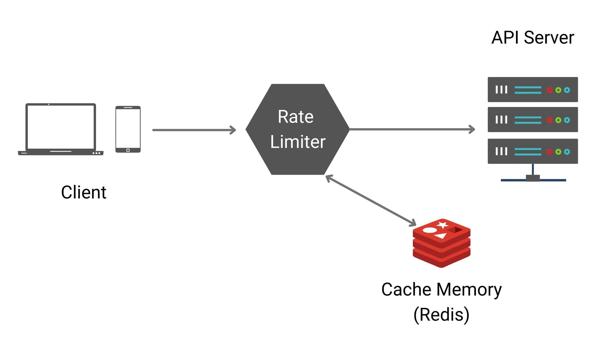
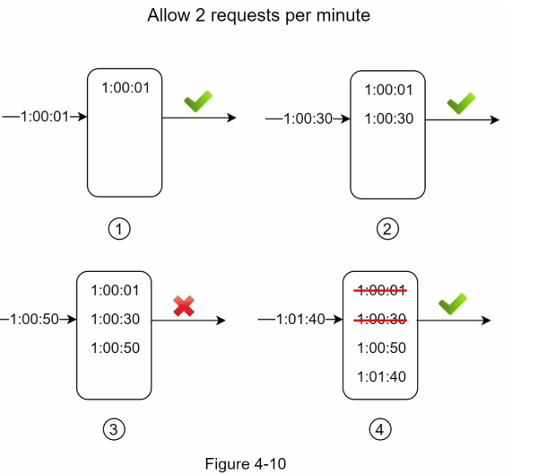
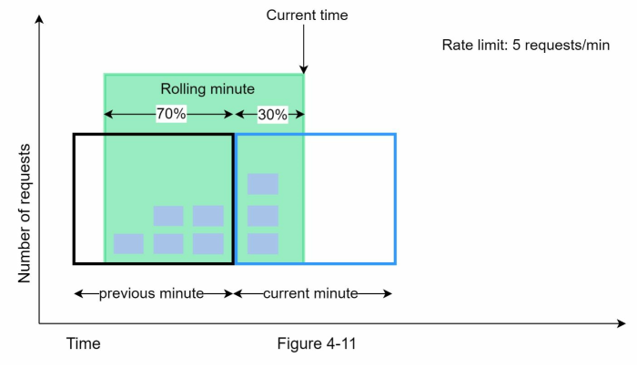
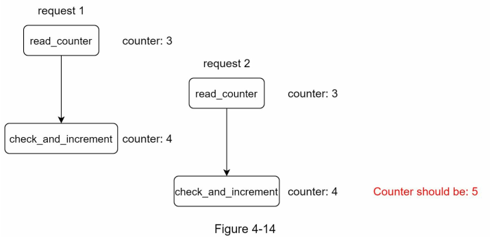
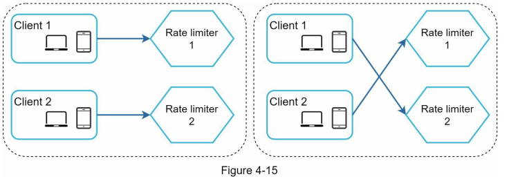
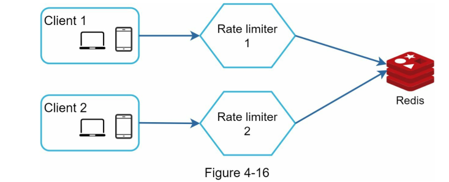
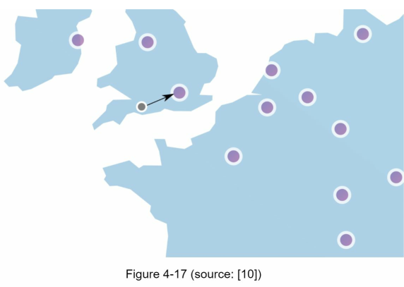

<!-- language: rtl -->
<div dir="rtl" align="right" >

#  **طراحی یک Rate Limiter (محدودکننده نرخ)**

در یک سیستم شبکه‌ای، *Rate Limiter* (محدودکننده نرخ) برای کنترل نرخ ترافیکی که توسط یک کاربر یا یک سرویس ارسال می‌شود، استفاده می‌گردد. در دنیای HTTP، یک Rate Limiter تعداد درخواست‌هایی که یک کلاینت می‌تواند در یک بازه زمانی مشخص ارسال کند را محدود می‌کند. اگر تعداد درخواست‌های API از آستانه تعیین‌شده توسط Rate Limiter فراتر رود، تمام فراخوانی‌های اضافی مسدود می‌شوند.



### مثال‌هایی از کاربرد محدودکننده نرخ:

* یک کاربر نمی‌تواند بیش از **۲ پست در هر ثانیه** ارسال کند.
* از یک آدرس IP مشخص، تنها می‌توان **حداکثر ۱۰ حساب کاربری در یک روز** ایجاد کرد.
* از یک دستگاه خاص، **فقط ۵ بار در هفته** می‌توان پاداش دریافت کرد.

در این فصل، از شما خواسته شده تا یک سیستم Rate Limiter طراحی کنید. پیش از شروع طراحی، ابتدا به مزایای استفاده از Rate Limiter در APIها می‌پردازیم:

---

### مزایای استفاده از Rate Limiter:

#### ۱. **جلوگیری از Starvation منابع ناشی از حملات DoS (Denial of Service - حمله انکار سرویس)**

تقریباً تمامی APIهای منتشر شده توسط شرکت‌های بزرگ فناوری، نوعی از محدودیت نرخ را پیاده‌سازی می‌کنند. به عنوان مثال:

* **توییتر** محدودیت ارسال توییت را به **۳۰۰ توییت در هر ۳ ساعت** محدود کرده است \[2].
* APIهای **Google Docs** به طور پیش‌فرض دارای محدودیت **۳۰۰ درخواست خواندن در هر ۶۰ ثانیه برای هر کاربر** هستند \[3].

محدودکننده نرخ از بروز حملات DoS - چه عمدی و چه غیرعمدی - با مسدود کردن درخواست‌های اضافی جلوگیری می‌کند.

📌 **منبع:**

* \[1] OWASP: Rate Limiting – [https://owasp.org/www-community/Rate\_Limiting](https://owasp.org/www-community/Rate_Limiting)
* \[2] Twitter Rate Limits – [https://developer.twitter.com/en/docs/twitter-api/rate-limits](https://developer.twitter.com/en/docs/twitter-api/rate-limits)
* \[3] Google Docs API Usage Limits – [https://developers.google.com/docs/api/limits](https://developers.google.com/docs/api/limits)

---

#### ۲. **کاهش هزینه‌ها**

محدود کردن درخواست‌های اضافی باعث می‌شود به تعداد کمتری سرور نیاز باشد و منابع بیشتر به APIهای با اولویت بالا تخصیص یابند. Rate Limiting در شرکت‌هایی که از APIهای خارجی پولی استفاده می‌کنند، اهمیت فوق‌العاده‌ای دارد.

برای مثال، در موارد زیر شما به ازای هر فراخوانی هزینه پرداخت می‌کنید:

* بررسی اعتبار مشتری
* انجام پرداخت بانکی
* بازیابی سوابق سلامت کاربر

محدود کردن تعداد فراخوانی‌ها برای کاهش هزینه ضروری است.

---

#### ۳. **جلوگیری از Overload شدن سرورها**

برای کاهش بار سرورها، Rate Limiter می‌تواند درخواست‌های اضافی ناشی از رفتار ناهنجار کاربران یا ربات‌ها را فیلتر کند. این کار باعث می‌شود سیستم در شرایط بار بالا نیز پایدار باقی بماند.

---

📌 **نکته تکمیلی (اضافه شده با رفرنس):**
در سیستم‌های مبتنی بر میکروسرویس‌ها، محدودکننده نرخ می‌تواند در لایه‌ی *API Gateway* یا به‌عنوان یک *middleware* پیاده‌سازی شود. در سرویس‌هایی مانند Amazon API Gateway یا Kong، قابلیت *rate limiting* به صورت توکار وجود دارد (منبع: *Designing Distributed Systems - Brendan Burns, O’Reilly*).

---
# گام اول – درک مسئله و تعیین محدوده طراحی

محدودکننده نرخ (Rate Limiter) را می‌توان با استفاده از الگوریتم‌های مختلفی پیاده‌سازی کرد که هرکدام مزایا و معایب خود را دارند. تعامل بین مصاحبه‌گر و مصاحبه‌شونده به روشن شدن نوع Rate Limiter مورد نظر کمک می‌کند.

---

#### 💬 مکالمه نمونه بین کاندیدا و مصاحبه‌گر:

**کاندیدا:** قرار است چه نوع محدودکننده نرخی طراحی کنیم؟ از نوع کلاینت-ساید است یا API سمت سرور؟

**مصاحبه‌گر:** سوال خوبی است. تمرکز ما روی محدودکننده نرخ سمت سرور (Server-side API Rate Limiter) است.

**کاندیدا:** آیا این Rate Limiter باید بر اساس IP یا شناسه کاربر (User ID) یا ویژگی‌های دیگر درخواست‌ها را محدود کند؟

**مصاحبه‌گر:** این محدودکننده باید به اندازه کافی انعطاف‌پذیر باشد تا بتواند مجموعه‌ای از قوانین مختلف را برای اعمال محدودیت پشتیبانی کند.

**کاندیدا:** مقیاس سیستم چقدر است؟ برای یک استارتاپ کوچک است یا برای یک شرکت بزرگ با کاربران زیاد؟

**مصاحبه‌گر:** سیستم باید توانایی پاسخگویی به تعداد بسیار زیادی از درخواست‌ها را داشته باشد.

**کاندیدا:** آیا این سیستم باید در یک محیط توزیع‌شده (Distributed Environment) کار کند؟

**مصاحبه‌گر:** بله.

**کاندیدا:** آیا Rate Limiter باید به صورت یک سرویس مستقل طراحی شود یا در کد اپلیکیشن قرار گیرد؟

**مصاحبه‌گر:** این یک تصمیم طراحی است که بر عهده شماست.

**کاندیدا:** آیا باید کاربران محدودشده (Throttled Users) را از وضعیتشان آگاه کنیم؟

**مصاحبه‌گر:** بله.

---

### 🧾 جمع‌بندی نیازمندی‌ها (Requirements)

بر اساس گفت‌وگوهای بالا، نیازمندی‌های طراحی سیستم محدودکننده نرخ به شرح زیر است:

1. **محدودسازی دقیق درخواست‌های بیش‌از‌حد:**
   سیستم باید بتواند به‌درستی از درخواست‌های خارج از حد مجاز جلوگیری کند.

2. **تاخیر پایین (Low Latency):**
   محدودکننده نرخ نباید باعث افزایش زمان پاسخ HTTP شود.

3. **حداقل مصرف حافظه (Memory Efficient):**
   استفاده بهینه از حافظه در طراحی بسیار مهم است.

4. **پشتیبانی از توزیع‌پذیری (Distributed Rate Limiting):**
   محدودکننده نرخ باید بتواند به‌صورت مشترک بین چند سرور یا فرآیند اجرا شود.

5. **مدیریت استثناها (Exception Handling):**
   هنگام بلوکه شدن درخواست‌ها، پیام‌های واضح به کاربران نمایش داده شود (مانند HTTP 429 Too Many Requests).

6. **تحمل‌پذیری بالا در برابر خطا (High Fault Tolerance):**
   اگر مشکلی در یکی از اجزای Rate Limiter (مثلاً کش Redis) پیش آمد، نباید کل سیستم تحت تأثیر قرار گیرد.

---

📌 **نکته تکمیلی (اضافه‌شده از منبع معتبر):**
در سیستم‌های توزیع‌شده‌ای که بین چندین نود Rate Limiting پیاده‌سازی می‌شود، استفاده از Redis یا Memcached با TTL و atomic counter به همراه fallback مکانیزم‌ها مانند local in-memory cache توصیه می‌شود (منبع: *Designing Data-Intensive Applications – Martin Kleppmann*).

---
# گام دوم – طراحی سطح بالا و جلب نظر مصاحبه‌گر

برای ساده نگه‌داشتن طرح، ابتدا یک مدل ساده ارتباط بین **Client و Server** را در نظر می‌گیریم. سپس، به این سوال کلیدی می‌پردازیم:

---

### 📌 کجا باید Rate Limiter پیاده‌سازی شود؟

در نگاه اول، Rate Limiter را می‌توان در یکی از دو جایگاه زیر پیاده‌سازی کرد:

#### ۱. پیاده‌سازی در سمت کلاینت (Client-side)

* به طور کلی، **سمت کلاینت مکان قابل اعتمادی برای اجرای محدودکننده نرخ نیست**، زیرا:

  * درخواست‌ها از سمت کلاینت به‌راحتی می‌توانند توسط کاربران مخرب (malicious users) جعل شوند.
  * ممکن است کنترل کاملی بر پیاده‌سازی کلاینت نداشته باشیم (مانند اپ‌های شخص ثالث).

#### ۲. پیاده‌سازی در سمت سرور (Server-side)

* در این حالت، Rate Limiter در مسیر رسیدن درخواست به API سرور قرار می‌گیرد.


#### ۳. راهکار جایگزین: پیاده‌سازی به‌عنوان Middleware

* به‌جای پیاده‌سازی مستقیم در سرورهای API، می‌توان از یک **Middleware** برای کنترل نرخ درخواست‌ها استفاده کرد.
* این معماری به شکل زیر عمل می‌کند:

  * کلاینت‌ها درخواست خود را به Middleware ارسال می‌کنند.
  * Middleware نقش واسط را ایفا کرده و قبل از رسیدن درخواست به سرور API، آن را بررسی می‌کند.
  * اگر تعداد درخواست‌ها از حد مجاز عبور کرده باشد، پاسخ `HTTP 429 Too Many Requests` بازمی‌گردد.


---

### 🎯 مثال عملکردی از محدودکننده نرخ

برای درک بهتر، به مثالی از **نمودار Figure 4-3** توجه کنید:

فرض کنیم در طراحی ما، هر کاربر فقط **۲ درخواست در ثانیه** مجاز است. حال، کلاینتی در عرض یک ثانیه **۳ درخواست** ارسال می‌کند:

* دو درخواست اول توسط Middleware مجاز دانسته شده و به API Server ارسال می‌شوند.
* درخواست سوم به دلیل نقض محدودیت، توسط Middleware رد شده و کد HTTP 429 به کاربر بازگردانده می‌شود.


---

### 💡 معماری‌های واقعی: Rate Limiting در API Gateway

در معماری‌های مدرن مبتنی بر **microservice**، استفاده از **API Gateway** به‌شدت رایج است. این Gateway معمولاً قابلیت‌های زیر را فراهم می‌کند:

* Rate Limiting
* SSL Termination
* Authentication
* IP Whitelisting
* سرویس‌دهی به محتوای ایستا (Static Content)

به‌عنوان نمونه، می‌توان به سرویس‌های زیر اشاره کرد که به‌صورت مدیریت‌شده API Gateway ارائه می‌دهند:

* **AWS API Gateway**
* **Kong API Gateway**
* **NGINX Gateway with Lua scripting**
* **Google Cloud Endpoints**

📚 *(منبع: \[4] Cloud Microservices Architecture, Martin Fowler – martinfowler.com)*

---

### ⚖️ تصمیم‌گیری در مورد محل پیاده‌سازی Rate Limiter

هیچ پاسخ قطعی برای محل پیاده‌سازی Rate Limiter وجود ندارد. اما نکات زیر راهنمای خوبی هستند:

| نکته طراحی                    | توضیح                                                                                                                          |
| ----------------------------- | ------------------------------------------------------------------------------------------------------------------------------ |
| **تکنولوژی موجود**            | بررسی کنید که زبان برنامه‌نویسی و کش فعلی پروژه برای پیاده‌سازی Rate Limiter مناسب باشد (مثلاً Redis + Python یا Golang).      |
| **انعطاف در انتخاب الگوریتم** | اگر از Gatewayهای شخص ثالث استفاده می‌کنید، ممکن است فقط برخی الگوریتم‌ها قابل تنظیم باشند. ولی در سمت سرور، کنترل کامل دارید. |
| **معماری فعلی**               | اگر معماری شما هم‌اکنون API Gateway دارد، می‌توانید به‌راحتی Rate Limiting را به آن اضافه کنید.                                |
| **منابع مهندسی**              | پیاده‌سازی Rate Limiter سفارشی نیاز به زمان و نیرو دارد. در نبود منابع کافی، استفاده از API Gateway آماده توصیه می‌شود.        |

---

# الگوریتم‌های محدودسازی نرخ (Rate Limiting Algorithms)

برای پیاده‌سازی Rate Limiting می‌توان از الگوریتم‌های مختلفی استفاده کرد که هر یک **مزایا و معایب خاص خود** را دارند. اگرچه تمرکز این فصل بر روی جزئیات الگوریتم‌ها نیست، اما درک مفاهیم سطح بالای آن‌ها به ما کمک می‌کند تا بسته به **موارد کاربردی (use case)** مناسب‌ترین الگوریتم یا ترکیبی از آن‌ها را انتخاب کنیم.

---

### ✅ فهرست الگوریتم‌های رایج:

---

#### 1. **Token Bucket (سطل توکن)**

* **مفهوم**: یک سطل حاوی توکن‌ها داریم که با سرعت ثابتی پر می‌شود. هر بار که یک درخواست می‌رسد، یک توکن مصرف می‌شود. اگر توکن وجود نداشته باشد، درخواست رد می‌شود.
* **مزایا**:

  * پشتیبانی از انفجارهای کوتاه (burst)
  * کنترل نرخ متوسط و اجازه به درخواست‌های ناگهانی در بازه کوتاه
* **کاربرد رایج**: مناسب برای APIهایی که امکان افزایش ناگهانی ترافیک دارند.
* 📚 *منبع: RFC 2697 (A Single Rate Three Color Marker)*

---

#### 2. **Leaky Bucket (سطل چکه‌ای)**

* **مفهوم**: مشابه سطل آب است که با نرخ ثابتی نشت می‌کند. اگر تعداد درخواست‌ها بیش از ظرفیت سطل باشد، درخواست‌های اضافی حذف می‌شوند.
* **مزایا**:

  * یکنواخت‌سازی بار ترافیکی (smoothing traffic)
  * جلوگیری از انفجارهای ناگهانی
* **معایب**:

  * به اندازه Token Bucket انعطاف‌پذیر نیست.
* **کاربرد رایج**: کنترل ترافیک در سیستم‌های بانکی یا ثبت لاگ پایدار.

---

#### 3. **Fixed Window Counter (شمارنده با پنجره زمانی ثابت)**

* **مفهوم**: درخواست‌ها در بازه‌های زمانی ثابت (مثلاً هر دقیقه) شمارش می‌شوند. اگر تعداد آن‌ها از آستانه بیشتر شود، رد می‌شوند.
* **مزایا**:

  * پیاده‌سازی ساده
* **معایب**:

  * امکان حمله انفجاری در مرز پنجره‌ها (Request Burst at boundary)
* **کاربرد رایج**: مناسب برای محدودیت‌های ساده بر اساس IP یا User ID.

---

#### 4. **Sliding Window Log (لاگ با پنجره لغزان)**

* **مفهوم**: زمان هر درخواست در یک لیست ذخیره می‌شود و در هر بار بررسی، درخواست‌هایی که در بازه لغزان (مثلاً 60 ثانیه اخیر) هستند شمارش می‌شوند.
* **مزایا**:

  * دقت بالا
* **معایب**:

  * مصرف بالای حافظه (ذخیره‌سازی timestamps)
* **کاربرد رایج**: سیستم‌هایی با نیاز به کنترل دقیق نرخ بر اساس زمان.

---

#### 5. **Sliding Window Counter (شمارنده با پنجره لغزان)**

* **مفهوم**: شبیه به Fixed Window، ولی دو پنجره زمانی مجاور را در نظر می‌گیرد و بر اساس میانگین وزن‌دار، تعداد درخواست‌ها را می‌سنجد.
* **مزایا**:

  * دقت بیشتر نسبت به Fixed Window
  * مصرف حافظه کمتر از Sliding Log
* **کاربرد رایج**: سیستم‌هایی با نیاز به تعادل بین دقت و عملکرد.

---

### 🎯 نتیجه‌گیری و انتخاب مناسب

| الگوریتم        | دقت           | مصرف حافظه | پشتیبانی از Burst | مناسب برای                 |
| --------------- | ------------- | ---------- | ----------------- | -------------------------- |
| Token Bucket    | متوسط         | کم         | بله               | APIهای عمومی               |
| Leaky Bucket    | متوسط         | کم         | خیر               | پردازش پایدار              |
| Fixed Window    | پایین         | بسیار کم   | خیر               | موارد ساده                 |
| Sliding Log     | بالا          | بالا       | بله               | امنیت و کنترل دقیق         |
| Sliding Counter | متوسط به بالا | متوسط      | بله               | استفاده عمومی با دقت متوسط |

---

📚 منابع:

* [Rate Limiting Algorithms – Cloudflare Blog](https://blog.cloudflare.com/rate-limiting-algorithms/)
* [High Scalability – Design Patterns for Rate Limiting](http://highscalability.com/blog/2016/4/20/design-patterns-for-rate-limiting.html)
* [AWS Rate Limiting Techniques – AWS Architecture Blog](https://aws.amazon.com/architecture)

---
### الگوریتم Token Bucket (سطل توکن)


الگوریتم **Token Bucket** یکی از پرکاربردترین و ساده‌ترین الگوریتم‌ها برای پیاده‌سازی **Rate Limiting** است. این الگوریتم به‌طور گسترده در شرکت‌های بزرگ اینترنتی استفاده می‌شود. به عنوان مثال، شرکت‌های **Amazon** \[منبع: Amazon API Gateway Throttling \[5]] و **Stripe** \[منبع: Stripe API Rate Limits \[6]] از این الگوریتم برای کنترل نرخ درخواست‌های API خود استفاده می‌کنند.

---

## 👈 نحوه کار الگوریتم Token Bucket:

* یک **سطل توکن (Token Bucket)**، در واقع یک ظرف با ظرفیت از پیش تعیین‌شده است.
* این سطل به‌صورت **دوره‌ای (periodically)** با **توکن‌هایی** که نماینده مجوز ارسال درخواست هستند، **پر می‌شود**.
* اگر سطل پر شود، توکن‌های اضافی **دور ریخته می‌شوند (overflow)** و وارد سطل نمی‌شوند.

* هر درخواست HTTP، **یک توکن مصرف می‌کند**.
* اگر **توکن کافی** در سطل باشد، توکن کم شده و درخواست **اجازه عبور پیدا می‌کند**.
* اگر **توکن کافی نباشد**، درخواست **رد می‌شود** (Throttle/Drop).


---

### 🔢 پارامترهای کلیدی الگوریتم:

1. **Bucket Size (ظرفیت سطل)**
   بیشترین تعداد توکنی که می‌تواند در سطل نگهداری شود.

2. **Refill Rate (نرخ پرشدن)**
   نرخی که در آن توکن‌ها به‌صورت ثابت وارد سطل می‌شوند، مثلاً 4 توکن در هر دقیقه.

---

### 🎯 مثال از عملکرد:

فرض کنیم:

* ظرفیت سطل = 4 توکن
* نرخ پر شدن = 2 توکن در هر ثانیه

در این صورت، هر ثانیه دو توکن به سطل اضافه می‌شود تا زمانی که سطل به ظرفیت ۴ برسد. حال اگر در یک ثانیه 3 درخواست برسد:

* 2 درخواست اول توکن دریافت می‌کنند و عبور می‌کنند.
* درخواست سوم چون توکن نیست، **رد خواهد شد (HTTP 429)**.


---

### 🧮 محاسبه تعداد سطل‌های مورد نیاز:

تعداد سطل‌ها بستگی به **سیاست‌های محدودسازی نرخ** دارد:

* اگر برای هر endpoint نرخ جداگانه تعریف شده باشد، برای هر **user و endpoint** باید **یک سطل مجزا** داشته باشیم.
  مثال:

  * پست گذاشتن: 1 بار در ثانیه
  * افزودن دوست: 150 بار در روز
  * لایک کردن: 5 بار در ثانیه
    نتیجه → ۳ سطل برای هر کاربر

* اگر محدودسازی بر اساس IP باشد، برای **هر آدرس IP یک سطل** لازم است.

* اگر یک سقف کلی برای کل سیستم در نظر گرفته شود (مثلاً 10,000 درخواست در ثانیه)، یک **سطل جهانی (global bucket)** مشترک بین همه کاربران کافی است.

---

### ✅ مزایا (Pros):

* **پیاده‌سازی ساده**
* **مصرف کم حافظه**
* **پشتیبانی از ترافیک انفجاری (Burst Traffic)** برای مدت کوتاه
  (تا وقتی توکن باشد، درخواست مجاز است حتی اگر فراتر از نرخ لحظه‌ای باشد.)

---

### ❌ معایب (Cons):

* نیاز به **تنظیم بهینه دو پارامتر**:

  * ظرفیت سطل (bucket size)
  * نرخ پر شدن (refill rate)

  اگر این مقادیر به‌درستی تنظیم نشوند، یا بیش‌ازحد سختگیرانه می‌شوند یا بیش‌ازحد گشاده‌دست، که هر دو می‌توانند تجربه کاربری را تحت تأثیر قرار دهند.

---

📚 **منابع:**

* \[5] Amazon API Gateway – Throttle API Requests: [https://docs.aws.amazon.com/apigateway/latest/developerguide/api-gateway-request-throttling.html](https://docs.aws.amazon.com/apigateway/latest/developerguide/api-gateway-request-throttling.html)
* \[6] Stripe API Rate Limiting: [https://stripe.com/docs/rate-limits](https://stripe.com/docs/rate-limits)
* [Designing a Scalable Rate Limiter – High Scalability Blog](http://highscalability.com/blog/2016/4/20/design-patterns-for-rate-limiting.html)
* [Google API Quotas](https://developers.google.com/docs/api/limits)

---

🔍 **نکته تکمیلی**: در مقایسه با سایر الگوریتم‌ها، Token Bucket بیشتر برای کاربردهایی مناسب است که **ترافیک ناگهانی و انفجاری** داشته و نیاز به کنترل آن وجود دارد ولی در عین حال نباید مانع از ارسال درخواست‌های منطقی و مجاز شود.

## الگوریتم Leaking Bucket (سطل نشت‌پذیر)

الگوریتم **Leaking Bucket** (سطل نشت‌پذیر) از نظر مفهومی شبیه به الگوریتم **Token Bucket** است، با این تفاوت که در این الگوریتم **پردازش درخواست‌ها با نرخ ثابت انجام می‌شود**. این ویژگی باعث می‌شود که Leaking Bucket برای سناریوهایی که **خروجی یکنواخت و پایدار (Stable Outflow Rate)** نیاز دارند، بسیار مناسب باشد.

---

### 👈 نحوه عملکرد الگوریتم Leaking Bucket:

* این الگوریتم معمولاً با استفاده از یک **صف به صورت FIFO (First-In-First-Out)** پیاده‌سازی می‌شود.
* زمانی که یک درخواست وارد سیستم می‌شود:

  * اگر **صف پر نباشد**، درخواست به **صف افزوده می‌شود**.
  * اگر **صف پر باشد**، درخواست **رد (drop)** می‌شود.
* درخواست‌ها از صف با یک **نرخ خروج ثابت (Outflow Rate)** پردازش می‌شوند.


---

### 🔢 پارامترهای کلیدی الگوریتم:

1. **Bucket Size (ظرفیت سطل)**
   همان اندازه صف است و مشخص می‌کند چند درخواست در انتظار پردازش می‌توانند باشند.

2. **Outflow Rate (نرخ خروج)**
   تعیین می‌کند چند درخواست در یک بازه زمانی مشخص (مثلاً در هر ثانیه) می‌توانند از صف خارج و پردازش شوند.

---

### 🛒 مثال واقعی:

شرکت تجارت الکترونیک **Shopify** از الگوریتم **Leaking Bucket** برای پیاده‌سازی **Rate Limiting** در زیرساخت‌های خود استفاده می‌کند.
📚 منبع: \[7] Shopify Rate Limits – [https://shopify.dev/docs/api/usage/rate-limits](https://shopify.dev/docs/api/usage/rate-limits)

---

### ✅ مزایا (Pros):

* **استفاده بهینه از حافظه** به‌دلیل صف با اندازه محدود.
* **پردازش پایدار** و یکنواخت درخواست‌ها، مناسب برای سیستم‌هایی که نیاز به **خروجی با نرخ مشخص** دارند، مثل پردازش تراکنش‌های مالی یا لاگ سرورها.

---

### ❌ معایب (Cons):

* در شرایط **ترافیک انفجاری (Burst Traffic)**، صف سریع پر می‌شود و درخواست‌های قدیمی در صف باقی می‌مانند؛ در نتیجه، **درخواست‌های جدیدتر نیز رد می‌شوند** حتی اگر منطقی‌تر باشند.
* مانند الگوریتم Token Bucket، **تنظیم دقیق دو پارامتر اصلی** (اندازه سطل و نرخ خروج) ممکن است چالش‌برانگیز باشد.

---

### 🔍 نکته تکمیلی:

الگوریتم Leaking Bucket برخلاف Token Bucket **اجازه ترافیک انفجاری (burst)** را نمی‌دهد و همواره تلاش می‌کند **خروجی یکنواختی** داشته باشد. بنابراین، اگر سیستمی دارید که ظرفیت محدودی برای پردازش هم‌زمان دارد، استفاده از Leaky Bucket انتخاب بهتری نسبت به Token Bucket خواهد بود.

---

📚 منابع:

* \[7] Shopify API Rate Limits: [https://shopify.dev/docs/api/usage/rate-limits](https://shopify.dev/docs/api/usage/rate-limits)
* [Designing Scalable Rate Limiting – Cloudflare Engineering Blog](https://blog.cloudflare.com/counting-things-a-lot-of-different-things/)
* [Rate Limiting Algorithms – Stripe Docs](https://stripe.com/docs/rate-limits)

---

📝 مقایسه سریع:

| ویژگی              | Token Bucket      | Leaking Bucket             |
| ------------------ | ----------------- | -------------------------- |
| پشتیبانی از Burst  | دارد ✅            | ندارد ❌                    |
| نرخ خروجی          | انعطاف‌پذیر       | ثابت                       |
| پیچیدگی پیاده‌سازی | پایین             | متوسط                      |
| مناسب برای         | API با انعطاف نرخ | پردازش‌های محدود و یکنواخت |

---
در ادامه کد کامل الگوریتم **Leaking Bucket** با استفاده از Redis و زبان Python آورده شده است. این پیاده‌سازی بر پایه یک **صف (FIFO queue)** برای نگه‌داری درخواست‌ها و زمان‌های آن‌ها در Redis است. سپس درخواست‌ها با نرخ ثابت پردازش می‌شوند.

---

### 📌 ویژگی‌های این پیاده‌سازی:

* استفاده از Redis لیست (List) برای پیاده‌سازی صف.
* نرخ خروجی (outflow rate) ثابت است.
* درخواست‌ها در صورت پر بودن صف رد می‌شوند.

---

### 🧱 پیش‌نیاز

```bash
pip install redis
```

---

### 📄 فایل: `leaky_bucket.py`

```python
import redis
import time

class LeakyBucketRateLimiter:
    def __init__(self, redis_client, bucket_key: str, capacity: int, outflow_rate_per_sec: float):
        self.redis = redis_client
        self.bucket_key = bucket_key         # کلید bucket در Redis
        self.capacity = capacity             # ظرفیت صف
        self.outflow_rate = outflow_rate_per_sec  # نرخ خروج بر حسب درخواست در ثانیه
        self.last_drip_key = f"{bucket_key}:last_drip"

    def _drip(self):
        # حذف آیتم‌های قدیمی بر اساس نرخ خروج
        now = time.time()
        last_drip = self.redis.get(self.last_drip_key)
        last_drip = float(last_drip) if last_drip else now

        elapsed = now - last_drip
        leak_count = int(elapsed * self.outflow_rate)

        if leak_count > 0:
            for _ in range(leak_count):
                self.redis.lpop(self.bucket_key)
            self.redis.set(self.last_drip_key, now)

    def allow_request(self) -> bool:
        self._drip()

        current_length = self.redis.llen(self.bucket_key)
        if current_length < self.capacity:
            self.redis.rpush(self.bucket_key, time.time())
            return True
        else:
            return False
```

---

### 🧪 استفاده از Rate Limiter

```python
if __name__ == "__main__":
    r = redis.Redis(host='localhost', port=6379, db=0)
    
    # ظرفیت 10، نرخ خروج 2 درخواست بر ثانیه
    limiter = LeakyBucketRateLimiter(
        redis_client=r,
        bucket_key="leaky:bucket:ip:192.168.1.100",
        capacity=10,
        outflow_rate_per_sec=2
    )

    for i in range(20):
        allowed = limiter.allow_request()
        print(f"Request {i+1} allowed: {allowed}")
        time.sleep(0.2)  # درخواست‌های سریع‌تر از نرخ خروج
```

---

### 🧠 نکات فنی و مزایا:

| مورد          | توضیح                                                                          |
| ------------- | ------------------------------------------------------------------------------ |
| صف FIFO       | پیاده‌سازی شده با Redis List (`rpush` و `lpop`)                                |
| نرخ ثابت خروج | از روی اختلاف زمانی بین `last_drip` و `now` محاسبه می‌شود                      |
| مناسب برای    | سناریوهایی که نیاز به پردازش با نرخ یکنواخت دارند (مثل صف ایمیل، چاپ، API کند) |

---

### 📚 منابع معتبر برای درک عمیق‌تر:

* [Redis Data Structures](https://redis.io/docs/data-types/)
* کتاب Designing Data-Intensive Applications (Martin Kleppmann) — فصل مربوط به Rate Limiting
* مقاله رسمی Shopify: [Rate Limiting at Shopify](https://engineering.shopify.com/blogs/engineering/rate-limiting-shopify)

---

اگر نیاز به نسخه **Distributed** یا با **Token TTL سفارشی** داری یا بخواهی با **Lua Script** برای اتمیک بودن بهتر کار کنی، اطلاع بده تا نسخه پیشرفته‌تر نیز ارائه شود.


## الگوریتم Fixed Window Counter (شمارنده‌ی پنجره‌ی ثابت)

الگوریتم **Fixed Window Counter** یکی از ساده‌ترین روش‌های پیاده‌سازی **Rate Limiting** است که از طریق تقسیم بازه زمانی به **پنجره‌های زمانی ثابت** و شمارش تعداد درخواست‌ها در هر پنجره، نرخ درخواست‌ها را کنترل می‌کند.

---

### 👈 نحوه عملکرد الگوریتم:

* خط زمانی به **بازه‌های زمانی با طول ثابت** (مثلاً ۱ ثانیه، ۱ دقیقه) تقسیم می‌شود.
* برای هر پنجره‌ی زمانی، یک **شمارنده** در نظر گرفته می‌شود.
* **هر درخواست دریافتی، مقدار شمارنده‌ی آن پنجره را یک واحد افزایش می‌دهد.**
* اگر مقدار شمارنده به آستانه تعیین‌شده (threshold) برسد، **درخواست‌های اضافی تا آغاز پنجره بعدی رد می‌شوند.**

---

### 🔢 مثال ملموس:

فرض کنید سیستم حداکثر اجازه‌ی ۳ درخواست در هر ثانیه را دارد. در هر پنجره‌ی یک‌ثانیه‌ای، تنها ۳ درخواست مجاز است. اگر بیشتر از ۳ درخواست وارد شود، مابقی **رد می‌شوند**.


---

### ⚠️ مسئله مهم: لبه‌های پنجره (Edge Effect)

یکی از مشکلات اصلی این الگوریتم، **ترافیک انفجاری (Burst Traffic)** در لبه‌های پنجره‌های زمانی است. در این حالت، تعداد درخواست‌هایی که از سیستم عبور می‌کنند ممکن است **بیشتر از ظرفیت مجاز** باشد.

🔍 مثال:

فرض کنید حداکثر ۵ درخواست در هر دقیقه مجاز است. در شکل **Figure 4-9**:

* بین ساعت ۲:۰۰:۰۰ تا ۲:۰۱:۰۰، پنج درخواست ارسال شده‌اند.
* بین ۲:۰۱:۰۰ تا ۲:۰۲:۰۰، پنج درخواست دیگر ارسال شده‌اند.

اما در بازه‌ی ترکیبی **۲:۰۰:۳۰ تا ۲:۰۱:۳۰**، عملاً **۱۰ درخواست** عبور کرده‌اند، که **دو برابر حد مجاز** است. این اتفاق به دلیل تنظیم شمارنده بر اساس دقیقه‌های گرد (مانند `HH:MM:00`) رخ می‌دهد و به آن **Edge Effect** گفته می‌شود.


---

### ✅ مزایا (Pros):

* **پیاده‌سازی ساده** و **درک آسان**.
* **مصرف کم حافظه**، زیرا تنها نیاز به نگه‌داشتن شمارنده برای هر پنجره‌ی زمانی داریم.
* **مناسب برای مواردی که محدودیت زمانی دقیق** (مثلاً ۱ دقیقه‌ای یا ۱ ساعته) نیاز است و **تغییرات نرخ درخواست‌ها خیلی مهم نیست**.

---

### ❌ معایب (Cons):

* در لبه‌های پنجره، ممکن است سیستم **بیش از حد مجاز درخواست را بپذیرد** (Edge Effect).
* **عدم تحمل انفجار ترافیکی در زمان کوتاه**.

---

### 📌 نکته تکمیلی:

الگوریتم **Fixed Window** زمانی مفید است که:

* درخواست‌ها پراکندگی یکنواخت داشته باشند.
* محدودیت دقیق و ساده (مثلاً "۵ درخواست در دقیقه") مهم‌تر از کنترل دقیق بار در هر لحظه باشد.

در غیر این‌صورت، استفاده از الگوریتم‌هایی مثل **Sliding Window** یا **Token Bucket** برای کنترل بهتر بار و کاهش مشکلات لبه‌ای توصیه می‌شود.

---

📚 منابع:

* [Rate Limiting Strategies and Algorithms - Cloudflare](https://blog.cloudflare.com/counting-things-a-lot-of-different-things/)
* [API Rate Limiting – Stripe](https://stripe.com/docs/rate-limits)
* [YouTube Engineering – Throttle Requests at Scale](https://youtubeeng.blogspot.com/2017/07/how-youtube-scales-rate-limiting.html)

---
الگوریتم **Sliding Window Log** یکی از دقیق‌ترین روش‌های پیاده‌سازی Rate Limiting است که مشکل الگوریتم **Fixed Window Counter** را حل می‌کند. در ادامه این الگوریتم را مرحله‌به‌مرحله و با جزئیات کامل برایت توضیح می‌دهم:


---
## الگوریتم Sliding Window Log (ثبت زمانی پنجره‌ لغزان)

همان‌طور که پیش‌تر بحث شد، الگوریتم **Fixed Window Counter** (شمارنده‌ پنجره‌ی ثابت) یک مشکل اساسی دارد: این الگوریتم اجازه می‌دهد تعداد بیشتری درخواست در نقاط مرزی بین دو پنجره زمانی عبور کنند.
الگوریتم **Sliding Window Log** (ثبت زمانی در پنجره‌ لغزان) این مشکل را برطرف می‌کند.

نحوه عملکرد الگوریتم به این صورت است:

* الگوریتم تمام **timestamp**‌های درخواست‌ها (برچسب‌های زمانی) را نگه‌ می‌دارد. این داده‌ها معمولاً در **cache** (حافظه نهان) نگه‌داری می‌شوند، مانند **مجموعه‌های مرتب (Sorted Set)** در **Redis** \[منبع: Redis Documentation, [https://redis.io/docs/latest/data-types/sorted-sets/](https://redis.io/docs/latest/data-types/sorted-sets/)].

* وقتی یک درخواست جدید وارد می‌شود، تمام **timestamp**های منقضی‌شده (قدیمی‌تر از ابتدای پنجره زمانی جاری) از log حذف می‌شوند.

* برچسب زمانی درخواست جدید به log اضافه می‌شود.

* اگر اندازه‌ی log برابر یا کمتر از حد مجاز باشد، درخواست پذیرفته می‌شود. در غیر این صورت، درخواست رد می‌شود.

---
## 📊 پارامترهای ورودی:

| پارامتر           | توضیح                                               |
| ----------------- | --------------------------------------------------- |
| `max_requests`    | حداکثر تعداد درخواست مجاز در بازه زمانی مشخص        |
| `time_window_sec` | مدت زمان پنجره لغزان (مثلاً ۶۰ ثانیه برای یک دقیقه) |

---


#### مثال (مطابق با تصویر شکل ۴-۱۰)

فرض کنیم محدودیت نرخ ما به این صورت است: فقط **۲ درخواست در هر دقیقه** مجاز است.
اگرچه در واقعیت، timestampها معمولاً در قالب یونیکس (Unix timestamp) ذخیره می‌شوند، اما برای خوانایی بهتر، از زمان قابل‌خواندن انسانی در مثال استفاده می‌کنیم:

* در ساعت **۱:۰۰:۰۱**، log خالی است، بنابراین درخواست پذیرفته می‌شود.

* در ساعت **۱:۰۰:۳۰**، زمان ۱:۰۰:۳۰ به log افزوده می‌شود. اکنون log دارای ۲ timestamp است، که کمتر یا برابر با حد مجاز است. بنابراین درخواست پذیرفته می‌شود.

* در ساعت **۱:۰۰:۵۰**، یک timestamp جدید به log اضافه می‌شود و اندازه log به ۳ می‌رسد، که از حد مجاز بیشتر است. بنابراین این درخواست رد می‌شود، اگرچه timestamp آن همچنان در log باقی می‌ماند.

* در ساعت **۱:۰۱:۴۰**، فقط timestampهایی که در بازه \[۱:۰۰:۴۰ تا ۱:۰۱:۴۰) هستند معتبر محسوب می‌شوند. در نتیجه، timestampهای ۱:۰۰:۰۱ و ۱:۰۰:۳۰ منقضی هستند و از log حذف می‌شوند. پس از این حذف، اندازه log برابر با ۲ می‌شود و درخواست جدید پذیرفته می‌شود.


##### فرض: محدودیت ۲ درخواست در هر ۶۰ ثانیه



| زمان درخواست | وضعیت لاگ (timestamps)            | نتیجه  |
| ------------ | --------------------------------- | ------ |
| 1:00:01      | \[1:00:01]                        | ✅ مجاز |
| 1:00:30      | \[1:00:01, 1:00:30]               | ✅ مجاز |
| 1:00:50      | \[1:00:01, 1:00:30, 1:00:50]      | ❌ رد   |
| 1:01:40      | \[1:00:50, 1:01:40] ← حذف‌های قبل | ✅ مجاز |


---

### مزایا (Pros):

* محدودسازی نرخ توسط این الگوریتم **دقیق‌ترین** نوع است. در هر پنجره‌ زمانی متحرک (rolling window)، تعداد درخواست‌ها هرگز از حد مجاز تجاوز نمی‌کند.

* الگوریتم برای سیستم‌هایی با نیاز به **دقت بالا در نرخ درخواست‌ها** بسیار مناسب است، به‌خصوص در سیستم‌هایی که کاربران زیادی دارند و محدودیت منابع حیاتی است.

---

### معایب (Cons):

* این الگوریتم مقدار زیادی حافظه مصرف می‌کند، چون حتی اگر یک درخواست رد شود، ممکن است **timestamp** آن همچنان در حافظه باقی بماند.

* در مقیاس بالا، مدیریت logهای زمانی برای هر کاربر و هر endpoint می‌تواند هزینه‌بر باشد و نیاز به **بهینه‌سازی در ذخیره‌سازی و حذف داده‌ها** دارد.

---

### ابزارهای پیشنهادی برای پیاده‌سازی واقعی:

| ابزار                                   | کاربرد در Sliding Window Log                                   | مزایا                                                      |
| --------------------------------------- | -------------------------------------------------------------- | ---------------------------------------------------------- |
| **Redis Sorted Set**                    | ذخیره و مدیریت timestamp درخواست‌ها                            | سریع، پشتیبانی از TTL و پاک‌سازی خودکار                    |
| **Nginx + Lua module**                  | قرار دادن منطق rate limit در reverse proxy                     | بسیار سریع و سبک برای edge level                           |
| **Envoy Proxy**                         | پیاده‌سازی rate limiting با integration در سرویس‌های gRPC/REST | مناسب برای معماری microservices                            |
| **Kong Gateway + Rate Limiting Plugin** | پیاده‌سازی سطح بالا برای محدودسازی API                         | قابل تنظیم برای چند الگوریتم، پشتیبانی از Redis و database |

## 📦 ابزارهای واقعی برای پیاده‌سازی:

| ابزار           | قابلیت مرتبط                                                       |
| --------------- | ------------------------------------------------------------------ |
| **Redis**       | استفاده از ساختار داده `Sorted Set` برای ذخیره timestamps مرتب‌شده |
| **Nginx + Lua** | می‌توان Sliding Window Log را با Lua روی Nginx پیاده‌سازی کرد      |
| **Envoy**       | پشتیبانی داخلی از Rate Limiting مبتنی بر sliding window            |

---

## 💡 مقایسه سریع با سایر الگوریتم‌ها:

| الگوریتم               | دقت   | حافظه    | پشتیبانی از burst | مناسب برای     |
| ---------------------- | ----- | -------- | ----------------- | -------------- |
| Token Bucket           | متوسط | کم       | بله               | استفاده عمومی  |
| Leaking Bucket         | پایین | کم       | خیر               | نرخ خروجی ثابت |
| Fixed Window Counter   | پایین | بسیار کم | خیر               | سیستم‌های ساده |
| **Sliding Window Log** | بالا  | بالا     | محدود             | سرویس‌های حساس |
### پیشنهاد مهندسی برای پروژه‌های مقیاس‌پذیر:

در پروژه‌هایی با بار بالا، الگوریتم Sliding Window Log معمولاً با ابزارهای **شمارش زمان‌دار (time-series)** مانند **InfluxDB** یا **Redis TimeSeries Module** ترکیب می‌شود تا ذخیره‌سازی و پردازش بهینه‌تری صورت گیرد (منبع: [RedisTimeSeries Documentation](https://redis.io/docs/latest/stack/timeseries/)).

همچنین در پلتفرم‌های ابری مانند **AWS API Gateway**، به‌صورت native امکان تنظیم sliding window rate limits با ابزارهایی مانند WAF وجود دارد.

الان مقاله‌ی مورد نظر شما از **Medium** با عنوان **"Rate Limiting: The Sliding Window Algorithm"** را بررسی کردم ([medium.com][1]). در ادامه، توضیحات دقیق و سازمان‌یافته‌ای همراه با مثال، مزایا/معایب، و ابزارهای عملی ارائه می‌دهم:

---

#### 🧭 مروری بر مقاله

* نویسنده (Mohamed El‑Bably) الگوریتم **Sliding Window** را معرفی می‌کند که هدف آن **مدیریت نرخ درخواست** (Rate Limiting) با استفاده از بازه زمانی متحرک (Sliding Window) است. ([medium.com][1])
* الگوریتم با **یادداشت timestamp هر درخواست** و **حذف timestampهای خارج‌شده از پنجره**، تعداد درخواست‌های اخیر را شمارش می‌کند.
* اگر تعداد درخواست‌ها در پنجره از حد مجاز بیشتر باشد، درخواست جدید **رد می‌شود**؛ در غیر این‌صورت **پذیرفته می‌شود**. ([stackoverflow.com][2])

---


### # 🛠 گام‌های الگوریتم در یک نگاه:

1. **Time Window ثابت** مشخص می‌شود (مثلاً ۶۰ ثانیه).
2. **Counter** تعداد درخواست‌ها در بازهٔ کنونی نگهداری می‌شود.
3. **ذخیره‌سازی** timestampهای درخواست‌ها در Redis یا دیتاستوری با قابلیت‌ تراکنش.
4. در هنگام هربار دریافت درخواست:

   * timestampهای خارج از بازه زمانی حذف می‌شوند.
   * timestamp جدید اضافه می‌شود.
   * تعداد timestampها بررسی می‌شود؛ اگر کمتر از حد مجاز باشد، درخواست پذیرفته می‌شود، وگرنه رد می‌شود.&#x20;

---

### # ✅ مزایا (Benefits)

* کنترل دقیق نرخ درخواست به‌صورت لحظه‌ای؛ تعداد درخواست‌ها **هیچ‌گاه از حد مجاز بیشتر نمی‌شود**.
* **عدم نیاز به ریست دوره‌ای شمارنده**، زیرا window به‌صورت خودکار حرکت می‌کند.
* مناسب برای جلوگیری از **ترافیک انفجاری** و **حملات DDoS یا brute force**. ([rdiachenko.com][3], [medium.com][1])

---

####  ⚠️ معایب (Drawbacks)

* مصرف بالای حافظه برای ذخیره timestampها برای هر کلاینت یا key.
* نیاز به **پاک‌سازی مداوم** داده‌ها که می‌تواند بار اضافی روی دیتاستور ایجاد کند.
* با افزایش تعداد کاربران/endpointها، **پیاده‌سازی توزیع‌شده آن پیچیده‌تر** می‌شود. ([databox.com][4])

---

#### 📌 پیاده‌سازی واقعی – مثال Slide Limiter

نویسنده مقاله‌ای دیگر خود به نام **"Rate Limiting: A Dynamic Distributed Rate Limiting with Redis"** اشاره می‌کند که در آن یک پروژه open-source با نام **Slide Limiter** معرفی شده است ([medium.com][5]):

* این پروژه با **TypeScript** و پشتیبانی از **RedisStore** (برای سیستم‌های توزیع‌شده) و **MemoryStore** (برای تست یا سیستم‌های تک‌نوده) است.
* توابع `hit(bucket, key)` برای ثبت درخواست و محاسبه مانده‌ی quota استفاده می‌شوند.
* پیاده‌سازی با اسکریپت LUA است تا عملیات به‌صورت **اتمیک** در Redis انجام شود و race condition پیش نیاید. ([medium.com][5])

---

####  🧮 اسکریپت LUA در Redis

LUA Script نمونه نحوه‌ی عملکرد Rate Limiting را نشان می‌دهد:

* زمان جاری گرفته می‌شود.
* Timestamp‌های قدیمی حذف می‌شوند.
* تعداد درخواست‌ها محاسبه و بررسی می‌گردد.
* اگر کمتر از limit باشد، timestamp جدید افزوده شده و باقی‌مانده quota بازگردانده می‌شود، در غیر این‌صورت ۰ برگردانده می‌شود. ([medium.com][5], [nalashaa.com][6], [stackoverflow.com][2])

---

####  🌐 کاربردهای واقعی و منبع‌های جهانی

1. **Cloudflare** از الگوریتم Sliding Window برای کنترل درخواست‌های API در edge استفاده می‌کند تا جلوگیری از حملات لایه ۷ شود ([blog.cloudflare.com][7]).
2. **Dev & Engineering Blogs** مانند Databox و سایت‌هایی مثل Arpit Bhayani مثال‌ها و پیاده‌سازی‌هایی برای Sliding Window بیان کرده‌اند ([databox.com][4]).
3. در جامعه گیت‌هاب و npm، پروژه‌هایی مانند **slide-limiter** وجود دارند که با Redis و TypeScript Rate Limiting توزیع‌شده فراهم می‌کنند. ([medium.com][5])

---

####  💡 جمع‌بندی و توصیه‌ها

| ویژگی          | توضیح                                       |
| -------------- | ------------------------------------------- |
| 🎯 دقت کنترل   | بسیار بالا، بدون عبور از حد در window متحرک |
| 💾 حافظه مصرفی | بالا (ذخیره timestamp)                      |
| 🛡 کاربرد      | جلوگیری از تهدیدات و ترافیک انفجاری         |
| ✅ مناسب برای   | APIهایی با نیاز به دقت نرخ لحظه‌ای          |

---

####  ✅ پیشنهاد برای شما

* اگر پروژه شما نیاز به کنترل دقیق و توزیع شده دارد، می‌توانید از **Slide Limiter** استفاده یا نسخه مشابه آن را در زبان مورد استفاده‌تان (مثلاً Python, Go) پیاده کنید.
* همچنین می‌توانید از **Lua script در Redis** برای اجرای اتمیک این الگوریتم بهره ببرید.

---

[1]: https://medium.com/%40m-elbably/rate-limiting-the-sliding-window-algorithm-daa1d91e6196?utm_source=chatgpt.com "Rate Limiting: The Sliding Window Algorithm | by Mohamed El-Bably"
[2]: https://stackoverflow.com/questions/69161879/sliding-window-algorithm-for-rate-limiting-requests-per-second-windows?utm_source=chatgpt.com "Sliding window algorithm for rate limiting requests per second ..."
[3]: https://rdiachenko.com/posts/arch/rate-limiting/sliding-window-algorithm/?utm_source=chatgpt.com "Sliding Window Rate Limiting and its Memory-Optimized Variant"
[4]: https://databox.com/understanding-rate-limiting-strategies-and-solutions?utm_source=chatgpt.com "Understanding Rate Limiting: Strategies and Solutions - Databox"
[5]: https://medium.com/%40m-elbably/rate-limiting-a-dynamic-distributed-rate-limiting-with-redis-339f9504200f?utm_source=chatgpt.com "Rate Limiting: A Dynamic Distributed Rate Limiting with Redis"
[6]: https://www.nalashaa.com/api-performance-optimization/?utm_source=chatgpt.com "Solving API Rate Limiting Issues with Efficient Throttling Algorithms"
[7]: https://blog.cloudflare.com/counting-things-a-lot-of-different-things/?utm_source=chatgpt.com "How we built rate limiting capable of scaling to millions of domains"

ترجمه کامل تخصصی بخش **Sliding Window Counter Algorithm** با حفظ ساختار اصلی، توضیح اصطلاحات فنی، اضافه‌کردن دانش معتبر و مشخص‌کردن نمودارها به شرح زیر است:

---

## الگوریتم شمارنده پنجره لغزان (Sliding Window Counter Algorithm)

الگوریتم Sliding Window Counter یک رویکرد **ترکیبی (hybrid)** است که عناصر الگوریتم‌های **Fixed Window Counter** (شمارنده پنجره ثابت) و **Sliding Window Log** (ثبت پنجره لغزان) را با یکدیگر ترکیب می‌کند.

این الگوریتم را می‌توان به **دو روش متفاوت** پیاده‌سازی کرد. در این بخش، یکی از پیاده‌سازی‌ها توضیح داده می‌شود و مرجع پیاده‌سازی دوم در انتهای بخش معرفی شده است.


---

### 💡 مثال عملی از نحوه عملکرد الگوریتم

فرض کنید نرخ مجاز درخواست‌ها (rate limiter) **۷ درخواست در دقیقه** است.

در این مثال:

* در دقیقه‌ی قبلی، ۵ درخواست ثبت شده‌اند.
* در دقیقه‌ی فعلی، ۳ درخواست تاکنون دریافت شده‌اند.
* درخواست جدید در **۳۰٪ اول دقیقه جاری** وارد سیستم شده است.

برای محاسبه تعداد درخواست‌ها در پنجره‌ی جاری (Rolling Window)، از فرمول زیر استفاده می‌شود:

```plaintext
تعداد کل درخواست‌ها = درخواست‌های جاری + (درخواست‌های دقیقه‌ی قبل × درصد هم‌پوشانی)
```

یعنی:

```plaintext
تعداد کل درخواست‌ها = ۳ + (۵ × ۰٫۷) = ۶٫۵
```

بسته به نوع پیاده‌سازی، ممکن است عدد ۶٫۵ **گرد به پایین (۶)** یا **بالا (۷)** شود.

در این مثال، عدد گرد به پایین شده و برابر ۶ در نظر گرفته می‌شود.

بنابراین:

* درخواست فعلی **مجاز است**.
* اما اگر یک درخواست دیگر وارد شود، به سقف محدودیت خواهد رسید.

---

### ✅ مزایا (Pros)

* **کاهش نوسانات ناگهانی ترافیک**: چون نرخ بر اساس میانگین بازه قبلی محاسبه می‌شود، از جهش ناگهانی درخواست‌ها جلوگیری می‌کند.
* **کارآمد از نظر مصرف حافظه** (memory efficient): نیازی به ذخیره‌سازی جزئیات زمانی دقیق هر درخواست نیست.

---

### ❌ معایب (Cons)

* فقط برای **بازه‌های زمانی کمتر سخت‌گیرانه (not-so-strict lookback window)** مناسب است.
* **یک تخمین از نرخ واقعی است**: چرا که فرض می‌شود درخواست‌های دقیقه‌ی قبلی به‌طور **یکنواخت توزیع شده‌اند**. اما در عمل این‌گونه نیست.

📌 **مهم**: این مسئله به اندازه‌ای که به‌نظر می‌رسد بد نیست.
براساس آزمایش‌های شرکت **Cloudflare** (مرجع \[10]) در میان **۴۰۰ میلیون درخواست**:

> تنها **۰٫۰۰۳٪** از درخواست‌ها به‌اشتباه مجاز یا محدود شده‌اند.

منبع:

* Cloudflare blog – [source](https://blog.cloudflare.com/counting-things-a-lot-of-different-things)

---

### 📘 یادداشت تکمیلی

#### مقایسه با Sliding Window Log:

| ویژگی              | Sliding Window Counter          | Sliding Window Log                |
| ------------------ | ------------------------------- | --------------------------------- |
| دقت                | متوسط                           | بالا                              |
| حافظه مصرفی        | کم                              | زیاد                              |
| پیچیدگی پیاده‌سازی | متوسط                           | بالا                              |
| سرعت               | بالا                            | متوسط                             |
| کاربرد پیشنهادی    | سیستم‌های عمومی با ترافیک متوسط | APIهای دقیق با نیاز به کنترل شدید |

---

### 🔧 ابزارهای واقعی پیاده‌سازی

| ابزار                        | توضیح                                                                                 |
| ---------------------------- | ------------------------------------------------------------------------------------- |
| **Redis + Lua script**       | برای پیاده‌سازی Sliding Counter با ذخیره‌ی تعداد درخواست در کلیدهای time-based        |
| **Envoy Proxy**              | دارای ماژول `RateLimitService` با پشتیبانی از Sliding Window Counter                  |
| **Amazon API Gateway**       | از الگوریتم‌های ترکیبی مشابه استفاده می‌کند                                           |
| **NGINX + Limit Conn / Req** | به کمک ماژول‌های جانبی می‌توان الگوریتم Sliding Counter را در reverse proxy اعمال کرد |

---

### 📚 مرجع پیاده‌سازی دوم (برای علاقه‌مندان)

در متن ذکر شده که پیاده‌سازی دوم به دلیل محدودیت فضا شرح داده نمی‌شود. برای بررسی آن، به منبع \[9] که در انتهای فصل آمده است، مراجعه فرمایید. در نسخه اصلی کتاب معمولاً این ارجاع به مقاله‌ای در Cloudflare یا GitHub داده می‌شود که شامل الگوریتم با جزئیات ریاضی و کد است.

در ادامه توضیح کامل و دقیق مقاله **“System Design — Rate limiter and Data modelling”** نوشته Sai Sandeep Mopuri در Medium را ارائه می‌دهم. این توضیحات شامل بخش‌های طراحی کلی، مدل داده‌ای، الگوریتم‌ها، مزایا/معایب، مثال‌ها و ابزارهای واقعی برای پیاده‌سازی می‌شود—بدون خلاصه‌سازی و با حفظ واژگان تخصصی به انگلیسی در اولین بار استفاده (با معادل فارسی در پرانتز).

---

## طراحی سیستم Rate Limiter و مدل داده‌ (Rate Limiter and Data Modelling)

### 🎯 تعریف مسئله:

Rate limiter ابزاری است که **تعداد درخواست‌ها را در یک بازه زمانی (time window)** کنترل می‌کند. اگر تعداد درخواست‌ها از حد مجاز فراتر رود، درخواست‌های اضافی مسدود می‌شوند (مثلاً با پرتاب exception). کاربران می‌توانند انسان یا سرویس‌های دیگر باشند (مثلاً در معماری میکروسرویس‌ها). ([medium.com][1])

#### مثال:

* یک دستگاه با IP مشخص می‌تواند **۱۰ رزرو بلیط در دقیقه** انجام دهد.
* سرویس A نمی‌تواند بیش از **۵۰۰ درخواست در ثانیه** به سرویس B ارسال کند.
  تمام درخواست‌های اضافی رد می‌شوند.&#x20;

---

### 💾 چرا **MySQL یا پایگاه داده‌ دیسکی** مناسب نیست؟

* زمان جستجوی دیسکی (disk seek) بالا بوده و **تراکم (granularity)** را کاهش می‌دهد.
* Redis یا in-memory cache حدود **۱۰^7 درخواست در ثانیه** با تاخیر \~۱۰۰ نانوثانیه پشتیبانی می‌کنند؛ در حالی که MySQL حدود ۱۰۰۰ req/sec است. ([medium.com][1])

---

## سطوح طراحی Rate Limiter (Various Levels)

1. Single machine, single-threaded
2. Single machine, multi-threaded (race conditions)
3. **Distributed** با استفاده از Cache توزیع‌شده مانند Redis
4. Rate limiter در **سمت کاربر (client-side)** برای جلوگیری از ارسال اضافی
   ([medium.com][1])

---

## الگوریتم‌‎های غالب پیاده‌سازی (Rate Limiting Designs)

الگوریتم‌های زیر توصیف شده‌اند:

* Fixed Window Counters
* Sliding Window Logs
* Sliding Window Counters
  (و دیگر الگوریتم‌ها مانند Token Bucket، Leaky Bucket) ([medium.com][1], [dilipkumar.medium.com][2])

### Fixed Window Counters:

* یک شمارنده برای هر پنجره زمانی ثابت وجود دارد.
* فضای O(1)، پیچیدگی زمان O(1).
* ساده، اما با مشکل burst در لبه‌ی پنجره مواجه است. مثال: درخواست‌های ساعت ۱:۳۰ تا ۲:۳۰ مجموعاً بالاتر از حد مجاز می‌شود. ([medium.com][1])

### Sliding Window Logs:

* ذخیره timestamp همه درخواست‌های کاربر داخل پنجره زمان.
* حافظه wysoko، پیچیدگی حذف O(n).
* دقیق اما پرهزینه از نظر منابع.&#x20;

### Sliding Window Counters:

* پنجره زمانی به چند سطل کوچک‌تر تقسیم می‌شود.
* هر سطل شمارنده مجزا دارد. مجموع با محاسبه وزن هم‌پوشانی محاسبه می‌شود.
* فضای O(n buckets). تقریب خوبی ارائه می‌دهد. مثال: تقسیم ساعت به سه بازه ۲۰ دقیقه‌ای، جمع شمارش‌ها برای نرخ‌گیری.&#x20;

---

## 📊 مدل داده‌ای پیشنهادی (Redis-based)

### برای Sliding Window Logs:

* استفاده از **Redis pipeline** یا **Lua scripting** برای حذف atomically timestampهای قدیمی، شمارش، افزودن timestamp جدید و تنظیم TTL.
* اجرای تراکنش اتمیک برای جلوگیری از race condition ضروری است. ([medium.com][3])

### برای Sliding Window Counters:

* نگهداری شمارنده‌ها به‌ازای هر bucket در Redis.
* جمع‌زدن هم‌پوشانی، افزودن به bucket فعلی، حذف bucketهای قدیمی با expiration.&#x20;

---

## ✅ مزایا و معایب

| الگوریتم        | دقت        | مصرف حافظه | پیچیدگی    | مناسب برای                  |
| --------------- | ---------- | ---------- | ---------- | --------------------------- |
| Fixed Window    | پایین      | بسیار کم   | ساده       | نیازهای پایه‌ای             |
| Sliding Log     | بالا       | زیاد       | متوسط-بالا | سیستم‌هایی با نیاز دقت بالا |
| Sliding Counter | متوسط-بالا | متوسط      | متوسط      | تعادل بین مقدار و منابع     |

* Fixed Window: ساده ولی مشکل burst دارد.
* Sliding Log: دقیق ولی حافظه‌بر و پیچیده.
* Sliding Counter: تعادل دقیق و سبک‌تر. ([medium.com][1], [geeksforgeeks.org][4])

---

## 🔧 ابزارهای واقعی پیاده‌سازی

* **Redis (Sorted Set + Lua scripts)**: ذخیره و حذف timestamp به‌صورت atomically در Sliding Log. ([medium.com][3])
* **Envoy Proxy RateLimitService**: پشتیبانی از Sliding Window Counter توزیع‌شده.
* **Amazon API Gateway**: پیاده‌سازی قواعد rate limiting و throttle قوانین.
* **Nginx + Lua / Kong Gateway**: قابلیت اعمال الگوریتم‌های ترکیبی یا مستقل در Edge/perimeter. ([codesmith.io][5], [dilipkumar.medium.com][2])

---

## 🧠 نمونه واقعی (Circles.Life / Shopify)

* شرکت Circles.Life در مثال سیستم پرداخت خود برای APIهای ثالث، از **Sliding Log** همراه Lua + Redis استفاده می‌کند:

  * افزودن timestamp با `ZADD`
  * حذف زمان‌های منقضی با `ZREMRANGEBYSCORE`
  * شمارش `ZCARD`
  * تنظیم TTL با `EXPIRE`
  * اجرای atomic با Lua script یا MULTI/EXEC ([medium.com][3], [geeksforgeeks.org][4])

* Shopify نیز از الگوریتم مشابهی برای جلوگیری از بروز overload در endpointها استفاده می‌کند.&#x20;

---

## 🧩 جمع‌بندی کاربردی برای پروژه شما

* اگر نیاز به دقت بالا دارید و می‌توانید حافظه کافی تخصیص دهید → از **Sliding Window Log** با Redis بخرید و از Lua برای اتمیک‌سازی استفاده کنید.
* اگر می‌خواهید تعادلی بین دقت و مصرف حافظه داشته باشید → الگوریتم **Sliding Window Counter** مناسب است.
* برای واسط API Gateway یا Edge server → از Envoy یا Kong یا Nginx استفاده کنید و الگوریتم مطلوب را مطابق با نیاز انتخاب نمایید.

---

[1]: https://medium.com/%40saisandeepmopuri/system-design-rate-limiter-and-data-modelling-9304b0d18250?utm_source=chatgpt.com "System Design — Rate limiter and Data modelling - Medium"
[2]: https://dilipkumar.medium.com/rate-limiter-system-design-c67f74e78771?utm_source=chatgpt.com "Rate limiter system design - Dilip Kumar"
[3]: https://medium.com/circleslife/implementing-a-sliding-log-rate-limiter-with-redis-go-d59c6765db80?utm_source=chatgpt.com "Implementing a sliding log rate limiter with redis & go | by Circles.Life"
[4]: https://www.geeksforgeeks.org/system-design/how-to-design-a-rate-limiter-api-learn-system-design/?utm_source=chatgpt.com "How to Design a Rate Limiter API | Learn System Design"
[5]: https://www.codesmith.io/blog/diagramming-system-design-rate-limiters?utm_source=chatgpt.com "Diagramming System Design: Rate Limiters - Codesmith"

## معماری سطح بالا (High-level architecture)

ایده‌ی پایه الگوریتم‌های محدودسازی نرخ (Rate Limiting) ساده است. در سطح بالا، ما به یک **شمارنده (counter)** نیاز داریم تا بتوانیم تعداد درخواست‌هایی که از یک کاربر خاص، آدرس IP مشخص، یا هر هویت دیگر ارسال شده‌اند را پیگیری کنیم. اگر مقدار شمارنده بیشتر از حد مجاز باشد، درخواست رد می‌شود.

### محل ذخیره شمارنده‌ها کجاست؟

استفاده از **پایگاه داده دیسکی** (مثل MySQL یا PostgreSQL) ایده‌ی خوبی نیست، چرا که دسترسی به دیسک کند است و باعث افزایش تأخیر (latency) می‌شود. به جای آن، استفاده از **کش درون‌حافظه‌ای (in-memory cache)** مانند **Redis** پیشنهاد می‌شود. چرا؟

زیرا Redis:

* سرعت بالا دارد (تا میلیون‌ها درخواست در ثانیه)
* از **استراتژی انقضای مبتنی بر زمان** (Time-based expiration) پشتیبانی می‌کند

### Redis چه دستورات کلیدی برای این کار دارد؟

* `INCR`: مقدار شمارنده را یک واحد افزایش می‌دهد.
* `EXPIRE`: زمان انقضا برای کلید تعیین می‌کند؛ پس از انقضا، کلید (و مقدار آن) به‌طور خودکار از بین می‌رود.

---

### مراحل اجرای Rate Limiting در سطح بالا:


1. **کلاینت (Client)** یک درخواست به سیستم ارسال می‌کند.
2. این درخواست به **میان‌افزار محدودسازی نرخ (Rate Limiting Middleware)** می‌رسد.
3. میان‌افزار، مقدار شمارنده را از **Bucket** متناظر در Redis دریافت می‌کند و بررسی می‌کند آیا به حد مجاز رسیده یا نه.
4. اگر حد مجاز **رسیده باشد**، درخواست رد می‌شود.
5. اگر حد مجاز **نرسیده باشد**:

   * درخواست به سمت سرورهای API فرستاده می‌شود.
   * هم‌زمان، شمارنده در Redis **یک واحد افزایش** می‌یابد و **مجدداً ذخیره** می‌شود.

---

### مثال واقعی:

فرض کنید کاربری با IP `192.168.1.1` می‌تواند حداکثر **۱۰ درخواست در دقیقه** داشته باشد:

* در اولین درخواست، Redis مقدار `counter:192.168.1.1` را از 0 به 1 افزایش می‌دهد و `EXPIRE` را روی 60 ثانیه تنظیم می‌کند.
* با هر درخواست بعدی، مقدار این شمارنده افزایش می‌یابد.
* اگر مقدار به 11 برسد، درخواست رد خواهد شد تا زمانی که انقضا اعمال شده توسط `EXPIRE` اتفاق بیفتد و شمارنده حذف شود.

---

### ابزارهای واقعی برای پیاده‌سازی این معماری:

| ابزار                                    | توضیح                                                                        |
| ---------------------------------------- | ---------------------------------------------------------------------------- |
| **Redis**                                | محبوب‌ترین کش برای پیاده‌سازی Rate Limiter با `INCR`, `EXPIRE`, `Lua Script` |
| **Kong API Gateway**                     | دارای پلاگین rate-limiting با پشتیبانی Redis backend                         |
| **Envoy Proxy**                          | دارای سرویس RateLimitService که از گیت‌وی مرکزی پشتیبانی می‌کند              |
| **NGINX + Lua**                          | امکان اجرای محدودسازی نرخ به صورت edge با پشتیبانی Redis                     |
| **Cloudflare Workers / AWS API Gateway** | برای محدودسازی نرخ در سطح CDN و فایروال API کاربرد دارد                      |

---

### منابع معتبر تکمیلی:

* [Redis Rate Limiting](https://redis.io/docs/interact/ratelimit/)
* [Kong Rate Limiting Plugin](https://docs.konghq.com/hub/kong-inc/rate-limiting/)
* [Envoy RateLimitService Design](https://www.envoyproxy.io/docs/envoy/latest/intro/arch_overview/other_features/global_rate_limiting)

---

در ادامه یک نمونه ساده از پیاده‌سازی **الگوریتم Fixed Window Counter** برای Rate Limiting با استفاده از Redis و زبان Python آمده است. این مثال به ازای هر کاربر (مثلاً IP یا user\_id)، حداکثر تعداد درخواست در یک پنجره زمانی (مثلاً یک دقیقه) را محدود می‌کند.

> پیش‌نیاز: نصب Redis و کتابخانه `redis-py`

```bash
pip install redis
```

---

### 📄 فایل: `rate_limiter.py`

```python
import time
import redis

class FixedWindowRateLimiter:
    def __init__(self, redis_client, limit: int, window_seconds: int):
        self.redis = redis_client
        self.limit = limit
        self.window = window_seconds

    def _get_redis_key(self, identifier: str) -> str:
        # کلید Redis شامل شناسه کاربر و timestamp رندشده به ابتدای پنجره زمانی است
        window_start = int(time.time()) // self.window
        return f"rate:{identifier}:{window_start}"

    def allow_request(self, identifier: str) -> bool:
        key = self._get_redis_key(identifier)
        current_count = self.redis.get(key)

        if current_count is None:
            # درخواست اول در این پنجره زمانی
            self.redis.set(key, 1, ex=self.window)
            return True

        if int(current_count) < self.limit:
            self.redis.incr(key)
            return True
        else:
            return False
```

---

### 🧪 استفاده از Rate Limiter

```python
if __name__ == "__main__":
    r = redis.Redis(host='localhost', port=6379, db=0)
    limiter = FixedWindowRateLimiter(redis_client=r, limit=5, window_seconds=60)

    user_id = "192.168.1.10"
    for i in range(10):
        allowed = limiter.allow_request(user_id)
        print(f"Request {i+1} allowed: {allowed}")
        time.sleep(5)
```

---

### 🛠 توضیح عملکرد:

* اگر کاربر در یک بازه‌ی ۶۰ ثانیه‌ای کمتر از ۵ درخواست ارسال کند، درخواست‌ها مجاز خواهند بود.
* Redis کلید را با نامی مانند `rate:192.168.1.10:28930123` ذخیره می‌کند.
* با اولین درخواست، کلید ایجاد می‌شود و `expire` روی ۶۰ ثانیه تنظیم می‌شود.
* اگر شمارش از ۵ بگذرد، درخواست‌ها رد می‌شوند تا پایان پنجره زمانی.

---

### ✅ مزایا:

* اتمیک بودن عملیات `incr` در Redis
* قابلیت تنظیم انقضای کلیدها به‌صورت خودکار
* مناسب برای توزیع‌شده بودن در سیستم‌های چند سروری

---

### گام سوم - بررسی عمیق طراحی (Design Deep Dive)

طراحی سطح بالا که در **شکل 12-4** ارائه شده، به برخی از پرسش‌های کلیدی پاسخ نمی‌دهد:

* قوانین **نرخ‌دهی درخواست‌ها (Rate Limiting Rules)** چگونه ایجاد می‌شوند؟ این قوانین در کجا ذخیره می‌شوند؟
* چگونه باید با درخواست‌هایی که تحت نرخ‌دهی محدود می‌شوند (Rate Limited Requests) برخورد کرد؟

در این بخش ابتدا به پرسش‌های مربوط به قوانین نرخ‌دهی پاسخ می‌دهیم، سپس استراتژی‌های مدیریت درخواست‌های محدودشده را بررسی می‌کنیم. در نهایت، به طراحی نرخ‌دهی در محیط‌های توزیع‌شده، بهینه‌سازی عملکرد و مانیتورینگ خواهیم پرداخت.

---

## قوانین نرخ‌دهی (Rate Limiting Rules)

شرکت **Lyft** (سرویس حمل‌ونقل آنلاین در آمریکا) یک کامپوننت متن‌باز برای پیاده‌سازی Rate Limiting ارائه داده است \[12]. اکنون نگاهی به ساختار داخلی این کامپوننت و نمونه‌ای از قوانین تعریف‌شده در آن خواهیم داشت:

```yaml
domain: messaging
descriptors:
  - key: message_type
    value: marketing
rate_limit:
  unit: day
  requests_per_unit: 5
```

در مثال بالا، سیستم به‌گونه‌ای پیکربندی شده که فقط **۵ پیام مارکتینگ در روز** مجاز است. یعنی اگر بیش از این تعداد پیام ارسال شود، درخواست‌ها رد خواهند شد.

مثال دیگر:

```yaml
domain: auth
descriptors:
  - key: auth_type
    value: login
rate_limit:
  unit: minute
  requests_per_unit: 5
```

در این قانون، کاربران مجاز نیستند بیش از **۵ بار در هر دقیقه لاگین** کنند.

> 💡 **واژه‌توضیح:**
>
> * `domain`: دامنه‌ای که محدودیت در آن اعمال می‌شود (مثلاً احراز هویت یا پیام‌رسانی).
> * `descriptors`: توصیف‌کننده نوع عملیات (مثلاً نوع پیام یا نوع لاگین).
> * `requests_per_unit`: تعداد مجاز درخواست در واحد زمانی.
> * `unit`: واحد زمان (ثانیه، دقیقه، روز، ماه و ...).

این قوانین معمولاً در فایل‌های پیکربندی (Configuration Files) نوشته می‌شوند و در دیسک ذخیره می‌گردند.

---

## عبور از حد مجاز نرخ (Exceeding the Rate Limit)

اگر یک درخواست از حد مجاز تعریف‌شده تجاوز کند، API مربوطه باید به کلاینت، کد پاسخ **HTTP 429** ارسال کند. این کد به معنی «درخواست بیش از حد» (Too Many Requests) است.

در برخی سناریوها، درخواست‌هایی که به دلیل بار بالا Reject می‌شوند، می‌توانند در صف قرار بگیرند تا بعداً پردازش شوند.
مثلاً اگر سفارش‌هایی (Orders) به دلیل بار بیش از حد رد شده باشند، این سفارش‌ها می‌توانند در صف قرار گیرند و پس از کاهش بار پردازش شوند.

---

## هدرهای Rate Limiter در HTTP (Rate Limiter Headers)

سؤال:
چگونه کلاینت بفهمد که تحت محدودیت قرار گرفته (Throttled) یا چقدر مجاز به ارسال درخواست بیشتر است؟

پاسخ در **HTTP Response Headers** نهفته است. زمانی که محدودکننده نرخ (Rate Limiter) پاسخ می‌دهد، هدرهای زیر را ارسال می‌کند:

| هدر                       | توضیح                                                                  |
| ------------------------- | ---------------------------------------------------------------------- |
| `X-Ratelimit-Remaining`   | تعداد باقی‌مانده درخواست‌های مجاز در بازه زمانی فعلی                   |
| `X-Ratelimit-Limit`       | سقف تعداد درخواست‌های مجاز در یک بازه زمانی مشخص                       |
| `X-Ratelimit-Retry-After` | تعداد ثانیه‌هایی که باید صبر کنید تا بتوانید دوباره درخواست ارسال کنید |

> مثال پاسخ HTTP در صورت عبور از محدودیت:

```http
HTTP/1.1 429 Too Many Requests
X-Ratelimit-Limit: 5
X-Ratelimit-Remaining: 0
X-Ratelimit-Retry-After: 60
```

---

### 📌 اطلاعات تکمیلی کاربردی:

* در **Redis** می‌توان این قوانین را با استفاده از دستورات `INCR`, `EXPIRE` و یا اسکریپت‌های **Lua** (منبع: [Redis Lua Scripting Docs](https://redis.io/docs/manual/programmability/eval-intro/)) پیاده‌سازی کرد.
* برای مدیریت پیشرفته‌تر در سیستم‌های پیچیده، می‌توان از ابزارهایی مانند:

  * **Envoy Rate Limit Service**
  * **Gloo Gateway**
  * **Kong Gateway** (با پلاگین Rate Limiting)
  * **AWS API Gateway Rate Limits**
  * **Istio QuotaSpec + Quota Enforcement Handler**
    استفاده کرد.

---

### طراحی جزئی (Detailed Design)

**شکل 13-4**، یک نمای کلی از طراحی دقیق سیستم محدودسازی نرخ (Rate Limiting) را ارائه می‌دهد. در این طراحی، اجزای مختلف با تعامل با یکدیگر، کنترل دقیقی روی تعداد درخواست‌های ورودی به API اعمال می‌کنند.


#### فرآیند طراحی به‌صورت گام‌به‌گام:

1. **ذخیره‌سازی قوانین روی دیسک:**

   * قوانین مربوط به نرخ‌دهی درخواست‌ها (Rate Limiting Rules) به‌صورت فایل پیکربندی روی دیسک ذخیره می‌شوند.
   * **Workers (کارگران پردازشی)** به صورت دوره‌ای این فایل‌ها را از دیسک خوانده و در کش (Cache) بارگذاری می‌کنند تا دسترسی سریع‌تری داشته باشند.

2. **دریافت درخواست از کلاینت:**

   * وقتی یک کلاینت (مثلاً اپلیکیشن موبایل یا سرویس دیگر) درخواستی به سرور ارسال می‌کند، این درخواست ابتدا به یک **Middleware مخصوص Rate Limiting** ارسال می‌شود.

3. **خواندن قوانین و داده‌ها از کش و Redis:**

   * این Middleware ابتدا قوانین محدودسازی را از کش بارگذاری می‌کند.
   * سپس مقدار شمارنده درخواست‌ها (Counter) و آخرین زمان ارسال درخواست کاربر را از **حافظه Redis** واکشی می‌کند.

4. **تصمیم‌گیری بر اساس محدودیت‌ها:**

   * اگر درخواست ارسالی **از حد مجاز کمتر باشد**:

     * درخواست به سمت سرورهای API هدایت می‌شود.
   * اگر درخواست **از حد مجاز بیشتر باشد**:

     * به کلاینت کد **HTTP 429 (Too Many Requests)** بازگردانده می‌شود.
     * و هم‌زمان ممکن است یکی از دو حالت زیر رخ دهد:

       * درخواست به‌طور کامل **دور انداخته** (Dropped) شود.
       * یا در **صفی (Queue)** قرار گیرد تا بعداً پردازش شود.

---

### 📌 مفاهیم مهم فنی:

| مولفه                       | توضیح                                                                                                                |
| --------------------------- | -------------------------------------------------------------------------------------------------------------------- |
| **Middleware Rate Limiter** | لایه میانی که پیش از رسیدن درخواست به API، بررسی می‌کند که آیا درخواست مجاز است یا خیر.                              |
| **Cache**                   | حافظه موقت (معمولاً در حافظه RAM یا Redis) برای نگهداری قوانین بارگذاری‌شده به‌صورت سریع.                            |
| **Redis**                   | برای ذخیره شمارنده‌ها و زمان آخرین درخواست کاربران استفاده می‌شود. بسیار سریع و مناسب برای محیط‌های real-time.       |
| **Queue (صف)**              | اگر سیاست سیستم اجازه دهد، درخواست‌هایی که فعلاً رد شده‌اند می‌توانند در صف قرار گیرند تا در زمان مناسب پردازش شوند. |


---

## محدودساز نرخ (Rate Limiter) در محیط توزیع‌شده

پیاده‌سازی یک محدودساز نرخ در محیطی که فقط یک سرور وجود دارد نسبتاً آسان است. اما **گسترش این سیستم برای پشتیبانی از چندین سرور و چندین Thread همزمان**، یک موضوع کاملاً متفاوت و پیچیده است.

### دو چالش اساسی در محیط توزیع‌شده:

1. **شرایط رقابتی (Race Condition)**
2. **مسائل همگام‌سازی (Synchronization Issue)**

---

### 💢 1. شرایط رقابتی (Race Condition)

همان‌طور که قبلاً گفته شد، یک محدودساز نرخ در سطح بالا به صورت زیر کار می‌کند:

* مقدار شمارنده (Counter) را از Redis می‌خواند.
* بررسی می‌کند که آیا `(counter + 1)` از آستانه مجاز بیشتر است یا نه.
* اگر بیشتر نباشد، مقدار شمارنده را در Redis یک واحد افزایش می‌دهد.

اما در محیط‌های با تعداد درخواست بالا (High Concurrency)، این منطق ساده باعث **شرایط رقابتی** می‌شود. به شکل زیر دقت کن:




📌 فرض کن مقدار شمارنده در Redis برابر ۳ است. دو درخواست همزمان وارد سیستم می‌شوند و هر دو مقدار ۳ را از Redis می‌خوانند، بدون اینکه بدانند دیگری هم همین کار را کرده. سپس هر دو شمارنده را به ۴ افزایش می‌دهند و ذخیره می‌کنند.

🔴 نتیجه: هر دو درخواست فکر می‌کنند شمارنده برابر ۴ شده، در حالی‌که باید شمارنده واقعی ۵ باشد.

#### ✅ راه‌حل‌ها:

* استفاده از **Lock** می‌تواند شرایط رقابتی را از بین ببرد، اما باعث کاهش شدید کارایی (Performance) سیستم می‌شود.
* **دو روش رایج و سریع‌تر** برای حل این مشکل وجود دارد:

  1. استفاده از **Lua Script در Redis**: اجرای عملیات اتمیک (Atomic) به‌صورت اسکریپت که تمام مراحل را در یک بلاک انجام می‌دهد.
  2. استفاده از ساختار داده‌ای **Sorted Set در Redis**: برای ثبت دقیق‌تر و کنترل همزمانی بر اساس timestamp یا شناسه درخواست.

---

### 🔄 2. مسائل همگام‌سازی (Synchronization Issue)

در مقیاس بالا و زمانی که باید از میلیون‌ها کاربر پشتیبانی شود، استفاده از یک سرور برای Rate Limiting کافی نیست. در این حالت از چندین سرور Rate Limiter استفاده می‌شود.

اما این کار منجر به **مشکل همگام‌سازی (Sync)** بین سرورها می‌شود:

📌 مثال:

* **Client 1** به **Rate Limiter 1** متصل می‌شود و داده‌های خود را دارد.
* **Client 2** به **Rate Limiter 2** متصل می‌شود، که اطلاعاتی از Client 1 ندارد.
* چون لایه وب (Web Tier) **stateless** است، کاربران ممکن است درخواست خود را به هر Rate Limiter ارسال کنند.
* اگر همگام‌سازی انجام نشود، Rate Limiterها تصویر ناقصی از وضعیت واقعی دارند و نمی‌توانند درست تصمیم بگیرند.




#### 🚫 راه‌حل اشتباه:

* استفاده از **Sticky Session** (ارسال تمام درخواست‌های کاربر به یک Rate Limiter خاص) ممکن است مشکل را کاهش دهد.

  * اما این روش **مقیاس‌پذیر و انعطاف‌پذیر نیست** و در محیط‌های واقعی توصیه نمی‌شود.

#### ✅ راه‌حل پیشنهادی:

* استفاده از یک **ذخیره‌ساز مرکزی (مثل Redis)** برای نگهداری اطلاعات تمام کاربران.
* طراحی نهایی در **شکل 16-4** نمایش داده شده که در آن همه Rate Limiterها با Redis به‌عنوان منبع داده‌ی مشترک در ارتباط هستند.



---

### جمع‌بندی طراحی توزیع‌شده:

| چالش                      | راه‌حل                                                      |
| ------------------------- | ----------------------------------------------------------- |
| Race Condition            | اجرای اتمیک عملیات با Lua یا استفاده از Sorted Set در Redis |
| Sync بین چند Rate Limiter | استفاده از Redis به عنوان منبع داده مرکزی                   |

---

## 🎯 بهینه‌سازی عملکرد (Performance Optimization)

بهینه‌سازی عملکرد، یکی از موضوعات رایج در مصاحبه‌های طراحی سیستم (System Design) است. در این بخش، دو حوزه مهم برای بهبود عملکرد را بررسی می‌کنیم:

### ۱. پیکربندی چند دیتاسنتر (Multi-Data Center Setup)

وجود زیرساخت چند دیتاسنتر برای یک Rate Limiter بسیار حیاتی است، چراکه کاربرانِ جغرافیایی دور از مرکز داده ممکن است با **زمان پاسخ بالا (Latency زیاد)** مواجه شوند.

🔹 برای کاهش این تاخیر، اکثر ارائه‌دهندگان خدمات ابری (Cloud Providers) زیرساختی از **سرورهای Edge** در نقاط مختلف جهان ایجاد کرده‌اند.

📌 به‌عنوان مثال، تا تاریخ ۲۰ مه ۲۰۲۰، شرکت **Cloudflare** دارای **۱۹۴ سرور Edge توزیع‌شده جغرافیایی** در سراسر دنیا بوده است \[14].

➡️ **ترافیک کاربران به‌صورت خودکار به نزدیک‌ترین سرور Edge هدایت می‌شود تا تاخیر به حداقل برسد.**



---

### ۲. همگام‌سازی با مدل «انسجام نهایی» (Eventually Consistent)

در معماری‌های توزیع‌شده، استفاده از مدل **Consistency نهایی (Eventually Consistent)** برای همگام‌سازی داده‌ها بسیار مؤثر است.

📘 اگر با این مدل آشنایی نداری، می‌توانی به بخش "Consistency" در فصل ۶ از کتاب طراحی سیستم با عنوان “Design a Key-Value Store” مراجعه کنی.

---

## 📊 پایش (Monitoring)

پس از پیاده‌سازی Rate Limiter، جمع‌آوری داده‌های تحلیلی برای ارزیابی کارایی آن بسیار مهم است. این داده‌ها کمک می‌کنند تا متوجه شویم:

* آیا **الگوریتم Rate Limiting به‌درستی عمل می‌کند یا خیر؟**
* آیا **قوانین Rate Limiting مؤثر هستند یا خیلی سختگیرانه؟**

### سناریوهای مثال:

#### 🔴 اگر قوانین Rate Limiting خیلی سخت باشند:

ممکن است بسیاری از درخواست‌های معتبر به‌اشتباه مسدود شوند.

✅ در این حالت، باید **قوانین را کمی انعطاف‌پذیرتر** تعریف کنیم.

#### 🔴 اگر در زمان‌های خاص (مثل فروش‌های لحظه‌ای / Flash Sale) الگوریتم دیگر پاسخگو نیست:

الگوریتم فعلی در برابر افزایش ناگهانی ترافیک **توانایی مدیریت ترافیک انفجاری (Burst Traffic)** را ندارد.

✅ راه‌حل:

* تعویض الگوریتم فعلی با الگوریتمی که برای ترافیک‌های انفجاری مناسب‌تر است.
* **Token Bucket** یکی از گزینه‌های مناسب برای این وضعیت است، چون اجازه می‌دهد در بازه‌های زمانی خاص، درخواست‌های بیشتری پردازش شوند.

---

## ✅ خلاصه

| بخش                     | توصیه                                          |
| ----------------------- | ---------------------------------------------- |
| دیتاسنتر                | استفاده از سرورهای Edge برای کاهش latency      |
| هماهنگی داده            | مدل Eventually Consistent                      |
| پایش عملکرد             | بررسی اثربخشی الگوریتم و قوانین                |
| بهبود برای ترافیک سنگین | استفاده از Token Bucket برای پشتیبانی از burst |

---
در اینجا فهرستی از **ابزارهای متن‌باز (Open Source)** برای **پایش و مانیتورینگ Rate Limiting** به همراه توضیحات فنی، سناریوهای کاربرد و مثال آورده شده است. این ابزارها در سطوح مختلف از **API Gateway**، **Redis**، **Nginx**, تا **سطح اپلیکیشن** قابل استفاده‌اند.

---

## 1. **Kong Gateway + Prometheus + Grafana**

### 🔧 توضیح:

* **Kong** یک API Gateway متن‌باز با قابلیت Rate Limiting، Authentication، Caching و Logging است.
* افزونه‌ی `rate-limiting` در Kong امکان شمارش درخواست‌ها و محدودسازی را فراهم می‌کند.
* **Prometheus** داده‌های متریک را جمع‌آوری می‌کند.
* **Grafana** این متریک‌ها را مانیتور و تصویری‌سازی می‌کند.

### 🧪 مثال:

```bash
curl -i -X POST http://localhost:8001/plugins \
  --data "name=rate-limiting" \
  --data "config.minute=5" \
  --data "config.policy=local"
```

📊 سپس با Prometheus و Grafana می‌توان داشبورد زیر را ساخت:

* تعداد درخواست‌های رد شده (status=429)
* زمان بازنشانی Rate Limit
* درخواست‌های موفق vs. رد شده

---

## 2. **Envoy Proxy + Rate Limit Service + Statsd + Prometheus + Grafana**

### 🔧 توضیح:

* Envoy یک **Service Proxy** است که قابلیت **global rate limiting** را از طریق gRPC فراهم می‌کند.
* سیستم `Rate Limit Service` جداگانه‌ای (مانند [lyft/ratelimit](https://github.com/envoyproxy/ratelimit)) را پیاده می‌کند.
* متریک‌ها از طریق StatsD یا Prometheus به Grafana منتقل می‌شود.

### 📁 ساختار Rate Limit Rule:

```yaml
domain: messaging
descriptors:
  - key: message_type
    value: marketing
    rate_limit:
      unit: day
      requests_per_unit: 100
```

### 📊 داشبورد:

* نرخ درخواست‌های رد شده در هر domain
* درخواست‌های عبوری
* زمان انتظار تا ریست شدن Limit

---

## 3. **Redis + Lua + Prometheus Exporter**

### 🔧 توضیح:

اگر Rate Limiting را با Redis و Lua Script پیاده کرده‌اید (مثلاً Token Bucket یا Sliding Window)، می‌توانید با [Redis Exporter for Prometheus](https://github.com/oliver006/redis_exporter) مانیتورینگ انجام دهید.

### 📦 متریک‌های Redis مرتبط با Rate Limiting:

* `redis_key_hits` → موفقیت در پیدا کردن کلید
* `redis_key_expired_total`
* `rate_limit_reject_total` (با سفارشی‌سازی Lua)

### 🔍 مثال متریک سفارشی:

```lua
local key = KEYS[1]
local limit = tonumber(ARGV[1])
local current = tonumber(redis.call("get", key) or "0")

if current + 1 > limit then
  return 0
else
  redis.call("INCR", key)
  redis.call("EXPIRE", key, 60)
  return 1
end
```

---

## 4. **API Umbrella**

### 🔧 توضیح:

API Umbrella یک API Management Layer متن‌باز است که Rate Limiting و مانیتورینگ را با Elasticsearch + Kibana انجام می‌دهد.

### 📊 ویژگی‌ها:

* داشبورد Kibana از requestها و limitها
* تعریف rate limit بر اساس IP، API Key و User
* مشاهده نمودار خطاهای 429

---

## 5. **Rate Limit Dashboard in NGINX + Grafana**

### 🔧 توضیح:

در صورتی که از NGINX با `limit_req_zone` و `limit_req` استفاده می‌کنید، می‌توان لاگ‌های NGINX را به Prometheus ارسال کرد.

### ⚙️ تنظیمات:

```nginx
limit_req_zone $binary_remote_addr zone=one:10m rate=5r/m;
limit_req zone=one burst=10;
```

### 📊 مانیتور با:

* [NGINX Exporter for Prometheus](https://github.com/nginxinc/nginx-prometheus-exporter)
* Grafana Dashboard برای:

  * نرخ خطاهای 429
  * میانگین پاسخ‌دهی
  * Burst traffic

---

## 6. **OpenResty + Lua + Prometheus**

اگر از **OpenResty** (NGINX با Lua) برای Rate Limit استفاده می‌کنید، می‌توانید با پکیج `lua-resty-limit-traffic` و ماژول `prometheus.lua` متریک تولید کنید.

---

## مقایسه کلی ابزارها

| ابزار        | لایه اعمال Rate Limit | مانیتورینگ             | مناسب برای                     |
| ------------ | --------------------- | ---------------------- | ------------------------------ |
| Kong         | API Gateway           | Prometheus, Grafana    | پروژه‌های API متمرکز           |
| Envoy        | Network Proxy         | StatsD, Prometheus     | سیستم‌های میکروسرویس توزیع‌شده |
| Redis + Lua  | Application           | Redis Exporter         | سیستم‌های سبک تا متوسط         |
| API Umbrella | API Management        | Kibana                 | تیم‌هایی با نیاز تحلیل پیشرفته |
| NGINX        | L3/L7                 | NGINX logs, Prometheus | کنترل مبتنی بر IP یا مسیر      |
| OpenResty    | L7 با Lua             | Prometheus             | سیستم‌های قابل توسعه با Lua    |

---

## مرحله چهارم – جمع‌بندی (Step 4 - Wrap up)

### الگوریتم‌هایی که مورد بحث قرار گرفتند:

1. **سطل توکن (Token Bucket)**
2. **سطل نشت‌کننده (Leaking Bucket)**
3. **پنجره ثابت (Fixed Window)**
4. **ثبت وقایع در پنجره لغزان (Sliding Window Log)**
5. **شمارش در پنجره لغزان (Sliding Window Counter)**

سپس معماری کلی سیستم، محدودسازی نرخ در محیط‌های توزیع‌شده، بهینه‌سازی عملکرد و پایش را مورد بررسی قرار دادیم.

---

## نکات پیشرفته برای مصاحبه طراحی سیستم (اگر زمان اجازه دهد):

### 🔸 محدودسازی نرخ سخت در مقابل نرم (Hard vs Soft Rate Limiting):

| نوع      | تعریف                                                                                                               |
| -------- | ------------------------------------------------------------------------------------------------------------------- |
| **Hard** | تعداد درخواست‌ها تحت هیچ شرایطی نباید از آستانه عبور کند. هر درخواست اضافی مستقیماً رد می‌شود.                      |
| **Soft** | اجازه می‌دهد برای مدت‌زمان کوتاهی، درخواست‌ها از آستانه عبور کنند. اما سیستم پس از مدتی به وضعیت پایدار بازمی‌گردد. |

---

### 🔸 محدودسازی نرخ در لایه‌های مختلف سیستم (Multi-Layer Rate Limiting):

در این فصل، فقط درباره Rate Limiting در **لایه اپلیکیشن (HTTP یا لایه ۷ مدل OSI)** صحبت شد.

اما Rate Limiting را می‌توان در سایر لایه‌ها نیز پیاده‌سازی کرد، مثلاً:

* در **لایه شبکه (Layer 3)** با استفاده از ابزارهایی مانند **iptables** می‌توان بر اساس IP، محدودسازی انجام داد.

📚 **مرجع مدل OSI** – مدل مرجع اتصال سیستم‌های باز (Open Systems Interconnection Model):

| لایه    | نام                               |
| ------- | --------------------------------- |
| Layer 1 | لایه فیزیکی (Physical Layer)      |
| Layer 2 | لایه پیوند داده (Data Link Layer) |
| Layer 3 | لایه شبکه (Network Layer)         |
| Layer 4 | لایه انتقال (Transport Layer)     |
| Layer 5 | لایه نشست (Session Layer)         |
| Layer 6 | لایه نمایش (Presentation Layer)   |
| Layer 7 | لایه کاربردی (Application Layer)  |

---

## نحوه جلوگیری از قرار گرفتن در محدودسازی نرخ (How to Avoid Being Rate Limited)

اگر شما توسعه‌دهنده‌ی سمت کلاینت هستید، می‌توانید با رعایت برخی اصول، از دریافت خطای 429 جلوگیری کنید:

### ✅ توصیه‌های مهم برای طراحی کلاینت:

1. **از کش سمت کلاینت استفاده کن**
   تا نیاز به فراخوانی مکرر API نداشته باشی.

2. **محدودیت‌ها را بشناس و رعایت کن**
   از ارسال درخواست‌های زیاد در بازه زمانی کوتاه پرهیز کن.

3. **مدیریت استثناها و خطاها را در کد لحاظ کن**
   برای اینکه در صورت دریافت خطای 429 یا خطاهای دیگر، کلاینت دچار crash نشود.

4. **از منطق backoff در ری‌تری‌ها استفاده کن**
   یعنی در صورت رد شدن درخواست، با فاصله‌های افزایشی مجدد تلاش کن (Exponential Backoff).

---

## ✅ خلاصه پایانی برای مهندسین طراحی سیستم:

| محور           | توصیه کلیدی                                                                         |
| -------------- | ----------------------------------------------------------------------------------- |
| الگوریتم‌ها    | برای هر سناریو، الگوریتم مناسب را انتخاب کن (مثلاً Token Bucket برای burst traffic) |
| معماری         | از Redis برای شمارش سریع و دقیق استفاده کن                                          |
| محیط توزیع‌شده | از Lua Script و Consistency برای هماهنگی و جلوگیری از Race Condition استفاده کن     |
| بهینه‌سازی     | از edge server و eventual consistency برای عملکرد بهتر بهره ببر                     |
| نظارت          | همیشه effectiveness الگوریتم و Ruleها را پایش کن                                    |
| طراحی کلاینت   | از کش، مدیریت خطا، backoff و محدودسازی درخواست‌ها بهره بگیر                         |

---

