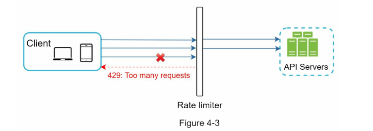
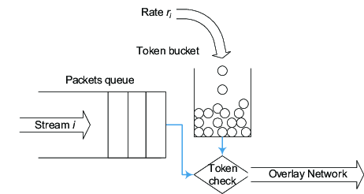
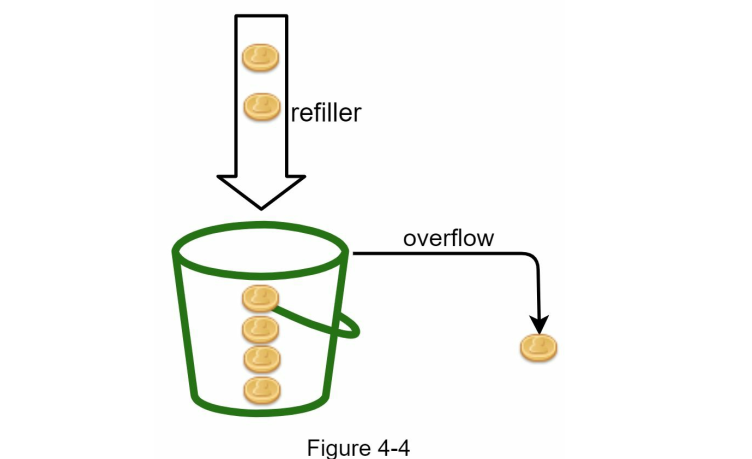
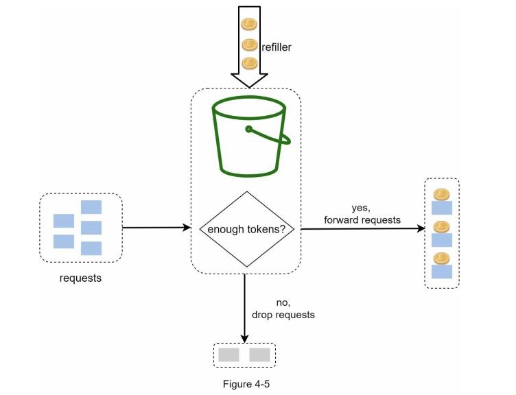
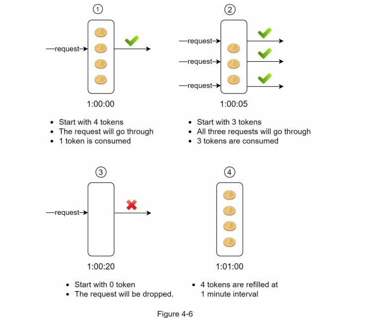
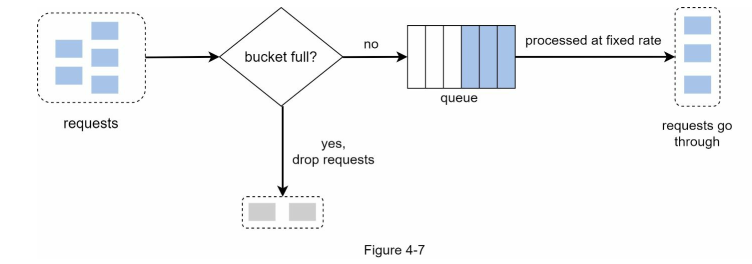
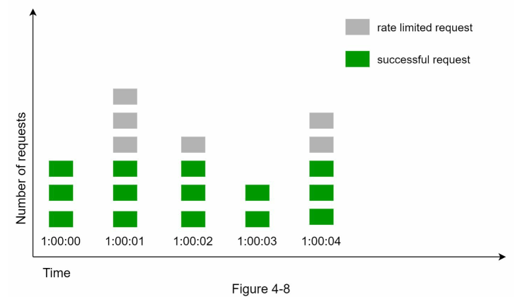
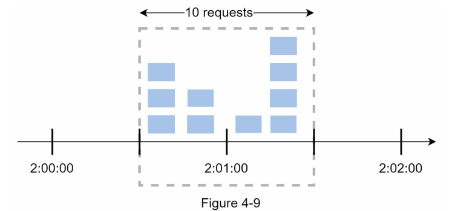

<!-- language: rtl -->

**فصل ۴: طراحی یک Rate Limiter (محدودکننده نرخ)**

در یک سیستم شبکه‌ای، *Rate Limiter* (محدودکننده نرخ) برای کنترل نرخ ترافیکی که توسط یک کاربر یا یک سرویس ارسال می‌شود، استفاده می‌گردد. در دنیای HTTP، یک Rate Limiter تعداد درخواست‌هایی که یک کلاینت می‌تواند در یک بازه زمانی مشخص ارسال کند را محدود می‌کند. اگر تعداد درخواست‌های API از آستانه تعیین‌شده توسط Rate Limiter فراتر رود، تمام فراخوانی‌های اضافی مسدود می‌شوند.

### مثال‌هایی از کاربرد محدودکننده نرخ:

* یک کاربر نمی‌تواند بیش از **۲ پست در هر ثانیه** ارسال کند.
* از یک آدرس IP مشخص، تنها می‌توان **حداکثر ۱۰ حساب کاربری در یک روز** ایجاد کرد.
* از یک دستگاه خاص، **فقط ۵ بار در هفته** می‌توان پاداش دریافت کرد.

در این فصل، از شما خواسته شده تا یک سیستم Rate Limiter طراحی کنید. پیش از شروع طراحی، ابتدا به مزایای استفاده از Rate Limiter در APIها می‌پردازیم:

---

### مزایای استفاده از Rate Limiter:

#### ۱. **جلوگیری از Starvation منابع ناشی از حملات DoS (Denial of Service - حمله انکار سرویس)**

تقریباً تمامی APIهای منتشر شده توسط شرکت‌های بزرگ فناوری، نوعی از محدودیت نرخ را پیاده‌سازی می‌کنند. به عنوان مثال:

* **توییتر** محدودیت ارسال توییت را به **۳۰۰ توییت در هر ۳ ساعت** محدود کرده است \[2].
* APIهای **Google Docs** به طور پیش‌فرض دارای محدودیت **۳۰۰ درخواست خواندن در هر ۶۰ ثانیه برای هر کاربر** هستند \[3].

محدودکننده نرخ از بروز حملات DoS - چه عمدی و چه غیرعمدی - با مسدود کردن درخواست‌های اضافی جلوگیری می‌کند.

📌 **منبع:**

* \[1] OWASP: Rate Limiting – [https://owasp.org/www-community/Rate\_Limiting](https://owasp.org/www-community/Rate_Limiting)
* \[2] Twitter Rate Limits – [https://developer.twitter.com/en/docs/twitter-api/rate-limits](https://developer.twitter.com/en/docs/twitter-api/rate-limits)
* \[3] Google Docs API Usage Limits – [https://developers.google.com/docs/api/limits](https://developers.google.com/docs/api/limits)

---

#### ۲. **کاهش هزینه‌ها**

محدود کردن درخواست‌های اضافی باعث می‌شود به تعداد کمتری سرور نیاز باشد و منابع بیشتر به APIهای با اولویت بالا تخصیص یابند. Rate Limiting در شرکت‌هایی که از APIهای خارجی پولی استفاده می‌کنند، اهمیت فوق‌العاده‌ای دارد.

برای مثال، در موارد زیر شما به ازای هر فراخوانی هزینه پرداخت می‌کنید:

* بررسی اعتبار مشتری
* انجام پرداخت بانکی
* بازیابی سوابق سلامت کاربر

محدود کردن تعداد فراخوانی‌ها برای کاهش هزینه ضروری است.

---

#### ۳. **جلوگیری از Overload شدن سرورها**

برای کاهش بار سرورها، Rate Limiter می‌تواند درخواست‌های اضافی ناشی از رفتار ناهنجار کاربران یا ربات‌ها را فیلتر کند. این کار باعث می‌شود سیستم در شرایط بار بالا نیز پایدار باقی بماند.

---

📌 **نکته تکمیلی (اضافه شده با رفرنس):**
در سیستم‌های مبتنی بر میکروسرویس‌ها، محدودکننده نرخ می‌تواند در لایه‌ی *API Gateway* یا به‌عنوان یک *middleware* پیاده‌سازی شود. در سرویس‌هایی مانند Amazon API Gateway یا Kong، قابلیت *rate limiting* به صورت توکار وجود دارد (منبع: *Designing Distributed Systems - Brendan Burns, O’Reilly*).

---
# گام اول – درک مسئله و تعیین محدوده طراحی

محدودکننده نرخ (Rate Limiter) را می‌توان با استفاده از الگوریتم‌های مختلفی پیاده‌سازی کرد که هرکدام مزایا و معایب خود را دارند. تعامل بین مصاحبه‌گر و مصاحبه‌شونده به روشن شدن نوع Rate Limiter مورد نظر کمک می‌کند.

---

#### 💬 مکالمه نمونه بین کاندیدا و مصاحبه‌گر:

**کاندیدا:** قرار است چه نوع محدودکننده نرخی طراحی کنیم؟ از نوع کلاینت-ساید است یا API سمت سرور؟

**مصاحبه‌گر:** سوال خوبی است. تمرکز ما روی محدودکننده نرخ سمت سرور (Server-side API Rate Limiter) است.

**کاندیدا:** آیا این Rate Limiter باید بر اساس IP یا شناسه کاربر (User ID) یا ویژگی‌های دیگر درخواست‌ها را محدود کند؟

**مصاحبه‌گر:** این محدودکننده باید به اندازه کافی انعطاف‌پذیر باشد تا بتواند مجموعه‌ای از قوانین مختلف را برای اعمال محدودیت پشتیبانی کند.

**کاندیدا:** مقیاس سیستم چقدر است؟ برای یک استارتاپ کوچک است یا برای یک شرکت بزرگ با کاربران زیاد؟

**مصاحبه‌گر:** سیستم باید توانایی پاسخگویی به تعداد بسیار زیادی از درخواست‌ها را داشته باشد.

**کاندیدا:** آیا این سیستم باید در یک محیط توزیع‌شده (Distributed Environment) کار کند؟

**مصاحبه‌گر:** بله.

**کاندیدا:** آیا Rate Limiter باید به صورت یک سرویس مستقل طراحی شود یا در کد اپلیکیشن قرار گیرد؟

**مصاحبه‌گر:** این یک تصمیم طراحی است که بر عهده شماست.

**کاندیدا:** آیا باید کاربران محدودشده (Throttled Users) را از وضعیتشان آگاه کنیم؟

**مصاحبه‌گر:** بله.

---

### 🧾 جمع‌بندی نیازمندی‌ها (Requirements)

بر اساس گفت‌وگوهای بالا، نیازمندی‌های طراحی سیستم محدودکننده نرخ به شرح زیر است:

1. **محدودسازی دقیق درخواست‌های بیش‌از‌حد:**
   سیستم باید بتواند به‌درستی از درخواست‌های خارج از حد مجاز جلوگیری کند.

2. **تاخیر پایین (Low Latency):**
   محدودکننده نرخ نباید باعث افزایش زمان پاسخ HTTP شود.

3. **حداقل مصرف حافظه (Memory Efficient):**
   استفاده بهینه از حافظه در طراحی بسیار مهم است.

4. **پشتیبانی از توزیع‌پذیری (Distributed Rate Limiting):**
   محدودکننده نرخ باید بتواند به‌صورت مشترک بین چند سرور یا فرآیند اجرا شود.

5. **مدیریت استثناها (Exception Handling):**
   هنگام بلوکه شدن درخواست‌ها، پیام‌های واضح به کاربران نمایش داده شود (مانند HTTP 429 Too Many Requests).

6. **تحمل‌پذیری بالا در برابر خطا (High Fault Tolerance):**
   اگر مشکلی در یکی از اجزای Rate Limiter (مثلاً کش Redis) پیش آمد، نباید کل سیستم تحت تأثیر قرار گیرد.

---

📌 **نکته تکمیلی (اضافه‌شده از منبع معتبر):**
در سیستم‌های توزیع‌شده‌ای که بین چندین نود Rate Limiting پیاده‌سازی می‌شود، استفاده از Redis یا Memcached با TTL و atomic counter به همراه fallback مکانیزم‌ها مانند local in-memory cache توصیه می‌شود (منبع: *Designing Data-Intensive Applications – Martin Kleppmann*).

---
# گام دوم – طراحی سطح بالا و جلب نظر مصاحبه‌گر

برای ساده نگه‌داشتن طرح، ابتدا یک مدل ساده ارتباط بین **Client و Server** را در نظر می‌گیریم. سپس، به این سوال کلیدی می‌پردازیم:

---

### 📌 کجا باید Rate Limiter پیاده‌سازی شود؟

در نگاه اول، Rate Limiter را می‌توان در یکی از دو جایگاه زیر پیاده‌سازی کرد:

#### ۱. پیاده‌سازی در سمت کلاینت (Client-side)

* به طور کلی، **سمت کلاینت مکان قابل اعتمادی برای اجرای محدودکننده نرخ نیست**، زیرا:

  * درخواست‌ها از سمت کلاینت به‌راحتی می‌توانند توسط کاربران مخرب (malicious users) جعل شوند.
  * ممکن است کنترل کاملی بر پیاده‌سازی کلاینت نداشته باشیم (مانند اپ‌های شخص ثالث).

#### ۲. پیاده‌سازی در سمت سرور (Server-side)

* در این حالت، Rate Limiter در مسیر رسیدن درخواست به API سرور قرار می‌گیرد.

#### ۳. راهکار جایگزین: پیاده‌سازی به‌عنوان Middleware

* به‌جای پیاده‌سازی مستقیم در سرورهای API، می‌توان از یک **Middleware** برای کنترل نرخ درخواست‌ها استفاده کرد.
* این معماری به شکل زیر عمل می‌کند:

  * کلاینت‌ها درخواست خود را به Middleware ارسال می‌کنند.
  * Middleware نقش واسط را ایفا کرده و قبل از رسیدن درخواست به سرور API، آن را بررسی می‌کند.
  * اگر تعداد درخواست‌ها از حد مجاز عبور کرده باشد، پاسخ `HTTP 429 Too Many Requests` بازمی‌گردد.

---

### 🎯 مثال عملکردی از محدودکننده نرخ

برای درک بهتر، به مثالی از **نمودار Figure 4-3** توجه کنید:

فرض کنیم در طراحی ما، هر کاربر فقط **۲ درخواست در ثانیه** مجاز است. حال، کلاینتی در عرض یک ثانیه **۳ درخواست** ارسال می‌کند:

* دو درخواست اول توسط Middleware مجاز دانسته شده و به API Server ارسال می‌شوند.
* درخواست سوم به دلیل نقض محدودیت، توسط Middleware رد شده و کد HTTP 429 به کاربر بازگردانده می‌شود.

---

### 💡 معماری‌های واقعی: Rate Limiting در API Gateway

در معماری‌های مدرن مبتنی بر **microservice**، استفاده از **API Gateway** به‌شدت رایج است. این Gateway معمولاً قابلیت‌های زیر را فراهم می‌کند:

* Rate Limiting
* SSL Termination
* Authentication
* IP Whitelisting
* سرویس‌دهی به محتوای ایستا (Static Content)

به‌عنوان نمونه، می‌توان به سرویس‌های زیر اشاره کرد که به‌صورت مدیریت‌شده API Gateway ارائه می‌دهند:

* **AWS API Gateway**
* **Kong API Gateway**
* **NGINX Gateway with Lua scripting**
* **Google Cloud Endpoints**

📚 *(منبع: \[4] Cloud Microservices Architecture, Martin Fowler – martinfowler.com)*

---

### ⚖️ تصمیم‌گیری در مورد محل پیاده‌سازی Rate Limiter

هیچ پاسخ قطعی برای محل پیاده‌سازی Rate Limiter وجود ندارد. اما نکات زیر راهنمای خوبی هستند:

| نکته طراحی                    | توضیح                                                                                                                          |
| ----------------------------- | ------------------------------------------------------------------------------------------------------------------------------ |
| **تکنولوژی موجود**            | بررسی کنید که زبان برنامه‌نویسی و کش فعلی پروژه برای پیاده‌سازی Rate Limiter مناسب باشد (مثلاً Redis + Python یا Golang).      |
| **انعطاف در انتخاب الگوریتم** | اگر از Gatewayهای شخص ثالث استفاده می‌کنید، ممکن است فقط برخی الگوریتم‌ها قابل تنظیم باشند. ولی در سمت سرور، کنترل کامل دارید. |
| **معماری فعلی**               | اگر معماری شما هم‌اکنون API Gateway دارد، می‌توانید به‌راحتی Rate Limiting را به آن اضافه کنید.                                |
| **منابع مهندسی**              | پیاده‌سازی Rate Limiter سفارشی نیاز به زمان و نیرو دارد. در نبود منابع کافی، استفاده از API Gateway آماده توصیه می‌شود.        |

---

# الگوریتم‌های محدودسازی نرخ (Rate Limiting Algorithms)

برای پیاده‌سازی Rate Limiting می‌توان از الگوریتم‌های مختلفی استفاده کرد که هر یک **مزایا و معایب خاص خود** را دارند. اگرچه تمرکز این فصل بر روی جزئیات الگوریتم‌ها نیست، اما درک مفاهیم سطح بالای آن‌ها به ما کمک می‌کند تا بسته به **موارد کاربردی (use case)** مناسب‌ترین الگوریتم یا ترکیبی از آن‌ها را انتخاب کنیم.

---

### ✅ فهرست الگوریتم‌های رایج:

---

#### 1. **Token Bucket (سطل توکن)**

* **مفهوم**: یک سطل حاوی توکن‌ها داریم که با سرعت ثابتی پر می‌شود. هر بار که یک درخواست می‌رسد، یک توکن مصرف می‌شود. اگر توکن وجود نداشته باشد، درخواست رد می‌شود.
* **مزایا**:

  * پشتیبانی از انفجارهای کوتاه (burst)
  * کنترل نرخ متوسط و اجازه به درخواست‌های ناگهانی در بازه کوتاه
* **کاربرد رایج**: مناسب برای APIهایی که امکان افزایش ناگهانی ترافیک دارند.
* 📚 *منبع: RFC 2697 (A Single Rate Three Color Marker)*

---

#### 2. **Leaky Bucket (سطل چکه‌ای)**

* **مفهوم**: مشابه سطل آب است که با نرخ ثابتی نشت می‌کند. اگر تعداد درخواست‌ها بیش از ظرفیت سطل باشد، درخواست‌های اضافی حذف می‌شوند.
* **مزایا**:

  * یکنواخت‌سازی بار ترافیکی (smoothing traffic)
  * جلوگیری از انفجارهای ناگهانی
* **معایب**:

  * به اندازه Token Bucket انعطاف‌پذیر نیست.
* **کاربرد رایج**: کنترل ترافیک در سیستم‌های بانکی یا ثبت لاگ پایدار.

---

#### 3. **Fixed Window Counter (شمارنده با پنجره زمانی ثابت)**

* **مفهوم**: درخواست‌ها در بازه‌های زمانی ثابت (مثلاً هر دقیقه) شمارش می‌شوند. اگر تعداد آن‌ها از آستانه بیشتر شود، رد می‌شوند.
* **مزایا**:

  * پیاده‌سازی ساده
* **معایب**:

  * امکان حمله انفجاری در مرز پنجره‌ها (Request Burst at boundary)
* **کاربرد رایج**: مناسب برای محدودیت‌های ساده بر اساس IP یا User ID.

---

#### 4. **Sliding Window Log (لاگ با پنجره لغزان)**

* **مفهوم**: زمان هر درخواست در یک لیست ذخیره می‌شود و در هر بار بررسی، درخواست‌هایی که در بازه لغزان (مثلاً 60 ثانیه اخیر) هستند شمارش می‌شوند.
* **مزایا**:

  * دقت بالا
* **معایب**:

  * مصرف بالای حافظه (ذخیره‌سازی timestamps)
* **کاربرد رایج**: سیستم‌هایی با نیاز به کنترل دقیق نرخ بر اساس زمان.

---

#### 5. **Sliding Window Counter (شمارنده با پنجره لغزان)**

* **مفهوم**: شبیه به Fixed Window، ولی دو پنجره زمانی مجاور را در نظر می‌گیرد و بر اساس میانگین وزن‌دار، تعداد درخواست‌ها را می‌سنجد.
* **مزایا**:

  * دقت بیشتر نسبت به Fixed Window
  * مصرف حافظه کمتر از Sliding Log
* **کاربرد رایج**: سیستم‌هایی با نیاز به تعادل بین دقت و عملکرد.

---

### 🎯 نتیجه‌گیری و انتخاب مناسب

| الگوریتم        | دقت           | مصرف حافظه | پشتیبانی از Burst | مناسب برای                 |
| --------------- | ------------- | ---------- | ----------------- | -------------------------- |
| Token Bucket    | متوسط         | کم         | بله               | APIهای عمومی               |
| Leaky Bucket    | متوسط         | کم         | خیر               | پردازش پایدار              |
| Fixed Window    | پایین         | بسیار کم   | خیر               | موارد ساده                 |
| Sliding Log     | بالا          | بالا       | بله               | امنیت و کنترل دقیق         |
| Sliding Counter | متوسط به بالا | متوسط      | بله               | استفاده عمومی با دقت متوسط |

---

📚 منابع:

* [Rate Limiting Algorithms – Cloudflare Blog](https://blog.cloudflare.com/rate-limiting-algorithms/)
* [High Scalability – Design Patterns for Rate Limiting](http://highscalability.com/blog/2016/4/20/design-patterns-for-rate-limiting.html)
* [AWS Rate Limiting Techniques – AWS Architecture Blog](https://aws.amazon.com/architecture)

---
### الگوریتم Token Bucket (سطل توکن)

الگوریتم **Token Bucket** یکی از پرکاربردترین و ساده‌ترین الگوریتم‌ها برای پیاده‌سازی **Rate Limiting** است. این الگوریتم به‌طور گسترده در شرکت‌های بزرگ اینترنتی استفاده می‌شود. به عنوان مثال، شرکت‌های **Amazon** \[منبع: Amazon API Gateway Throttling \[5]] و **Stripe** \[منبع: Stripe API Rate Limits \[6]] از این الگوریتم برای کنترل نرخ درخواست‌های API خود استفاده می‌کنند.

---

## 👈 نحوه کار الگوریتم Token Bucket:

* یک **سطل توکن (Token Bucket)**، در واقع یک ظرف با ظرفیت از پیش تعیین‌شده است.
* این سطل به‌صورت **دوره‌ای (periodically)** با **توکن‌هایی** که نماینده مجوز ارسال درخواست هستند، **پر می‌شود**.
* اگر سطل پر شود، توکن‌های اضافی **دور ریخته می‌شوند (overflow)** و وارد سطل نمی‌شوند.

* هر درخواست HTTP، **یک توکن مصرف می‌کند**.
* اگر **توکن کافی** در سطل باشد، توکن کم شده و درخواست **اجازه عبور پیدا می‌کند**.
* اگر **توکن کافی نباشد**، درخواست **رد می‌شود** (Throttle/Drop).

---

### 🔢 پارامترهای کلیدی الگوریتم:

1. **Bucket Size (ظرفیت سطل)**
   بیشترین تعداد توکنی که می‌تواند در سطل نگهداری شود.

2. **Refill Rate (نرخ پرشدن)**
   نرخی که در آن توکن‌ها به‌صورت ثابت وارد سطل می‌شوند، مثلاً 4 توکن در هر دقیقه.

---

### 🎯 مثال از عملکرد:

فرض کنیم:

* ظرفیت سطل = 4 توکن
* نرخ پر شدن = 2 توکن در هر ثانیه

در این صورت، هر ثانیه دو توکن به سطل اضافه می‌شود تا زمانی که سطل به ظرفیت ۴ برسد. حال اگر در یک ثانیه 3 درخواست برسد:

* 2 درخواست اول توکن دریافت می‌کنند و عبور می‌کنند.
* درخواست سوم چون توکن نیست، **رد خواهد شد (HTTP 429)**.

---

### 🧮 محاسبه تعداد سطل‌های مورد نیاز:

تعداد سطل‌ها بستگی به **سیاست‌های محدودسازی نرخ** دارد:

* اگر برای هر endpoint نرخ جداگانه تعریف شده باشد، برای هر **user و endpoint** باید **یک سطل مجزا** داشته باشیم.
  مثال:

  * پست گذاشتن: 1 بار در ثانیه
  * افزودن دوست: 150 بار در روز
  * لایک کردن: 5 بار در ثانیه
    نتیجه → ۳ سطل برای هر کاربر

* اگر محدودسازی بر اساس IP باشد، برای **هر آدرس IP یک سطل** لازم است.

* اگر یک سقف کلی برای کل سیستم در نظر گرفته شود (مثلاً 10,000 درخواست در ثانیه)، یک **سطل جهانی (global bucket)** مشترک بین همه کاربران کافی است.

---

### ✅ مزایا (Pros):

* **پیاده‌سازی ساده**
* **مصرف کم حافظه**
* **پشتیبانی از ترافیک انفجاری (Burst Traffic)** برای مدت کوتاه
  (تا وقتی توکن باشد، درخواست مجاز است حتی اگر فراتر از نرخ لحظه‌ای باشد.)

---

### ❌ معایب (Cons):

* نیاز به **تنظیم بهینه دو پارامتر**:

  * ظرفیت سطل (bucket size)
  * نرخ پر شدن (refill rate)

  اگر این مقادیر به‌درستی تنظیم نشوند، یا بیش‌ازحد سختگیرانه می‌شوند یا بیش‌ازحد گشاده‌دست، که هر دو می‌توانند تجربه کاربری را تحت تأثیر قرار دهند.

---

📚 **منابع:**

* \[5] Amazon API Gateway – Throttle API Requests: [https://docs.aws.amazon.com/apigateway/latest/developerguide/api-gateway-request-throttling.html](https://docs.aws.amazon.com/apigateway/latest/developerguide/api-gateway-request-throttling.html)
* \[6] Stripe API Rate Limiting: [https://stripe.com/docs/rate-limits](https://stripe.com/docs/rate-limits)
* [Designing a Scalable Rate Limiter – High Scalability Blog](http://highscalability.com/blog/2016/4/20/design-patterns-for-rate-limiting.html)
* [Google API Quotas](https://developers.google.com/docs/api/limits)

---

🔍 **نکته تکمیلی**: در مقایسه با سایر الگوریتم‌ها، Token Bucket بیشتر برای کاربردهایی مناسب است که **ترافیک ناگهانی و انفجاری** داشته و نیاز به کنترل آن وجود دارد ولی در عین حال نباید مانع از ارسال درخواست‌های منطقی و مجاز شود.

## الگوریتم Leaking Bucket (سطل نشت‌پذیر)

الگوریتم **Leaking Bucket** (سطل نشت‌پذیر) از نظر مفهومی شبیه به الگوریتم **Token Bucket** است، با این تفاوت که در این الگوریتم **پردازش درخواست‌ها با نرخ ثابت انجام می‌شود**. این ویژگی باعث می‌شود که Leaking Bucket برای سناریوهایی که **خروجی یکنواخت و پایدار (Stable Outflow Rate)** نیاز دارند، بسیار مناسب باشد.

---

### 👈 نحوه عملکرد الگوریتم Leaking Bucket:

* این الگوریتم معمولاً با استفاده از یک **صف به صورت FIFO (First-In-First-Out)** پیاده‌سازی می‌شود.
* زمانی که یک درخواست وارد سیستم می‌شود:

  * اگر **صف پر نباشد**، درخواست به **صف افزوده می‌شود**.
  * اگر **صف پر باشد**، درخواست **رد (drop)** می‌شود.
* درخواست‌ها از صف با یک **نرخ خروج ثابت (Outflow Rate)** پردازش می‌شوند.

---

### 🔢 پارامترهای کلیدی الگوریتم:

1. **Bucket Size (ظرفیت سطل)**
   همان اندازه صف است و مشخص می‌کند چند درخواست در انتظار پردازش می‌توانند باشند.

2. **Outflow Rate (نرخ خروج)**
   تعیین می‌کند چند درخواست در یک بازه زمانی مشخص (مثلاً در هر ثانیه) می‌توانند از صف خارج و پردازش شوند.

---

### 🛒 مثال واقعی:

شرکت تجارت الکترونیک **Shopify** از الگوریتم **Leaking Bucket** برای پیاده‌سازی **Rate Limiting** در زیرساخت‌های خود استفاده می‌کند.
📚 منبع: \[7] Shopify Rate Limits – [https://shopify.dev/docs/api/usage/rate-limits](https://shopify.dev/docs/api/usage/rate-limits)

---

### ✅ مزایا (Pros):

* **استفاده بهینه از حافظه** به‌دلیل صف با اندازه محدود.
* **پردازش پایدار** و یکنواخت درخواست‌ها، مناسب برای سیستم‌هایی که نیاز به **خروجی با نرخ مشخص** دارند، مثل پردازش تراکنش‌های مالی یا لاگ سرورها.

---

### ❌ معایب (Cons):

* در شرایط **ترافیک انفجاری (Burst Traffic)**، صف سریع پر می‌شود و درخواست‌های قدیمی در صف باقی می‌مانند؛ در نتیجه، **درخواست‌های جدیدتر نیز رد می‌شوند** حتی اگر منطقی‌تر باشند.
* مانند الگوریتم Token Bucket، **تنظیم دقیق دو پارامتر اصلی** (اندازه سطل و نرخ خروج) ممکن است چالش‌برانگیز باشد.

---

### 🔍 نکته تکمیلی:

الگوریتم Leaking Bucket برخلاف Token Bucket **اجازه ترافیک انفجاری (burst)** را نمی‌دهد و همواره تلاش می‌کند **خروجی یکنواختی** داشته باشد. بنابراین، اگر سیستمی دارید که ظرفیت محدودی برای پردازش هم‌زمان دارد، استفاده از Leaky Bucket انتخاب بهتری نسبت به Token Bucket خواهد بود.

---

📚 منابع:

* \[7] Shopify API Rate Limits: [https://shopify.dev/docs/api/usage/rate-limits](https://shopify.dev/docs/api/usage/rate-limits)
* [Designing Scalable Rate Limiting – Cloudflare Engineering Blog](https://blog.cloudflare.com/counting-things-a-lot-of-different-things/)
* [Rate Limiting Algorithms – Stripe Docs](https://stripe.com/docs/rate-limits)

---

📝 مقایسه سریع:

| ویژگی              | Token Bucket      | Leaking Bucket             |
| ------------------ | ----------------- | -------------------------- |
| پشتیبانی از Burst  | دارد ✅            | ندارد ❌                    |
| نرخ خروجی          | انعطاف‌پذیر       | ثابت                       |
| پیچیدگی پیاده‌سازی | پایین             | متوسط                      |
| مناسب برای         | API با انعطاف نرخ | پردازش‌های محدود و یکنواخت |

---
## الگوریتم Fixed Window Counter (شمارنده‌ی پنجره‌ی ثابت)

الگوریتم **Fixed Window Counter** یکی از ساده‌ترین روش‌های پیاده‌سازی **Rate Limiting** است که از طریق تقسیم بازه زمانی به **پنجره‌های زمانی ثابت** و شمارش تعداد درخواست‌ها در هر پنجره، نرخ درخواست‌ها را کنترل می‌کند.

---

### 👈 نحوه عملکرد الگوریتم:

* خط زمانی به **بازه‌های زمانی با طول ثابت** (مثلاً ۱ ثانیه، ۱ دقیقه) تقسیم می‌شود.
* برای هر پنجره‌ی زمانی، یک **شمارنده** در نظر گرفته می‌شود.
* **هر درخواست دریافتی، مقدار شمارنده‌ی آن پنجره را یک واحد افزایش می‌دهد.**
* اگر مقدار شمارنده به آستانه تعیین‌شده (threshold) برسد، **درخواست‌های اضافی تا آغاز پنجره بعدی رد می‌شوند.**

---

### 🔢 مثال ملموس:

فرض کنید سیستم حداکثر اجازه‌ی ۳ درخواست در هر ثانیه را دارد. در هر پنجره‌ی یک‌ثانیه‌ای، تنها ۳ درخواست مجاز است. اگر بیشتر از ۳ درخواست وارد شود، مابقی **رد می‌شوند**.

---

### ⚠️ مسئله مهم: لبه‌های پنجره (Edge Effect)

یکی از مشکلات اصلی این الگوریتم، **ترافیک انفجاری (Burst Traffic)** در لبه‌های پنجره‌های زمانی است. در این حالت، تعداد درخواست‌هایی که از سیستم عبور می‌کنند ممکن است **بیشتر از ظرفیت مجاز** باشد.

🔍 مثال:

فرض کنید حداکثر ۵ درخواست در هر دقیقه مجاز است. در شکل **Figure 4-9**:

* بین ساعت ۲:۰۰:۰۰ تا ۲:۰۱:۰۰، پنج درخواست ارسال شده‌اند.
* بین ۲:۰۱:۰۰ تا ۲:۰۲:۰۰، پنج درخواست دیگر ارسال شده‌اند.

اما در بازه‌ی ترکیبی **۲:۰۰:۳۰ تا ۲:۰۱:۳۰**، عملاً **۱۰ درخواست** عبور کرده‌اند، که **دو برابر حد مجاز** است. این اتفاق به دلیل تنظیم شمارنده بر اساس دقیقه‌های گرد (مانند `HH:MM:00`) رخ می‌دهد و به آن **Edge Effect** گفته می‌شود.

---

### ✅ مزایا (Pros):

* **پیاده‌سازی ساده** و **درک آسان**.
* **مصرف کم حافظه**، زیرا تنها نیاز به نگه‌داشتن شمارنده برای هر پنجره‌ی زمانی داریم.
* **مناسب برای مواردی که محدودیت زمانی دقیق** (مثلاً ۱ دقیقه‌ای یا ۱ ساعته) نیاز است و **تغییرات نرخ درخواست‌ها خیلی مهم نیست**.

---

### ❌ معایب (Cons):

* در لبه‌های پنجره، ممکن است سیستم **بیش از حد مجاز درخواست را بپذیرد** (Edge Effect).
* **عدم تحمل انفجار ترافیکی در زمان کوتاه**.

---

### 📌 نکته تکمیلی:

الگوریتم **Fixed Window** زمانی مفید است که:

* درخواست‌ها پراکندگی یکنواخت داشته باشند.
* محدودیت دقیق و ساده (مثلاً "۵ درخواست در دقیقه") مهم‌تر از کنترل دقیق بار در هر لحظه باشد.

در غیر این‌صورت، استفاده از الگوریتم‌هایی مثل **Sliding Window** یا **Token Bucket** برای کنترل بهتر بار و کاهش مشکلات لبه‌ای توصیه می‌شود.

---

📚 منابع:

* [Rate Limiting Strategies and Algorithms - Cloudflare](https://blog.cloudflare.com/counting-things-a-lot-of-different-things/)
* [API Rate Limiting – Stripe](https://stripe.com/docs/rate-limits)
* [YouTube Engineering – Throttle Requests at Scale](https://youtubeeng.blogspot.com/2017/07/how-youtube-scales-rate-limiting.html)

---

در بخش بعدی، الگوریتم Sliding Window بررسی خواهد شد که سعی می‌کند مشکل لبه‌ی پنجره‌ها در این روش را برطرف نماید.
