<!-- language: rtl -->
<div dir="rtl"align="right" >


## 5. طراحی الگوریتم Consistent Hashing (هش‌ساز سازگار)

### **Consistent Hashing چیست؟**  
**Consistent Hashing** یک تکنیک توزیع داده (Data Distribution) است که برای **تقسیم بار (Load Balancing)** و **کاهش جابجایی داده (Data Rebalancing)** در سیستم‌های توزیع‌شده (مثل پایگاه‌داده‌ها، کش‌ها و CDNها) استفاده می‌شود.  

---

### **چرا از Consistent Hashing استفاده می‌شود؟**  
1. **کاهش جابجایی داده هنگام اضافه/حذف سرورها**  
   - در سیستم‌های معمولی، اگر یک سرور اضافه شود، تقریباً تمام کلیدها باید دوباره محاسبه شوند (`hash(key) % N` جدید).  
   - در Consistent Hashing، فقط داده‌های نزدیک به نقطه تغییر جابجا می‌شوند.  

2. **توزیع یکنواخت‌تر داده (Load Balancing بهتر)**  
   - با استفاده از **Virtual Nodes**، می‌توان توزیع داده را عادلانه‌تر کرد.  

3. **مقاومت در برابر تغییرات مقیاس (Scalability)**  
   - مناسب برای سیستم‌هایی که مدام در حال رشد یا کوچک‌شدن هستند (مثل **DynamoDB، Cassandra، Redis Cluster**).  

---

### **چرا Consistent Hashing مهم است؟**  
- **بهبود Performance**: چون جابجایی داده کم می‌شود، زمان تأخیر (Latency) کاهش می‌یابد.  
- **کاهش هزینه شبکه**: وقتی داده کمتری جابجا شود، پهنای باند کمتری مصرف می‌شود.  
- **تحمل خطا (Fault Tolerance)**: اگر یک سرور از کار بیفتد، فقط بخشی از داده‌ها تحت تأثیر قرار می‌گیرند.  

---

### **کاربردهای Consistent Hashing**  
1. **سیستم‌های کش توزیع‌شده (Distributed Caching)**  
   - مثل **Memcached، Redis Cluster**  
2. **پایگاه‌داده‌های NoSQL**  
   - مثل **Cassandra، DynamoDB**  
3. **شبکه‌های توزیع محتوا (CDN)**  
   - برای مسیریابی درخواست‌ها به نزدیک‌ترین سرور  
4. **میکروسرویس‌ها و Load Balancerها**  
   - مثل **Nginx، Envoy**  


برای دستیابی به **مقیاس‌پذیری افقی (Horizontal Scaling)**، ضروری است که درخواست‌ها یا داده‌ها به‌صورت **موثر و یکنواخت** بین سرورها توزیع شوند. یکی از روش‌های رایج برای تحقق این هدف، استفاده از تکنیکی به نام **Consistent Hashing (هش‌ساز سازگار)** است. اما پیش از بررسی این روش، ابتدا باید به‌صورت عمیق مسئله‌ای به نام **مشکل Rehashing (بازهش‌سازی)** را درک کنیم.

---

### *۵.۱ مشکل بازهش‌سازی (Rehashing Problem)*

فرض کنید ما **n سرور کش (Cache Server)** در اختیار داریم. یک روش معمول برای توزیع بار بین این سرورها، استفاده از فرمول زیر برای نگاشت کلیدها به سرورها است:


```python
server_index = hash(key) % N
```

که در آن:

* `key`: کلیدی است که می‌خواهیم در کش ذخیره یا بازیابی کنیم،
* `N`: تعداد سرورهای موجود در سیستم است.

برای درک بهتر، از یک مثال استفاده می‌کنیم.

**جدول 5-1: توزیع کلیدها بر اساس مقدار هش و نگاشت به سرور**

| کلید (Key) | مقدار Hash | Hash % 4 | سرور انتخابی |
| ---------- | ---------- | -------- | ------------ |
| key0       | 120        | 0        | server0      |
| key1       | 123        | 3        | server3      |
| key2       | 125        | 1        | server1      |
| key3       | 140        | 0        | server0      |
| key4       | 142        | 2        | server2      |
| key5       | 146        | 2        | server2      |
| key6       | 150        | 2        | server2      |
| key7       | 153        | 1        | server1      |

در این روش، برای یافتن سروری که یک کلید در آن ذخیره شده، کافی است عملیات `hash(key) % 4` را انجام دهیم.
برای نمونه: `hash(key0) % 4 = 0`، یعنی کلید `key0` باید در `server0` ذخیره شود.

---


(تصویر توزیع کلیدها روی سرورها را بر اساس جدول 5-1 نمایش می‌دهد)

---

### \[+] مشکل اصلی این روش چیست؟

اگر تعداد سرورها تغییر کند (مثلاً یک سرور اضافه یا کم شود)، مقدار `N` تغییر می‌کند و در نتیجه `hash(key) % N` نتایج متفاوتی تولید می‌کند. این امر باعث می‌شود اکثر کلیدها به سرورهای متفاوتی نسبت به قبل نگاشت شوند و در نتیجه:

* کش فعلی بی‌اثر (Invalidated) شود.
* نیاز به انتقال کلیدها بین سرورها باشد.
* تاخیر زیاد و بار اضافی در سیستم ایجاد شود.

---

### \[+] مطالعه موردی: طراحی سیستم کش توزیع‌شده در Memcached (فیسبوک)

> در طراحی سیستم Memcached توسط فیسبوک، برای حل مشکل Rehashing ناشی از اضافه‌کردن یا حذف سرور، الگوریتم Consistent Hashing به کار گرفته شد. این روش باعث شد تا تنها بخش کوچکی از کلیدها به سرورهای جدید منتقل شوند، نه تمام داده‌ها.
>
> منبع: Engineering Facebook’s Memcached infrastructure – [Facebook Engineering Blog, 2011](https://engineering.fb.com/2011/04/28/core-data/scaling-memcache-at-facebook/)


### ۵.۲ مشکل نگاشت ناپایدار در زمان تغییر اندازه سرورها

رویکرد `hash(key) % N` زمانی به خوبی کار می‌کند که:
- **تعداد سرورها ثابت باشد**،
- و **توزیع داده‌ها بین سرورها یکنواخت باشد**.

اما در دنیای واقعی، چنین ثباتی نادر است. معمولاً سرورها به دلایل مختلف اضافه یا حذف می‌شوند:
- **افزایش ترافیک** (نیاز به مقیاس‌پذیری افقی)،
- **خرابی سرور یا خارج‌شدن از سرویس**،
- **بروزرسانی سخت‌افزاری یا نرم‌افزاری**.

---

### *مشکل در زمان حذف یک سرور*

فرض کنید `server1` از دسترس خارج شود. در این حالت، تعداد سرورها از `4` به `3` کاهش می‌یابد. در نتیجه:

```python
server_index = hash(key) % 3
```

اگرچه تابع هش برای هر کلید همچنان همان مقدار را تولید می‌کند، اما تغییر در تعداد سرورها (از 4 به 3)، باعث می‌شود خروجی تابع مدولار (`% N`) تغییر کند و **اغلب کلیدها به سرورهای متفاوتی نسبت به قبل نگاشت شوند**.

---

**جدول 5-2: نگاشت جدید کلیدها پس از حذف server1**

| کلید (Key) | مقدار Hash | Hash % 4 (قبلی) | Hash % 3 (جدید) | سرور جدید |
| ---------- | ---------- | --------------- | --------------- | --------- |
| key0       | 120        | 0               | 0               | server0   |
| key1       | 123        | 3               | 0               | server0   |
| key2       | 125        | 1               | 2               | server2   |
| key3       | 140        | 0               | 2               | server2   |
| key4       | 142        | 2               | 1               | server1   |
| key5       | 146        | 2               | 2               | server2   |
| key6       | 150        | 2               | 0               | server0   |
| key7       | 153        | 1               | 0               | server0   |

---


(نشان‌دهنده توزیع جدید کلیدها پس از حذف یکی از سرورها)

---

### *تحلیل مشکل:*

همان‌طور که در تصویر مشاهده می‌شود، **بیشتر کلیدها به سرورهای جدیدی نگاشت شده‌اند، نه فقط کلیدهایی که روی سرور آفلاین `server1` قرار داشتند.**

نتیجه:

* بیشتر درخواست‌های کش از سمت کلاینت‌ها به سرور اشتباه ارسال می‌شود.
* منجر به **حجم بالای cache miss** می‌شود.
* فشار ناگهانی به دیتابیس اصلی وارد می‌شود (به‌دلیل cache miss).
* عملکرد کل سیستم به شدت افت می‌کند.

---

### \[+] راه‌حل: استفاده از Consistent Hashing

الگوریتم **Consistent Hashing (هش‌ساز سازگار)** راه‌حلی مؤثر برای کاهش این مشکل است. این روش تضمین می‌کند که:

* با **حذف یا اضافه شدن سرور جدید**، فقط بخش کوچکی از کلیدها نیاز به بازتخصیص دارند.
* **اکثریت کلیدها** روی سرورهای قبلی باقی می‌مانند.

## ۵. هشینگ پایدار (Consistent Hashing)

---

### **۵.۱ تعریف هشینگ پایدار**

> برگرفته از ویکی‌پدیا:
> «هشینگ پایدار نوع خاصی از هشینگ است که در آن، هنگام تغییر اندازه جدول هش، تنها به‌طور میانگین $\frac{k}{n}$ کلید نیاز به بازنگاشت دارد؛ که در آن $k$ تعداد کلیدها و $n$ تعداد اسلات‌هاست. در حالی که در بیشتر جدول‌های هش سنتی، تغییر تعداد اسلات‌ها باعث می‌شود تقریباً تمام کلیدها نیاز به بازنگاشت داشته باشند.»[^1]

---

### **۵.۲ فضای هش و حلقه هش (Hash Ring)**

اکنون که تعریف هشینگ پایدار را درک کردیم، بیایید نحوه عملکرد آن را بررسی کنیم.

فرض کنیم تابع هش ما `f`، از نوع `SHA-1` باشد. فضای خروجی این تابع شامل مجموعه‌ای از مقادیر عددی مانند:
`x0, x1, x2, ..., xn` است.
در رمزنگاری، فضای هش SHA-1 برابر است با بازه‌ای بین `۰` تا `2^160 - 1`. به عبارت دیگر:

* `x0 = 0`
* `xn = 2^160 - 1`
* و سایر مقادیر هش در این بازه قرار می‌گیرند.

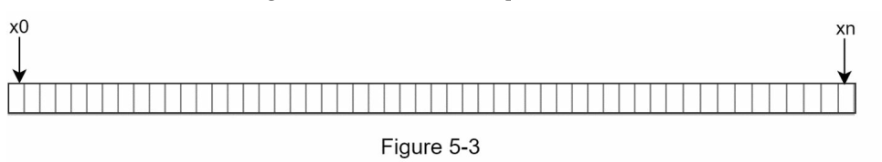

اکنون اگر دو انتهای این بازه را به یکدیگر متصل کنیم، فضای خطی به یک *حلقه هش (Hash Ring)* تبدیل می‌شود.

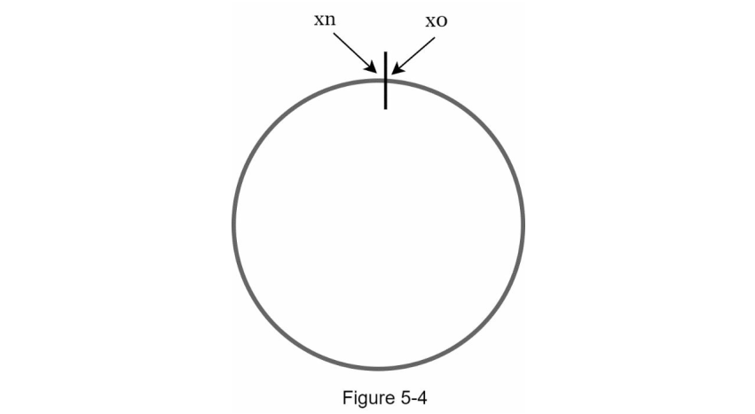

---

### **۵.۳ نگاشت سرورها بر روی حلقه هش**

با استفاده از همان تابع هش `f`، هر سرور را بر اساس `IP` یا `hostname` آن، روی حلقه هش نگاشت می‌کنیم.

به عنوان مثال، فرض کنید ۴ سرور در سیستم داریم. پس از هش کردن IP یا نام هر سرور، موقعیت آن‌ها روی حلقه مشخص می‌شود.

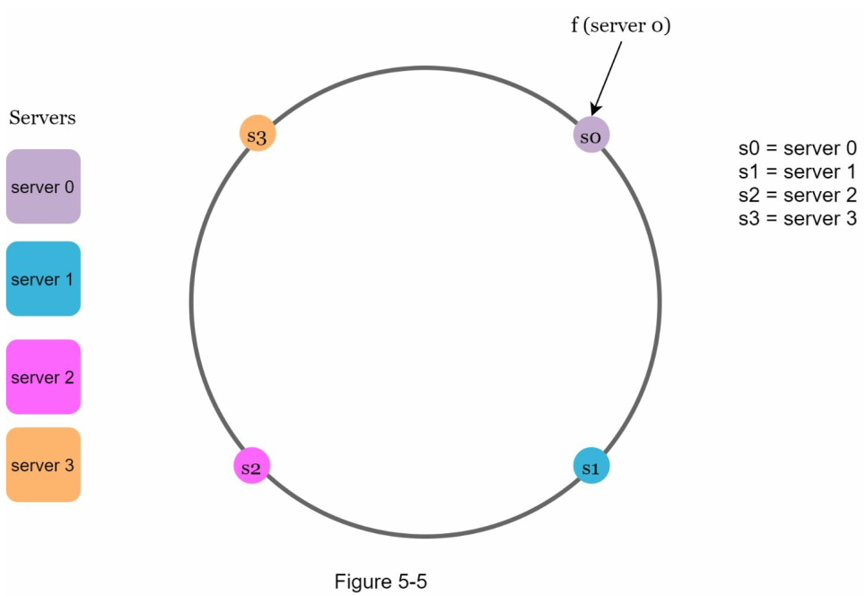
---

### \[+] *مطالعه موردی: استفاده از Consistent Hashing در Amazon DynamoDB*

> یکی از کاربردهای واقعی هشینگ پایدار، در طراحی **Amazon DynamoDB** مشاهده می‌شود.
> در Dynamo، برای توزیع کلیدها در میان نودها (Nodes)، از حلقه هش استفاده می‌شود.
> هر نود به چند موقعیت روی حلقه نگاشت می‌شود (Virtual Nodes)، تا توزیع یکنواخت‌تری حاصل شود.
>
> منبع: [Amazon Dynamo Paper, SOSP 2007](https://www.allthingsdistributed.com/files/amazon-dynamo-sosp2007.pdf)


### \[+] مزایای استفاده از Hash Ring در معماری مدرن:

| ویژگی                    | Consistent Hashing   | Hash Modulo (سنتی) |
| ------------------------ | -------------------- | ------------------ |
| توزیع یکنواخت کلیدها     | ✅ بله                | ❌ نه               |
| تاثیر کم از تغییر سرورها | ✅ تنها بازنگاشت جزئی | ❌ بازنگاشت کامل    |
| مقیاس‌پذیری افقی         | ✅ عالی               | ❌ مشکل‌ساز         |

---

[^1]: Wikipedia - [Consistent Hashing](https://en.wikipedia.org/wiki/Consistent_hashing)


## **۵.۳ کلیدهای هش (Hash Keys)**

نکته‌ای که شایان ذکر است این است که تابع هش مورد استفاده در این بخش با تابع هش در بخش «مشکل بازه‌بندی مجدد (rehashing problem)» متفاوت است. همچنین در اینجا هیچ عملیات مدولار (modular operation) وجود ندارد.

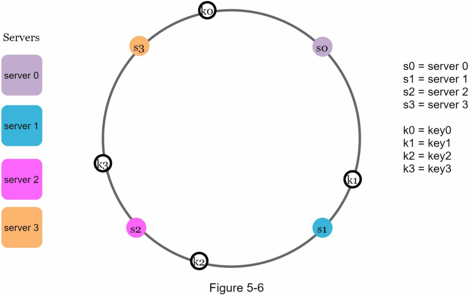

همان‌طور که در **تصویر 5-6** نشان داده شده، ۴ کلید کش (key0، key1، key2، key3) بر روی حلقه هش (hash ring) توزیع شده‌اند. این توزیع بر اساس خروجی تابع هش انجام می‌شود، که به عنوان موقعیت کلید روی حلقه در نظر گرفته می‌شود.

---

## **۵.۴ جستجوی سرور (Server Lookup)**

برای تعیین اینکه یک کلید در کدام سرور ذخیره شده، از موقعیت آن کلید بر روی حلقه به‌صورت ساعتگرد (Clockwise) حرکت می‌کنیم تا به نزدیک‌ترین سرور برسیم.

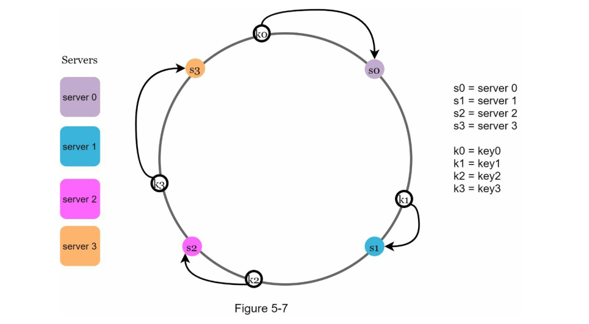

در **تصویر 5-7**، این فرآیند نشان داده شده است:

* key0 روی سرور 0 قرار می‌گیرد
* key1 روی سرور 1
* key2 روی سرور 2
* key3 روی سرور 3

این روش تضمین می‌کند که کلیدها با توزیع یکنواخت و بدون نیاز به بازپیکربندی گسترده میان سرورها توزیع شوند.

---

## **۵.۵ افزودن یک سرور (Add a Server)**

بر اساس منطق توضیح داده‌شده، افزودن یک سرور جدید تنها نیاز به **توزیع مجدد بخش کوچکی از کلیدها** دارد.

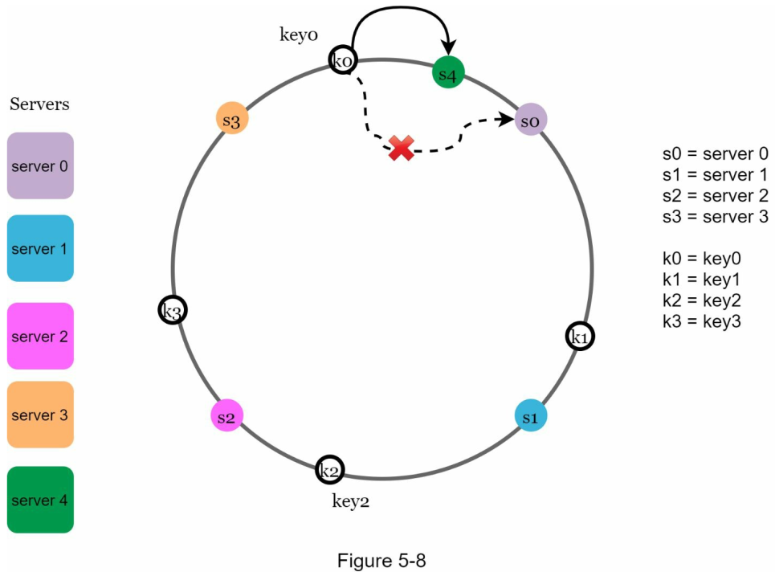

در **تصویر 5-8**، پس از اضافه شدن سرور جدید با شماره ۴، فقط **key0** نیاز به بازتخصیص دارد. سایر کلیدها (key1، key2، key3) همچنان روی همان سرورهای قبلی باقی می‌مانند.

بیایید دقیق‌تر به منطق آن نگاه کنیم:

* **قبل از اضافه شدن سرور ۴**، کلید key0 روی سرور 0 ذخیره می‌شد.
* **پس از اضافه شدن سرور ۴**، key0 اکنون روی سرور ۴ ذخیره می‌شود چون سرور ۴ اولین سروری است که از محل key0 در مسیر ساعتگرد به آن می‌رسیم.

بقیه کلیدها نیازی به بازتخصیص ندارند، زیرا مکان آن‌ها در حلقه تغییری نکرده و سرور مسئول آن‌ها همچنان همان است.

---

## **۵.۶ حذف یک سرور (Remove a Server)**

در صورت حذف یک سرور نیز تنها بخش کوچکی از کلیدها نیاز به بازتخصیص دارند.

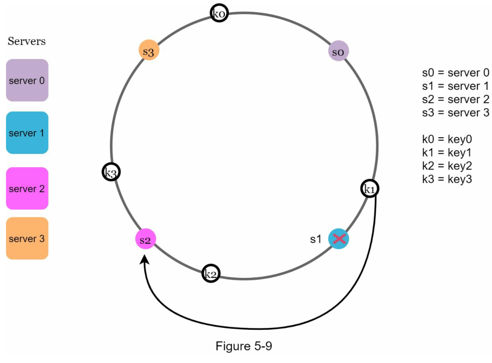

در **تصویر 5-9**، زمانی‌که سرور ۱ حذف می‌شود، فقط **key1** باید به سرور بعدی، یعنی **سرور ۲** منتقل شود. سایر کلیدها (key0، key2، key3) **تغییری نمی‌کنند**.

این مزیت مهمی از **Consistent Hashing** است، که در مقایسه با روش‌های سنتی هش، **تأثیر تغییرات در تعداد سرورها را به حداقل می‌رساند** و از بازتخصیص گسترده داده‌ها جلوگیری می‌کند.

---

\[+] **مطالعه موردی: استفاده از Consistent Hashing در Amazon Dynamo**

> سیستم ذخیره‌سازی Amazon Dynamo که برای محصولات کلیدی آمازون از جمله سبد خرید (Shopping Cart) استفاده می‌شود، از الگوریتم Consistent Hashing استفاده می‌کند تا بار توزیع داده بین نودهای مختلف را مدیریت کند. هر نود چندین "virtual node" روی حلقه هش دارد تا توازن بار بهتر برقرار شود. اضافه یا حذف نود تنها باعث جابجایی داده‌های محدودی می‌شود که در نتیجه، مقیاس‌پذیری افقی سیستم به‌خوبی حفظ می‌شود.
> **منبع**: Amazon Dynamo Paper (2007) – ACM Symposium on Operating Systems Principles

---

\[+] **ابزارهای متن‌باز پیشنهادی برای پیاده‌سازی Consistent Hashing:**

* 🔹 **Ketama**
  + [GitHub: https://github.com/RJ/ketama](https://github.com/RJ/ketama)
  + کتابخانه‌ای مبتنی بر C برای پیاده‌سازی Consistent Hashing با پشتیبانی از virtual nodes. در Memcached نیز استفاده می‌شود.
  + **مزایا:** سریع، سبک، مناسب برای سرویس‌های cache
  + **معایب:** توسعه‌یافته با C؛ نیاز به binding در زبان‌های دیگر

* 🔹 **Hashring (Python)**
  [PyPI: https://pypi.org/project/hashring](https://pypi.org/project/hashring)
  + کتابخانه‌ای ساده و مؤثر برای پیاده‌سازی حلقه هش در پایتون.
  + **سناریوی استفاده:** مناسب برای توزیع بار روی سرورهای کش یا API
  + **مزایا:** نصب آسان، بدون نیاز به Redis
  + **معایب:** مناسب فقط برای بارهای سبک

* 🔹 **Consistent Hashing in Envoy Proxy (C++)**
  + [Envoy Docs: https://www.envoyproxy.io](https://www.envoyproxy.io)
  + Envoy از Consistent Hashing در load balancing استفاده می‌کند (مثلاً بر اساس session ID).
  + **مزایا:** مناسب برای سیستم‌های میکروسرویس و real-time
  + **معایب:** پیکربندی نسبتاً پیچیده

---

## **۵.۷ دو مشکل در روش پایه‌ای (Two Issues in the Basic Approach)**

الگوریتم هش‌سازگار (Consistent Hashing) نخستین‌بار توسط **Karger و همکارانش در MIT** معرفی شد$1$. مراحل اصلی این الگوریتم به شرح زیر است:

* *سرورها و کلیدها* توسط یک تابع هش با توزیع یکنواخت، روی حلقه هش (hash ring) نگاشته می‌شوند.
* برای تعیین اینکه یک کلید در کدام سرور ذخیره شده است، از محل کلید به‌صورت ساعتگرد حرکت می‌کنیم تا به اولین سرور موجود روی حلقه برسیم.

با وجود سادگی و اثربخشی این رویکرد، دو مشکل اساسی در این الگوریتم پایه‌ای شناسایی شده است:

---

### *مشکل اول: اندازه نامتوازن پارتیشن‌ها (Partitions)*

حفظ اندازه یکسان برای *پارتیشن‌ها* (یعنی بازه هش بین دو سرور مجاور روی حلقه) غیرممکن است، به‌ویژه در شرایطی که سرور جدیدی اضافه یا حذف شود.

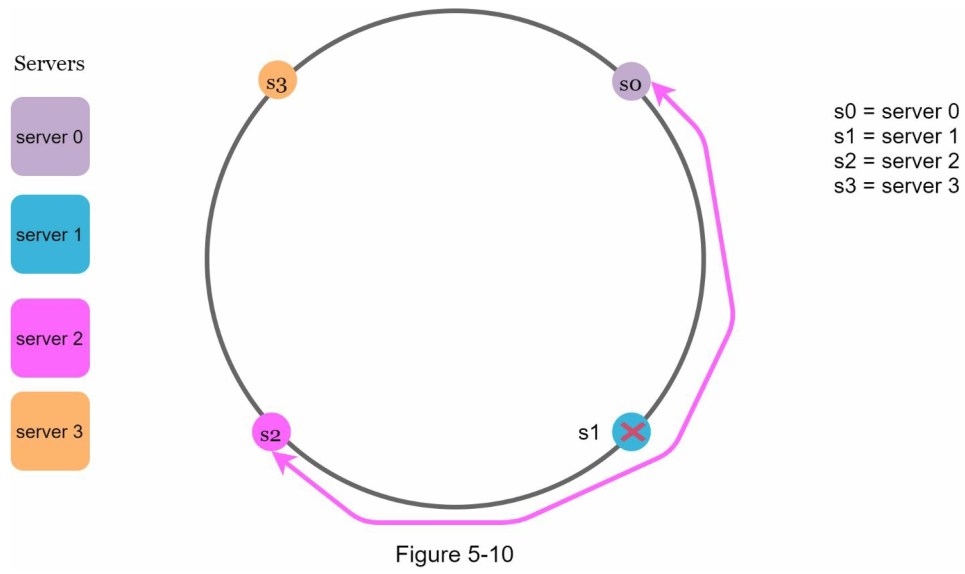

برای مثال، در **تصویر 5-10** اگر **سرور s1** حذف شود، اندازه پارتیشن سرور **s2** (که با فلش‌های دوطرفه نشان داده شده) **دو برابر** اندازه پارتیشن‌های سرور s0 و s3 خواهد بود.

این نابرابری منجر به توزیع غیریکسان بار بین سرورها می‌شود، که می‌تواند باعث فشار بیش از حد بر برخی سرورها و بلااستفاده ماندن برخی دیگر شود.

---

### *مشکل دوم: توزیع نامتوازن کلیدها (Key Distribution)*

یکی دیگر از مشکلات، **توزیع نامتوازن کلیدها** روی حلقه هش است. اگر سرورها در موقعیت‌هایی قرار بگیرند که یکنواخت نباشد، تعداد زیادی از کلیدها ممکن است روی یک سرور خاص متمرکز شوند، و برخی سرورها هیچ داده‌ای نداشته باشند.

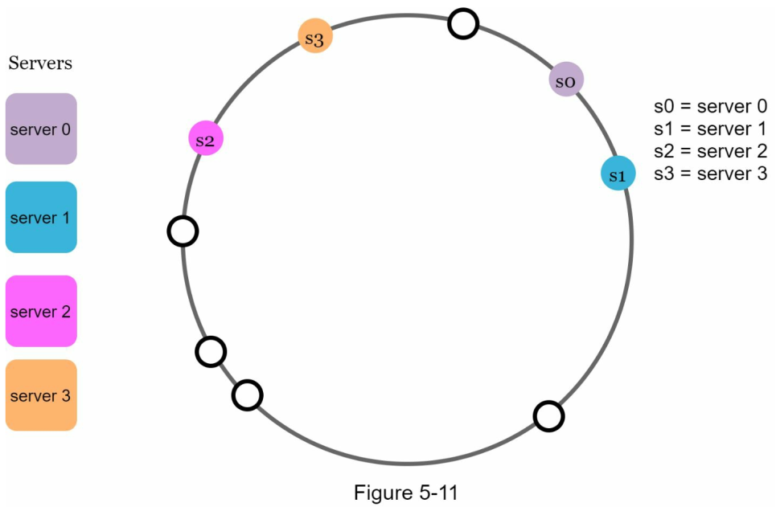

در **تصویر 5-11**، موقعیت قرارگیری سرورها به‌گونه‌ای است که **بیشتر کلیدها روی سرور شماره ۲ ذخیره شده‌اند**، در حالی که **سرور ۱ و ۳ هیچ داده‌ای در اختیار ندارند**.

---

## \[+] راهکار: استفاده از گره‌های مجازی (Virtual Nodes)

برای حل این دو مشکل، روشی به نام **گره‌های مجازی (Virtual Nodes)** یا **نسخه‌های تکراری (Replicas)** معرفی شده است.

در این روش:

* هر سرور به جای اینکه فقط یک موقعیت روی حلقه داشته باشد، به **چندین موقعیت مجازی (Virtual Node)** روی حلقه نگاشته می‌شود.
* این موقعیت‌ها با استفاده از ترکیب نام سرور و یک شناسه یکتا مانند `server1#1`، `server1#2`، ... هش می‌شوند.

مزایای این روش:

* توزیع یکنواخت‌تری از کلیدها میان سرورها حاصل می‌شود.
* حذف یا اضافه کردن یک سرور تأثیر کمتری بر کلیدهای سیستم خواهد داشت.
* امکان **تعادل بار بهتر (load balancing)** بین سرورها فراهم می‌شود.

---

\[+] **مطالعه موردی: استفاده از Virtual Nodes در Couchbase**

> سیستم پایگاه‌داده توزیع‌شده **Couchbase** از الگوریتم Consistent Hashing به همراه **گره‌های مجازی** استفاده می‌کند. هر سرور به چندین virtual node نگاشته می‌شود تا هنگام افزایش یا کاهش ظرفیت، داده‌ها با کمترین جابجایی منتقل شوند. همچنین این روش موجب شده تا Couchbase بتواند به‌خوبی مقیاس‌پذیر باقی بماند.
> **منبع:** [Couchbase Architecture Whitepaper](https://docs.couchbase.com)

---

\[+] **ابزارهای متن‌باز برای پشتیبانی از Virtual Nodes:**

* **Ringpop**
  + [https://github.com/uber/ringpop-go](https://github.com/uber/ringpop-go)
  + محصولی از اوبر (Uber) برای پیاده‌سازی توزیع بار بین نودها با پشتیبانی کامل از virtual nodes
  + **مزایا:** توسعه‌یافته برای سرویس‌های real-time، پشتیبانی از گره‌های مجازی، مناسب برای معماری‌های میکروسرویس
  + **معایب:** نیازمند درک دقیق مفاهیم توزیع‌شده و پیکربندی پیچیده

* **Consistent Hashing with Virtual Nodes in Java**
  + [https://github.com/doo/consistent-hash](https://github.com/doo/consistent-hash)
  + پیاده‌سازی ساده‌ی الگوریتم با پشتیبانی از virtual nodes در زبان Java
  + **کاربرد:** در برنامه‌هایی با کش توزیع‌شده یا کلید-مقدار (key-value stores)

---

## **۵.۸ گره‌های مجازی (Virtual Nodes)**

*گره مجازی* (Virtual Node یا VNode) یک نگاشت از سرور واقعی است که به‌صورت مستقل روی حلقه هش قرار می‌گیرد. هر سرور واقعی به‌جای داشتن یک نقطه، توسط چندین گره مجازی نمایندگی می‌شود. این تکنیک یکی از راهکارهای مؤثر برای متعادل‌سازی توزیع کلیدها و بار سرورها در الگوریتم هش‌سازگار است.

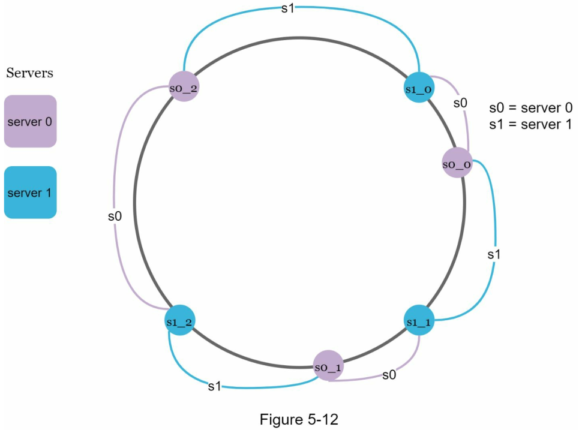

در **تصویر ۵-۱۲**، هر یک از سرورها (server 0 و server 1) با ۳ گره مجازی روی حلقه نمایش داده شده‌اند. این تعداد به‌صورت دلخواه انتخاب شده و در سیستم‌های واقعی، تعداد گره‌های مجازی برای هر سرور ممکن است به **صدها یا هزاران عدد** برسد.

به‌عنوان مثال:

* سرور ۰ با گره‌های `s0_0`، `s0_1` و `s0_2` نمایش داده شده.
* سرور ۱ با گره‌های `s1_0`، `s1_1` و `s1_2` نمایش داده شده.

هر گره مجازی مسئول مدیریت یک بخش از حلقه هش (پارتیشن) است، اما هنگام دسترسی به داده، مرجع آن گره به سرور فیزیکی واقعی بازمی‌گردد.

---

### *نحوه پیدا کردن سرور مقصد یک کلید*


برای یافتن سروری که یک کلید خاص (مثلاً `k0`) در آن ذخیره شده، از موقعیت کلید روی حلقه به‌صورت ساعتگرد حرکت می‌کنیم تا به **نخستین گره مجازی** برسیم. سپس گره مجازی را به سرور واقعی‌اش نگاشت می‌دهیم.

در **تصویر ۵-۱۳**، اگر از موقعیت `k0` به‌صورت ساعتگرد حرکت کنیم، نخستین گره مجازی برخوردی `s1_1` است، بنابراین داده مربوط به `k0` در **سرور ۱** قرار دارد.

---

### *مزایای استفاده از گره‌های مجازی*

افزایش تعداد گره‌های مجازی باعث می‌شود **توزیع کلیدها بین سرورها متعادل‌تر شود**. این موضوع به کاهش انحراف معیار در توزیع کلیدها می‌انجامد، که یکی از معیارهای کلیدی در ارزیابی یکنواختی داده است.

> **یافته‌های تجربی** (براساس یک تحقیق آنلاین $2$):
>
> * اگر از **۱۰۰ گره مجازی** استفاده شود، انحراف معیار تقریباً **۱۰٪** از مقدار میانگین است.
> * اگر از **۲۰۰ گره مجازی** استفاده شود، این مقدار به **۵٪** کاهش می‌یابد.
> * با افزایش بیشتر تعداد گره‌های مجازی، انحراف معیار کمتر خواهد شد، اما هزینه‌ی حافظه برای نگهداری گره‌ها نیز افزایش می‌یابد.

این موضوع یک **موازنه (trade-off)** مهم است و باید با توجه به نیاز سیستم، تعداد گره‌های مجازی به‌درستی تنظیم شود.

---

## **۵.۹ شناسایی کلیدهای تحت تأثیر (Find Affected Keys)**

هنگام **افزودن یا حذف یک سرور**، تنها بخشی از کلیدها باید بازتخصیص (redistribute) یابند. اما سؤال اینجاست: **کدام محدوده از کلیدها تحت تأثیر قرار می‌گیرد؟**

---

### *افزودن یک سرور جدید*

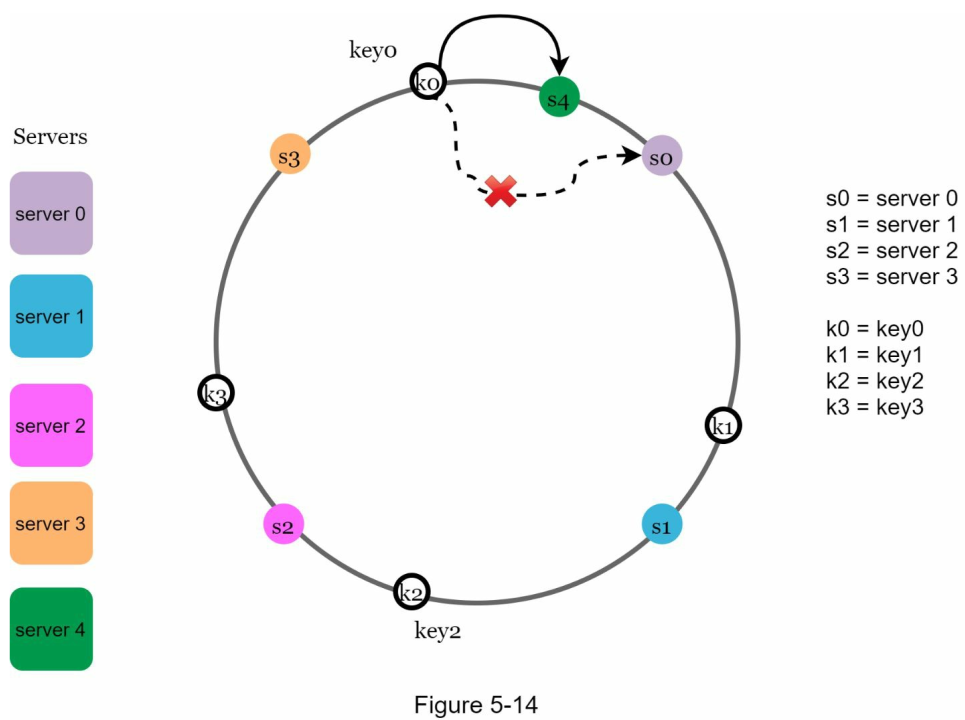

در **تصویر ۵-۱۴**، سرور ۴ به حلقه اضافه شده است. برای تعیین کلیدهای تحت تأثیر:

* از موقعیت سرور جدید (`s4`) به‌صورت **پادساعتگرد** حرکت می‌کنیم تا به یک سرور موجود دیگر (`s3`) برسیم.
* تمام کلیدهایی که در این بازه قرار دارند (بین `s3` تا `s4`) باید به سرور جدید (`s4`) منتقل شوند.

---

### *حذف یک سرور*

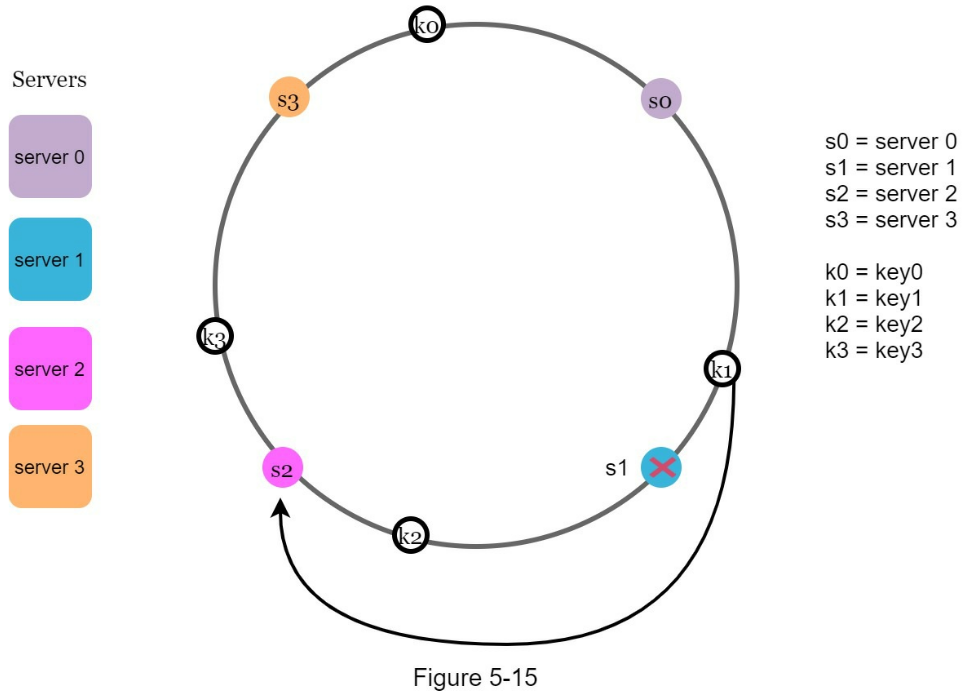

در **تصویر ۵-۱۵**، سرور ۱ از حلقه حذف شده است. در این حالت:

* از موقعیت سرور حذف‌شده (`s1`) به‌صورت **پادساعتگرد** حرکت می‌کنیم تا به نزدیک‌ترین سرور موجود (در اینجا `s0`) برسیم.
* تمام کلیدهایی که در این فاصله قرار دارند باید به سرور جایگزین (در اینجا `s2`) منتقل شوند.

---

\[+] **مطالعه موردی: استفاده از Virtual Nodes در Amazon Dynamo**

> پایگاه داده توزیع‌شده **Amazon DynamoDB** از گره‌های مجازی به‌طور گسترده استفاده می‌کند. در طراحی اولیه Dynamo، هر نود منطقی چندین گره مجازی روی حلقه هش دارد که باعث شده افزونگی، تعادل بار و تحمل خطا به‌طور مؤثری پیاده‌سازی شود. این ساختار همچنین به Dynamo امکان می‌دهد در برابر افزوده شدن یا حذف ناگهانی نودها مقاوم باقی بماند.
> **منبع:** [Amazon Dynamo Paper - SOSP 2007](https://www.allthingsdistributed.com/files/amazon-dynamo-sosp2007.pdf)

---

\[+] **ابزارهای متن‌باز برای پیاده‌سازی گره‌های مجازی و مدیریت کلیدهای تأثیرپذیر**

* **Ketama**

  * لینک: [https://github.com/RJ/ketama](https://github.com/RJ/ketama)
  * توضیح: کتابخانه‌ی C برای پیاده‌سازی consistent hashing با پشتیبانی از virtual nodes.
  * مزایا: کارایی بالا، استفاده‌شده در Memcached و توزیع بار فیس‌بوک.
  * معایب: نیاز به ادغام با سرویس‌های دیگر به‌صورت دستی.

* **Hashring (Python)**

  * لینک: [https://pypi.org/project/hashring/](https://pypi.org/project/hashring/)
  * توضیح: ماژول پایتون برای پیاده‌سازی الگوریتم هش‌سازگار با قابلیت گره‌های مجازی.
  * مزایا: سادگی، مناسب برای پروژه‌های متوسط
  * معایب: مناسب برای پروژه‌های با بار سنگین نیست.

## 5.10 مقاله کاربردی:


---

#### هشینگ پایدار با جستجوی دودویی (Consistent Hashing with Binary Search)

✍ نویسنده: Arpit Bhayani
🎯 هدف: حل مشکل توزیع یکنواخت داده‌ها هنگام تغییر تعداد سرورها (گره‌ها) با استفاده از هشینگ پایدار و جستجوی دودویی.

+ [لینک مقاله](https://www.codementor.io/@arpitbhayani/consistent-hashing-with-binary-search-16rec8e8eh)
---

## 🧠 مشکل اصلی هش سنتی

در معماری توزیع‌شده، معمول است که از هش تابعی برای تخصیص فایل‌ها یا کاربران به سرورها استفاده شود:

```python
idx = hash(key) % N  # N تعداد گره‌هاست
```

❌ اما وقتی تعداد گره‌ها (N) تغییر کند، تمام آیتم‌ها ممکن است به گره دیگری تخصیص پیدا کنند → بازتوزیع کامل داده = هزینه زیاد.

---

## ✅ راه‌حل: Consistent Hashing

در هشینگ پایدار، کل فضای هش به صورت یک دایره (هش‌رینگ) در نظر گرفته می‌شود.

### روند تخصیص:

* هر سرور در موقعیتی روی دایره هش قرار می‌گیرد (بر اساس hash آدرس IP).
* هر کلید (مثلاً نام فایل یا کاربر) هم هش می‌شود و روی دایره قرار می‌گیرد.
* آیتم به اولین سروری که در جهت ساعتگرد بعد از موقعیت کلید قرار دارد تخصیص داده می‌شود.

---

## ⚙️ پیاده‌سازی کامل در پایتون

### 1. تابع هش با SHA-256

```python
import hashlib

def hash_fn(key: str, total_slots: int) -> int:
    h = hashlib.sha256()
    h.update(key.encode('utf-8'))
    return int(h.hexdigest(), 16) % total_slots
```

* از `hashlib.sha256` برای یکنواختی توزیع استفاده می‌شود.
* `total_slots` فضای بزرگ هش است، معمولاً $2^{16}$ یا بیشتر.

---

### 2. کلاس `ConsistentHashing`

```python
from bisect import bisect, bisect_right, bisect_left

class ConsistentHashing:
    def __init__(self, total_slots: int):
        self.total_slots = total_slots
        self._keys = []      # موقعیت‌های هش سرورها روی دایره
        self.nodes = []      # اشیاء Node متناظر با هر کلید

    def add_node(self, node):
        key = hash_fn(node.host, self.total_slots)
        idx = bisect(self._keys, key)
        if idx > 0 and self._keys[idx-1] == key:
            raise Exception("Collision")  # برخورد هش
        self._keys.insert(idx, key)
        self.nodes.insert(idx, node)
        return key

    def remove_node(self, node):
        if not self._keys:
            raise Exception("Empty")
        key = hash_fn(node.host, self.total_slots)
        idx = bisect_left(self._keys, key)
        if idx >= len(self._keys) or self._keys[idx] != key:
            raise Exception("Not exist")
        self._keys.pop(idx)
        self.nodes.pop(idx)
        return key

    def get_node(self, item):
        if not self._keys:
            return None
        key = hash_fn(item, self.total_slots)
        idx = bisect_right(self._keys, key) % len(self._keys)
        return self.nodes[idx]
```

---

### 3. تست عملکرد:

```python
if __name__ == "__main__":
    ch = ConsistentHashing(total_slots=2**16)

    class Node:
        def __init__(self, host): self.host = host
        def __repr__(self): return f"Node({self.host})"

    for host in ["10.0.0.1", "10.0.0.2", "10.0.0.3"]:
        ch.add_node(Node(host))

    items = ["f1.txt", "f2.txt", "f3.txt"]
    for it in items:
        print(it, "->", ch.get_node(it))
```

### خروجی احتمالی:

```
f1.txt -> Node(10.0.0.2)
f2.txt -> Node(10.0.0.3)
f3.txt -> Node(10.0.0.1)
```

---

## 💡 بهبود: Virtual Nodes (گره‌های مجازی)

هر سرور می‌تواند چند موقعیت مختلف روی دایره داشته باشد تا بار توزیع‌شده‌تر شود.

مثلاً:

```python
for i in range(3):
    ch.add_node(Node(f"10.0.0.1-{i}"))
```

---

## 📌 جمع‌بندی نهایی

| ویژگی                | هش سنتی    | هش پایدار |
| -------------------- | ---------- | --------- |
| توزیع یکنواخت        | ❌          | ✅         |
| حساس به تغییر گره‌ها | ✅          | ❌         |
| مقیاس‌پذیر           | ❌          | ✅         |
| بار مجدد داده‌ها     | بسیار زیاد | کم (k/n)  |

---

## 👨‍🏫 مناسب برای چه پروژه‌هایی؟

* توزیع فایل‌ها (CDN، IPFS)
* توزیع بار کاربران در گیم‌سرورها
* مسیریابی ترافیک (Load Balancer)
* Cache Systems مانند Memcached، Redis Cluster
* پایگاه‌داده‌های توزیع‌شده مانند Cassandra و DynamoDB

