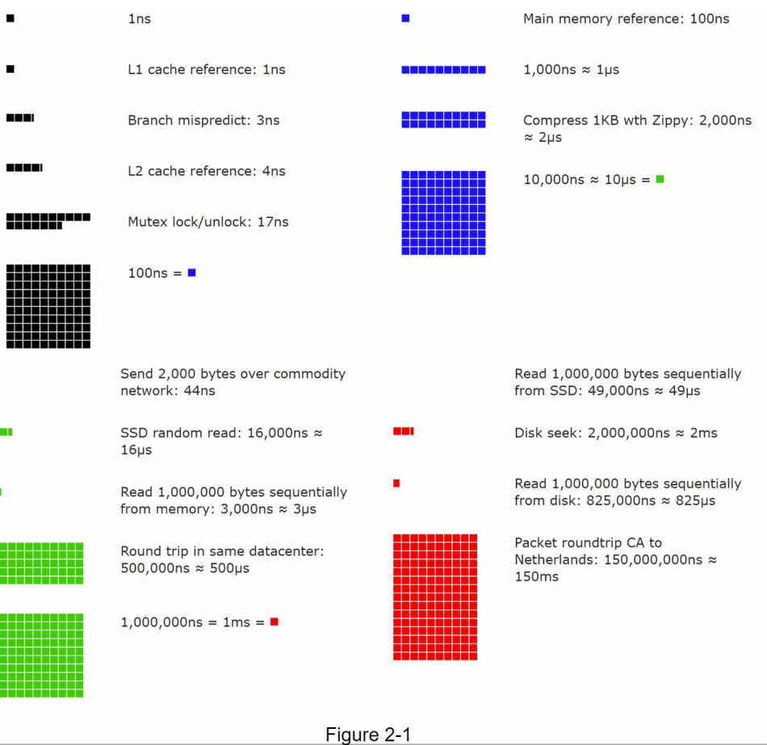

<!-- language: rtl -->
<div dir="rtl" align="right" >

### فصل دوم: برآورد سرانگشتی (Back-of-the-Envelope Estimation)

در مصاحبه‌های طراحی سیستم (System Design Interview)، گاهی از شما خواسته می‌شود که ظرفیت یا نیازمندی‌های عملکردی سیستم را به‌صورت **برآورد سرانگشتی** تخمین بزنید.

به‌گفته‌ی **Jeff Dean**، از ارشدترین مهندسان گوگل (Google Senior Fellow):

> «برآوردهای سرانگشتی تخمین‌هایی هستند که با ترکیب آزمایش ذهنی (thought experiment) و اعداد رایج عملکردی (common performance numbers) انجام می‌شوند تا حس خوبی از اینکه کدام طراحی‌ها می‌توانند نیازمندی‌ها را برآورده کنند، به‌دست آید.» \[1]

---

برای اینکه بتوانید به‌درستی این نوع برآوردها را انجام دهید، باید درک عمیقی از اصول پایه‌ی مقیاس‌پذیری داشته باشید. مفاهیم زیر باید به‌خوبی فهمیده شوند:

---

### ۱. قدرت اعداد ۲ (Power of Two) \[2]

در بسیاری از محاسبات مربوط به ظرفیت حافظه، انتقال داده، و آدرس‌دهی، اعداد بر مبنای توان‌های ۲ بیان می‌شوند:

* 2⁰ = 1
* 2¹⁰ = 1,024 ≈ 1 KB
* 2²⁰ = 1,048,576 ≈ 1 MB
* 2³⁰ = 1,073,741,824 ≈ 1 GB
* 2⁴⁰ = 1 TB

درک این سری‌ها به شما کمک می‌کند تا به‌سرعت حجم، نرخ، یا محدودیت منابع را تخمین بزنید.
در کار با **سیستم‌های توزیع‌شده (Distributed Systems)**، حجم داده‌ها می‌تواند به شکل قابل توجهی بزرگ شود.
با این حال، **محاسبات دقیق در نهایت به اصول پایه‌ای بازمی‌گردند.**

برای انجام محاسبات درست، بسیار مهم است که **واحدهای حجم داده** را بر اساس **توان‌های عدد ۲** بشناسید.

---

### تعریف پایه:

* **یک Byte** برابر است با دنباله‌ای از **۸ بیت (Bits)**.
* **یک کاراکتر ASCII** دقیقاً **۱ Byte** حافظه اشغال می‌کند (معادل ۸ بیت).

---

### جدول 2-1: واحدهای حجم داده بر پایه توان‌های عدد ۲

| واحد داده           | مقدار بر اساس توان ۲                  | معادل تقریبی ده‌دهی (Decimal) |
| ------------------- | ------------------------------------- | ----------------------------- |
| **1 Byte (B)**      | 2⁰ × 8 = 8 bits                       | 1 Byte                        |
| **1 Kilobyte (KB)** | 2¹⁰ = 1,024 Bytes                     | ≈ 1 هزار بایت                 |
| **1 Megabyte (MB)** | 2²⁰ = 1,048,576 Bytes                 | ≈ ۱ میلیون بایت               |
| **1 Gigabyte (GB)** | 2³⁰ = 1,073,741,824 Bytes             | ≈ ۱ میلیارد بایت              |
| **1 Terabyte (TB)** | 2⁴⁰ = 1,099,511,627,776 Bytes         | ≈ ۱ تریلیون بایت              |
| **1 Petabyte (PB)** | 2⁵⁰ = 1,125,899,906,842,624 Bytes     | ≈ ۱,۱۲۵ تریلیون بایت          |
| **1 Exabyte (EB)**  | 2⁶⁰ = 1,152,921,504,606,846,976 Bytes | ≈ ۱.۱۵ کوادریلیون بایت        |

---

> **نکته:** برخلاف استاندارد SI که بر پایه ۱۰ است (1 KB = 1000 B)،
> در رایانه و سیستم‌های توزیع‌شده، واحدها بر اساس **توان‌های عدد ۲** تعریف می‌شوند.

---

> **منبع معتبر:**
> *Computer Systems: A Programmer's Perspective*, Randal E. Bryant, 3rd ed.


---

### ۲. اعداد تأخیر که هر برنامه‌نویسی باید بداند (Latency Numbers Every Programmer Should Know)

یکی از منابع مرجع در این زمینه توسط **Peter Norvig** و **Jeff Dean** مطرح شده است. در این مرجع، تأخیر عملیات‌های پایه در سیستم‌های کامپیوتری آورده شده است:

| عملیات                           | میانگین تأخیر تقریبی |
| -------------------------------- | -------------------- |
| اجرای دستور در CPU               | 1 نانوثانیه (ns)     |
| رفتن به کش سطح اول (L1 cache)    | 0.5 نانوثانیه        |
| رفتن به کش L2                    | 7 نانوثانیه          |
| دسترسی به RAM                    | 100 نانوثانیه        |
| رفتن به SSD محلی                 | 100 میکروثانیه (μs)  |
| دسترسی به دیسک مکانیکی           | 10 میلی‌ثانیه (ms)   |
| ارسال بسته شبکه (ایران به آلمان) | 50–100 میلی‌ثانیه    |

> (منبع: latencylist.com و ACM Queue – *Latency Numbers*, Jeff Dean)

### تأخیرهایی که هر برنامه‌نویس باید بداند (Latency Numbers Every Programmer Should Know)

**دکتر جف دین (Dr. Jeff Dean)** از Google در سال ۲۰۱۰ لیستی از مدت‌زمان عملیات‌های رایج در رایانه‌ها را منتشر کرد \[1].
هرچند که سخت‌افزارها در دهه اخیر پیشرفت کرده‌اند، اما این مقادیر هنوز یک **درک شهودی معتبر از سریع بودن یا کند بودن عملیات‌ها** در سیستم‌های مدرن ارائه می‌دهند.

---

### تبدیل واحدها

| واحد     | معادل زمان                |
| -------- | ------------------------- |
| 1 **ns** | 10⁻⁹ ثانیه = یک نانوثانیه |
| 1 **µs** | 10⁻⁶ ثانیه = 1,000 ns     |
| 1 **ms** | 10⁻³ ثانیه = 1,000 µs     |

---

### جدول تخمینی تأخیر عملیات‌ها (به‌روز شده تا 2020 — مطابق با شکل 2-1)

| عملیات                             | مدت‌زمان تقریبی | مثال / توضیح                                    |
| ---------------------------------- | --------------- | ----------------------------------------------- |
| اجرای یک دستور در CPU              | \~0.3 ns        | اجرای یک عمل منطقی ساده، مانند `a + b`          |
| دسترسی به کش L1                    | \~0.5 ns        | حافظه نزدیک‌ترین سطح به CPU                     |
| دسترسی به کش L2                    | \~7 ns          | حافظه میانی بین CPU و RAM                       |
| دسترسی به RAM                      | \~100 ns        | بارگذاری متغیری که در حافظه اصلی قرار دارد      |
| عبور از سوکت شبکه در همان دیتاسنتر | \~10 µs         | ارسال داده به یک سرور مجاور در همان دیتاسنتر    |
| خواندن از SSD                      | \~100 µs        | بازیابی یک فایل کوچک از حافظه فلش               |
| رفتن به دیسک مکانیکی (HDD seek)    | \~10 ms         | یافتن یک بلوک روی دیسک چرخان                    |
| ارسال بسته TCP به دیتاسنتر دیگر    | \~150 ms        | تماس به API از فرانکفورت به دیتاسنتر غرب آمریکا |

---

### ابزار تصویری

مهندس نرم‌افزار Google ابزاری برای **تصویری‌سازی** این داده‌ها ساخته است که شامل **نسبت مقیاس زمانی** نیز هست.
**(تصویر: شکل 2-1 - Latency Visualized Tool، 2020)**
ابزار را می‌توان در سایت‌هایی مانند `latency.iamcal.com` یا منابع مشابه مشاهده کرد .


---

### نتیجه‌گیری‌ها از مقایسه تأخیرها:

1. **رم سریع است ولی دیسک کند است.**

   * عملیات حافظه بسیار سریع‌تر از دسترسی به دیسک مکانیکی است.

2. **تا حد امکان از جستجوی روی دیسک (disk seek) پرهیز کنید.**

   * جستجو روی دیسک مکانیکی می‌تواند **ده‌ها هزار برابر کندتر** از دسترسی RAM باشد.

3. **الگوریتم‌های فشرده‌سازی ساده سریع هستند.**

   * استفاده از فشرده‌سازی مانند GZIP معمولاً سریع‌تر از ارسال داده خام از طریق شبکه است.

4. **در صورت امکان، داده را پیش از ارسال فشرده کنید.**

   * کاهش پهنای باند و تأخیر ارسال با فشرده‌سازی اولیه، مخصوصاً در APIهای اینترنتی.

5. **دیتاسنترها معمولاً در مناطق مختلف قرار دارند.**

   * ارسال داده بین دو دیتاسنتر ممکن است چند ده تا صدها میلی‌ثانیه طول بکشد.

---

### مثال عملی از کاربرد این دانش:

#### سناریو: طراحی API سرویس تصویر

* کاربر یک عکس ۵ مگابایتی آپلود می‌کند تا به دوستش نمایش داده شود.
* سرور این عکس را در دیسک ذخیره کرده و از طریق API آن را به نمایش می‌گذارد.

**مشکل:**
هر بار که کاربر درخواست تصویر می‌دهد، عملیات `disk seek` انجام می‌شود (تا 10ms زمان). اگر هم‌زمان هزاران کاربر درخواست مشابه داشته باشند، سرور **قفل عملکردی** می‌شود.

**راهکار:**

* در اولین درخواست، تصویر را در **Cache** (مانند Redis یا RAM) قرار دهید.
* از **GZIP** برای کاهش حجم عکس استفاده کنید.
* اگر در CDN قرار داده شود، ارسال از نزدیک‌ترین محل انجام می‌شود (کاهش latency).

---

### نمونه‌های واقعی از تأثیر **Latency** در شرکت‌های بزرگ

در ادامه، چند **مثال عملی** از شرکت‌های بزرگ جهانی ارائه می‌شود که نشان می‌دهد درک و مدیریت تأخیر (latency) در عملکرد سیستم‌های مقیاس‌پذیر، چه نقشی در موفقیت معماری آن‌ها داشته است:

---

### 1. **Google Search** – حساسیت شدید به تأخیر زیر میلی‌ثانیه

* **مسئله:**
  گوگل متوجه شد که افزایش تنها **400 میلی‌ثانیه** در زمان پاسخ‌گویی صفحه جستجو، باعث کاهش قابل‌توجهی در **رفتار کاربران** می‌شود.

* **راهکار:**
  Google از **کش‌های توزیع‌شده داخلی در RAM**، **load balancing هوشمند** و **pre-warming index** برای کاهش latency استفاده می‌کند.

* **اقدام مهندسی:**
  Queryها قبل از اجرا، چندین مرحله **pre-evaluation** می‌گذرانند و نتایج پرکاربرد در حافظه RAM نگهداری می‌شوند.

> **منبع:** Marissa Mayer – Google Engineering Blog

---

### 2. **Netflix** – طراحی برای تأخیر بین‌دیتاسنتری و failover سریع

* **مسئله:**
  با میلیون‌ها کاربر در سراسر جهان، Netflix باید اطمینان حاصل کند که تأخیر در **streaming video** از مناطق دور مانند هند یا برزیل با کیفیت قابل‌قبول حفظ شود.

* **راهکار:**
  Netflix از سیستم **Open Connect CDN** استفاده می‌کند که سرورهایی را در نزدیکی ISPهای کاربران مستقر می‌کند. همچنین از **Edge Caching** استفاده می‌کند.

* **جزئیات فنی:**

  * انتقال بین دیتاسنتر اصلی و edge حدود **100-150ms** است.
  * بنابراین فایل‌های پربازدید قبلاً در edge cache ذخیره شده‌اند.

* **مورد مهم:**
  در هر لحظه، اگر یک نود یا دیتاسنتر از دسترس خارج شود، سیستم از **multi-region failover** بهره می‌برد.

> **منبع:** Netflix Technology Blog – *Latency and Resilience Engineering at Scale*

---

### 3. **Facebook** – حل مسئله Hotspot Key در پیام‌رسان

* **مسئله:**
  در سیستم پیام‌رسانی، پروفایل‌هایی مانند مارک زاکربرگ یا سلبریتی‌ها میلیاردها پیام در دقیقه دریافت می‌کردند، و این باعث **Hotspot در یک shard خاص** می‌شد.

* **راهکار:**
  Facebook از **logical partitioning** استفاده کرد؛ برای مثال، inbox و outbox جداگانه با کلیدهای توزیع تصادفی‌تر ساخته شد.

* **نتیجه:**
  کاهش قابل توجه فشار روی یک shard و افزایش **throughput خواندن پیام‌ها**.

> **منبع:** Facebook Engineering – *Scalable Messaging Infrastructure*

---

### 4. **Amazon** – طراحی سیستم‌های microservice برای کمینه کردن latency

* **مسئله:**
  هر بار که کاربر وارد صفحه خرید می‌شود، ده‌ها microservice باید با یکدیگر تماس بگیرند:

  * قیمت‌گذاری
  * موجودی انبار
  * پیشنهادها
  * بررسی‌های کاربران
  * حمل‌ونقل

* **خطر:**
  تاخیر ۱۰۰ میلی‌ثانیه در جمع‌آوری این اطلاعات ممکن است منجر به **ترک سبد خرید توسط کاربر** شود.

* **راهکار:**

  * استفاده از **backend-for-frontend (BFF)** برای تجمیع پاسخ‌ها.
  * **فشرده‌سازی (compression)** و **Edge Network Optimization**
  * **فراخوانی موازی (parallel async call)** بین microserviceها.

> **منبع:** Werner Vogels – Amazon CTO Blog

---

### جمع‌بندی کاربردی

| شرکت     | Latency Concern             | راهکار اصلی                     | لایه‌های درگیر    |
| -------- | --------------------------- | ------------------------------- | ----------------- |
| Google   | کاهش تأخیر جستجو            | کش داخلی، RAM و Load Balancer   | حافظه، اپلیکیشن   |
| Netflix  | پخش بدون وقفه و انتقال سریع | CDN اختصاصی و Edge Caching      | شبکه، storage     |
| Facebook | Hotspot در پیام‌رسانی       | Partitioning + de-normalization | دیتابیس، shard    |
| Amazon   | کاهش تاخیر خرید             | فراخوانی موازی + BFF + cache    | API, service mesh |

---

> **منبع تکمیلی:**
>
> * Jeff Dean’s Keynote, ACM Queue (2010)
> * latency.iamcal.com
> * Martin Kleppmann, *Designing Data-Intensive Applications*, فصل 4


---

### ۳. اعداد مربوط به دسترس‌پذیری (Availability Numbers)

مقدار دسترس‌پذیری یک سیستم معمولاً با درصد uptime بیان می‌شود. تفاوت بین 99.9٪ و 99.999٪ بسیار مهم است:
درک این اعداد برای طراحی سیستم‌های mission-critical و قابل‌اطمینان حیاتی است.

### **Availability Numbers (اعداد دسترس‌پذیری)**

**دسترس‌پذیری بالا (High Availability یا HA)** یعنی اینکه یک سیستم بتواند برای مدت‌زمان طولانی، **به‌طور پیوسته فعال** باقی بماند، حتی در صورت بروز خطا یا افزایش بار.
دسترس‌پذیری معمولاً به‌صورت **درصد uptime** بیان می‌شود و 100% به معنای **عدم وجود هیچ‌گونه قطعی (zero downtime)** است.

اکثر سیستم‌ها در دنیای واقعی بین **99% تا 100%** در دسترس هستند.

---

### **SLA چیست؟**

**SLA (Service Level Agreement)** قراردادی رسمی بین ارائه‌دهنده خدمات و مشتری است که در آن **میزان دسترس‌پذیری مورد انتظار** مشخص می‌شود.
بیشتر ارائه‌دهندگان زیرساخت ابری (Cloud Providers) مانند:

* **Amazon AWS** \[4]
* **Google Cloud Platform** \[5]
* **Microsoft Azure** \[6]

سطح SLA را برابر یا بالاتر از **99.9%** تعریف کرده‌اند.

---

### جدول 2-3 – نسبت درصد دسترس‌پذیری به مدت زمان قطعی

| درصد SLA | قطعی مجاز در سال | قطعی مجاز در ماه | قطعی مجاز در هفته |
| -------- | ---------------- | ---------------- | ----------------- |
| 99%      | \~87.6 ساعت      | \~7.3 ساعت       | \~1.68 ساعت       |
| 99.9%    | \~8.76 ساعت      | \~43 دقیقه       | \~10 دقیقه        |
| 99.99%   | \~52.6 دقیقه     | \~4.3 دقیقه      | \~1 دقیقه         |
| 99.999%  | \~5.26 دقیقه     | \~26 ثانیه       | \~6 ثانیه         |
| 100%     | صفر              | صفر              | صفر               |

---

### مفاهیم مهم:

* **هر یک عدد ۹ اضافه‌تر**، چند برابر پیچیدگی فنی و هزینه نگهداری بالاتر را به همراه دارد.
* دستیابی به 99.999% به معنی **فقط ۵ دقیقه قطعی در سال** است؛ که تنها با **سیستم‌های توزیع‌شده چند‌منطقه‌ای با failover آنی** ممکن است.

---

### نمونه‌های واقعی از شرکت‌های بزرگ

---

### ✅ **Amazon Web Services (AWS)**

* **SLA رسمی:**

  * EC2: 99.99%
  * S3: 99.9%
  * RDS: 99.95%

* **اقدامات فنی برای حفظ SLA:**

  * استقرار سرویس‌ها در **Availability Zoneهای مستقل**
  * استفاده از **Elastic Load Balancing**
  * پشتیبان‌گیری زمان‌بندی‌شده و replication بین مناطق

> **مرجع:**
> [https://aws.amazon.com/compute/sla/](https://aws.amazon.com/compute/sla/)
> [https://aws.amazon.com/s3/sla/](https://aws.amazon.com/s3/sla/)

---

### ✅ **Netflix**

* **هدف:** حداقل 99.99% دسترس‌پذیری برای کاربران جهانی

* **راهکارها:**

  * استفاده از چندین **Region** در AWS (us-east-1، eu-west-1، ...)
  * ابزار **Chaos Monkey** برای آزمایش سناریوهای خرابی واقعی
  * **Multi-Region Failover** با Replication ناهمزمان

> **مرجع:**
> Netflix Tech Blog – *Failover and Resilience Engineering*
> [https://netflixtechblog.com/chaos-monkey-released-637f92baca2e](https://netflixtechblog.com/chaos-monkey-released-637f92baca2e)

---

### ✅ **Google Cloud Platform (GCP)**

* **SLA رسمی:**

  * Compute Engine: 99.99%
  * BigQuery: 99.9%
  * Cloud SQL: 99.95%

* **ویژگی کلیدی:**

  * استفاده از **Global Load Balancing**
  * Failover بی‌درنگ بین دیتاسنترهای جهانی

> **مرجع:**
> [https://cloud.google.com/terms/sla](https://cloud.google.com/terms/sla)
> [https://cloud.google.com/architecture](https://cloud.google.com/architecture)

---

### ✅ **Stripe (پرداخت‌ساز)**

* **اهمیت HA:**
  در پردازش پرداخت‌ها، حتی **۱ ثانیه قطعی** می‌تواند منجر به از دست رفتن ده‌ها هزار تراکنش شود.

* **اقدامات:**

  * استفاده از طراحی multi-region
  * نهادینه‌سازی **graceful degradation** برای نمایش پیام مناسب به کاربران در زمان اختلال

> **مرجع:**
> [https://stripe.com/blog/stripe-infrastructure](https://stripe.com/blog/stripe-infrastructure)
> [https://status.stripe.com/](https://status.stripe.com/)

---

### جمع‌بندی فنی:

| شرکت        | SLA رسمی     | اقدامات برای دستیابی به آن                           |
| ----------- | ------------ | ---------------------------------------------------- |
| **AWS**     | 99.9%–99.99% | Multi-AZ, Load Balancer, Backup                      |
| **Google**  | 99.9%–99.99% | Global LB, replication, redundancy                   |
| **Netflix** | 99.99%       | Chaos Engineering, Multi-region                      |
| **Stripe**  | 99.99%       | Graceful Degradation, Failover, Real-time Monitoring |

---
### مثال واقعی‌تر: تخمین QPS و نیاز ذخیره‌سازی مشابه توییتر (Twitter)

در این سناریو می‌خواهیم با استفاده از تخمین‌های سرانگشتی (**Back-of-the-Envelope Estimation**) میزان **QPS (Query Per Second)** و نیاز به **ذخیره‌سازی رسانه‌ای** را در یک پلتفرم شبیه به توییتر برآورد کنیم.
اعداد زیر تقریبی هستند و صرفاً برای **درک حجم سیستم در مقیاس بالا** استفاده می‌شوند، نه داده‌های واقعی Twitter.

---

### مفروضات تمرین:

| پارامتر                        | مقدار فرضی               |
| ------------------------------ | ------------------------ |
| کاربران فعال ماهانه (MAU)      | ۳۰۰ میلیون               |
| درصد کاربران فعال روزانه (DAU) | ۵۰٪ از MAU = ۱۵۰ میلیون  |
| میانگین تعداد توییت روزانه     | ۲ توییت به ازای هر کاربر |
| درصد توییت‌های دارای مدیا      | ۱۰٪                      |
| اندازه متوسط رسانه (media)     | ۱ مگابایت                |
| مدت نگهداری داده               | ۵ سال                    |

---

### مرحله ۱: تخمین QPS (تعداد درخواست در ثانیه)

#### تعداد توییت‌ها در روز:

```text
150 میلیون کاربر * 2 توییت = 300 میلیون توییت در روز
```

#### تخمین QPS:

```text
300 میلیون توییت / (24 * 3600 ثانیه) ≈ 3472 ≈ ~3500 توییت/ثانیه
```

#### در نظر گرفتن ترافیک پیک (Peak QPS):

در ساعات خاص مانند شب یا رویدادهای زنده:

```text
Peak QPS ≈ 2 * متوسط QPS ≈ 7000 توییت/ثانیه
```

---

### مرحله ۲: تخمین نیاز به فضای ذخیره‌سازی مدیا

#### توییت‌های دارای مدیا در روز:

```text
10٪ * 300 میلیون توییت = 30 میلیون توییت با مدیا
```

#### حجم مدیا در روز:

```text
30 میلیون * 1 مگابایت = 30 ترابایت (30 TB/day)
```

#### حجم مدیا در ۵ سال:

```text
30 TB/day * 365 * 5 ≈ 54,750 TB = ~55 پتابایت (PB)
```

---

### واقعیت‌های مهندسی از شرکت‌های واقعی

---

### ✅ **Twitter**

* **ظرفیت واقعی در سال‌های اخیر (حدودی):**

  * بیش از **۶۰۰۰ توییت در ثانیه** در ساعات اوج (مطابق آمار رویدادهای جهانی مانند جام‌جهانی ۲۰۱4)
  * نیاز به **streaming replication** و **partitioning بر اساس tweet\_id**

* **راهکار فنی:**

  * ذخیره توییت‌ها به‌صورت ایندکس شده در **Manhattan DB** (پایگاه داده داخلی توییتر)
  * فایل‌های مدیا در **Blob Store اختصاصی** نگهداری می‌شوند.

> **منبع:** Twitter Engineering Blog – *Manhattan: The distributed storage system powering Twitter*

---

### ✅ **Instagram (متعلق به Meta)**

* **مقیاس مشابه:**
  صدها میلیون کاربر، میلیاردها تصویر.

* **راهکار فنی:**

  * تصاویر در سیستم فایل توزیع‌شده اختصاصی مشابه **Haystack** نگهداری می‌شوند.
  * metadata و index در **Cassandra** یا **MySQL sharded** ذخیره می‌شوند.

> **منبع:** Facebook Engineering – *Haystack: Efficient object storage at scale*

---

### ✅ **TikTok**

* **ویژگی خاص:** ویدیوهای کوتاه و سنگین.

* **تکنیک‌ها:**

  * فشرده‌سازی سریع و real-time
  * Edge Caching نزدیک به کاربران
  * ذخیره‌سازی توزیع‌شده در **Ceph / S3 compatible** object stores.

> **منبع:** ByteDance Tech Blog – *Distributed Media Platform at Scale*

---

### جدول مقایسه تخمینی با شرکت‌های واقعی

| پلتفرم    | متوسط QPS تخمینی | حجم روزانه مدیا | مدت نگهداری | تکنولوژی ذخیره‌سازی مدیا         |
| --------- | ---------------- | --------------- | ----------- | -------------------------------- |
| Twitter   | \~3500–7000      | \~30 TB         | 5 سال       | Manhattan, Blob Store            |
| Instagram | \~4000–8000      | \~50–100 TB     | 5+ سال      | Haystack, S3, MySQL Shards       |
| TikTok    | >10000           | \~200+ TB       | 1–2 سال     | Ceph, CDN, Real-Time Compression |

---

### نتیجه‌گیری مهندسی

برای هر سیستمی با چنین مقیاسی:

* **Sharding بر اساس کلید اصلی** (مثلاً `user_id` یا `tweet_id`) حیاتی است.
* **مدیا و متادیتا باید جدا ذخیره شوند.**
* **Object Storage جداگانه با versioning** برای محتواهای چندرسانه‌ای توصیه می‌شود.
* استفاده از **Edge CDN** برای کاهش latency و کاهش فشار سرورها ضروری است.

---
### نکات مهم در برآورد سرانگشتی (Tips for Back-of-the-Envelope Estimation)

برآورد سرانگشتی (Back-of-the-envelope estimation) **بیشتر در مورد فرآیند تفکر و حل مسئله است تا رسیدن به عدد نهایی دقیق.**
در مصاحبه‌های طراحی سیستم، هدف اصلی **ارزیابی مهارت حل مسئله و تحلیل عددی** شماست، نه ریاضیات دقیق.

در ادامه چند نکته مهم برای موفقیت در این نوع برآورد آورده شده است:

---

### ۱. گرد کردن و ساده‌سازی (Rounding and Approximation)

در مصاحبه نیازی به محاسبات دقیق نیست. ریاضیات پیچیده فقط وقت را تلف می‌کند.

#### مثال:

```text
99987 ÷ 9.1 ≈ ؟
```

به جای تلاش برای پاسخ دقیق، **تقریب بزنید**:

```text
≈ 100,000 ÷ 10 = 10,000
```

استفاده از اعداد رُند مانند 10، 1000، 1 میلیون به درک بهتر و سریع‌تر مسئله کمک می‌کند.

---

### ۲. فرضیات خود را یادداشت کنید (Write Down Your Assumptions)

فرض‌هایی که در حین حل مسئله انجام می‌دهید را به وضوح یادداشت کنید تا بعداً بتوانید به آن‌ها **ارجاع** دهید یا آن‌ها را **تغییر** دهید.

#### مثال:

* تعداد کاربران فعال روزانه: فرض = ۱۵۰ میلیون
* متوسط اندازه توییت: فرض = ۱ KB
* میانگین درخواست در ثانیه: محاسبه بر اساس ۲ توییت/کاربر/روز

---

### ۳. واحدها را بنویسید (Label Your Units)

عدم نوشتن واحد باعث ابهام و خطا در محاسبه می‌شود.

#### مثال بد:

```text
5
```

#### مثال صحیح:

```text
5 MB یا 5 requests/sec یا 5 servers
```

این کار نه تنها به شفاف‌سازی کمک می‌کند، بلکه مصاحبه‌گر را نیز تحت تأثیر قرار می‌دهد که شما به دقت جزئیات توجه دارید.

---

### ۴. تمرین مکرر (Practice Common Estimation Scenarios)

برخی از سناریوهای متداولی که معمولاً در مصاحبه‌های طراحی سیستم پرسیده می‌شوند:

| سناریو برآورد                      | هدف                      |
| ---------------------------------- | ------------------------ |
| QPS (تعداد درخواست در ثانیه)       | اندازه‌گیری بار سیستم    |
| Peak QPS                           | بررسی پیک بار سیستم      |
| حجم داده برای ذخیره‌سازی (Storage) | تخمین نیاز دیتابیس یا S3 |
| حجم کش (Cache Size)                | تخمین LRU یا Redis size  |
| تعداد سرورها                       | تقسیم بار بین سرورها     |

#### پیشنهاد تمرین:

هر بار یک پلتفرم معروف مانند **Instagram** یا **WhatsApp** را در نظر بگیرید و برای آن:

* تعداد کاربران را تخمین بزنید
* QPS را حساب کنید
* ذخیره‌سازی روزانه را درآورید
* حجم کش موردنیاز را محاسبه کنید

> **منبع آموزشی معتبر:**
> Alex Xu – *System Design Interview – An Insider’s Guide*
> Gaurav Sen – YouTube Channel (System Design Playlist)

---

**یادآوری:** مصاحبه‌کننده بیشتر به **منطق پشت محاسبات** شما توجه دارد تا خود عدد نهایی. اگر منطقی فکر کنید و ساختار واضحی داشته باشید، حتی با تخمین‌های نادقیق نیز موفق خواهید بود.
